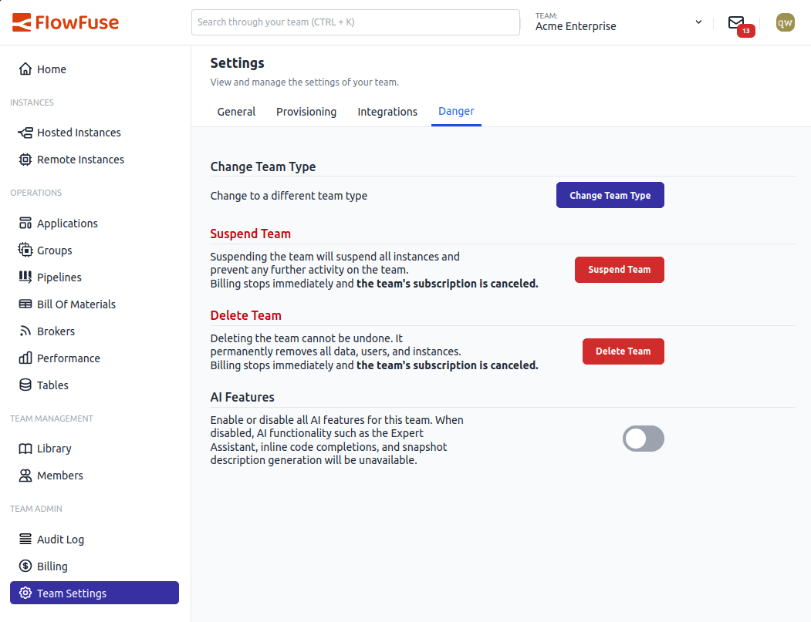

You can now turn off AI features for your team from the team settings page. When disabled, FlowFuse removes the Expert Assistant, inline code completions, and snapshot description generation for your team. Running instances will need a restart for the change to fully take effect.            

{data-zoomable}                                                                                                                                                                                                                                       
*Opt out of AI features from the Danger section in team settings.*

The toggle is on by default for all teams. Flipping it off shows a confirmation dialog so you don't accidentally disable it. If you change your mind later, just flip it back on.

Self Hosted Enterprise customers also get platform-level and team-type-level AI controls, so admins can control AI availability across the entire installation or per plan before it ever reaches team owners.

This feature is available to all FlowFuse Cloud users and Enterprise Self Hosted users from v2.31.                                                                                                                                                                                                                          
                                                                                                             
