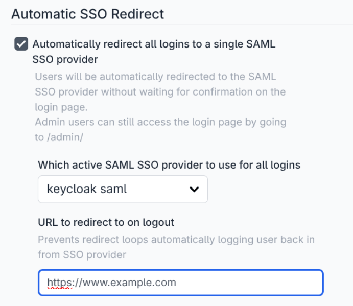

When running self hosted FlowFuse or embedding FlowFuse in a solution it may be 
required to send all user authentication requests to a single SAML SSO provider,
rather than using the users email domain to pick the correct provider.

With the release of FlowFuse 2.30.0 it is now possible to pick a configured provider and all unauthenticated users will be automatically redirected to this provider.

To prevent administrator lockout in the event of a SSO failure, admins can by pass this redirect and enter their normal username and password by accessing any page on the admin route, e.g. `https://forge.example.com/admin`

This feature is only available to Self Hosted Enterprise licensed FlowFuse Instances.