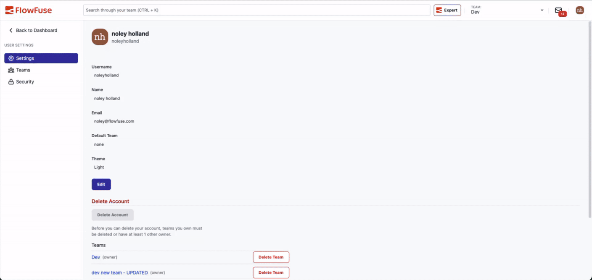

FlowFuse now has a dark mode. You can switch the whole app between Light, Dark, and System from your User Settings.

A bright white UI is fatiguing in low-light control rooms or on a night shift. Dark mode lets FlowFuse fit those environments.

By default, FlowFuse follows your operating system and flips live when it changes. Pick Light or Dark to lock it in — FlowFuse remembers your choice per browser.

{data-zoomable}
*The whole app rethemes live as you toggle — no reload needed.*

To change your theme:

1. Open **User Settings**
2. Under **Theme**, choose **Light**, **Dark**, or **System**
3. Save

A note on scope: dark mode covers the FlowFuse application itself. The embedded Node-RED editor and Dashboard iframes keep their own themes — Node-RED and your Dashboard configuration manage those separately.

This feature is available to all FlowFuse Cloud users and all Self Hosted users from v2.32.
