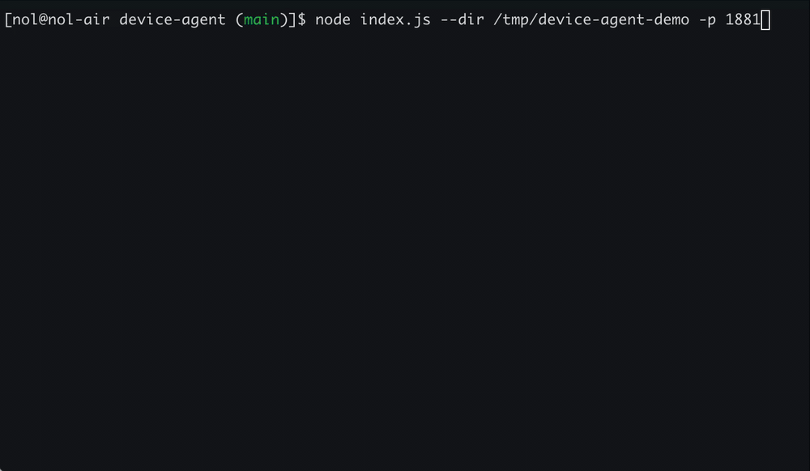
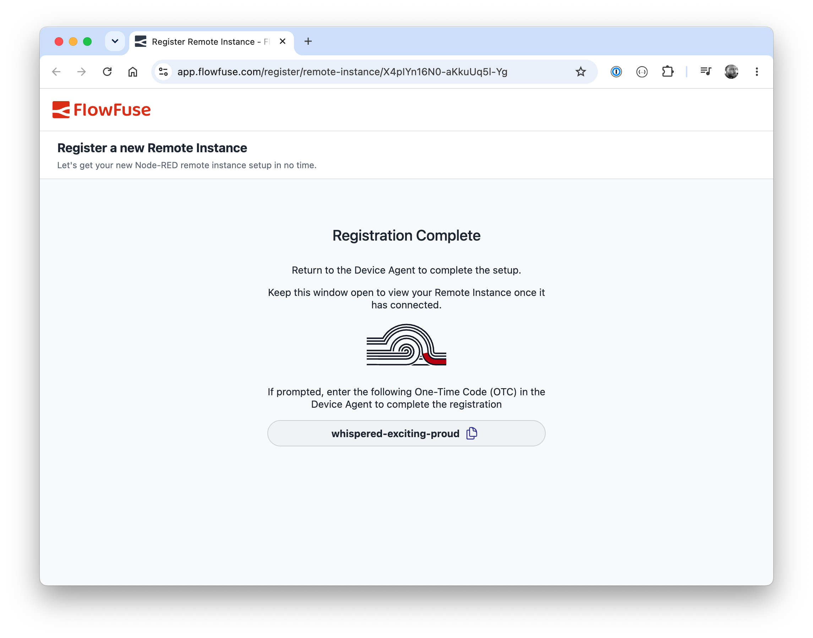

FlowFuse Device Agent allows you to remotely manage Node-RED instances running on your hardware, for example, devices on your factory floor.

Getting your own hardware into FlowFuse meant working backwards. You signed up, found the remote instance section, learned what the Device Agent was, created the instance in the platform, copied its connection details, and only then ran the installer with that code in hand.

Now you can start where the hardware already is. Run the installer from your terminal and it walks you through registering — including setting up an account if you need one — ending with your machine registered as a remote instance and ready to build on. If something's in the way — like port 1880 already being in use — the installer tells you up front instead of failing partway through.

Check the [Device Agent Quick Start guide](https://flowfuse.com/docs/device-agent/quickstart/) to get connected.

{data-zoomable style="border: 2px solid #E5E7EB;"}
*Sign-up and registration happen in one uninterrupted flow — no jumping back to the platform.*

{data-zoomable style="border: 2px solid #E5E7EB;"}
*The interactive registration takes you straight through to the Node-RED editor once connected*
