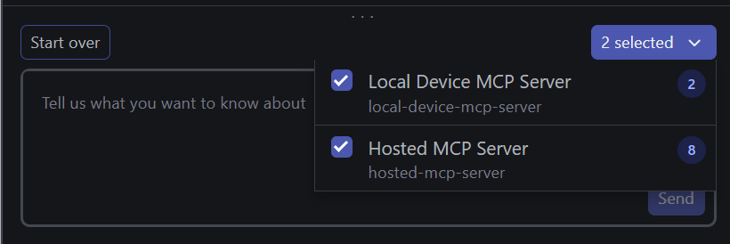
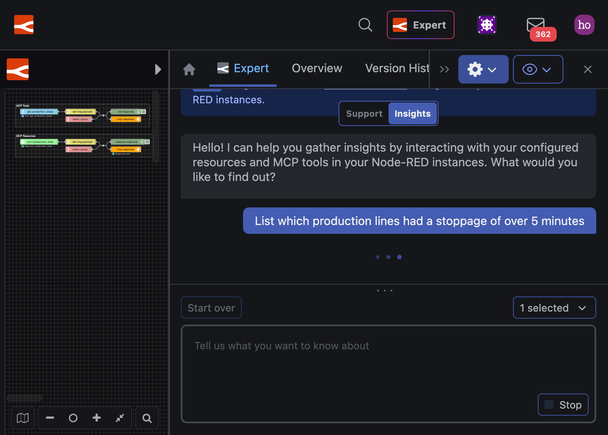
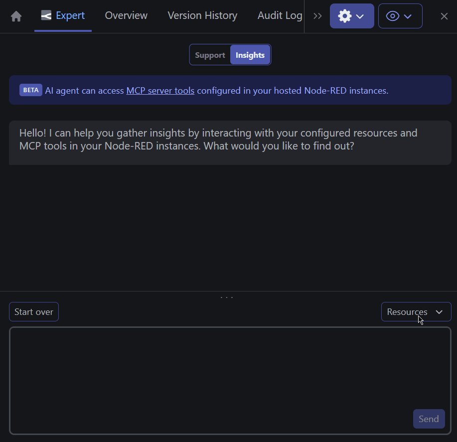
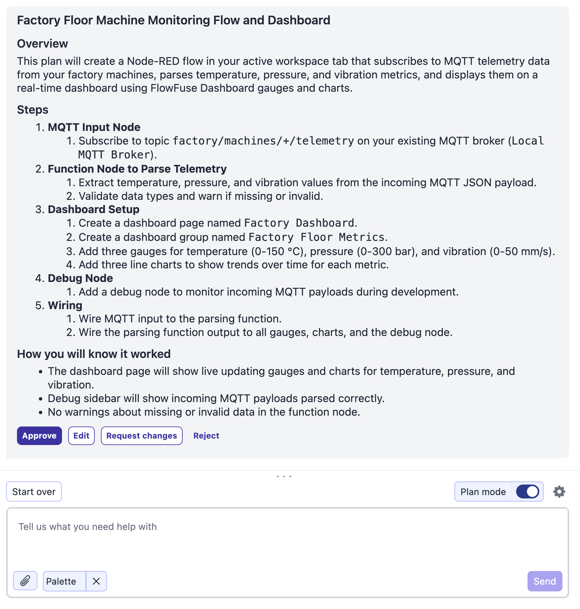
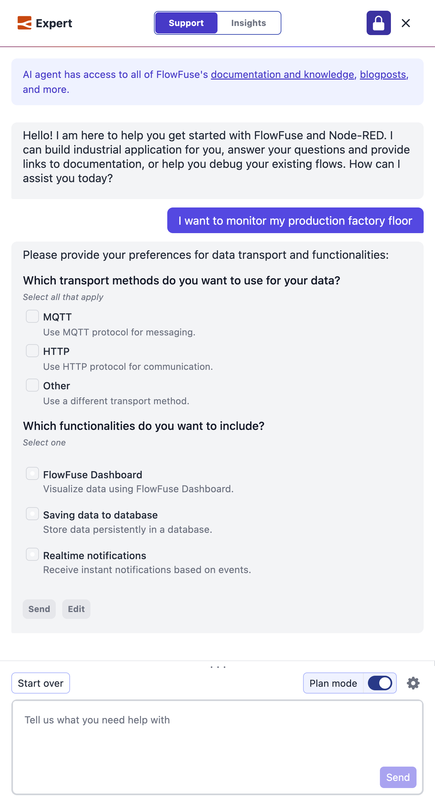
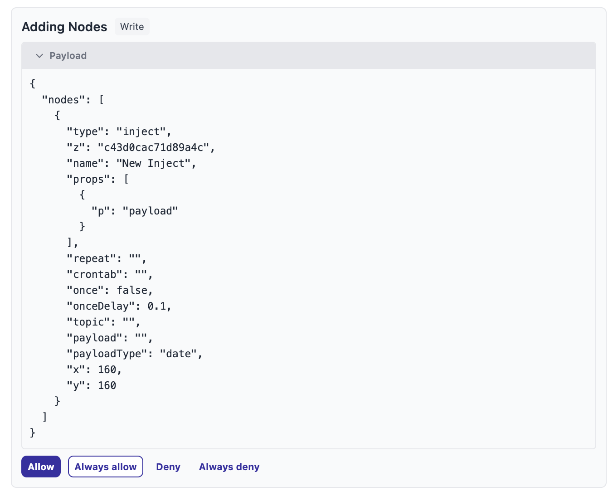

### Insights

With the release of device-agent 4.0.0 and FlowFuse 2.32.0, FlowFuse Expert Insights Agent can now work with Remote instances and Self Hosted Instances.

#### Screenshots

{data-zoomable}
*Resource from Hosted and Remote Instances can now be selected*

{data-zoomable}
*Insights querying a Remote Instance*

{data-zoomable}
*Insights in an action - querying a Remote Instance*

### Platform Automations

The Expert can now take action on your FlowFuse platform directly. Instead of telling you which buttons to click, it can create instances, register devices, take snapshots, and manage applications on your behalf. You can ask the Expert to:

 - Create hosted instances with the right type, stack, and template, optionally starting from a flow blueprint   
 - Register remote instances (devices) and assign them to applications                                           
 - Take and list snapshots of both hosted and remote instances                                                   
 - Create applications, list what's running inside them, and check their audit logs                            
 - Look up live status and logs for any hosted instance, or query a remote instance's state over MQTT

Behind the scenes, FlowFuse exposes over 30 automation tools covering instances, devices, applications, snapshots, teams, and configuration. When you ask the Expert to do something, it picks the right tools, calls them with your permissions, and reports back.

### Support Agent

We have added three ways to stay in control of what the Expert does while it works alongside you in the editor.

#### Plan Mode

The Expert can now propose a plan before it changes anything, so you can review the approach before it touches your flows.

Turn on **Plan Mode** with the toggle in the chat composer. Instead of acting straight away, the Expert lays out what it intends to do as a plan you can read through. From there you can:

- **Approve** — the Expert proceeds with the plan.
- **Edit** — open the plan in the composer, adjust the wording yourself, and send it back.
- **Request changes** — describe what you would like to be different, and the Expert proposes an updated plan.
- **Reject** — discard the plan and start again.

This is ideal for larger or unfamiliar changes, where you want to agree on the approach before any work happens.

{data-zoomable}
*The Expert proposes a plan and waits for your approval before making any changes*

#### Questions and Answers

The Expert now asks clarifying questions when a request could go more than one way, rather than guessing and building the wrong thing.

When it needs more detail, the Expert presents up to four questions in a single turn, each as a set of options you pick from — single choice or multiple choice. You answer them all together, and it uses your answers to get the result right the first time. For example:

- Which flow should this run in?
- Should the incoming payload be stored, forwarded, or both?
- Which of these nodes should trigger the alert?

You can revisit and change your answers before continuing, and you decide the pace: use the follow-up questions setting in the composer menu to have the Expert ask everything **all at once** or **one at a time**.

{data-zoomable}
*The Expert asks clarifying questions and collects your answers before acting*

#### Human in the Loop

You are now in charge of exactly which actions the Expert is allowed to take on your flows — no change happens that you did not permit.

When the Expert wants to run an action that needs your sign-off, it pauses and shows an approval card in the chat. The card names the action, whether it reads, writes, or deletes, and the exact details of what it will do, with four choices:

- **Allow** or **Deny** — approve or refuse this one action.
- **Always allow** or **Always deny** — remember your choice for the rest of the chat.

The Expert waits for your decision however long you need, and you can cancel a pending action at any time with the stop button.

You can also set this up ahead of time. In the Expert settings, each team chooses default permissions for reading, writing, and deleting — **always allow**, **ask first**, or **always deny** — and can fine-tune individual actions where needed. Permissions respect your team role too: members with read-only access cannot enable or trigger actions that write or delete.

{data-zoomable}
*The Expert pauses and asks for approval before running an action that needs your sign-off*

These features are available to FlowFuse Cloud users and Self-Hosted users from v2.32.
