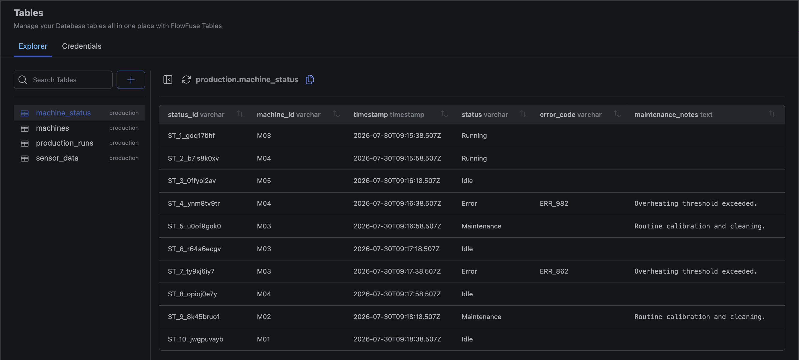

FlowFuse Expert can now look up your FlowFuse Tables databases directly. Ask it to list the databases on your team, show you the tables in a database, or describe a table's schema, and it calls the right tools and reports back, without you needing to open the Tables view yourself. It can also preview a table's data: up to 10 rows, exactly as stored.

This is a fixed, read-only preview, not a query engine: there's no filtering, sorting, or paging through it, and no writes. For anything beyond that quick look, the Expert can help you build it as a flow with the `tables-query` node instead.

{data-zoomable}
*The Expert listing a database's tables, grouped by schema*

Alongside this, FlowFuse Tables now correctly supports tables that live in a schema other than `public`. Previously, viewing data for a table outside the default schema could fail. Tables and their schema now show up correctly throughout the Tables UI: next to each table name in the list, and as `schema_name.table_name` (with a copy button) in the table detail view.

{data-zoomable}
*The schema label beside each table name, and the qualified `schema.table` name with a copy button in the header*

This feature is available to Enterprise tier users of FlowFuse Cloud and Enterprise Licensed Self Hosted users from v2.33.
