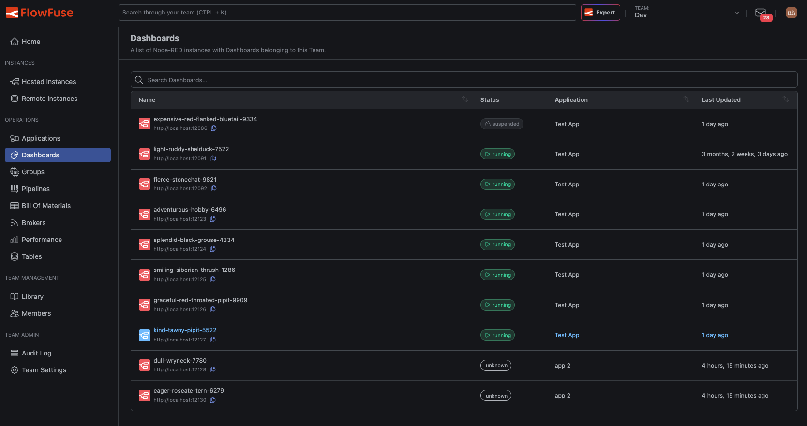

Your dashboards now have a home. A new **Dashboards** entry in the team navigation lists every dashboard across your hosted instances in one place. Open one and it loads right inside FlowFuse, not in a separate browser tab. Each application has the same **Dashboards** tab, showing just the dashboards from that application's instances.

Until now, dashboards were tucked behind an "Open Dashboard" button on individual instance pages. Finding the one you wanted meant hunting through instances, and each one opened in a new tab. Now you get one place that shows them all, at the team or application level.

{data-zoomable}
*Every dashboard in the team, each showing whether its instance is currently running*

## Switch between dashboards in place

A drawer lets you switch to any other dashboard without returning to the list, so moving between them is a single click. Jump from your "Line 3 OEE" dashboard to "Energy Monitoring" and back without losing your place. Instance status updates live in the drawer, so you can see at a glance which dashboards are ready.

{data-zoomable}
*The drawer stays open alongside the dashboard, so switching doesn't cover what you're viewing*

*This feature is available to all users of FlowFuse Cloud and all Self Hosted users from v2.33.*
