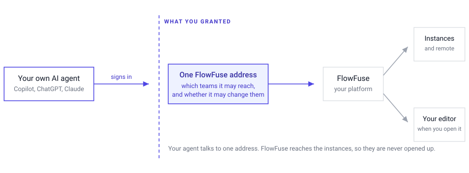

FlowFuse Expert is no longer the only AI that can work your platform. FlowFuse now acts as an MCP server, so the agent your team already uses can query your teams and instances, and build Node-RED applications for you.

*Your agent talks to one address. FlowFuse reaches the instances, so they stay unexposed.*

Add the FlowFuse address in your agent's connector settings, sign in, and choose which teams the agent may reach and whether it may make changes. Microsoft Copilot, ChatGPT and Claude all connect this way, and so do command-line and editor agents such as Claude Code, Cursor and Visual Studio Code.

This matters most where company policy only permits an approved AI assistant. Until now that meant no AI on the platform at all, because the only way in was our own. Now the assistant your company already sanctioned can do the work.

The access you grant is enforced on every call, so a read-only grant is refused whatever the agent tries. Nothing an agent reaches through FlowFuse can delete an instance, an application, a snapshot or a team, and deploying stays yours.

Flow building happens on the canvas in front of you. Open the instance, turn on the MCP toggle in the page header, and you watch the agent work.

This is available to all FlowFuse Cloud users and to Enterprise self-hosted installations from v3.0, across FlowFuse Hub, Edge and Fleet. See [connecting your own agent](/docs/user/expert/third-party-agents/) for setup, including what to check on an instance before asking for a flow.
