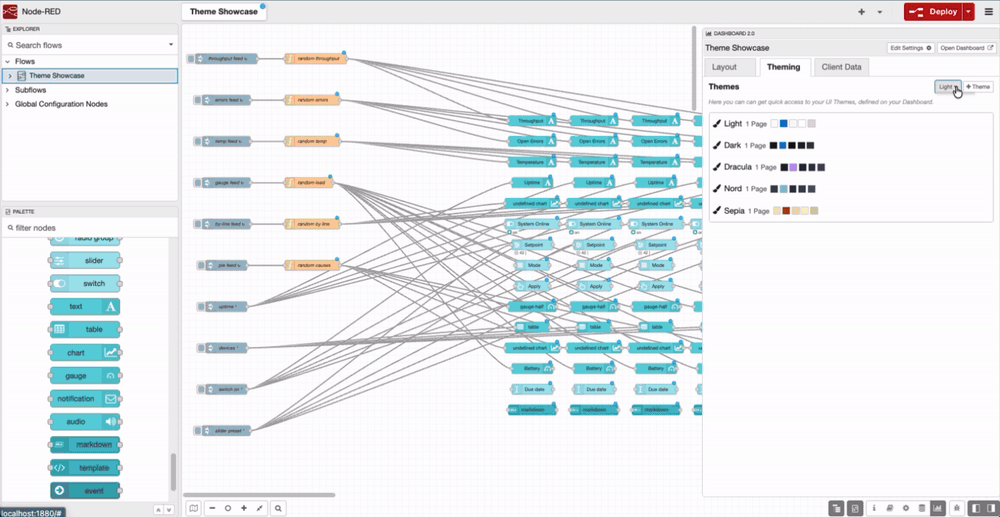

You can now start a Dashboard theme from a built-in preset — **Light**, **Dark**, **Dracula**, **Nord**, or **Sepia** — and get a complete colour scheme in one step, instead of setting each colour yourself.

Every preset meets WCAG AA contrast, so your dashboard is readable on the first render. No checking dark-scheme text against its background before you ship. And nothing is locked: change any individual colour and the theme flips to **Custom**, keeping the rest of the scheme intact. New dashboards start on Light.

Dark themes adapt automatically. When a theme's page background is dark, Dashboard switches input fields, borders, chart and gauge colours, and the browser's native date and time pickers to match, so nothing sits light against a dark background. This applies to any dark theme you build, not just the presets.

To get started:

1. In the Dashboard sidebar, click **+ Theme**. The new theme starts from your default preset.
2. Open it and use the **Preset** dropdown to switch schemes.
3. To change which preset new themes start from, set the **Theme preset** dropdown in the sidebar.

*Switching presets updates every colour at once — the same dashboard, five schemes, no per-colour editing.*

This feature is available to all FlowFuse Dashboard users on FlowFuse Cloud and Self Hosted, from Dashboard v1.30.3.
