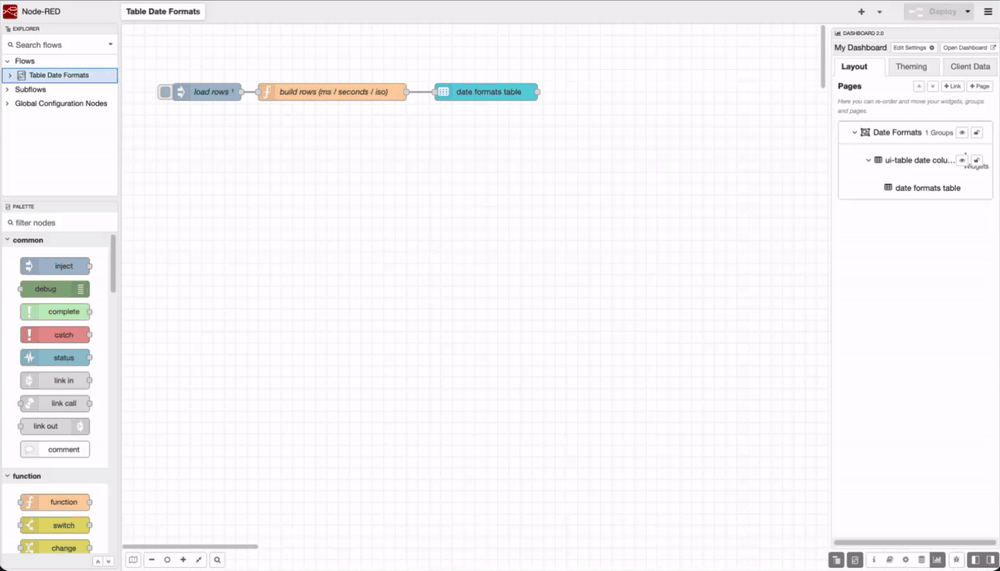

FlowFuse Dashboard's `ui-table` node now formats timestamps. Set a column's **Type** to **Date & Time** and `1754999400000` renders as `Aug 12, 2026, 12:10 PM` instead of the raw number.

Previously, sending a timestamp to a Dashboard table showed either a long epoch number or a UTC string, so you had to reformat it yourself in a function node or template. The table handles it now. Each cell formats in the viewer's own browser locale and timezone, so a UTC timestamp shows in their local time.

The column accepts whatever you already have: an epoch in seconds or milliseconds, an ISO-8601 string, or a `Date`.

Dashboard v1.30.3 or later is required. To get started:

1. On your `ui-table` node, turn off **Auto Columns** and add a column.
2. Set its **Type** to **Date & Time**, **Date**, or **Time**.
3. Point its **Value** at the field holding your timestamp.

*The same epoch value in three columns, with no function node upstream — the table reads the raw timestamp directly.*

This feature is available to all FlowFuse Cloud users and Self Hosted users from Dashboard v1.30.3.
