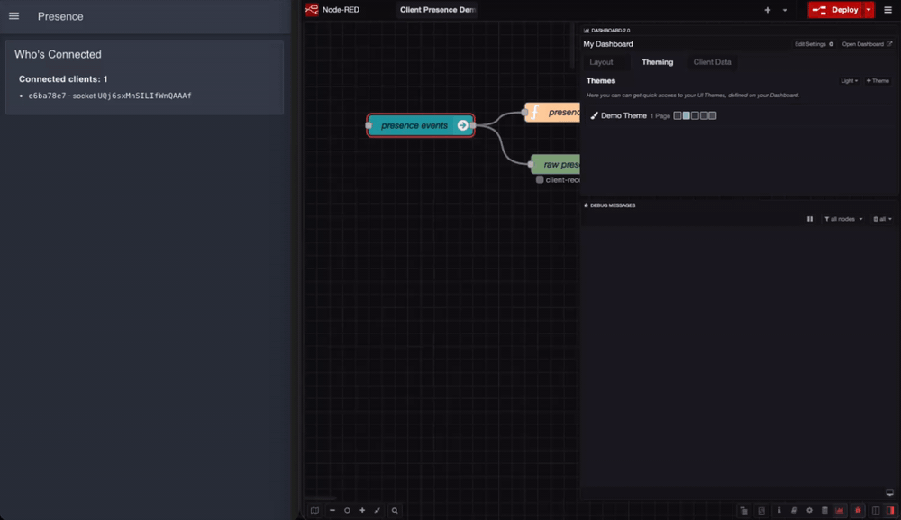

You can now track which clients are connected to your dashboard, and react when one joins or leaves, directly from your flows.

Every client now carries a stable `clientId` on `msg._client`. The old `socketId` changed on every reconnect, sleep, or page reload, so anything you stored against it broke the moment the connection blipped. The `clientId` stays the same for that browser across reconnects and restarts, which makes it a reliable key for per-client state.

The `ui-control` node can now emit presence events keyed on that id. Set its **Output** to **Client Presence Events Only** and it sends:

- `client-connected` when a new client first connects
- `client-reconnected` when a client returns after a brief drop
- `client-gone` when a client leaves and does not come back

A grace window means a quick refresh or network blip does not fire `client-gone`. A client that returns within 20 seconds is reported as `client-reconnected` instead, so you only hear about genuine departures. Use these to keep an accurate map of who is currently viewing your dashboard: add on connect, keep on reconnect, remove on gone.

*Reopening the same browser produces `client-reconnected` rather than a second `client-connected`, so the client keeps its place in your map. The recording uses a shortened grace window so the events fit on screen; the real window is 20 seconds.*

**Note:** if you have `ui-control` nodes set to **All Events**, they will now also emit the `client-*` presence messages. The `client-` prefix keeps them distinct from the existing `connect` / `lost` events, so flows that switch on `msg.payload` are unaffected, but a flow that reacts to *every* message from that node will see the new ones.

`clientId` identifies a browser for presence and routing, not a user for authorization. The browser supplies it, so treat it the way you would any other client-supplied value.

This feature is available to all FlowFuse Dashboard users from v1.32.0, on FlowFuse Cloud and Self Hosted.
