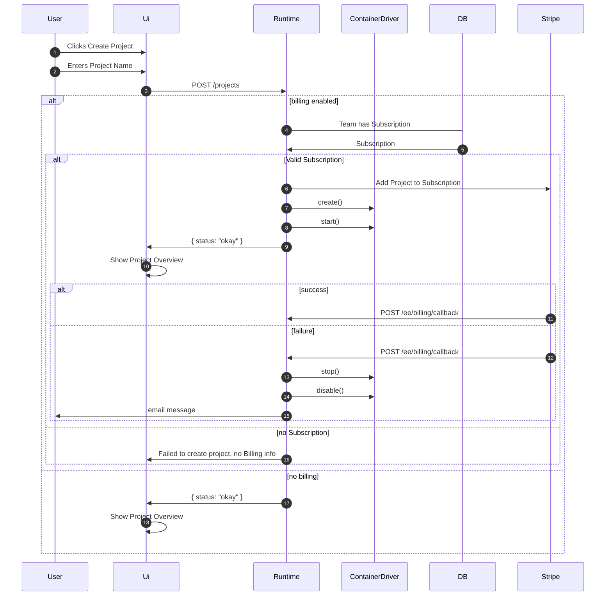

# Sequence For Project Creation

```mermaid
sequenceDiagram
autonumber
participant User
participant Ui
participant Runtime
participant ContainerDriver
participant DB
participant Stripe

User->>Ui: Clicks Create Project
User->>Ui: Enters Project Name
Ui->>Runtime: POST /projects
alt billing enabled
  Runtime->DB: Team has Subscription
  DB->>Runtime: Subscription
  alt Valid Subscription
    Runtime->>Stripe: Add Project to Subscription
    Runtime->>ContainerDriver: create()
    Runtime->>ContainerDriver: start()
    Runtime->>Ui: { status: "okay" }
    Ui->>Ui: Show Project Overview
    alt success
      Stripe->>Runtime: POST /ee/billing/callback
    else failure
      Stripe->>Runtime: POST /ee/billing/callback
      Runtime->>ContainerDriver: stop()
      Runtime->>ContainerDriver: disable()
      Runtime->>User: email message
    end
  else no Subscription
    Runtime->>Ui: Failed to create project, no Billing info
  end
else no billing
  Runtime->>Ui: { status: "okay" }
  Ui->>Ui: Show Project Overview
end
```