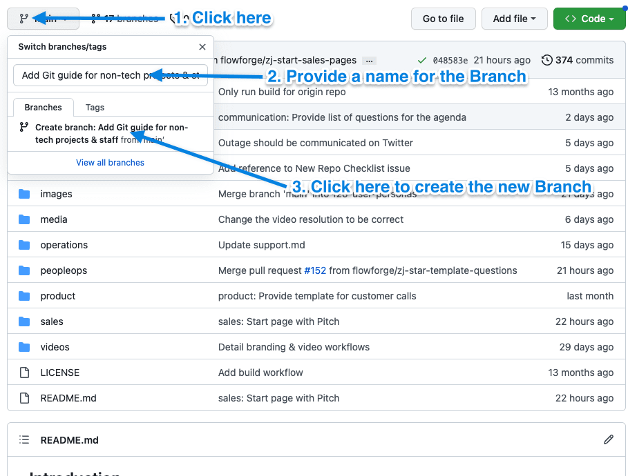
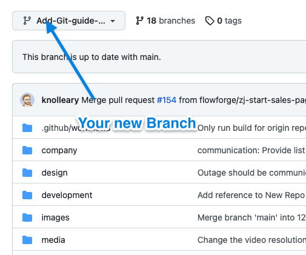
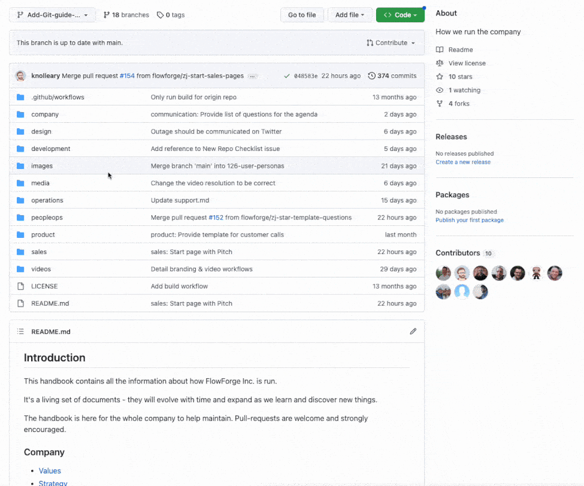
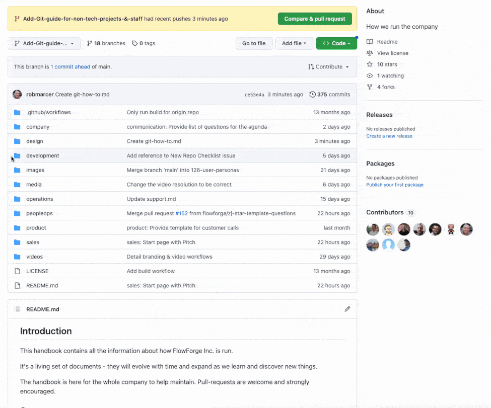
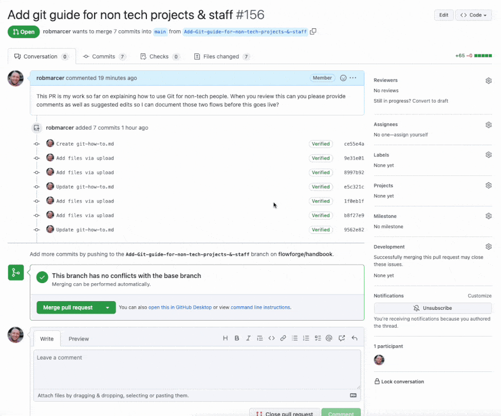

# How to use Git

## Background

[Git](#git) is a way for a team to create written content, track any changes to that content, and seek approval for any changes to become the [Published](#publish) version of that content on [Live](#live). [Git](#git) can be used in many ways, our developers use it to write the code which makes FlowFuse work. In this guide we are focusing on the process of working with documents within our company [Handbook](#handbook) or website. We will use [Git](#git)'s terminology to describe how we are working. This guide also assumes you are using [Github](#github).com to edit the [Handbook](#handbook) and website.

When making changes to a [Project](#project) at least two people have to agree that the changes should be Published. In most cases those two people would be yourself and a [Reviewer](#reviewer).

We have included a [Glossary](#glossary) at the end of this guide which hopefully will give you a good start with common [Git](#git) terminology.

## Quick Guide

### New Contributions

If you've been asked to do a new piece of work, this is the quick bullet list of steps to follow:

1. Switch to (`checkout`) to the latest version of the repository's `main` branch
2. Create a new branch (with a `kebab-case-name`)
3. Make the changes you need to do locally on your machine
4. Add & Commit your changes when they're ready.
5. Push your changes to the branch
6. You can do multiple commits and pushes to iterate on your work. It will all be saved to your branch
7. When ready for review, open a Pull Request
8. Assign someone else as a reviewer, they may offer feedback
9. The reviewer, when happy, will aprove and merge the Pull request
10. Once your PR is merged, be sure to switch back to the `main` branch again

### Modifying an Existing Contribution

If another person has opened a Pull Request or branch already, and asked you to make additions to that, then the steps differ slightly:

1. Switch to their branch on your machine (if request to append to the Pull Request, that will have a branch associated to.)
2. Make the changes you need to do locally
3. Add & Commit your changes when they're ready.
4. Push your changes to the branch. Any pushed changes will automatically update the associated Pull Request.
5. You can do multiple commits and pushes to iterate on your work. It will all be saved to your branch & PR.
6. Check with the original PR owner as to whether you're reviewing the PR, or if someone else has been assigned
7. Reviewer submits their feedback, if any.
8. The reviewer, when happy, will aprove and merge the Pull request
10. Once you have finished your contirubtions, you can switch back to the `main` branch

### Completing a Pull Request Review

You may be asked to conduct a Pull Request Review. This means that someone else has contributed some work, and would like you to check whether it works, and whether you're happy with the contributions made. These are the steps by which you can do that:

1. Switch to their branch on your machine (if request to append to the Pull Request, that will have a branch associated to.)
2. Run the code (e.g. website server or FlowFuse platform) and ensure their changes work as expected.
3. "Add your Review" on GitHub, offer comments and recommendatins where required.
4. Once you're happy, "Approve" the Pull Request
5. Merge the PR
6. Ensure you have switched back to the `main` branch locally before continuing any other work.

## How to make changes to the Live version of a Project

### Create a Branch

The first step to editing content is to create a [Branch](#branch) of that content. A [Branch](#branch) is a complete copy of the [Project](#project). Creating a [Branch](#branch) allows you to edit the content without those edits changing the [Live](#live) copy of a [Project](#project).

Navigate to the Project within [Github](#github) you want to work on, that would usually be [our website](https://github.com/FlowFuse/website) or [Handbook](https://github.com/FlowFuse/handbook).

The [Branch](#branch) name should give a brief overview of what you are planning to change in the [Project](#project), for example ‘Add Git guide for non-tech projects & staff’ then click the ‘create branch’ link.

You should now notice that where the drop down said ‘main’ before it now says the name of the [Branch](#branch) you just created.

You can now start the process of actually creating or editing content, any changes you make will not yet be added to the [Published](#publish) version of the [Live](#live) [Project](#project) so don't worry if you make mistakes or are not yet happy with the finished product.

### Create a new file (document)

In this example I am going to create a new document in the [Handbook](#handbook) which will help non-technical FlowFuse team members use [Git](#git).

Firstly I will create a new document called git-how-to.md in the design folder.

The file type is .md (Markdown). A [Markdown](#markdown) file is similar to a .docx or .txt. It allows you to lay out content in a document including text, images, titles, headers and tables. You can read more about [Markdown](#markdown) here.

In the video above I pressed ‘[Commit](#commit) changes’ which is the same as saving your document.

### Editing your document

I can now start the process of writing my document, first I will reopen it in the editor, then I will add the content.

I will work on the file until I think it's ready for a colleague to review the changes I have made. Once I am happy with the content I will [Commit](#commit) the changes as I did before.

## How to get those changes published

### Creating a Pull Request

I am now ready to request a [Review](#review) of my work from a colleague. To do this I need to create a [Pull Request](#pull-request). Once you create the [Pull Request](#pull-request) an alert will be sent to your colleagues asking them for feedback on your work.

[Github](#github) gives you an easy to find button to create a [Pull Request](#pull-request) for your current work. 

It's a good idea to provide your colleagues descriptive comments explaining the goals of the changes you have made as well as anything else you think would help them [review](#review) your work.

Once you press the 'Create pull request' button an alert will be sent to one of FlowFuse's Slack channels letting everyone know you'd like your work reviewed. You can also request a [review](#review) from a specific colleague using the [Reviewers](#reviewer) section of your [Pull Request](#pull-request) Click on [Reviewers](#reviewer) then select the colleague you think would be best placed to [review](#review) your work.

#### Preview URLs

After creating a Pull Request, you can preview your changes before they go live:

- **[FlowFuse/website](https://github.com/FlowFuse/website)**: Look for the Netlify bot comment on your PR with a preview link
- **[FlowFuse/flowfuse](https://github.com/FlowFuse/flowfuse)**: Preview URLs are posted to the [`#gh-pipelines`](https://flowfuse.slack.com/archives/C067BD0377F) Slack channel

These preview links let you and your reviewer see exactly how your changes will look.

### Requesting a review of your work

Once a colleague has [reviewed](#review) your work you will receive an email alert. They can provide feedback on your work in three ways, sometimes a [review](#review) will include more than one type of feedback.

#### Approval of your Branch to go live

This is the easiest to deal with, the [Reviewer](#reviewer) doesn't think anything needs to be changed. Proceed to the next section to get the changes in your [Branch](#branch) [Published](#publish) to [Live](#live).

#### Comments on your Branch asking you to make edits.

The [Reviewer](#reviewer) has given feedback on your [Branch](#branch), you will need to consider making edits and provide feedback to the [Reviewer](#reviewer) to explain what you changed (or didn't) and why.

Once you are happy that your edits address the Reviewer's feedback points [Commit](#commit) your changes. You should now also reply to each of the [Reviewer](#reviewer)'s comments letting them know what you changed or why you didn't change anything based on their comments.

The [Reviewer](#reviewer) will now read your comments and edits and based on their actions you may need to respond to further comments or edits.

#### Suggested edits to your Branch.

The [Reviewer](#reviewer) has editing your [Branch](#branch) themselves, you can read through their edits and approve them if you think they improve the content.

TO DO - How does the user actually deal with this?

### Publishing to live

TO DO - Write up the process to publish to live.

## Glossary

### Branch

When working in [Git](#git), a Branch is a complete copy of a [Project](#project) which you can make changes to without those changes effecting the [Live](#live) copy of the [Project](#project).

### Commit

The process to save changes to a [Branch](#branch) of a [Project](#project).

### Git

An app to help us collaboratively manage changes to documents. You can read more [here](https://git-scm.com/) but we'd advise you don't unless you are a developer as Git has a lot of features and terminology which you don't need to understand at this point.

### Github

A website which allows you to manage [Git](#git). Github also allows you to communicate with your colleagues about changes you are making.

### Handbook

FlowFuse's public document explaining how run the company.

### Live

The current version of each [Project](#project) which anyone can access on the internet, click here to view the live versions of the [website](/) and [handbook](/handbook/).

### Markup

A method to add formatting to a document by adding additional characters around content. You can read more on the [Wikipedia article](https://en.wikipedia.org/wiki/Markup_language). [Markdown](#markdown) is a Markup format.

### Markdown

A [Markup](#markup) language for formatting content in documents. You can read more in this [guide](https://www.markdownguide.org/). FlowFuse uses Markdown to format content for our website and [Handbook](#handbook)

### Project

A collection of documents and content which usually relate to a specific topic. In this guide we are discussing how to edit two FlowFuse Projects, our website and our [Handbook](#handbook).

### Publish

The action which takes your work on a [Project](#project) and makes it available on the internet for anyone to view.

### Pull-Request

A request to have your work from a [Branch](#branch) Published to [Live](#live).

### Reviewer

A team member who is going to check your work and provide feedback. 

### Review

The process by which a colleague checks and provides feedback on your work.
