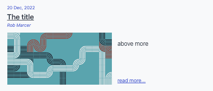
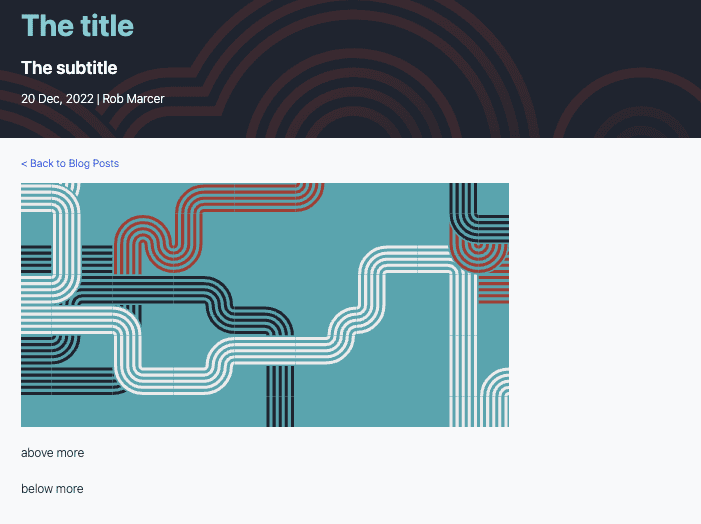

---
meta:
    title: Marketing - Blog
---

# Blog

## Blogging Process

Content creation and blogging are an effective way to communicate with our community. The process for publishing a blog is as follows:

1. Create an initial issue or tie your blog to one of your scheduled issues [here](https://github.com/orgs/FlowFuse/projects/21/views/1).
2. Issues should be assigned a date, which should be posted here in this [Github projects](https://github.com/orgs/FlowFuse/projects/21/views/1).
3. Create a PR requests with your Blog Content.
4. Assign yourself as an Assignee.
5. Convert to Draft
6. No Reviews shall be done until the PR is “Ready for Review”
7. Assign two reviewers
    * One Reviewer for Content (ZJ / Grey)
    * One Reviewer for SEO. (Hasmin / Grey)
8. Content will be reviewed first.
9. SEO will be reviewed second.
10. When both reviews are done, the Author or SEO reviewer can merge. In the event of an external author, SEO/content review will merge.
11. Once merged, SEO Reviewer will promote on FlowFuse Social channels.


## Blog CMS

When creating a blog post there are several headers which are used by the CMS to populate the blog article as well as the blog index page. e.g:


```njk
---
title: The title
subtitle: The subtitle
description: The description
date: 2022-12-20
authors: ["rob-marcer"]
tags:
    - posts
    - node-red
    - how-to
---

above more
<!--more-->
below more
```

### Title

The title of the page can be seen on both the blog index and the articles.

### Subtitle

The subtitle is only shown on the articles.

### Description

Provides the (OpenGraph) description used when sharing a post on social media. Also used on the `/blog` page for past articles.

### Date

The data can be seen on both the blog index and the articles.

The `date` field in the blog post front matter serves a crucial role in determining when a blog post is published. You can set this field to a future date if you wish to schedule your blog post for publication on a specific day. See the [Scheduling a blog post](#scheduling-a-blog-post) section for more details.

### Authors

The author can be seen on both the blog index and the articles.

### Tags

Tag your content appropriately from the collection of tags that help us manage our blog content. They include:

- `node-red`
- `flowfuse`
- `how-to`
- `dashboard`
- `community`
- `releases`
- `news`
- `unified-namespace`

There's a page with a collection of posts for each tag in that list.

#### Custom Tags

You can also add your own custom tags. While these won't create a new page with a collection of posts, they will help suggest related articles. Keep in mind that for an article to be considered related, the majority of tags must match, with allowance for a difference in one tag.

#### Meta Keywords

Additionally, the tags you assign to your content will also be used as [meta keywords](/handbook/customer/marketing/website/#meta-keywords) for each article, alongside the [default keywords](/handbook/customer/marketing/website#default-keywords).

### More tag

The '\<\!\-\-more\-\-\>' tag is used to define the text shown in the blog index from each article.

### Example blog index item based on the header above



### Example blog article based on the header above



### Writing content

FlowFuse blog posts are written in markdown. To learn how to style content and
have a nice markup for your content, please read the [markdown guide](/handbook/company/guides/markdown/)

### Scheduling a blog post

By setting a future date, the blog post will be automatically scheduled for publication on the specified date. This allows contributors to plan ahead and coordinate blog posts with events or marketing strategies. The post will be published at the next deploy after the `date` is set, a daily deploy is done at noon GMT.

Feel free to request reviews and merge your blog post when it's ready, even if the publication date is set in the future. This provides the flexibility to collaborate, make revisions, and ensure the content is polished well before it goes live.
The post, to be published in the future, will be rendered when developing locally and on deployment previews.

By utilizing the scheduling feature, we can maintain a consistent and organized publishing schedule without the need for last-minute adjustments.
