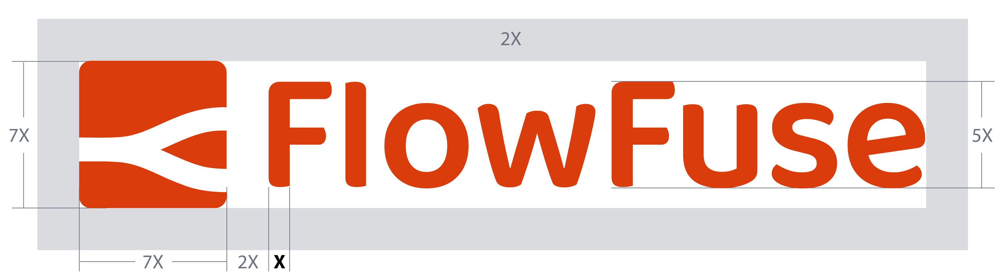

# FlowFuse Branding Guidelines

For FlowFuse Assets (e.g. logos, pictograms, and raw design files), if you're part of the FlowFuse team, please refer to the [`/design`](https://drive.google.com/drive/folders/1PiuFwW3H8XuydolepmfQQ4BjcdNekVQg) folder on the company Google Drive.

If you're not part of the FlowFuse organization, you can download the logos from the following links:
- [PNG low-resolution files](../images/logos/FlowFuse_logo_png.zip)
- [Vector files (PDF and SVG)](../images/logos/FlowFuse_logo_vector.zip)

## Logo
### Composition

Our logo is a combination mark, featuring an abstract symbol that represents the flows connecting the nodes, along with a wordmark displaying our name.

### Versions

**The horizontal version is the preferred choice**. When space and layout constraints make this option an awkward fit, forcing the logo to be too small, the vertical version can be used.

#### Horizontal Version

    

#### Vertical Version

    

### Minimum Sizes

Only when the size becomes too small for the combination mark to render the wordmark legibly, the symbol can be used independently without the wordmark.

#### Symbol

    

### Construction and correct usage

The order, distance, and proportion of the elements composing the combination mark must not be altered in any way.

A **safety area of 2X** is defined to ensure proper image usage and readability.

#### Construction of Horizontal Version

    

#### Construction of Vertical Version

    

### Chromatic Versions

Depending on the background against which the logo is presented, there are corresponding versions to be used.

#### Dark Backgrounds

Search for the file name ending with "dark", such as: *ff-logo--wordmark--dark.png*

    

        
    

    

        
    

#### Light Backgrounds

Search for the file name ending with "light", like: *ff-logo--wordmark--light.png*

    

        
    

    

        
    

Please note that the dark background version consists of two colors, while the remaining versions consist of a single color.

#### Monochromatic

When only black or white are allowed, search for the file name ending with "black" or "white". For instance: *ff-logo--wordmark--white.png*

    

        
    

    

        
    

    

        
    

    

        
    

## Fonts

The following fonts are used across the FlowFuse platform, website, and branded materials. The table below outlines where each font is applied.

| Font                                                   | Logo | Platform | Website | Branded Materials |
|--------------------------------------------------------|------|----------|---------|--------------------|
| [**font-sans** (Tailwind CSS)](https://tailwindcss.com) |      | *        |         |                    |
| [**Heebo**](https://fonts.google.com/specimen/Heebo)   |      |          | *       | *                  |
| [**Baloo Da 2**](https://fonts.google.com/specimen/Baloo+Da+2) | *    |          |         |                    |

#### Notes:
- **Heebo:** When using this font, we aim to avoid weights heavier than *semi-bold* to maintain a clean and balanced design.
- **Baloo Da 2:** Exclusively used in the FlowFuse logo.

## Color Palette

    

        

            Black
            #000000
        

        

            White
            #FFFFFF
        

    

    

        

            Grey 50
            #F9FAFB
        

        

            Grey 100
            #F3F4F6
        

        

            Grey 200
            #E5E7EB
        

        

            Grey 300
            #D1D5DB
        

        

            Grey 400
            #9CA3AF
        

        

            Grey 500
            #6B7280
        

        

            Grey 600
            #4B5563
        

        

            Grey 700
            #374151
        

        

            Grey 800
            #1F2937
        

        

            Grey 900
            #111827
        

    

    

        

            Red 50
            #FFEFEA
        

        

            Red 100
            #FFD9CE
        

        

            Red 200
            #FFC5B3
        

        

            Red 300
            #FFB29A
        

        

            Red 400
            #FA9170
        

        

            Red 500
            #EB6D46
        

        

            Red 600
            #DA3D0B
        

        

            Red 700
            #B33109
        

        

            Red 800
            #8D2606
        

        

            Red 900
            #671D06
        

    

    

        

            Indigo 50
            #EEF2FF
        

        

            Indigo 100
            #E0E7FF
        

        

            Indigo 200
            #C7D2FE
        

        

            Indigo 300
            #A5B4FC
        

        

            Indigo 400
            #818CF8
        

        

            Indigo 500
            #6366F1
        

        

            Indigo 600
            #4F46E5
        

        

            Indigo 700
            #4338CA
        

        

            Indigo 800
            #3730A3
        

        

            Indigo 900
            #312E81
        

    

    

        

            Blue 50
            #EFF6FF
        
 
        

            Blue 100
            #DBEAFE
        

        

            Blue 200
            #BFDBFE
        

        

            Blue 300
            #93C5FD
        

        

            Blue 400
            #60A5FA
        

        

            Blue 500
            #3B82F6
        

        

            Blue 600
            #2563EB
        

        

            Blue 700
            #1D4ED8
        

        

            Blue 800
            #1E40AF
        

        

            Blue 900
            #1E3A8A
        

    

## Iconography

All app and site iconography uses [Heroicons](https://heroicons.com/), by the makers of Tailwind CSS. Within our flowforge app, we have two icon sizes available which can be assigned with `ff-icon` and `ff-icon-sm`.

## Pictograms

These larger images are used for stylistic purposes. We use pictograms to communicate in a glance, offer interactivity, or simplify complex ideas.

If you wish to create your own Pictograms, you can use this Adobe Illustrator file as a template:
[pictogram.ai](https://drive.google.com/drive/u/1/folders/1guBnBUrIiRXuK6vsik_NIXIhtE1cZRRa)

Sizings:

- **128 x 128px**: Used when showing multiple pictograms in the same section of the website or application.
- **250 x 250 px:** Used as part of page headers, inline with the page title and page description.

## Branded Templates

### Email Signature

Using a consistent email signature helps people outside FlowFuse understand who we are and what we do. Including your job title gives context to your role, and the link to our website makes it easy for recipients to learn more about us. It also reinforces our brand and makes every interaction look professional and cohesive.

##### When to use your signature
Always include it in external emails (clients, partners, vendors, community members) and when starting or joining a new email thread. For ongoing replies within the same thread, it's optional. Many email clients have settings to automatically include your signature only in new emails, which can help streamline this.

#### Gmail (Browser)

If you're using Gmail in your browser:

1. Go to [flowfuse.com/email-signature/](/email-signature/)
2. Copy the signature displayed on the page
3. Paste it into your Gmail signature settings following [these instructions](https://support.google.com/mail/answer/8395?hl=en&co=GENIE.Platform%3DDesktop)
4. Update the placeholder text with your personal information
 

#### Apple Mail

If you're using the Apple Mail app, you can follow [this video tutorial](https://www.youtube.com/watch?v=Gb4dbik1YPI) which covers most of the steps below. The main difference is that we're providing you with the [signature code](https://github.com/FlowFuse/website/blob/main/src/email-signature.njk) directly, so you can skip the HTML generation part.

Here are the detailed steps:

1. Create a new signature following [these instructions](https://support.apple.com/en-gb/guide/mail/mail11943/mac). Name it and leave it empty. If any content is added automatically, delete it. Close the Mail app.

2. In Finder, go to the menu bar and select **Go > Go to Folder**, then enter: `~/Library/Mail`

3. Navigate to the folder that starts with "V" followed by a number (this indicates your Mail version and will vary by user), then go to **MailData > Signatures**.

4. Find the file with the `*.mailsignature` extension and open it in a text editor.

5. Replace everything below the line `Mime-Version: [version]` with the code from [email-signature.njk](https://github.com/FlowFuse/website/blob/main/src/email-signature.njk).

6. Save the file, then press **Command + I** to open the Info window and check **Locked**.

7. Reopen the Mail app, return to the Signatures menu, and edit the placeholder data with your personal information.

Your signature is now ready to use.

> **Note:** Please preserve the typography, colors, and formatting in the signature template to maintain brand consistency.
### Presentations

There's a **branded theme** for Google Slides presentations available in the [FlowFuse template gallery](https://docs.google.com/presentation/u/0/?tgif=d&ftv=1). To access it, you need to be logged in to your FlowFuse account. Look for a theme called "FlowFuse Template".

When you click on it, two things will happen:   
1. A new Google Slides file will be created in your Drive with the theme applied.
2. The file will open for editing.

You'll find a fully designed presentation as an example of how to use different layouts. To explore all the predefined options available, check the [Layout menu](https://support.google.com/docs/answer/1705254?hl=en&ref_topic=19434&sjid=8039782987794605660-EU#zippy=%2Cchange-layout:~:text=your%20theme%20colors-,Change%20layout,-A%20layout%20is).

Feel free to edit the content, delete or add slides as needed. Any changes you make will only affect your copy in your Drive.

### Letterhead

A **branded Google Docs letterhead** is also available in the [FlowFuse template gallery](https://docs.google.com/document/u/0/?ftv=1&folder=16xMKKQxonSD4IkdLJjVuACTrQInZ_-Zr&tgif=d), titled "FlowFuse Letterhead – Template." Make sure you're logged into your FlowFuse account to see it.

Clicking the template will create an editable copy in your Drive — just like with the presentation template. You can customize this copy freely without affecting the original.

> **Note:** Both templates include predefined typography, colors, and margins. Please preserve these elements to maintain consistency across all branded materials.

### Video Call Backgrounds

As part of our design assets, we have [branded images](https://drive.google.com/open?id=1B0-m5L_X2dvLqbQXvW9RqpMvSDC_FM_0&usp=drive_fs) in our company drive that can be used as backgrounds for video calls. Both regular and mirrored versions are available to suit the platform and view mode you have set up.