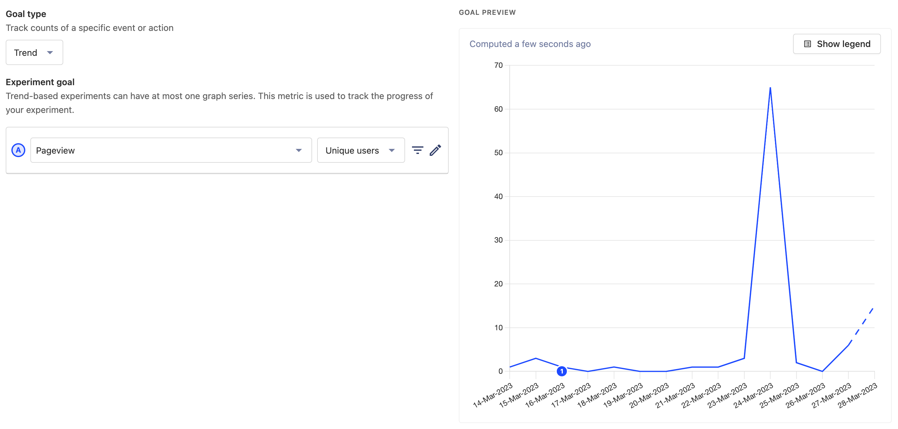
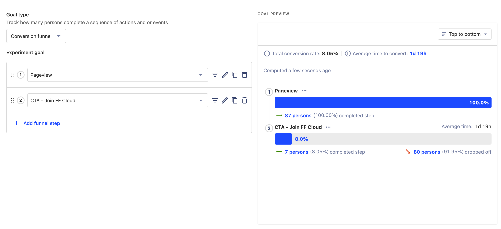

# A/B Testing

A/B Testing is a very useful exercise by which we can distribution variants of a piece of content and assess the success, defined by an arbitrary metric, for those variants.

## Defining a Test

A/B Tests can be proposed via the "A/B Testing" issue template on the [FlowFuse Website repository](https://github.com/FlowFuse/website/issues/new/choose). These issues are used to track findings. Results will be shared here from PostHog, and will provide a searchable source in the future if we want to reference historical A/B tests when proposiing new ideas that we may have already tried.

### What are your variants?

- **Control:** You must always define a `control` (A). This is generally whatever the state of the content/UI looks like now.

- **Test:** You must then define _at least_ one variant (B) of the content/UI. 

### What does success look like?

You must have a trackable metric that the variants can compete over. Example success metrics could be:

- Clicks of a certain button, e.g. a primary or secondary CTA
- $pageview events of a certain URL
- Number of Instances spun up on FlowFuse

## How we run A/B Tests

We run our A/B Testing via [PostHog Experiments](https://posthog.com/docs/experiments/manual). These are easily configured and setup in PostHog, and require that you answer the above questions in [Defining a Test](#defining-a-test)

### Types of PostHog Experiments

#### Trend

If you are purely interested in the raw number of a particular event taking place, then you'll want a Trend Experiment, e.g:



#### Funnel

If you are wanting to measure an improvement in conversion, then a Funnel Experiment is the way to go. For example, if we want to increase the number of visitors clicking our primary CTA, then we could do a Trend graph, but that may also just show improvements as a result of raw web traffic improving. Making it a "Funnel" Experiment, ensures we have a clean analysis of the conversion to CTA for a visitor.



## A/B Testing on our Website

To conduct a new Experiment:

1. Create an Experiment in PostHog
2. Define the criteria for which users you'd like involved, and the split across the variants

3. Make note of the relevant Feature Flag created, and variants (e.g. `control`, `testA`, `testB`)
4. Wherever you want to implement the variants, includes the following (equivalanet) code:


```liquid

    <h1 class="text-gray-50 max-w-lg m-auto">
    
    DevOps for Node-RED
    
    
    Run Node-RED in Production
    
    </h1>

```


As a quick explanation of what's happening here:

- `edge`: This tells Eleventy that we want to render this code server-side as a Netlify Edge Function
- `abtesting`: This is an Eleventy Shortcode that will automaticlaly check PostHog feature flags & experiments
- `<feature-flag>`: The Feature Flag defined for the experiment in PostHog.