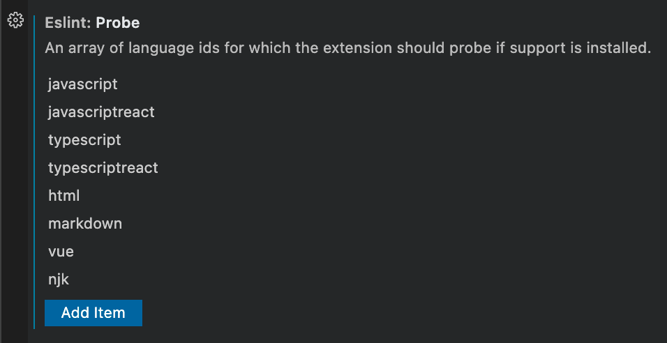

## Contributing

### Coding Best Practices

#### Linting

All code repositories adopt our standard linting rules found in the [flowforge/.github repository](https://github.com/FlowFuse/.github/blob/main/.eslintrc).

We use [StandardJS](https://standardjs.com/), with one exception - 4 spaces not 2.

If you're using VSCode, then we recommend using the [ESLint extenstion](https://github.com/Microsoft/vscode-eslint) and setting `all` for the `Eslint › Code Actions On Save: Mode` setting:

In the case of working with `vue` or `njk` files (found in the [frontend](https://github.com/FlowFuse/flowfuse/tree/main/frontend) and [website][website-repo] repositories), then you can add `vue` and `njk` to the `Eslint: Probe` setting in order to enable auto-formatting on save for these file types.

#### Editor Config

The [website repository][website-repo] uses a [`.editorconfig`](https://editorconfig.org)
to allow editors to automatically pick up the correct style for that repository.
Some editors, like neovim, has this pre-installed. If you're using VSCode, an
[plugin](https://marketplace.visualstudio.com/items?itemName=EditorConfig.EditorConfig)
is available.

### Git Best Practices

### Committing

Take care when adding files to a commit. It's easy just to `git add -A` (i.e. add all local changes to a commit) but this can result in commits and PRs being clogged with excessive changes that aren't linked to the actual issue/feature at hand.

Take your time when committing files. Review each file carefully and ensure what you're adding to a commit is relevant and necessary.

#### Git Commit Messages

- Capitalise the first letter, no trailing dot, 72 chars or less.
- First line should be an imperative/present tense, e.g. `Change` (not `Changed` or `Changes`)
- Do not include the issue number in the first line, this means that commit message are then suitable to include in a changelog as-is.
- Second line should either be blank, or reference to an issue/PR using one of the GitHub recognised keywords, e.g. `closes #...` `fixes #...` `part of #...`
- The remainder should be any further narrative that is needed. Wrapped at 72 chars.

#### Branching vs. Forking

Commits must never be pushed directly to `main`. Instead, branch or fork from the relevant branch (most likely `main`) and work from there.

It is preferred that new work be added on a branch (rather than in a forked repository), although this is not enforced. Branch names should be short, informative, and if directly linked to a single issue number, reference such issue number, e.g. `29-issue-summary`.

Once code is merged, please close any related branches in order to keep the repository tidy.

#### Pull Requests

PRs, when opened, should have at least one reviewer assigned, and a consequent review approved, before any merge takes place. If a PR is opened for review/discussion purposes, this PR should be set to `draft` state.

When merging a PR, you should choose the "Merge pull request" option. There is no need to rebase or squash the PR commits.

When conducting a PR review, if you are the last (or only) reviewer and all reviews (including your own) are approvals, unless there is a comment from the author stating otherwise, you are free to conduct the merge. Otherwise, leave the merge to the author of the PR, or a future reviewer.

For a comprehensive review of the Pull Request, utilize the designated FlowFuse pre-staging environment. As of the composition of this document, the pre-staging verification is only available for the primary [FlowFuse NPM package](https://github.com/FlowFuse/flowfuse).
To validate changes within the pre-staging environment, apply the deploy:pr label to the PR. The PR will then undergo automatic deployment to the pre-staging environment, and the deployment link will be appended to the associated workflow summary. The label should remain until the PR is merged.
A unique pre-staging environment is established for each Pull Request. This environment is terminated upon PR merging or closure. The FlowFuse application deployed from the Pull Request comes pre-configured. Access credentials for the pre-staging environment are located in the FlowFuse 1Password vault.

[website-repo]: https://github.com/FlowFuse/website
