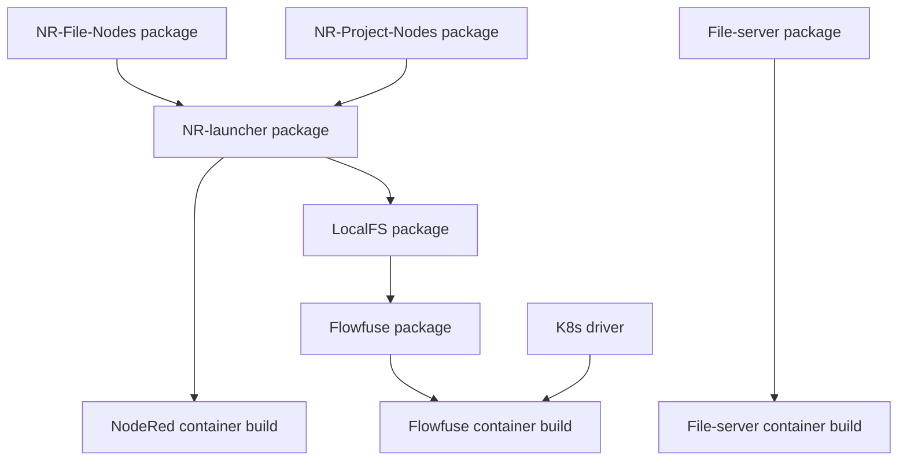

# Dependencies within the CI/CD process

This paragraph shows a graphical presentation of dependencies between each build pipeline in our CI/CD process.

```mermaid
graph TB
    A[NR-File-Nodes package] & C[NR-Project-Nodes package] --> B[NR-launcher package]
    B ----> X[NodeRed container build]
    B --> D[LocalFS package]
    D --> E[Flowfuse package]
    E & F[K8s driver] --> Y[Flowfuse container build]
    G[File-server package] -----> Z[File-server container build]

```