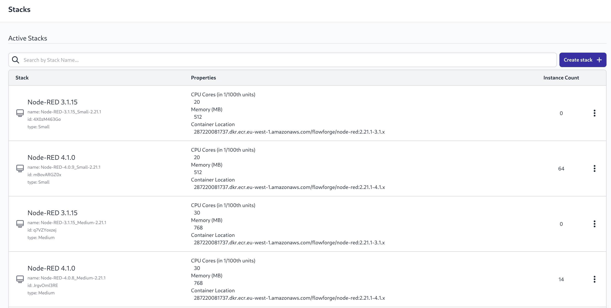
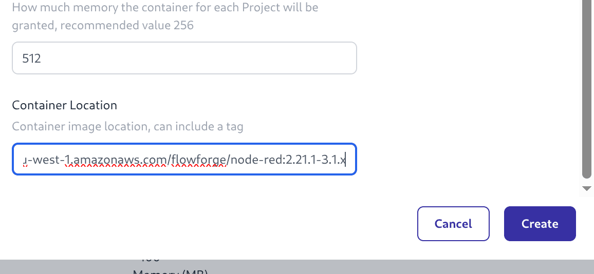

# How to Update Stacks on Production

As part of a FlowFuse Release the Stack definitions need updating
to use the latest container images.

## Process

1. Login as a FlowFuse Cloud Admin user
2. Navigate to Admin Settings -> Stacks
    {data-zoomable width="800px"}
    _Screenshot of Stacks list_
3. For each Stack in the "Active Stacks" section select "Create New Version" from the 3 dot menu and then follow Steps 4,5,6
4. Edit the Stack Name to remove the "-copy" and update the semver number
    {data-zoomable width="700px"}
    _Screenshot of Stack Name_
5. Edit the "Container Location" to edit the container tag, update just the semver of FlowFuse, not the Node-RED version suffix
    {data-zoomable width="700px"}
    _Screenshot of Stack Location_
6. Complete this step with the "Create" button

A new version of the Stack will appear in the "Active Stacks" list and the old one should move to the "Inactive Stacks" list.