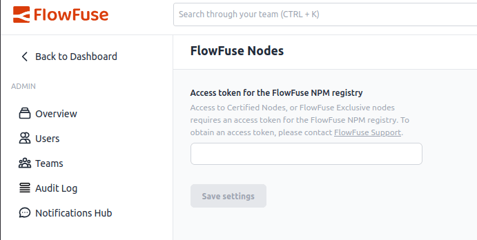

# Certified Nodes

FlowFuse maintains a catalogue of nodes from the community that we put through regular checks
to ensure they are of high quality and standards for use by our customers.

The catalogue is maintained in the [certified-nr-nodes](https://github.com/FlowFuse/certified-nr-nodes)(🔒) repository.

A daily GH action runs the audit process across all nodes and regenerates the `catalogue.json` file served to Node-RED
instances within FlowFuse.

## Proposing a new node to be included

1. [Raise an issue](https://github.com/FlowFuse/certified-nr-nodes/issues/new)(🔒) with details of the node to be added.
2. Assign the issue to the CTO (or in his absence, another member of the Engineering Team).

## Adding a new node to the list

Full details on the technical process are provided in the [certified-nr-nodes](https://github.com/FlowFuse/certified-nr-nodes)(🔒) readme.

1. Perform due diligence on the module; how popular is it, is it well maintained, is there a backlog of open issues etc.
2. Add the module to the list held in `modules.json`
3. Run the audit locally to check the current state of the module. Review the results and assess whether we can accept it into the catalogue in its current state.
4. Raise a PR with the updated module list and audit output for the module.
5. Review the PR with the CTO/Engineering Team

## Generating Tokens for Access to Certified Nodes Registry

Licensed Self Hosting customers can request acces to the Certified Nodes registry via support. These are the steps to generate a token for them

1. On FlowFuse Cloud in the FlowFuse Team, locate the `ff-certified-nodes` instance in the `Internal Tools` Application
2. Open the editor and locate the function node in the `Authentication` tab
3. The comments at the top of the tab explain how to generate a token using the customer name and a randomly generated password (recomend using the `pwgen` command to create random password)
4. Add the username, password and token (as comment) to the `tokens` object in the function node
5. Provide the token to the customer to add in the `Admin Settings` -> `Flowfuse Nodes` section in their Forge instance

