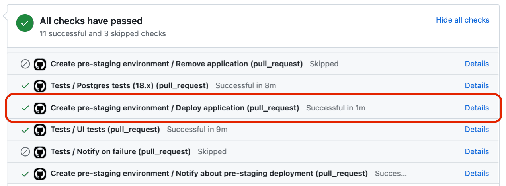

# Contributing

## Coding Best Practices

### Linting

All code repositories adopt our standard linting rules found in the [flowforge/.github repository](https://github.com/FlowFuse/.github/blob/main/.eslintrc).

We use [StandardJS](https://standardjs.com/), with one exception - 4 spaces not 2.

If you're using VSCode, then we recommend using the [ESLint extenstion](https://github.com/Microsoft/vscode-eslint) and setting `all` for the `Eslint › Code Actions On Save: Mode` setting:

In the case of working with `vue` or `njk` files (found in the [frontend](https://github.com/FlowFuse/flowfuse/tree/main/frontend) and [website][website-repo] repositories), then you can add `vue` and `njk` to the `Eslint: Probe` setting in order to enable auto-formatting on save for these file types.

### Editor Config

The [website repository][website-repo] uses a [`.editorconfig`](https://editorconfig.org)
to allow editors to automatically pick up the correct style for that repository.
Some editors, like neovim, has this pre-installed. If you're using VSCode, an
[plugin](https://marketplace.visualstudio.com/items?itemName=EditorConfig.EditorConfig)
is available.

## Git Best Practices

### Committing

Take care when adding files to a commit. It's easy just to `git add -A` (i.e. add all local changes to a commit) but this can result in commits and PRs being clogged with excessive changes that aren't linked to the actual issue/feature at hand.

Take your time when committing files. Review each file carefully and ensure what you're adding to a commit is relevant and necessary.

#### Git Commit Messages

- Capitalise the first letter, no trailing dot, 72 chars or less.
- First line should be an imperative/present tense, e.g. `Change` (not `Changed` or `Changes`)
- Do not include the issue number in the first line, this means that commit message are then suitable to include in a changelog as-is.
- Second line should either be blank, or reference to an issue/PR using one of the GitHub recognized keywords, e.g. `closes #...` `fixes #...` `part of #...`
- The remainder should be any further narrative that is needed. Wrapped at 72 chars.

#### Branching vs. Forking

Commits must never be pushed directly to `main`. Instead, branch or fork from the relevant branch (most likely `main`) and work from there.

It is preferred that new work be added on a branch (rather than in a forked repository), although this is not enforced. Branch names should be short, informative, and if directly linked to a single issue number, reference such issue number, e.g. `29-issue-summary`.

Once code is merged, please close any related branches in order to keep the repository tidy.

### Pull Requests

PRs, when opened, should have at least one reviewer assigned, and a consequent review approved, before any merge takes place. If a PR is opened for review/discussion purposes, this PR should be set to `draft` state.

When merging a PR, you should choose the "Merge pull request" option. There is no need to rebase or squash the PR commits.

When conducting a PR review, if you are the last (or only) reviewer and all reviews (including your own) are approvals, unless there is a comment from the author stating otherwise, you are free to conduct the merge. Otherwise, leave the merge to the author of the PR, or a future reviewer.

For a comprehensive review of the Pull Request, utilize the designated FlowFuse pre-staging environment. As of the composition of this document, the pre-staging verification is only available for the primary [FlowFuse NPM package](https://github.com/FlowFuse/flowfuse).

Pre-staging environment is created for each Pull Request created within `FlowFuse/flowfuse` repo which includes changes in the source code. Read more in the [Test Changes in Staging](#test-changes-in-staging) section.

## Conducting Code Reviews

As part of our commitment to quality, all code changes should be reviewed by at least one other developer before being merged. This is to ensure that the code is of a high standard, and that any potential issues are caught early.

When code is ready to review, developer should open a Pull Request (PR) and assign a reviewer. The reviewer should then review the code, and provide feedback in the form of comments on the PR.

When reviewing code, consider the following:

- **Functionality:** Has the acceptance criteria on the attached issue been met? Does the code do what it is supposed to do? You ***must explicitly test the functionality***. It is recommended to do so in a [staging environment](#test-changes-in-staging) as well as pulling code changes locally and testing on your own machine. 
- **Test Coverage:** Are there tests for the new code introduced? Are the test cases sufficient, and do they cover more than just golden path?
- **Documentation:** Ensure that supporting documentation has been written, this is especially important for new features and options introduced.

### Test Changes in Staging

For FlowFuse, when changes are merged into the `main` branch, they are [automatically deployed to the production environment](../ops/production#deployment-to-flowfuse-cloud). As such, it is vital a thorough review has been conducted before merging, and that the changes have been tested in a staging environment.

When a pull request includes modifications to the source code, a dedicated pre-staging environment is automatically generated. This pre-staging environment is a complete replica of the staging environment, ensuring that it mirrors the conditions and configurations found in staging. The pre-staging environment serves as a testing ground, allowing developers to thoroughly evaluate their changes before they are merged into the main codebase. This ensures that any issues can be identified and addressed in an isolated setting, maintaining the integrity of the staging environment.

The environment itself will then be available at: `https://<pr-number>.flowfuse.dev/` . Information about the pre-staging deployment is sent to `gh-pipelines` Slack channel.

Access credentials for the pre-staging environment are located in the FlowFuse 1Password vault.

The FlowFuse application deployed from the Pull Request comes pre-configured. The environment is terminated upon PR merging or closure.

#### Custom Pre-Staging Environment

By default, a pre-staging environment is automatically created for each Pull Request made in the `flowfuse/flowfuse` repository, containing changes from the related feature branch. 
However, there are instances where it is necessary to test changes or features made in the dependency packages of `flowfuse/flowfuse`. 
This can be accomplished by triggering a GitHub Actions pipeline to create a pre-staging environment with additional input parameters.

To create a customized pre-staging environment, please follow the steps below:
1. Push the changes you want to test to the feature branch of the specific package's repository, ie. `nr-project-nodes`.
2. In the `flowfuse/flowfuse` repository, create a new feature branch. Use this branch to make any necessary changes that depend on the updated package from step 1, if applicable.
3. Create a Pull Request for the changes in the `flowfuse/flowfuse` repository.
4. Navigate to the [Create pre-staging environment workflow page](https://github.com/FlowFuse/flowfuse/actions/workflows/branch-deploy.yaml) in the Actions tab of the `flowfuse/flowfuse` repository.
5. On the right side, click the `Run workflow` button.
6. Complete the `Pull request number` field and the dependent package feature branch name.

{data-zoomable}

7. Click the `Run workflow` button and wait for the results. A Slack notification will be sent to the `gh-pipelines` channel with the link to the pre-staging environment.

##### Using the custom Pre-Staging Environment

Once your pre-staging environment is created, you can create a new instance that uses your custom stack: 
1. Select the desired team
2. Select an application
3. Click "Add Instance"
4. Select the "Custom" entry in the "Node-RED Version" dropdown
5. Press Next until you reach the last step of the instance creation wizard
6. Press "Create Instance" to create your instance

### Community Contributions

As an open-core project, FlowFuse welcomes community contributions to the project. If you are, as a FlowFuse employee, conducting a review of a community contribution, please consider these additional guidelines:

1. **Be Grateful:** The community has taken the time to contribute to the project in their own time. They didn't need to do this, explicitly thank contributors for their Pull Requests, especially for first time contributors.
2. **Be Respectful:** In some cases, contributors may not have considered all the implications of their changes, or may not have the technical acumen to make the changes themselves to the standards we may like. Remember, they are doing this because they care about the project. Be respectful, provide feedback and be encouraging of future changes. Teaching a contributor about our code, and about mechanics of the project is a great way to help them improve, and will encourage more contributions in the future.
3. **Don't pressure them:** Proposing modifications and fixes to their Pull Requests are valid, and are important to ensuring we maintain a high quality codebase. However, we should never ask a contributor to do more work than they need to do. They are volunteering their time, and we shouldn't place demands on them to pick up additional issues as if they were FlowFuse employees. If they ask where they could be helpful, or want to take tasks for us, then please do assign accordingly.
4. **Don't be afraid to step in and make changes yourself:** Having a contributor go from opening a PR to seeing it merged is our main objective here. Closing that loop in a timely and supportive manner will encourage more contributions in the future. Sometimes, it may be necessary to make changes to a PR yourself, and explain to the contributor the reasoning behind your modifications to their work. Teaching is vitally important still, but doing some things yourself will reduce the friction to merge for the contributor, so make assessments where this could be done.

[website-repo]: https://github.com/FlowFuse/website
