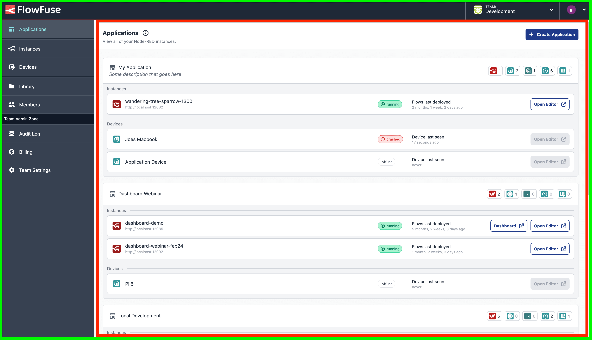

# Layouts

The frontend has 4 layouts which can be found in `frontend/src/layouts`:
- Platform
- Plain
- Page
- Box

## Layout Variants

### Platform
The platform layout serves as the primary structure throughout the application.

It comprises a page header and side navigation, offering features such as platform banners, toast notifications, dialog/modals, and interview popups.

Most importantly, it is designed to be mobile-friendly.


_Screenshot of the FlowFuse platform to show the areas controlled by the Platform (green) layout and the child, Page (red) layout._

#### Page
The page layout is used primarily as a wrapper for Vue pages and has support for a header slot among a default one.

### Plain
The plain layout serves as a blank structure primarily used for embedded pages or any other structures that don't require navigation or headers (ex: error pages).

Has support for alerts and dialog/modals.

### Box
The box layout is used in the initial Setup phase and consists of a boxed layout which guides you through the required steps in configuring the Flow Fuse Application.


_Screenshot of the FlowFuse platform with a page using the "Box" layout._

## Layout Selection

Layout selection is done via a `layout` meta attribute defined on the page route.

```javascript
{
    path: '/instance/:id',
    name: 'Instance',
    component: Instance,
    meta: {
        title: 'Instance - Overview',
        layout: 'plain' // 'platform'/'modal'/'plain'
    },
}
```

If the layout meta attribute is missing or an invalid value is passed, the application will default to the platform layout.
