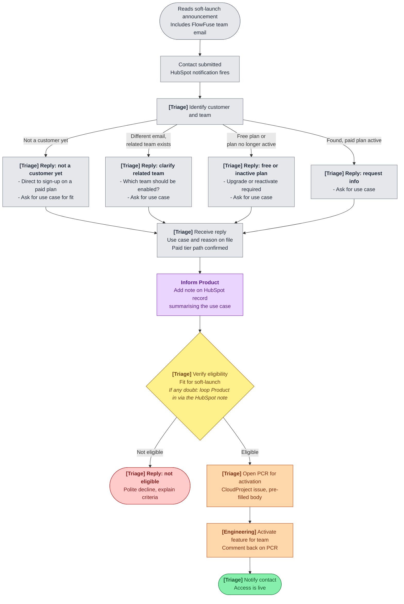

# Expert Agentic Application Building Soft-Launch Access

FlowFuse Expert Agentic Application Building (agentic Node-RED development, FlowFuse 2.30) is in soft launch on FlowFuse Cloud. Access is granted on request to teams on a paid plan (Starter, Team, Enterprise). This page describes how to triage incoming requests.

Customers request access via the [contact form](/contact-us/?subject=FlowFuse%20Expert%20Application%20Building) linked from the [2.30 release blog post](/blog/2026/05/flowfuse-release-2-30/) and the changelog. They are asked to include the email associated with their FlowFuse Cloud team.

## Ownership

| Role | Responsibility |
| --- | --- |
| **Triage duty** | Whoever is on triage duty owns the end-to-end customer-facing flow: identifying the customer in HubSpot, sending the appropriate reply, judging eligibility, and opening the activation handoff. Default owner of every step unless explicitly labelled `[Engineering]`. |
| **Engineering** | Owns the technical activation of the feature for the team once triage opens a PCR. Confirms back on the PCR when activation is complete so triage can close the loop with the customer. |
| **Product** | Owns the soft-launch eligibility criteria, is informed as soon as each new use case becomes clear (via a note on the HubSpot record), and is looped in on eligibility whenever triage has any doubt. |

## Flow





## Step by step

1. **[Triage] Identify customer and team in HubSpot** using the email from the contact submission. Four outcomes:
   - **Not a customer yet**: no FlowFuse Cloud team for this contact or their company.
   - **Different email, related team exists**: the contact's email doesn't match, but a team at the same company exists under a different email (e.g. a colleague's Starter team).
   - **Free plan or plan no longer active**: the team exists but is on the Free plan, or a previously paid plan / trial has expired or been cancelled.
   - **Found, paid plan active**: the team is on Starter, Team, or Enterprise with an active subscription.

2. **[Triage] Reply with an info ask, scoped to what is still missing.** The paid tier requirement always lands in this first reply so it never arrives late in the conversation. Use the relevant template below.

3. **Inform Product as soon as the use case is on file.** Add a note to the HubSpot contact record summarising the request (team name, use case in one or two sentences, plan tier) and mention Product on the note so they are notified. Keep the conversation in HubSpot; do not move it to Slack.

4. **[Triage] Verify eligibility** once use case, reason, and paid tier path are all on file. Eligibility checks fit for the soft-launch (intended use, team readiness, paid plan in place or being arranged). Eligibility runs only after all info is in.
   - **If you have any doubt about fit, loop Product into the decision** by adding them to the same HubSpot note thread. Product owns the criteria; triage should not make borderline decisions alone.

5. **Outcome:**
   - **Eligible**: [Triage] open a [Production Change Request](https://github.com/FlowFuse/CloudProject/issues/new?assignees=&labels=change-request&projects=&template=change-request.yml&title=Change%3A+Enable+Expert+Agentic+Application+Building+for+%5Bteam%5D&change-description=Enable+FlowFuse+Expert+Agentic+Application+Building+%28soft+launch%29+for+the+team+below.%0A%0A**Team+name**%3A+%5Bteam+name%5D%0A**FlowFuse+Cloud+team+ID**%3A+%5Bteam-id%5D%0A**Plan+tier**%3A+%5BStarter+%7C+Team+%7C+Enterprise%5D%0A**Use+case**%3A+%5B1-2+sentences+from+customer+reply%5D%0A**Eligibility+confirmed+by**%3A+%5Btriage+name%5D%0A**Product+consulted**%3A+%5Byes+%2F+no%5D%0A**HubSpot+contact**%3A+%5Blink+to+contact+record%5D%0A%0AOnce+activated%2C+please+comment+back+on+this+issue+so+triage+can+notify+the+customer.&validation-steps=-+%5B+%5D+Feature+enabled+for+the+team+in+admin+UI%0A-+%5B+%5D+Spot-check+from+a+team+member+account%3A+Expert+Agentic+Application+Building+entry+point+is+visible%0A-+%5B+%5D+Comment+on+this+issue+confirming+activation) in CloudProject. Tick **Production** in the Environment checkbox.
   - **Not eligible**: [Triage] reply with a polite decline using the template below.

6. **[Engineering] Activate the feature for the team** referenced in the PCR and comment back on the PCR when complete.

7. **[Triage] Notify the contact** that access is live.

## Reply templates

Adapt to tone and context. The shape of the ask is what matters.

### A. Not a customer yet

> Subject: FlowFuse Expert Agentic Application Building
>
> Hi [name],
>
> Thanks for your interest. It looks like [company name] doesn't have a FlowFuse Cloud team yet. Expert Agentic Application Building runs on top of FlowFuse Cloud, so we'd need a team in place on a paid plan (Starter, Team, Enterprise) before we can enable the feature. Happy to walk through plan options and help get set up.
>
> In the meantime, your use case helps us confirm fit: what you want to build, why you need it, what you plan to do with it, plus any other context you'd like to share.

### B. Different email, related team exists

> Subject: FlowFuse Expert Agentic Application Building
>
> Hi [name],
>
> Thanks for your interest. The email you used doesn't match a FlowFuse Cloud team directly, but I can see [company name] has a [Starter / Team / Enterprise] team active under a different email. A couple of things to sort out:
>
> - Should we enable Expert Agentic Application Building on that existing team, or are you looking to set up a separate one? Happy to walk through either path.
> - Your use case: what you want to build, why you need it, what you plan to do with it, plus any other context you'd like to share.

### C. Free plan or plan no longer active

> Subject: FlowFuse Expert Agentic Application Building
>
> Hi [name],
>
> Thanks for your interest. We found your [team name] team on FlowFuse Cloud. Two things before we move forward:
>
> - Expert Agentic Application Building is currently available on FlowFuse Cloud paid plans (Starter, Team, Enterprise). Your team is on the Free plan today / your previous plan is no longer active, so it'll need to be upgraded or reactivated before we can enable the feature. Happy to walk through plan options.
> - Your use case: what you want to build, why you need it, what you plan to do with it, plus any other context you'd like to share.

### D. Found, team is already on a paid plan

> Subject: FlowFuse Expert Agentic Application Building
>
> Hi [name],
>
> Thanks for your interest. We found your [team name] team on FlowFuse Cloud. To confirm fit for the soft launch, could you share your use case: what you want to build, what you plan to do with it, plus any other context you'd like to share?
>
> Once we have that we'll enable Expert Agentic Application Building on your team.

### E. Decline (not eligible)

> Subject: FlowFuse Expert Agentic Application Building
>
> Hi [name],
>
> Thanks for sharing your use case. Right now [specific reason], so we're not enabling it on your team at this stage.
>
> We'll be expanding access over the coming weeks. If your situation changes, reach back out and we'll re-evaluate.

## Edge cases

- **Contact never replies to the info ask**: [Triage] treat as stalled. Follow up on the standard cadence; close the loop after the cadence is exhausted.
- **Found-tier classification is ambiguous** (e.g. trial about to expire, plan change in flight): [Triage] treat as Free tier and include the paid tier note.
- **Eligibility genuinely borderline or use case is unusual**: [Triage] loop Product into the HubSpot note before deciding. Better to slow one case down by a day than ship a no/yes Product would have flipped.
- **Decline appeals**: [Triage] handle out of band. The decline reply explains the criteria so the customer can return with new context if their situation changes.
- **Engineering activation fails or is delayed**: Engineering comments back on the PCR; triage keeps the customer informed.
