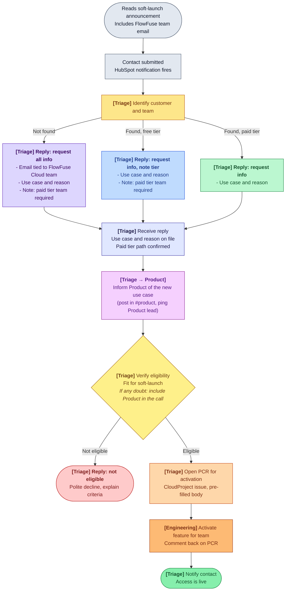

# Expert Agentic Application Building Soft-Launch Access

FlowFuse Expert Agentic Application Building (agentic Node-RED development, FlowFuse 2.30) is in soft launch on FlowFuse Cloud. Access is granted on request to teams on a paid plan (Starter, Team, Enterprise). This page describes how to triage incoming requests.

Customers request access via the [contact form](/contact-us/?subject=FlowFuse%20Expert%20Application%20Building) linked from the [2.30 release blog post](/blog/2026/05/flowfuse-release-2-30/) and the changelog. They are asked to include the email associated with their FlowFuse Cloud team.

## Ownership

| Role | Responsibility |
| --- | --- |
| **Triage duty** | Whoever is on triage duty owns the end-to-end customer-facing flow: identifying the customer in HubSpot, sending the appropriate reply, judging eligibility, and opening the activation handoff. Default owner of every step unless explicitly labelled `[Engineering]`. |
| **Engineering** | Owns the technical activation of the feature for the team once triage opens a PCR. Confirms back on the PCR when activation is complete so triage can close the loop with the customer. |
| **Product** | Owns the soft-launch eligibility criteria, is informed as soon as each new use case becomes clear, and is included in eligibility decisions whenever triage has any doubt. |

## Flow





## Step by step

1. **[Triage] Identify customer and team in HubSpot** using the email from the contact submission. Three outcomes:
   - **Not found**: no matching contact or FlowFuse Cloud team.
   - **Found, free tier**: the team exists but is on the Free plan.
   - **Found, paid tier**: the team is on Starter, Team, or Enterprise.

2. **[Triage] Reply with an info ask, scoped to what is still missing.** The paid tier requirement always lands in this first reply so it never arrives late in the conversation. Use the relevant template below.

3. **[Triage → Product] Inform Product as soon as the use case is on file.** Post a short summary in `#product` (team name, use case in one or two sentences, plan tier). This keeps Product in the loop on demand patterns without making them a blocker on every case.

4. **[Triage] Verify eligibility** once use case, reason, and paid tier path are all on file. Eligibility checks fit for the soft-launch (intended use, team readiness, paid plan in place or being arranged). Eligibility runs only after all info is in.
   - **If you have any doubt about fit, include Product in the eligibility call.** Loop them in via the same `#product` thread or pull them into the HubSpot record. Product owns the criteria; triage should not make borderline decisions alone.

5. **Outcome:**
   - **Eligible**: [Triage] open a [Production Change Request](https://github.com/FlowFuse/CloudProject/issues/new?assignees=&labels=change-request&projects=&template=change-request.yml&title=Change%3A+Enable+Expert+Agentic+Application+Building+for+%5Bteam%5D&change-description=Enable+FlowFuse+Expert+Agentic+Application+Building+%28soft+launch%29+for+the+team+below.%0A%0A**Team+name**%3A+%5Bteam+name%5D%0A**FlowFuse+Cloud+team+ID**%3A+%5Bteam-id%5D%0A**Plan+tier**%3A+%5BStarter+%7C+Team+%7C+Enterprise%5D%0A**Use+case**%3A+%5B1-2+sentences+from+customer+reply%5D%0A**Eligibility+confirmed+by**%3A+%5Btriage+name%5D%0A**Product+consulted**%3A+%5Byes+%2F+no%5D%0A**HubSpot+contact**%3A+%5Blink+to+contact+record%5D%0A%0AOnce+activated%2C+please+comment+back+on+this+issue+so+triage+can+notify+the+customer.&validation-steps=-+%5B+%5D+Feature+enabled+for+the+team+in+admin+UI%0A-+%5B+%5D+Spot-check+from+a+team+member+account%3A+Expert+Agentic+Application+Building+entry+point+is+visible%0A-+%5B+%5D+Comment+on+this+issue+confirming+activation) in CloudProject. Most fields prefill from the URL; tick **Production** in the Environment checkbox. Post the link in `#dept-engineering`.
   - **Not eligible**: [Triage] reply with a polite decline using the template below.

6. **[Engineering] Activate the feature for the team** referenced in the PCR and comment back on the PCR when complete.

7. **[Triage] Notify the contact** that access is live.

### If the PCR URL pre-fill doesn't populate

Paste this into Change Description manually:

```
Enable FlowFuse Expert Agentic Application Building (soft launch) for the team below.

**Team name**: [team name]
**FlowFuse Cloud team ID**: [team-id]
**Plan tier**: [Starter | Team | Enterprise]
**Use case**: [1-2 sentences from customer reply]
**Eligibility confirmed by**: [triage name]
**Product consulted**: [yes / no]
**HubSpot contact**: [link to contact record]

Once activated, please comment back on this issue so triage can notify the customer.
```

## Reply templates

Adapt to tone and context. The shape of the ask is what matters.

### A. Not found (no FlowFuse Cloud team matched)

> Subject: FlowFuse Expert Agentic Application Building, information needed
>
> Hi [name],
>
> Thanks for your interest in FlowFuse Expert Agentic Application Building. We couldn't match the email you used to a FlowFuse Cloud team. To take this further we'll need:
>
> - The email associated with the FlowFuse Cloud team that should receive access
> - A short description of your use case (the kind of application you're hoping Expert will help build)
> - The reason you'd like to be part of the soft launch
>
> One thing to flag upfront: Expert Agentic Application Building is currently available on FlowFuse Cloud paid plans (Starter, Team, Enterprise). The team that gets enabled will need to be on one of these plans.
>
> Looking forward to hearing back.

### B. Found, team is on the Free plan

> Subject: FlowFuse Expert Agentic Application Building, a couple of things
>
> Hi [name],
>
> Thanks for your interest in FlowFuse Expert Agentic Application Building. We found your [team name] team on FlowFuse Cloud. Two things before we move forward:
>
> - Expert Agentic Application Building is currently available on FlowFuse Cloud paid plans (Starter, Team, Enterprise). Your team is on the Free plan today, so it'll need to be upgraded before we can enable the feature. Happy to walk through plan options if useful.
> - We'd also like to learn more so we can confirm your team is a good fit for the soft launch:
>   - A short description of your use case
>   - The reason you'd like to be part of the soft launch

### C. Found, team is already on a paid plan

> Subject: FlowFuse Expert Agentic Application Building, a couple of questions
>
> Hi [name],
>
> Thanks for your interest in FlowFuse Expert Agentic Application Building. We found your [team name] team on FlowFuse Cloud. To confirm fit for the soft launch, could you share:
>
> - A short description of your use case (the kind of application you're hoping Expert will help build)
> - The reason you'd like to be part of the soft launch
>
> Once we have these we'll enable Expert Agentic Application Building on your team.

### D. Decline (not eligible)

> Subject: FlowFuse Expert Agentic Application Building, soft launch eligibility
>
> Hi [name],
>
> Thanks again for sharing your use case for Expert Agentic Application Building. We're rolling this out as a soft launch to a small group of teams who are a particularly close fit for what the capability does today. Right now [specific reason: e.g. the use case sits outside what Expert can build at this stage / the team's setup doesn't yet match the soft-launch criteria], so we're not enabling it on your team at this stage.
>
> We'll be expanding access over the coming weeks. If your situation changes, reach back out and we'll re-evaluate.

## Edge cases

- **Contact never replies to the info ask**: [Triage] treat as stalled. Follow up on the standard cadence; close the loop after the cadence is exhausted.
- **Found-tier classification is ambiguous** (e.g. trial about to expire, plan change in flight): [Triage] treat as Free tier and include the paid tier note.
- **Eligibility genuinely borderline or use case is unusual**: [Triage] pull Product into the call before deciding. Better to slow one case down by a day than ship a no/yes Product would have flipped.
- **Decline appeals**: [Triage] handle out of band. The decline reply explains the criteria so the customer can return with new context if their situation changes.
- **Engineering activation fails or is delayed**: Engineering comments back on the PCR; triage keeps the customer informed.
