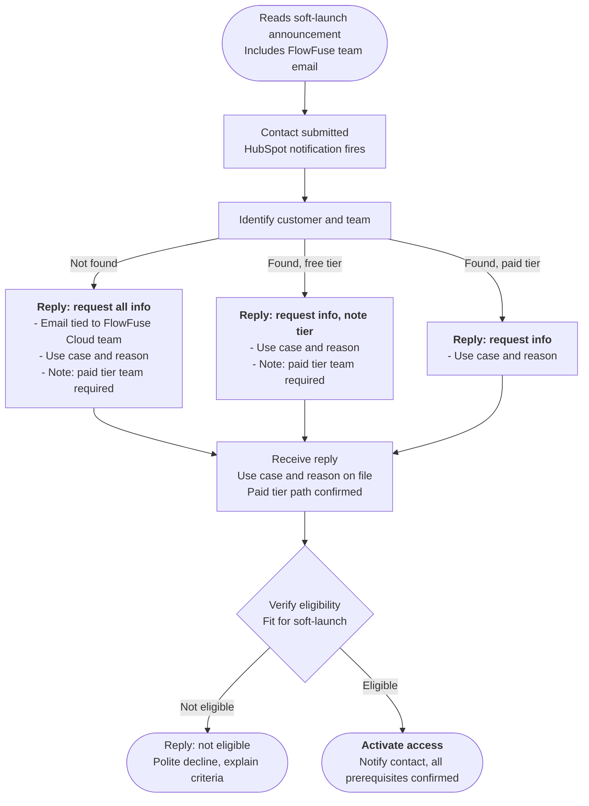

# Expert Application Building Soft-Launch Access

FlowFuse Expert Application Building (agentic Node-RED development, FlowFuse 2.30) is in soft launch on FlowFuse Cloud. Access is granted on request to teams on a paid plan (Starter, Team, Enterprise). This page describes how to triage incoming requests.

Customers request access via the [contact form](/contact-us/?subject=FlowFuse%20Expert%20Application%20Building) linked from the [2.30 release blog post](/blog/2026/05/flowfuse-release-2-30/) and the changelog. They are asked to include the email associated with their FlowFuse Cloud team.

## Flow





## Step by step

1. **Identify customer and team in HubSpot** using the email provided in the contact submission. Three outcomes:
   - **Not found**: no matching contact or FlowFuse Cloud team.
   - **Found, free tier**: the team exists but is on the Free plan.
   - **Found, paid tier**: the team is on Starter, Team, or Enterprise.

2. **Reply with an info ask, scoped to what is still missing.** The paid tier note always lands in this first reply so it never arrives late in the conversation.

   | Identify result | Ask for | Include paid tier note |
   | --- | --- | --- |
   | Not found | Email tied to FlowFuse Cloud team, use case, reason | Yes |
   | Found, free tier | Use case, reason | Yes |
   | Found, paid tier | Use case, reason | No |

3. **Verify eligibility** once the reply is received and use case, reason, and paid tier path are all on file. Eligibility checks fit for the soft-launch (intended use, team readiness, paid plan in place or being arranged). Eligibility runs only after all info is in.

4. **Outcome**:
   - **Eligible**: activate access for the team and notify the contact. Activation is a single step (it both technically enables the feature and confirms with the customer).
   - **Not eligible**: reply with a polite decline and explain the criteria that were not met.

## Edge cases

- **Contact never replies to the info ask**: treat as stalled. Follow up on the standard cadence; close the loop after the cadence is exhausted.
- **Found-tier classification is ambiguous** (e.g. trial about to expire, plan change in flight): treat as free tier and include the paid tier note.
- **Decline appeals**: handle out of band. The decline reply explains the criteria so the customer can return with new context if their situation changes.
