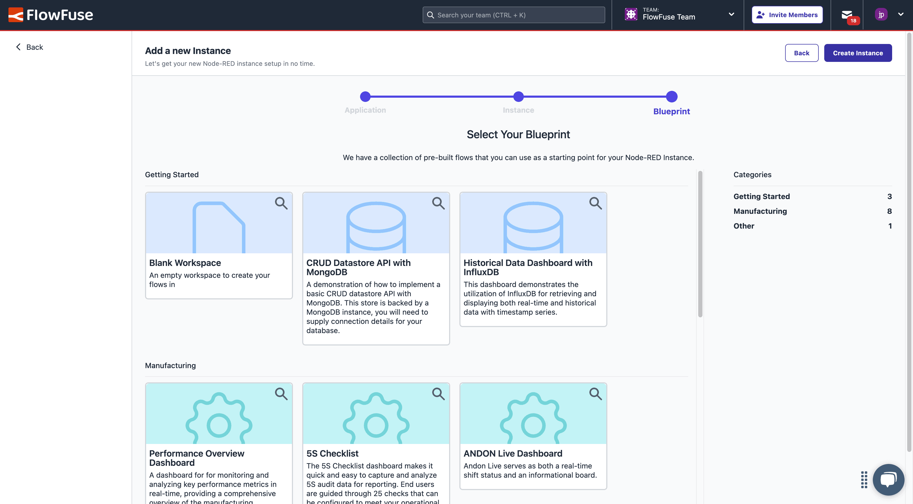

# Blueprints

{data-zoomable}
_Screenshot of the Blueprint selection UI in FlowFuse_

As part of the FlowFuse platform, it is possible to define "Blueprints".

Blueprints are packaged flows that help users get up and running with a particular project or idea. They should be informative, easy to understand, and provide a clear path to value.

FlowFuse host a public version of our [Blueprint Library here](https://flowfuse.com/blueprints/).

## Tracking Blueprint Ideas

We have a [GitHub Project Board](https://github.com/orgs/FlowFuse/projects/28/views/1) used to track the state of each idea recorded in the private `blueprint-library` repository ([link](https://github.com/FlowFuse/blueprint-library/issues)).

{data-zoomable}
_Screenshot of the Blueprint Project Board_

## Submitting a Blueprint

### Public Submission

We encourage Blueprint submissions from our customers, partners, and the wider community. Anyone can submit their own Blueprint idea via our online portal [here](https://flowfuse.com/blueprints/submit/). Please check with the [Minimum Requirements](#minimum-requirements) to ensure any submissions have provided the relevant details.

### Internal Development

If a Blueprint is being developed internally, it should be added to the `blueprint-library` repository via a Pull Request. First, create an issue in the same repository to track its progress and ensure alignment with product and company strategy. The Pull Request must be reviewed and tested by another team member. Once approved, [submit a Change Request](#submitting-a-change-request). When the responsible admin adds the Blueprint to the platform, they will share the Blueprint ID with the author, who should then include it in the Blueprint's README file:

```markdown
---
title: <Blueprint Name>
description: "<Description goes here>"
image: <Image Path>
tags:
  - blueprints
  - <blueprint tag such as manufacturing, getting-started, or other>
layout: layouts/blueprint.njk
blueprintId: <BlueprintId goes here>
---
Rest of the content...
```

Once done, the reviewer or the author can proceed to merge the Pull Request.

## Minimum Requirements

### Flow

The bare minimum requirement for a Blueprint is the respective `flow.json` file which details the Node-RED flow associated to the Blueprint.

#### Dependencies

With the `flow.json` we also need to have details on any third-party nodes and dependencies that the `flow.json` will require in order to be functional.

### Screenshots

Images help commuicate the value of a Blueprint, without the need to fully deploy it. Screenshots and images are used as part of marketing material in socials, as well as imagery on the Blueprint Library itself, e.g. the image background of the Blueprint's tile.

### Appearance

Blueprints are designated to a **category**. On FlowFuse Cloud, these categories are currently:

- Getting Started
- Manufacturing
- Other

But others can, and should, be added as required.

Each Blueprint can also have a custom icon, which should be defined as an icon from [Hero Icons v1](https://v1.heroicons.com/). The color for the tile of each Blueprint is hardcoded then depending on the category. Any changes to color, or coloring of new categories currently require a code change within FlowFuse.`

### Company Information

Submissions are encouraged to be from an organization, rather than an individual. As such, any submission must has an associated:

- Company Name
- Company Logo

## Publishing a Blueprint

Blueprints must be published in two locations:

- **Website**: This is our _public_ Blueprint Library, where users can browse Blueprints and get access to a quick "Deploy" action.
- **Platform**: This is the _internal_ Blueprint Library within FlowFuse. It is configured as part of the FlowFuse Admin Panel.

### Website

To add a Blueprint to our public Blueprint Library, we need to publish the Blueprint to the [`blueprint-library` repository](https://github.com/FlowFuse/blueprint-library). The Website then automatically picks up the new Blueprint and publishes it.

#### License

All Blueprints require a comment node be added to the flow, with the relevant license included.

You can import the required comment node by importing the following JSON:

```json
{
    "id": "fc23cedbf1194ca4",
    "type": "comment",
    "z": "ad0d2e8ce07aeb8b",
    "name": "License",
    "info": "The FlowFuse License\nCopyright (c) 2021-present FlowFuse Inc\n\nWith regard to the FlowFuse Software:\n\nThis software and associated documentation files (the \"Software\") may only be\nused in production, if you (and any entity that you represent) have agreed to,\nand are in compliance with, the FlowFuse Subscription Terms (the \"Terms\"),\nor other agreements governing the use of the Software, as mutually agreed by you\nand FlowFuse Inc (\"FlowFuse\"), and otherwise have a valid FlowFuse Subscription\nfor the active usage. Subject to the foregoing sentence, you are free to modify\nthis Software and publish patches to the Software. You agree that FlowFuse and/or\nits licensors (as applicable) retain all right, title and interest in and to all\nsuch modifications and/or patches, and all such modifications and/or patches may\nonly be used, copied, modified, displayed, distributed, or otherwise exploited\nwith a valid Subscription.\nNotwithstanding the foregoing, you may copy and modify the Software for development\nand testing purposes, without requiring a subscription.  You agree that FlowFuse\nand/or its licensors (as applicable) retain all right, title and interest in and\nto all such modifications.  You are not granted any other rights beyond what is\nexpressly stated herein. Subject to the foregoing, it is forbidden to copy, merge,\npublish, distribute, sublicense, and/or sell the Software.\n\nTHE SOFTWARE IS PROVIDED \"AS IS\", WITHOUT WARRANTY OF ANY KIND, EXPRESS OR\nIMPLIED, INCLUDING BUT NOT LIMITED TO THE WARRANTIES OF MERCHANTABILITY,\nFITNESS FOR A PARTICULAR PURPOSE AND NONINFRINGEMENT. IN NO EVENT SHALL THE\nAUTHORS OR COPYRIGHT HOLDERS BE LIABLE FOR ANY CLAIM, DAMAGES OR OTHER\nLIABILITY, WHETHER IN AN ACTION OF CONTRACT, TORT OR OTHERWISE, ARISING FROM,\nOUT OF OR IN CONNECTION WITH THE SOFTWARE OR THE USE OR OTHER DEALINGS IN THE\nSOFTWARE.\n\nFor all third party components incorporated into the FlowFuse Software, those\ncomponents are licensed under the original license provided by the owner of the\napplicable component.",
    "x": 130,
    "y": 40,
    "wires": []
}
```

### Platform

#### Submitting a Change Request

To add a Blueprint to FlowFuse Cloud, a [Change Request](https://github.com/FlowFuse/CloudProject/issues/new?assignees=&labels=change-request&projects=&template=change-request.yml&title=Change%3A+) must be submitted. 

Example Change Request: Change: Add OEE Dashboard Blueprint to production
```
### Environment

- [ ] Staging
- [x] Production

### Due Date

_No response_

### Change Description

This PR (<PR_LINK>) adds a new blueprint flow, along with documentation on how to use it with both real-world and simulated data sources.

### Validation Steps

- [ ] Is the Blueprint PR approved?  
- [ ] Is the blueprint added to the specified environment?  
- [ ] Is the Blueprint PR documentation updated with the blueprint ID and merged?
```

The issue should include a link to the relevant Pull Request in the Blueprint Library repository where your Blueprint has been published.

Once the Blueprint is reviewed and approved, someone with admin access to FlowFuse will add it to the platform. After it is added, a Blueprint ID will be generated, which should be shared with the Blueprint author.

#### Creating the Blueprint

{data-zoomable}
_Screenshot of the Blueprint Admin Panel in FlowFuse_

1. Make sure the Blueprint is published to the `blueprint-library` repository.
2. Login to FlowFuse Cloud as an Administrator
3. Navigate to the Admin Panel
4. Select the "Blueprints" tab
5. Click "Create Flow Blueprint"
6. Fill in the details of the Blueprint
7. Click "Create"
