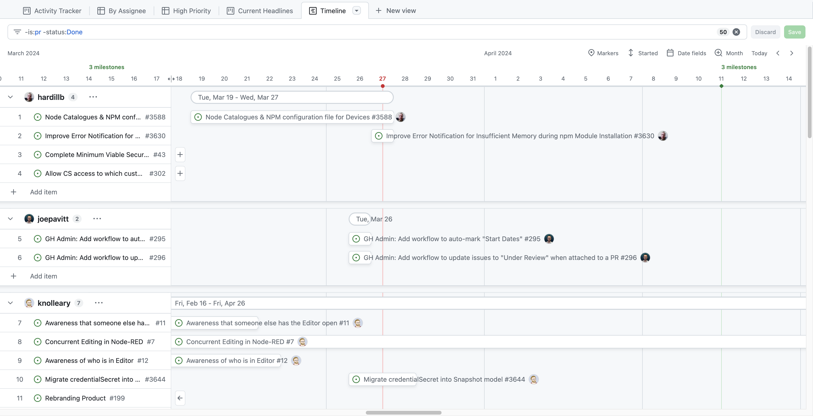

# Project Management

This page details provides a comprehensive overview of the project management processes and procedures that guide product development at FlowFuse. 

## Responsibilities

The three roles primarily involved in product planning and development at FlowFuse are the CTO, Engineering Manager, and Product Lead. The Product Lead advances strategic priorities and develops the product roadmap to achieve those priorities, the CTO determines technical feasibility and identifies the scope and dependencies of significant initiatives on the product roadmap, and the Engineering Manager assigns tasks to the engineering team and is responsible for delivering work on schedule.

Following the RACI framework articulated elsewhere in the [Handbook](https://flowfuse.com/handbook/company/decisions/#projects), product responsibilities among the CTO, Engineering Manager, and Product Lead are:

* Overall product roadmap and strategy: Product Lead is Responsible and Accountable, CTO is Consulted, Engineering Manager is Consulted.
* Articulating technical requirements and feasibility: Product Lead is Informed, CTO is Responsible and Accountable, Engineering Manager is Consulted and Informed
* Delivering work that is high quality and on schedule: Product Lead is Informed, CTO is Informed, Engineering Manager is Responsible and Accountable.

This means that on a day-to-day basis, the Product Lead and Engineering Manager work together to set the direction of product development and execute on a defined strategy that the CTO has helped to shape, with the Product Lead setting goals and defining initiatives, the Engineering Manager delivering the work, and the CTO serving as technical guide and sharing a product vision.

The three meet every week in the Product Planning meeting to review progress of the current release and identify, define, discuss, and plan work for upcoming releases.

## Product Planning Schedule

In order to ensure that releases are able to deliver work according to the priorities laid out by the Product and Engineering teams, the four Product Planning meetings scheduled each release are organized as follows, with Week 1 being the first meeting that occurs just after a release has shipped.

Week 1: The team discusses ongoing work and opportunities for future development.

Week 2: The PM has assigned a milestone to all epics and stories prioritized for the following milestone. For example, if it is week 2 of release 2.30, then the PM has completed this work in anticipation of release 2.31.

Week 3: The EM has divided epics and stories into appropriate tasks, and with the CTO, assigned story points to them. The EM is also prepared with an estimation of how many story points can be delivered during the subsequent release, as these are influenced by individual engineer schedules, holidays, events, and etc. During this meeting, the PM's proposed release is discussed, and any issues with an oversized or undersized release are discussed and reprioritized by the PM, if necessary. 

Week 4: The team prepares for the release that occurs during the same week. The EM reviews what was scheduled, what will ship, what will slip, and why.

## Hierarchy

As per our [Product Strategy](/handbook/engineering/product/strategy/), our product is broken into three pillars - Build, Manage and Deploy. Within these pillars we have a collection of [Areas](/handbook/engineering/product/strategy/#product-pillars).

Beneath the areas, we then utilize the standard GitHub hierarchy of Epics, Stories, and Tasks. As such, the hierarchy is as follows:

- **Pillar**: One of three overarching values of the product - Build, Manage, Deploy.
- **Area**: A sub-section of a Pillar, representing a specific feature set or value offered to the customer within a pillar of the product.
- **Epic**: A significant feature or piece of work. It will typically have a number of Stories and/or Tasks associated with it that can be delivered iteratively. This may represent a single high level feature of the product, e.g. "Blueprints".
- **Story**: A user-oriented description of a feature. It should describe what a user should be able to do and identify the value that brings to the user. A story should be deliverable in a single release.
- **Task**: If we consider a Story as a user-centric view of a feature, the underlying tasks are the engineering-centric view of the same feature. This may also be a piece of work that isn't necessarily tied to a specific Epic or Story. For example, items related to technical debt or house-keeping chores.

## Planning

Our planning process is continuously evolving as we find the best way to accommodate both a growing team and an expanding set of requirements for how and what we deliver. We operate on a continuous delivery model, with iterations of two-weeks. 

Whilst we deploy to FlowFuse Cloud on every merge to `main` branch, we conduct formal releases every four weeks. With this, we utilize GitHub milestones in order to track which items are planned for each release. The "Active Release" view provides a picture of all issues assigned to a given release, which is updated when a new release starts after our [retrospective](./releases/process.md#retrospective).

### Cadence

FlowFuse is continuously released to FlowFuse Cloud, and every four weeks, on a Thursday, it is packaged for users who are self-hosting FlowFuse.

### Prioritization

The planning process is continuous, allowing the engineering team to consistently release new functionalities.

This process covers the standard planning and prioritization process; bugs or minimal improvements are not part of this description. It is important to stay flexible, so this fast-lane approach for the described issues is possible and necessary.

Naturally there will be items that crop up unexpectedly and have to be dealt with pragmatically. For example, we may realize an item is needed for the current release that needs to be expedited through the process. We should remain flexible in how we work.

#### Step 1 - Backlog prioritization and refinement
Based on customer feedback, input from the FlowFuse team, and all stakeholders, issues are continuously raised and prioritized [in our Backlog](#product-planning-board).

#### Step 2 - Assignment to the To-Do section
Once an issue is refined, the PM continuously assigns issues to the [Development Board's](#development-board) `To-Do` Section. This is the first indication that this particular item is planned and will be the one of the next items for the `Up Next` section. It also signals the engineering and UX team to raise any open design or architectural clarifications if required.

This section should include a maximum of 40 [effort estimation points](#sizing-issues).

#### Step 3 - Assignment to the Up Next section
This section is most relevant for the engineering team because it communicates the highest priority items that need to be worked on next. 

The PM is responsible for assigning issues to the "Up Next" section, while the Engineering Manager is responsible for directly assigning the issues in this section to an engineer, if there is a particular plan in place for an engineer to complete a given piece of work.

The `Up Next` section should consistently contain sufficient items, ensuring that members of the engineering team can immediately transition to a new task once other issues have been [successfully developed](#defining-done).

#### Step 4 - Development

When an engineer is looking for their next item to work on, they should scan the "Up Next" section. If there are no items explicitly assigned to them already, they can choose their own desired work from that list. 

##### Mark "In Progress"

It is important that when a developer starts working on an issue, they move it to the `In Progress` section. This signals to the PM and the rest of the team that the issue is being worked on and is no longer available for others to pick up. It will also enable some of the automations we use for tracking progress. It is also desired that the engineer marks when a task is started, by recording the "Started" date on the issue's "Development" board item.

##### Record "Expected" Date

Where possible, developers should also provide a rough "Estimated" date as to when they expect the issue to be ready for review, i.e. development, testing and documentation has been finished.

If this is not conducted, the Engineering Manager will assign an end date to the items based on the [effort estimation](#sizing-issues).

The estimated date should take into account the associated [size](#sizing-issues) of the issue and most importantly the developer's availability, and other workload commitments.

## Issues

Issues are the building blocks of planning activities, helping the team to manage and prioritize work. 

### Types

- **Epic**: a significant feature or piece of work. It will typically have a number of Stories and/or Tasks associated with it that can be delivered iteratively, and should be presented in the Epic as a [Tasklist](https://docs.github.com/en/issues/managing-your-tasks-with-tasklists/creating-a-tasklist). Typically, an Epic shouldn't be assigned a "Status"; instead, the subtasks describing the first, second, third iterations, which in turn are assigned respective status'.

- **Story**: a *user-oriented* description of a feature. It should describe what a user should be able to do and identify the value that brings to the user. A story should be deliverable in a single release.

- **Task**: If we consider a Story as a user-centric view of a feature, the underlying tasks are the engineering-centric view of the same feature. This may also be a piece of work that isn't necessarily tied to a specific Epic or Story. For example, items related to technical debt or house-keeping chores.

- **Bugs**: issues that arise from errors, flaws, or unintended behavior in the existing code or system. Bugs negatively impact the user experience or the functionality of the software. They should be addressed and resolved by the development team, prioritized based on their severity, and included in the appropriate release for fixes.

- **Feature Requests**: suggestions or ideas submitted by users or stakeholders for new functionalities, enhancements, or improvements to the existing software or system. Feature requests should be evaluated, prioritized, and potentially incorporated into the product roadmap, often being transformed into Epics or Stories for implementation in future releases.

Whenever an issue is raised, it will be reviewed by the Product Manager / Engineering Manager and added
to the Product Planning Board for prioritization and planning. The exception to this are
tasks/bugs related to work already in progress and that need to be addressed in
the current milestone. They should be added to the Development Board and current
milestone directly.

#### Headline Features

We label some items as `headline`. These are items we want to highlight in the ["changelog"](#changelog) and further
announcements and should clearly describe the value they bring to our users.

We provide the ["Headlines" view](https://github.com/orgs/FlowFuse/projects/1/views/39) on our GitHub project boards to track these items on a release-by-release basis so that the customer team has a clearer view on what new content can be discussed in socials, etc.

#### Changelog

We produce changelog entries for new features and changes that are of interest to users. These are typically short highlight articles that let users know what we have added or improved in the product and can be found at https://flowfuse.com/changelog/

ChangeLog entries are created via PR to the [website](https://github.com/FlowFuse/website/tree/main/src/changelog) repository.

##### Changelog Entry Format

Each changelog entry should include frontmatter with the following structure:

```yaml
---
title: "Feature Title"
description: "Brief description of the feature or change"
date: 2025-06-11 12:00:00.0
authors: ["author-handle"]
tags:
  - changelog
issues:
  - "https://github.com/FlowFuse/device-agent/issues/185"
  - "#1234"
  - "567"
---
```

**GitHub Issues Integration**: You can now link related GitHub issues to changelog entries using the `issues` array in the frontmatter. This helps customers and internal stakeholders easily access the underlying GitHub discussions and technical details. The system supports:

- **Full GitHub URLs**: `"https://github.com/FlowFuse/device-agent/issues/185"`
- **Short form for main FlowFuse repo**: `"#1234"` (automatically links to FlowFuse/flowfuse)
- **Issue numbers only**: `"567"` (automatically links to FlowFuse/flowfuse)

The issues will be displayed as clickable links with GitHub icons on both the changelog listing page and individual changelog posts.

### Sizing Issues

To more accurately understand which tasks can be scheduled without overloading our team, everyone conducts an initial, high-level analysis when creating an issue to assign weight estimates. We recognize that these estimates might not be precise. If the person who creates an issue cannot provide an estimate, any FlowFuse team member is welcome to contribute one.

If a developer, who is an expert in a field, wants to change an estimation, they are encouraged to do so. There is no blame for "wrong" estimation; we all have to work together to achieve good planning. It is better to have a rough estimation than no estimation at all. The final decision on estimations in general lies with the CTO.

If a larger number of not estimated tasks need to be estimated, e.g. for a complex epic, the CTO and PM can initiate a [Planning Poker](https://en.wikipedia.org/wiki/Planning_poker) session.

Issue sizes are assigned in two stages:

1. The Product Manager will review high-level Epics and Issues and assign a size based on the broad complexity of the issue. This is done via a label on the issue, and follows the standard planning poker story point sizes.
2. When an item is moved into the Development Board, the Engineering Manager will review the issue and assign a size based on the effort required to complete the issue. This is done via the "Size" field on the [Development Board](https://github.com/orgs/FlowFuse/projects/1).

Size labels are as follows:

- **XS - 1**: Extra Small ~ Less than a day of development effort
- **S - 2**: Small ~ 1 day days of development effort
- **M - 3**: Medium ~ 2 or 3 days of development effort
- **L - 5**: Large ~ 3-5 days of development effort
- **XL - 8**: Extra Large ~ 1-2 weeks of development effort
- **XXL - 13**: Extra Large ~ More than 2 weeks of development effort

"Days of development effort" here would assume this was the only task the developer was working on, which is rarely the case. The actual time to complete a task will be longer than the number of days, or sizing, assigned to it.

There are two crucial elements to consider when determining an issue's weight:

- **Scope**: The amount of work pertains to the anticipated extent of modifications to the codebase. A minor adjustment might only require a single alteration in a single file, whereas a more extensive modification could necessitate multiple alterations across numerous files and sections of our codebase. 
- **Complexity:** Complexity can be divided into two components in practice: the degree to which the problem is understood and the expected level of problem-solving challenges.

Epics do not necessarily need an estimation, as long as all sub-issues have estimations, Epics are the sum of all subtasks, as a result, it is possible to handle epics larger than XXL. Be sure to not double-book the sizing. If a Story has a sizing, it's children tasks do not need a sizing too. Points are best served at the Story level, however, if you feel the Story is too large, you can break it down into smaller Tasks, and size appropriately there.

#### Measuring Burn Rate

With the "Size" field on the [Development Board](https://github.com/orgs/FlowFuse/projects/1) we can calculate the "burn rate" of the team, and use [GitHub's Insights](https://github.com/orgs/FlowFuse/projects/1/insights/11) to track the burn rate over time.

{data-zoomable}
_Burn Rate from the 2.15 Milestone, showing a sum of the story points scheduled and delivered over time_

We can use these Burn Charts to measure the delivery velocity, i.e. the number of story points we expect the Engineering team to deliver in a given time frame. When planning future releases, considerations should be made for planned absences and events, such that the amount of work scheduled is sustainable.

### What makes a good issue?

A good issue is one that is clear in it's scope, key tasks to be completed, and the value accomplished through it's completion, e.g. security flaw resolved, new feature added and the benefit that feature offers.

Some particular considerations to keep in mind:

#### Defining a Story

The best "Stories" are those that follow this structure:

> As a _[type of user]_, I want to _[do something]_, so that they can _[achieve some goal]_.

Note how this is user-centric and focuses on the value that the feature brings to the user.

#### Breaking a Story into Tasks

If we consider a story as a user-centric view of a feature, the underlying tasks are the engineering-centric view of the same feature.

Well structured stories, when it comes to implementation, can often be broken down into clearer tasks. A trivial breakdown could be a separation of the UI design work, UI implementation, and backend implementation.

When a member of the team is assigned a Story, they may be comfortable handling the full piece of work themselves, which is fine, and they can continue as such.

It is also fine to break it down into tasks and assign them to different people, if you feel others' skills are better suited to certain parts of the work. An example to consider is a piece of work that requires the following:

- API Changes
- Database Migration
- Frontend Development

_Engineer A_ may have been assigned the parent Story, and be comfortable doing the first two parts, but feel a colleague, _Engineer B_ is better suited to the front-end work. Engineers should feel empowered to use common sense here, and break the work down as they see fit, asking for assistance from their colleagues and collaborating to get the work done.

If you're unsure, or uncomfortable with a piece of assigned work please speak to the Engineering Manager or Product Manager.


## Project Boards

We use two project boards to plan and track our work.

 - [Product Planning Board](https://github.com/orgs/FlowFuse/projects/3/views/1)
 - [Development Board](https://github.com/orgs/FlowFuse/projects/1/views/1)

### Product Planning Board

[This board](https://github.com/orgs/FlowFuse/projects/3/views/1) is maintained
by the Product Manager (PM) and CTO. It is the main entry point for all issues. Longer term planning and strategy is defined here. Each item on the 

#### Area (for Epics)

As per our [Product Strategy](/handbook/engineering/product/strategy/), our product is broken into three pillars - Build, Manage and Deploy. Within these pillars we have a collection of [Areas](/handbook/engineering/product/strategy/#product-pillars).

When we create Epics in GitHub, we assign them to an Area. This helps us to understand where the work fits into our overall product strategy, and what fundamental area of the product will be improved by the work.

You can see a breakdown of all Epics by Area & Status [here](https://github.com/orgs/FlowFuse/projects/3/views/9)

#### Status (for all other issues)

Stories and Tasks on this board are put into one of the following states to indicate their priority in the backlog, they can move up or down the priority depending on business needs.

 - `No Status` - This is where all new items initially land so that they can be appropriately triaged and assigned by the PM and CTO
 - `Started` - Some work in this has been started, in the case of Epics, it may be a reflection that not all work here is planned to be completed though.
 - `Next` - These are items which we should be targeting for the next milestone to be planned, We plan milestones 2-3 iterations ahead so this time frame will typically be 2-3 months. 
 - `Short` - These are items in the 3-6 month time frame, Often these items will get pulled into a milestone from this point depending on capacity.
 - `Medium` - These are items that are in the 6-12 month time frame. 
 - `Long` - This is the long term horizon, items that we know we will want to do one day but at the moment are long term goals, typically this could be 12 months away or more.
 - `Icebox` - These are items that we do not currently see a clear plan for in building into FlowFuse, however, may be important to keep in mind for the future.
 - `Support & Under Review` - Customers often ask questions via GitHub issues. From these questions, new insightful requirements sometimes arise. Initially, to clarify the situation with the users, issues belong to this category.
 - `Closed` - All closed items are assigned to this section or being removed from th backlog.
As items move up the list and get closer to Next we should have a greater understanding of what the detail and demand is for that feature. This is an iterative approach and as we gain understanding on an item we will use that information to aid in reviewing its position on the board.

 A continuous review is held by the PM to keep the backlog in order - triaging new items that have been raised and not yet added to the backlog, and reflecting on changing priorities and requirements.

### Development Board

Any item on the Development board detail in-action items, or items planned for the immediate future (<4 weeks). It provides multiple views that are useful to get a clear picture on our active, and short-term planned items.

#### Activity Tracker

{data-zoomable}

The [Activity Tracker](https://github.com/orgs/FlowFuse/projects/1/views/33) is
used to plan and track the work.

The board has the following states:

 - `Todo` - items queued to go into "Up Next" once there is availability
 - `Up Next` - items that should be picked up next
 - `In Design` - items being designed, whether that is UX/UI design or engineering design
 - `In Progress` - items being developed
 - `Review` - items that are ready to be reviewed (PR open & [feature demo](#feature-demos) created)
 - `Done` - items that are [Done](#defining-done)

##### In Design Deliverables

Both UX/UI work and engineering work can be "In Design". For both instances there should still be defined deliverables. 

It is important to use Design as a tool for conversation, verification, or to ensure engineers and the wider team are on the same page, but it should rarely be a blocker given our [Bias for Action](../company/values/#🔁-iterative-improvement) value.

- **UI/UX Work:** This is generally work in Figma for product, website or the components library. Deliverables should be well-defined as an MVP prototype, or at least enough for engineering to get started, on which we can iterate.
- **Engineering:**  Questions that need answers should be formulated up front, and answered as the deliverable. Questions around what technology to use, how to scope down the feature set, and how to deliver the results
are thus required before the design sprint start.

##### Defining Done

An item should only be marked as 'Done' on the Development board when the following
criteria are met:

 - All related code changes have been merged
 - Suitable unit/system level tests have been added
 - Documentation has been updated
 - Acceptance criteria identified in the Story have been met
 - Feature Demo

##### Feature Demos

Part of finishing an item is being able to demonstrate it in action. This allows
others to see it in action, generate material for the release announcement and
help identify any gaps or places for improvement.

Each feature demo is recorded by the developer responsible for the feature, detailing its functions and operations. If problems, challenges, or improvement ideas arise during the review of the demo, everyone is encouraged to post a comment under the video within the Slack channel. Additionally, a corresponding GitHub issue should be opened to track and prioritize these points for further discussion and action.

Demos must be done in good time and as early as possible to allow for any follow-up action.

Demos should consist of:

 - A short (< 5 minute where possible) screen capture walk through of the feature with commentary.
 - It should cover the feature from a users perspective - what value do they get from it.
 - The video should be uploaded to, or linked to, in the relevant issue.
 - A link should be posted to the `#feature-demos` channel in slack. This will allow the whole team to be notified of the demo without having to subscribe to every issue comment.

For some features, it may be necessary to create multiple demos of different aspects.

#### Timeline

{data-zoomable}

The [Timeline](https://github.com/orgs/FlowFuse/projects/1/views/49) view utilizes the "Started" and "Expected" dates to give a visual representation active items that each member of the team is working on, as well as a clear picture of when they are expected to be completed.

## Engineering Throughput

Engineering throughput is a measure of how much value we're able to deliver to our customers. It's calculated by summing the total number of Pull Requests merged in a given time frame across the following repositories:

- [FlowFuse](https://github.com/flowfuse/flowfuse)
- [Node-RED](https://github.com/node-red/node-red)
- [Node-RED Dashboard 2.0](https://github.com/flowfuse/node-red-dashboard)
- [Node-RED Launcher](https://github.com/flowfuse/node-red-launcher)
- [Blueprint Library](https://github.com/flowfuse/blueprint-library)

An interactive Dashboard for these metrics, and a breakdown of the specifics issues and Pull Requests involved can be found [here](https://github-stats.flowfuse.cloud/dashboard/analysis).
