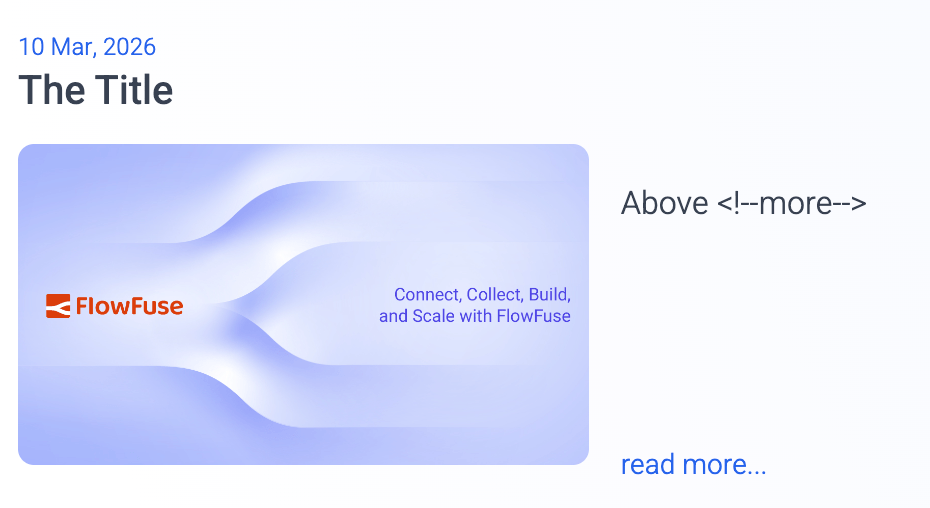
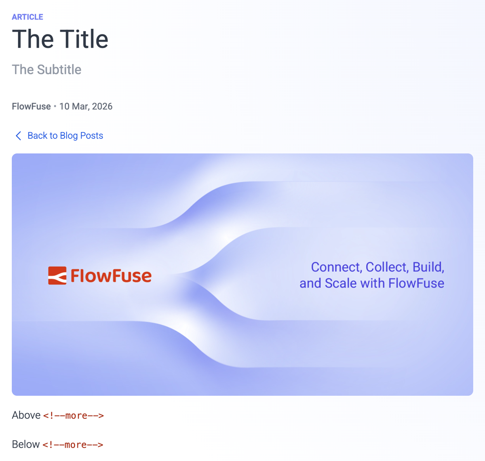

---
meta:
    title: Marketing - Blog
---

# Blog

## Blogging Process

Content creation and blogging are effective ways to communicate with our community and are tied to our SEO performance (that we track in this [dedicated dashboard](https://app-eu1.hubspot.com/reports-dashboard/26586079/view/110361885?appliedIlsFilters=JTdCJTIyMTEwMzYxODg1JTIyJTNBJTdCJTIyMC0xJTIyJTNBJTdCJTIyZmlsdGVycyUyMiUzQSU1QiU3QiUyMnByb3BlcnR5TmFtZSUyMiUzQSUyMmNyZWF0ZWRhdGUlMjIlMkMlMjJwcm9wZXJ0eVR5cGUlMjIlM0ElMjJkYXRldGltZSUyMiUyQyUyMm9wZXJhdG9yJTIyJTNBJTIySVNfQkVUV0VFTiUyMiUyQyUyMnZhbHVlJTIyJTNBJTdCJTIycHJvcGVydHlUeXBlJTIyJTNBJTIyZGF0ZXRpbWUtcmFuZ2VkJTIyJTJDJTIyb3BlcmF0b3IlMjIlM0ElMjJJU19CRVRXRUVOJTIyJTJDJTIybG93ZXJCb3VuZFRpbWVzdGFtcCUyMiUzQTE3NTkwMTc2MDAwMDAlMkMlMjJ1cHBlckJvdW5kVGltZXN0YW1wJTIyJTNBMTc2MTUyMzIwMDAwMCU3RCU3RCU1RCUyQyUyMmRhdGFTb3VyY2VOYW1lJTIyJTNBJTIyQ09OVEFDVCUyMiU3RCU3RCU3RA%3D%3D) and our [Social Media Strategy](/handbook/marketing/social-media/#strategy-for-increasing-reach). The process for publishing a blog is as follows:

1. Create an initial issue or tie your blog to one of your scheduled issues [here](https://github.com/orgs/FlowFuse/projects/21/views/1).
1. Issues should be assigned a date, which should be posted here in this [GitHub projects](https://github.com/orgs/FlowFuse/projects/21/views/1). The target date for review should be at least three working days before the planned posting date on social media. Check the [social media planning and posting section](/handbook/marketing/social-media/#planning-and-posting).
1. Create an [art request](/handbook/design/art-requests/#creating-an-art-request) for a blog tile to go with your article and share a deadline for when you're planning it to go live. This image will be used not only on the web, but also when the content is promoted on socials.
1. Create a Pull Request on the [website repository](https://github.com/FlowFuse/website) with your Blog Content.
1. Assign yourself as an Assignee.
1. Convert to Draft
1. Generate a temporary, [AI-generated blog tile](/handbook/marketing/blog/#blog-tile-creation-process) for your article to ensure the content is publish-ready from the start.
1. No Reviews shall be done until the PR is “Ready for Review”
1. Assign two reviewers
    * One Reviewer for Content 
    * One Reviewer for SEO.
1. If the content is time-sensitive, please make sure everyone involved is aware of this. 
1. Content will be reviewed first.
1. SEO will be reviewed second.
1. When both reviews are done*, the Author or SEO reviewer can merge. In the event of an external author, SEO/content review will merge.
1. Once merged, the article can be promoted on FlowFuse social channels by either the author or the Social Media Manager. Check the [social media planning and posting section](/handbook/marketing/social-media/#planning-and-posting) for guidance and considerations.

## Blog Tile Creation Process

The blog tile is generated with AI to ensure fast, unblocked publishing and visual consistency across all articles.  

This allows every post to move through review and publication without depending on design availability.

### Generate a Tile With Nano Banana Pro

By generating a tile immediately, we ensure:

- Fast turnaround  
- Asynchronous, non-blocking content flow  
- Consistent visual completeness across all new posts  

#### Requirements

- Enable both modes: **thinking** and **Nano Banana**.  
- Always attach at least three **PNG or JPG** reference images from [this folder](https://drive.google.com/open?id=1w99oFeCCcbVVkOxkzmwKlrwjWzAJFOWM&usp=drive_fs)
- All attached reference images must use the same background color (light indigo or dark indigo).  
- To choose the correct background color, check the [most recently published article](/blog/):
  - If the latest tile uses a light background, generate a dark one next, and vice versa.

#### Basic Prompt (Recommended for Speed)

```
Create a 1600 × 900 px image for this article:  
[insert the article’s Netlify preview URL]

Use the attached images as a style reference. It should include:

- A background using the same colour palette  
- The image title, using Heebo Regular and the same colour used for titles in the reference images  
- An image, diagram, or isometric illustration that represents the content of the article  
```

#### Optional Prompt Refinement

- You may refine the prompt if you already know the desired visual direction.  
- For example, if you want a diagram-style tile:  
  - Attach only diagram-based reference images.  
  - Provide a description of the diagram or include Mermaid code.

#### About the Watermark

Images generated with Nano Banana Pro will include the Gemini watermark.  

This is acceptable and supports fast publishing.

### Design Team Visibility

After generating the temporary tile, be sure to open an [art request](/handbook/design/art-requests/#creating-an-art-request) and attach the generated tile, so the design team is aware of the asset.  

This does **not** block publishing — it simply allows designers to review the temporary tile later and update it if a final, on-brand version is needed.

## Blog CMS

When creating a blog post there are several headers which are used by the CMS to populate the blogs as well as the blog index page. e.g:


```njk
---
title: The title
subtitle: The subtitle
description: The description
date: 2022-12-20
authors: ["rob-marcer"]
image: /blog/2022/12/images/tile-image.png
video: dteXgcBXUnk  # Optional: YouTube video ID to use instead of image in hero section
tags:
    - posts
    - node-red
    - how-to
---

above more
<!--more-->
below more
```

### Title

The title of the page can be seen on both the blog index and the articles.

### Subtitle

The subtitle is only shown on the articles.

### Description

Provides the (OpenGraph) description for social media sharing and may appear on search engine results pages. Also used on the `/blog` page for past articles. Keep it unique, simple, and concise, capturing the essence of the content within 80 to 220 characters, ideally around 160.

### Date

The data can be seen on both the blog index and the articles.

The `date` field in the blog post front matter serves a crucial role in determining when a blog post is published. You can set this field to a future date if you wish to schedule your blog post for publication on a specific day. See the [Scheduling a blog post](#scheduling-a-blog-post) section for more details.

### Authors

The author can be seen on both the blog index and the articles. If you need to add multiple authors, it can be achieved in this way:
```njk
authors: ["rob-marcer", "joe-pavitt"]
```
If the authors are FlowFuse team members, the names need to be formatted inline with the file names found [here](https://github.com/FlowFuse/website/tree/main/src/_data/team)

If they're not FlowFuse team members, they need to be added to the [guests list](https://github.com/FlowFuse/website/tree/main/src/_data/guests). Duplicate any of the files already in that folder, proceed to change the name of the file and update the info inside the `json` file. You'll also need to add a headshot in the images/team [folder](https://github.com/FlowFuse/website/tree/main/src/images/team) following the same name convention as the rest of the files.

### Video

You can include a YouTube video as the hero content instead of an image by adding a `video` field with the YouTube video ID:

```njk
---
title: The title
video: dteXgcBXUnk
---
```

The video ID is the part after `v=` in a YouTube URL. For example:
- URL: `https://www.youtube.com/watch?v=dteXgcBXUnk`
- Video ID: `dteXgcBXUnk`

When a `video` field is present, it takes precedence over the `image` field in the hero section of the blog post. The video will be embedded using the `lite-youtube` component for better performance and faster page load times.

**Note:** You should still provide an `image` field as a fallback for social media previews and RSS feeds.

### Tags

Tag your content appropriately from the collection of tags that help us manage our blog content. They include:

- `node-red`
- `flowfuse`
- `how-to`
- `dashboard`
- `community`
- `releases`
- `news`
- `unified-namespace`

There's a page with a collection of posts for each tag in that list.

#### Custom Tags

You can also add your own custom tags. While these won't create a new page with a collection of posts, they will help suggest related articles. Keep in mind that for an article to be considered related, the majority of tags must match, with allowance for a difference in one tag.

#### Meta Keywords

Additionally, the tags you assign to your content will also be used as [meta keywords](/handbook/marketing/website/#meta-keywords) for each article, alongside the [default keywords](/handbook/marketing/website#default-keywords).

### Adding Images

Images can be added into the respective `/blog/<year>/<month>/images` folder.

The image can then be referenced in the markdown file like so:

```md
{data-zoomable}
<figcaption>Caption Here</figcaption>
```

- `Alt Text` is the text that will be displayed if the image fails to load.
- `./images/<image>.png` is the path to the image.
- `{data-zoomable}` is an optional attribute that allows the image to be zoomed in when clicked. It is recommended to use this as users can often explore images in more detail.
- `<figcaption>Caption Here</figcaption>` is an optional caption that will be displayed below the image. It is recommended to use these, as it makes the article easier to read.

### More tag

The `<!--more-->` tag is used to define the text shown in the blog index from each article.

### Example blog index item based on the header above



### Example blogs based on the header above



### Rendering Node-RED Flows

The blog uses a flow renderer to make it easier for users to understand what the
flow looks like and how to use them. Furthermore it automatically provides a
download and copy button too for users to use what they've learned.

To render a flow you'll need to export it to JSON in Node-RED and paste it in a
`renderFlow` shortcode:


```

<flowJSONHere>

```


### Writing content

FlowFuse blog posts are written in markdown. To learn how to style content and
have a nice markup for your content, please read the [markdown guide](/handbook/company/guides/markdown/)

### Scheduling a blog post

By setting a future date, the blog post will be automatically scheduled for publication on the specified date. This allows contributors to plan ahead and coordinate blog posts with events or marketing strategies. The post will be published at the next deploy after the `date` is set, a daily deploy is done at noon GMT.

Feel free to request reviews and merge your blog post when it's ready, even if the publication date is set in the future. This provides the flexibility to collaborate, make revisions, and ensure the content is polished well before it goes live.
The post, to be published in the future, will be rendered when developing locally and on deployment previews.

By utilizing the scheduling feature, we can maintain a consistent and organized publishing schedule without the need for last-minute adjustments.
