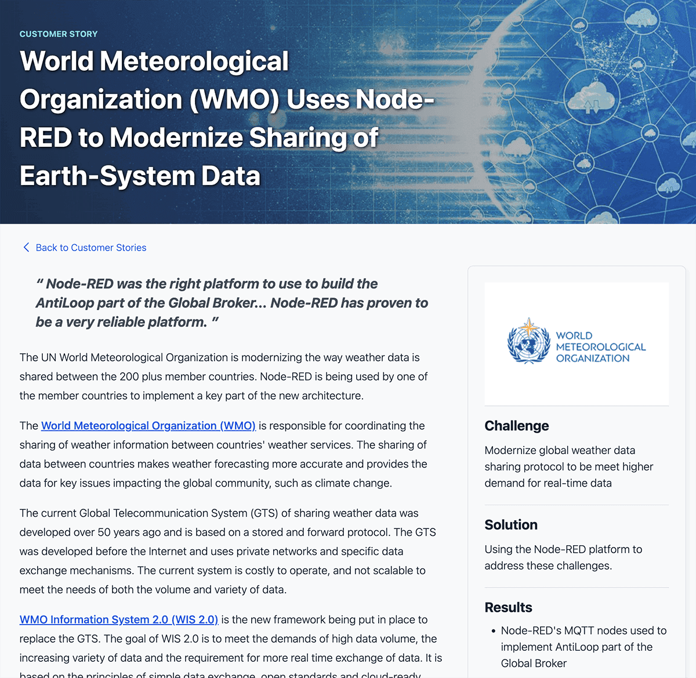

# Customer Stories

## Creating a story

A customer story is the same as a case study, these are helpful in illustrating how Node-RED and FlowFuse can be useful for our potential customers. The process would be as follows:

1. Raise an issue for the content in our private [Github repository](https://github.com/FlowFuse/customer){rel="nofollow"}.
2. Add it to the [Content Calendar Project](https://github.com/orgs/FlowFuse/projects/21) and schedule it.
3. If you want to work on the content immediately please triage the issue into our [development board](https://github.com/orgs/FlowFuse/projects/1/views/33).
4. Conduct an interview call with the customer using Google Meet to record and transcribe the conversation. Record interviews using Fathom as outlined in the [Sales Meetings guide](/handbook/sales/meetings/).
5. Consider that the readers of the story may have little knowledge of the industry discussed in the story. Try to explain industry specific terms or avoid using language which excludes any potential FlowFuse customer from understanding altogether.
6. Create the draft customer story in a Google Doc. The document should be stored in the [Marketing -> Case Study](https://drive.google.com/drive/folders/13A3UWjXdC7a13CVi1nQOMHvTb8MCLd-K?usp=drive_link){rel="nofollow"} folder. Everyone at FlowFuse should be given access to comment on the document.  Add a link to the document in the GitHub issue.
7. Leave a comment on the doc for each reviewer to request a review.
8. As a document reviewer, you should leave red-line edits in the document or add comments to the document.
9. When the final version of the story is done, follow these steps to create a PDF version:
    - Go to our [Template gallery](https://docs.google.com/document/u/0/?ftv=1&folder=1QXCso0HQPbShrB5_8N0n_sDnIlluUaaI&tgif=d) and select 'FlowFuse Customer Story - Template'.
    - Change the file name by replacing 'Template' with the customer's name.
    - Replace all the template information with your story. Ensure you paste using `ctrl + shift + v` to maintain the template format.
    - Confirm that the file is saved in the [Google Docs version](https://drive.google.com/drive/folders/1SbZ7ISJaYcxcJ_00Y_CwdY5gd9_uOTHP?usp=drive_link) folder.
    - Once ready, you can either print or download it as a PDF and then place it in the [PDFs folder](https://drive.google.com/drive/folders/1QXCso0HQPbShrB5_8N0n_sDnIlluUaaI?usp=drive_link).   
10. Create a download form in HubSpot specifically for the PDF you just created:
    - Upload the PDF file to HubSpot under 'Files and Templates' and copy the public URL.
    - In HubSpot, navigate to Marketing -> Lead Capture -> Forms, then 'Create Form' or clone an existing case study download form.
    - The form should include fields for first name, last name, email, and company (not mandatory).
    - Set the PDF URL as the action after submission, under 'Redirect to another page.'
    - Update and publish the form.
    - Copy the form ID from the script generated when you click on publish.
11. Create a new branch of the website repository. Follow our standard [development processes](/handbook/engineering/project-management#development-board). Google Docs has an [extension to convert the reviewed draft document to markdown](https://workspace.google.com/marketplace/app/docs_to_markdown/700168918607?hl=en&pann=docs_addon_widget). 
12. Add the HubSpot formId to your story's front matter, so anyone can download the PDF version of the case study.
13. It is OK for you to merge your own PR to main without review where the content is urgent or has been reviewed outside of Git but where it is practical to follow the
[standard process](/handbook/engineering/project-management#development-board) we encourage you to do so.

## Customer Story CMS

When creating a case study there are several headers which are used by the CMS to populate the story as well as the customer stories index page. e.g:


```njk
---
title: World Meteorological Organization (WMO) Uses Node-RED to Modernize Sharing of Earth-System Data
image: /images/stories/un-wmo.jpg
date: 2023-09-07
logo: /images/stories/logos/logo_wmo.png
hubspot:
    formId: 37f86f46-62d1-4203-bce9-0318ce993710
story:
    brand: WMO
    url: https://wmo.int/
    logo: /images/stories/logos/logo_wmo.png
    quote: Node-RED was the right platform to use to build the AntiLoop part of the Global Broker... Node-RED has proven to be a very reliable platform.
    challenge: Modernize global weather data sharing protocol to be meet higher demand for real-time data
    solution: Using the Node-RED platform to address these challenges.
    results:
        - Node-RED's MQTT nodes used to implement AntiLoop part of the Global Broker
        - Pilot system handling 45,000 message / 15 minutes; Production system will handle 30,000/minute 
---
```

### Title

The title of the story can be seen on both the customer stories index and the case study.

### Image

The story's image is visible on both the customer stories index and at the top of the case study, behind the title. Please note that this is a responsive image, and only a portion is displayed inside the case study. The recommended image type is photography.

### Date

The date is useful to order the stories in the customer stories index. The newest are shown first.

### Logo

Image of the logo to be included in the customer stories index, on top of the image, ideally a png file with transparent background. This is an optional field, if it's covering an important part of the image or if the image already includes a logo, there's no need to add it.

### Hubspot
##### formId

Download form ID code provided by HubSpot.

### Story
##### Brand

Name of the client, this is displayed in the customer stories index.

##### URL

URL address to the client's website. This is added to the logo in the case study.

##### Logo

Image of the logo displayed inside the story, in the right section.

##### Quote

This highlighted comment appears below the title in the case study.

##### Challenge, solution and results

A short summary of the challenge they faced, the implemented solution and a list of results.

### Example customer stories index item based on the header above


### Example customer story based on the header above



### Writing content

FlowFuse blog posts are written in markdown. To learn how to style content and
have a nice markup for your content, please read the [markdown guide](/handbook/company/guides/markdown/)
