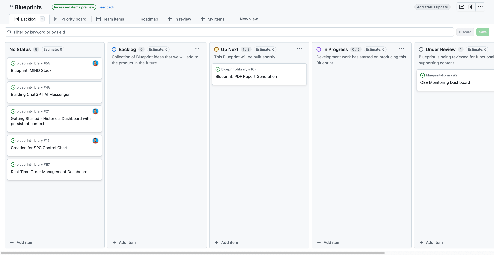
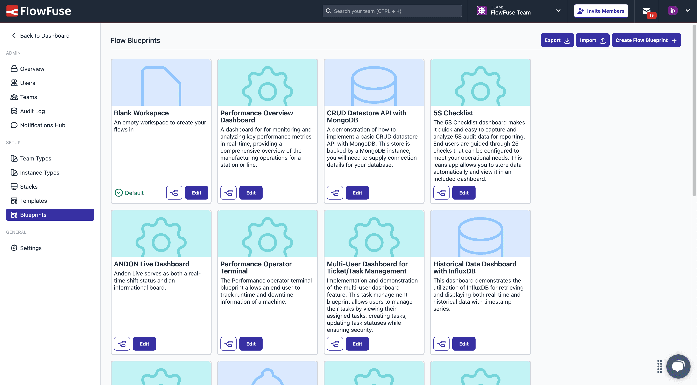

# Blueprints

{data-zoomable}
_Screenshot of the Blueprint selection UI in FlowFuse_

As part of the FlowFuse platform, it is possible to define "Blueprints".

Blueprints are packaged flows that help users get up and running with a particular project or idea. They should be informative, easy to understand, and provide a clear path to value.

FlowFuse host a public version of our [Blueprint Library here](https://flowfuse.com/blueprints/).

## Tracking Blueprint Ideas

We have a [GitHub Project Board](https://github.com/orgs/FlowFuse/projects/28/views/1) used to track the state of each idea recorded in the private `blueprint-library` repository ([link](https://github.com/FlowFuse/blueprint-library/issues)).

{data-zoomable}
_Screenshot of the Blueprint Project Board_

## Submitting a Blueprint

### Public Submission

We encourage Blueprint submissions from our customers, partners, and the wider community. Anyone can submit their own Blueprint idea via our online portal [here](https://flowfuse.com/blueprints/submit/). Please check with the [Minimum Requirements](#minimum-requirements) to ensure any submissions have provided the relevant details.

### Internal Development

If a Blueprint is being developed internally, then the Blueprint can be added to the Blueprint repository directly, via a Pull Request. An issue should be raised first in the `blueprint-library` repository to track the progress of the Blueprint, and to be sure the Blueprint aligns with the product and company strategy.

## Minimum Requirements

### Flow

The bare minimum requirement for a Blueprint is the respective `flow.json` file which details the Node-RED flow associated to the Blueprint.

#### Dependencies

With the `flow.json` we also need to have details on any third-party nodes and dependencies that the `flow.json` will require in order to be functional.

### Screenshots

Images help commuicate the value of a Blueprint, without the need to fully deploy it. Screenshots and images are used as part of marketing material in socials, as well as imagery on the Blueprint Library itself, e.g. the image background of the Blueprint's tile.

### Appearance

Blueprints are designated to a **category**. On FlowFuse Cloud, these categories are currently:

- Getting Started
- Manufacturing
- Other

But others can, and should, be added as required.

Each Blueprint can also have a custom icon, which should be defined as an icon from [Hero Icons v1](https://v1.heroicons.com/). The color for the tile of each Blueprint is hardcoded then depending on the category. Any changes to color, or coloring of new categories currently require a code change within FlowFuse.`

### Company Information

Submissions are encouraged to be from an organisation, rather than an individual. As such, any submission must has an associated:

- Company Name
- Company Logo

## Publishing a Blueprint

Blueprints must be published in two locations:

- **Website**: This is our _public_ Blueprint Library, where users can browse Blueprints and get access to a quick "Deploy" action.
- **Platform**: This is the _internal_ Blueprint Library within FlowFuse. It is configured as part of the FlowFuse Admin Panel.

### Website

To add a Blueprint to our public Blueprint Library, we need to publish the Blueprint to the [`blueprint-library` repository](https://github.com/FlowFuse/blueprint-library). The Website then automatically picks up the new Blueprint and publishes it.

### Platform

#### Submitting a Change Request

In order to add a Blueprint to FlowFuse Cloud, we need to submit a Change Request. Change Request's can be created by selecting "New Issue" in the [Cloud Project](https://github.com/FlowFuse/CloudProject/issues) repository.

Your issue should include a link to the relevant Pull Request on the Blueprint Library repository whereby your Blueprint was published.

#### Creating the Blueprint

{data-zoomable}
_Screenshot of the Blueprint Admin Panel in FlowFuse_

1. Make sure the Blueprint is published to the `blueprint-library` repository.
2. Login to FlowFuse Cloud as an Administrator
3. Navigate to the Admin Panel
4. Select the "Blueprints" tab
5. Click "Create Flow Blueprint"
6. Fill in the details of the Blueprint
7. Click "Create"