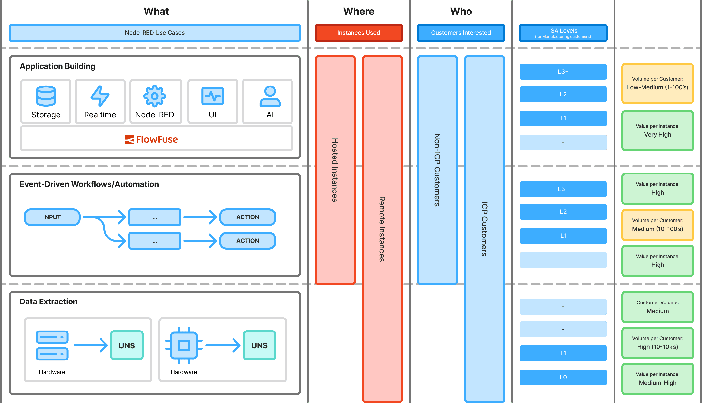

# Use Cases

This page is dedicated to describing the use cases that we see our customers using FlowFuse and Node-RED for.

It's purpose is to provide a centralized resource that unifies product, marketing and sales in ensuring
everyone understands _why_ people come to FlowFuse, _what_ they are building with Node-RED on
FlowFuse, _where_ those Instances run, and consequently _how_ FlowFuse can help them.

It also covers the [ISA-95 levels](https://www.isa.org/standards-and-publications/isa-standards/isa-95-standard),
which is a standard for industrial automation, where these use cases fit into.

If you want to find out more about _who_ is using FlowFuse and Node-RED, please refer to our
[Personas](./personas/index.md) and [Ideal Customer Profile](../marketing/messaging#ideal-customer-profile-(icp)) pages.

## Flows

In focussing on the flows that we see our customers building with FlowFuse and Node-RED,
we can break down the use cases into three core categories, as represented by each row of the following diagram:

{data-zoomable width="1000px"}
_Diagram to show a breakdown of the who, what and where of the three core Node-RED use cases we see._

1. [Application Development](#application-development) - Ranging from a simple Dashboard to display data in a database, to complex ecosystems that integrate multiple services to create full, enterprise grade applications.
2. [Event-Driven Workflows/Automation](#event-driven-workflowsautomation) - Flows that have some triggers/inputs, logic to compute on the data, and outputs that take action.
3. [Data Extraction](#data-extraction) - Interacting with hardware to extract data and publish it to a UNS or other source. This is a core IIoT use-case.

It's important to understand which use cases prospects care about, as this will help us align our messaging and product demonstrations to their needs.
Each of these use cases provide different value to different customers, and consequently this can see Node-RED (and consequently FlowFuse)
competing against different companies and solutions.

### Application Development

{data-zoomable width="600px"}
_Application Development use cases can use any combination of these five core ingredients._

Application Development use cases are those where Node-RED is used in conjunction with other
services, for example a Database, Realtime MQTT Broker, AI Agents and Dashboard.

#### Where

- ✅ Hosted Instances
- ✅ Remote Instances

Applications built with FlowFuse are most often deployed as Hosted Instances, running in a
centralized infrastructure, often collating data sources and visualizing in Dashboards. However,
they're certainly not limited to Hosted Instances, as we have many customers running full user
interfaces/dashboards at the edge on factory floors that may be displaying local data sources.

#### Who/What

- ✅ ICP Customers
- ✅ Non-ICP Customers

We have customers that cover both ICP and non-ICP use cases.

##### ICP Use Cases

- ✅ ISA Level 4
- ✅ ISA Level 3
- ✅ ISA Level 2
- ❌ ISA Level 1
- ❌ ISA Level 0

Applications built by ICP customers are those generally found at ISA levels 2-4. These customers
are typically building user interfaces for Dashboards or admin systems for manufacturing plants, curating
data from multiple sources, e.g. a UNS or MES, or acting as an interface for a SCADA system.

With our MQTT offering (FlowFuse Broker) and database offering (FlowFuse Tables) are
popular to support the Node-RED flows that define the core logic of these applications.

AI is seen here whereby a chat interface can be built and provide natural language interfaces to
a UNS or MES. Applications can also display data generated by predictive AI models that monitor
data feeds and forecast ahead of time their expected behavior.

##### Non-ICP Use Cases

Non-ICP use cases here are _vast_, if you name it, you can build it. Any integration with
digital services (e.g. databases, realtime data feeds or AI Agents) that may require a
custom user interface or a dashboard fall into this bracket.

To include some examples, internally we use FlowFuse ourselves as a non-ICP user to create customer success Dashboards
that track our customer's use of FlowFuse, integrate with HubSpot to track prospects and conversations,
as well as creating applications that collate data from GitHub to improve our own internal
engineering project management.

#### Scale

- 🟧 Volume per Customer: Low-Medium (1-100's of Instances)
- 🟩 Value per Instance: Very High

Given that applications are generally built as a centralized component that integrate multiple services and
data sources together, the number of Instances running this applications is lower, however, the
value to a customer for each of these single instances is very high.

### Event-Driven Workflows/Automation

{data-zoomable width="600px"}
_Event-Driven Workflows/Automation use cases involve a trigger/input, computation and resulting actions._

Event-Driven Workflows/Automation use cases consist of a given trigger/input, some logic to
compute on the data, and often some consequence actions as a result.

#### Where

- ✅ Hosted Instances
- ✅ Remote Instances

Event-Driven Workflows/Automation can be equally run as Hosted Instances or Remote Instances.

Hosted Instances are typically workflows that are integrating _digital_ services, triggered
by a given event, processing data from multiple sources and then taking some action. We are
also seeing a growing user base here for having AI Agents conduct decision making and taking appropriate
actions using MCP Servers (which can be built on FlowFuse).

For Remote Instances, generally these workflows are driven directly by data from hardware,
for example triggering alerts in a production line if a value exceeds a threshold, or automatically
opening a work item ticket in a help-desk system if a machine fault is detected.

#### Who/What

- ✅ ICP Customers
- ✅ Non-ICP Customers

We have customers that cover both ICP and non-ICP use cases.

##### ICP Use Cases

- ✅ ISA Level 4
- ✅ ISA Level 3
- ✅ ISA Level 2
- ✅ ISA Level 1
- ❌ ISA Level 0

Automations and workflows can cover a vast collection of use cases, from simple workflows that
trigger alarms based on thresholds of multiple conditions, automatically creating PDF reports
that are e-mailed to production line management when particular events take place, to complex
use cases where AI Agents are deployed as decision makers based on integrations with multiple
digital services.

The true value of FlowFuse and Node-RED here comes from the ability to easily connect the physical
world to the digital realm, and vice-versa. Automations can be built to control machinery based
on data fed from digital services, and likewise, data can be fed from hardware to digital
services to be processed and acted upon.

Some example use cases we've seen here are:

- Condition-based monitoring that uses AI and analytics to alert (using e-mail, Telegram
or other systems) of imminent machine failures, with an auto-scheduling or maintenance activity.
- Packaging staff scanning items off shelf/out of warehouse where the inventory count is
queried and if found to be below threshold, automatically ordering more inventory.
- Integrations with Production Lines and a PA system where a Production line signals the
facility has stopped and alerts shop floor staff via a overhead display and the PA alerts using text-to-speech.

##### Non-ICP Use Cases

From marketing integrations that automatically generate leads, social posts and follow up emails,
to integrations that can alerts users in Slack, Discord or Microsoft Teams when
certain events take place, these are all examples of non-ICP use cases.

The freedom and scope of what can be built with FlowFuse and Node-RED is vast, you can
take any collection of digital services and hardware data feeds and easily build a workflow to
integrate them together, taking any appropriate action as a consequence.

Webhooks are also an easy-to-build automation as often, digital services provide the ability
to define webhook endpoints that can be called when particular events take place, e.g. internally
at FlowFuse, we use Webhooks with HubSpot & PostHog for tracking customer interaction and recording
our own data.

#### Scale

- 🟧 Volume per Customer: Medium (10-100's of Instances)
- 🟩 Value per Instance: High

It's common to see more Instances running automations than we do in the Application Development
use cases, mostly because the amount of logic within a single Instance is generally simpler,
so it is easier/quicker to spin up new workflow ideas. The value provided by a single workflow
is still high, and may be saving users hours of time, on each workflow run, that would have
otherwise required manual intervention or effort.

### Data Extraction

{data-zoomable width="600px"}
_Data Extraction use cases involve pulling data from hardware, often running at the Edge._

The most common Industrial Internet of Things (IIoT) use-case, this use case encapsulates Node-RED
running on hardware, interfacing directly with sensors or via a PLC, reading data and publishing
it to a UNS or other source.

#### Where

- ✅ Remote Instances
- ❌ Hosted Instances

Data Extraction use cases are focussed in Remote Instances, running directly on hardware at
the Edge, whether that's part of a factory production line or on a Raspberry Pi as part of
a Home Assistant setup.

#### Who/What

- ✅ ICP Customers
- ❌ Non-ICP Customers

We have customers that cover both ICP and non-ICP use cases.

##### ICP Use Cases

- ❌ ISA Level 4
- ❌ ISA Level 3
- ❌ ISA Level 2
- ✅ ISA Level 1
- ✅ ISA Level 0

We see two core use cases in ICP customers for Data Extraction, these are:

- Modernization of legacy systems, where data is locked in silos, and not able to publish to a UNS or other source.
- Protocol Conversion, where data is read from a legacy system using an older/niché protocol, and then published using a more modern protocol, e.g. OPC or MQTT.

Data Extraction is often a foundation to further use cases with ICP customers, such as Application Development, whereby the Data Extraction enables monitoring and reporting on hardware performance, or Automations that may be triggered based on the values of the data extracted.

#### Scale

- 🟩 Volume per Customer: Very High (10-10k's of Instances)
- 🟩 Value per Instance: Medium-High

We see customers running thousands of Remote Instances of Node-RED for Data Extraction,
pulling data out of hardware and often then publishing it to a broker/UNS environment.
FlowFuse makes the management of these Instances simple, providing a single pane of
glass with which to monitor and manage them.

The value added here is very focussed on the possibilities this data unlocks. In 
gaining visibility into hardware performance, ICP customers can then implement
smart automations, alerting and reporting to fundamentally improve metrics
like mean-time-to-recover (MTTR) and OEE.

The value is also in the modernization of the protocols used by hardware, this can
save ICP customers $100k's in costs of replacing hardware with more modern alternatives.

## Node-RED in Production

A core value of FlowFuse is being able to scale Node-RED deployments to the scale
of thousands and higher. We often have prospects approaching us with the management
of Node-RED in a production environment being the primary pain point that they are
experiencing, so whilst the applications that customers build have focus in
the above 3 use cases, FlowFuse as a platform offers much more.

### Scale & Management of Node-RED Deployments

Customers are often running many Node-RED instances spread across a range of
infrastructure, whether this be in their own Cloud environments or spread across
hardware in multiple factories and production lines.

FlowFuse offers a centralized view of this ecosystem, making it easy for customers to 
manage and monitor their Node-RED instances from a single view.

FlowFuse also offers High Availability, ensuring redundancy and resilience of the instances.

### Security

Often, a major concern for running Node-RED in a production environment is the
security of the instances. FlowFuse offers a range of security features to help
keep Node-RED instances secure, including TLS/SSL, Single Sign-on (SSO) and
Audit logs for traceability.

### Reliability

One of the great benefits of Node-RED is it's open-source nature, and consequently
the 5,500+ community nodes that have been contributed to the Node-RED ecosystem.
However, the range of quality and reliability of these nodes can vary, and
this can be a concern for customers running Node-RED in a production environment,
particularly the lack of accountability of the authors should something go wrong.

At FlowFuse, we offer the Certified Nodes program, which is a collection of nodes
that FlowFuse have put a rubber-stamp on to say that FlowFuse will take
accountability for. This offers reassurance to prospects that the nodes they are
using are reliable and secure.

### Version Control

Node-RED, on it's own, does not offer a way to version control flows, making it
difficult to rollback to a previous version if needed, and work in collaborative
environments, where many contributors are working on the same flows.

FlowFuse uses Snapshots as a way to version control, not just the flow, but
the provided settings and environment variables too. These also feed into FlowFuse's
DevOps Pipelines which provides a mechanism by which customers can run isolated
development, staging and production environments, improving the reliability of
their own applications and deployments.