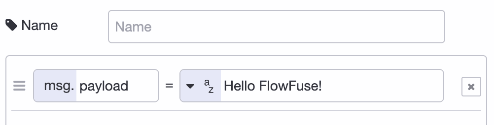

---
eleventyNavigation:
  key: Inject
  parent : Common
---

# Node-RED Inject Node

The Inject node is the beginning of many flows that are triggered manually. The box to the left of the node sends a message to connected nodes. For that reason it's often used for debugging too, to inject values at a point of choosing. The message item can be empty too. The message to send defaults to the timestamp as payload and an empty topic.

Message properties can be set to flow, or global variable values, and many other types, including JSONata expressions.

Flows can also be triggered once right after Node-RED starts the flows or with a delay. This is useful to set an initial state from a flow on boot.

An inject node can also start a flow based on a schedule. The schedules have capabilities mimicing cron. In the bottom section of the properties pane the repeat section one can select "at a specific time".

Repeating the measure on an interval is done by selecting "interval" in the "repeat" section. On a schedule requires an input higher than 1 and below 2^31. When the repeat value is 0 or below Node-RED will not display an error.

## Examples

### Inject on Node-RED start

To setup state when starting Node-RED, the inject node can be set to a zero delay to trigger a flow. When an Inject node is set to run only once, a small '1' is displayed after the label inside the node.


[{"id":"73cc510bee68600f","type":"inject","z":"80987f27785245a7","name":"","props":[{"p":"payload"}],"repeat":"","crontab":"","once":true,"onceDelay":"0.1","topic":"","payload":"","payloadType":"date","x":190,"y":200,"wires":[["7f83bf24bdf7bc68"]]},{"id":"7f83bf24bdf7bc68","type":"debug","z":"80987f27785245a7","name":"Output once","active":true,"tosidebar":true,"console":false,"tostatus":false,"complete":"payload","targetType":"msg","statusVal":"","statusType":"auto","x":370,"y":200,"wires":[]}]


### Run a flow daily at midnight

By selecting "at a specific" time in the Repeat section the inject node can generate a message at set times. Useful for data processing at set times.

Do set the correct timezone in the [editor settings](/docs/user/instance-settings/#editor).


[{"id":"998e844a7e50e275","type":"inject","z":"80987f27785245a7","name":"","props":[{"p":"payload"}],"repeat":"","crontab":"59 23 * * *","once":false,"onceDelay":"0","topic":"","payload":"","payloadType":"date","x":190,"y":320,"wires":[["1e80f5229516e910"]]},{"id":"1e80f5229516e910","type":"debug","z":"80987f27785245a7","name":"Output daily at night","active":true,"tosidebar":true,"console":false,"tostatus":false,"complete":"payload","targetType":"msg","statusVal":"","statusType":"auto","x":400,"y":320,"wires":[]}]


### Insert a static string

The Inject node can also set the payload to other input data, for example a
static string. Note this string cannot have multiple lines.


[{"id":"c0451e14f6b7eff0","type":"inject","z":"80987f27785245a7","name":"Inject a string","props":[{"p":"payload"}],"repeat":"","crontab":"","once":false,"onceDelay":0.1,"topic":"","payload":"Hello FlowFuse!","payloadType":"str","x":190,"y":280,"wires":[["9fbd8a0a9d21562a"]]},{"id":"9fbd8a0a9d21562a","type":"debug","z":"80987f27785245a7","name":"Output \"Hello FlowFuse\"","active":true,"tosidebar":true,"console":false,"tostatus":false,"complete":"payload","targetType":"msg","statusVal":"","statusType":"auto","x":410,"y":280,"wires":[]}]

