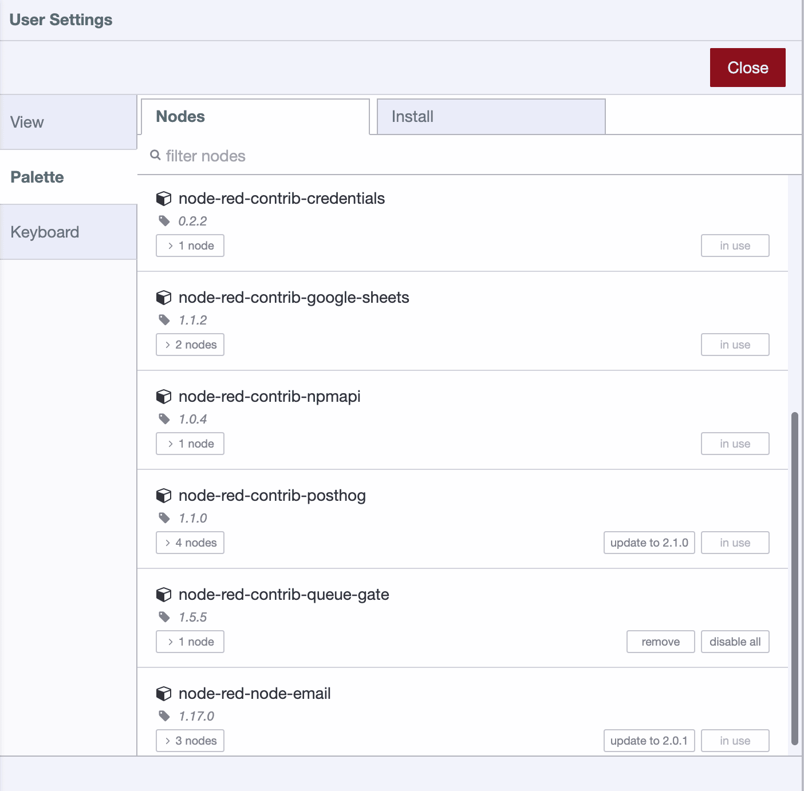
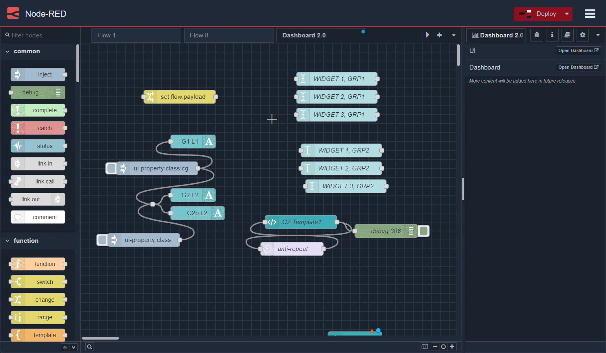

---
eleventyNavigation:
  key: Unknown
  parent : Common
---

# Node-RED Unknown Node

The `unknown` node is not one users can add add to their flows, and there's no
way to add them from the node palette. This node will only show up when when you
import a flow with nodes that have not yet been installed.

To understand which nodes need installing when importing a flow, it is advised
to create a list of installed node packages _before_ exporting your flows. Such a list 
can be obtained by looking in the palette manager.

Or use the `System Info` dialog to get a list:

Presently it is not possible to install older versions of a package into Node-RED so your flows will need to run on the latest version of each package, you may want to consider updating before you migrate.

## Migrating your flows to FlowFuse

When migrating your flows from any Node-RED to a FlowFuse managed Node-RED instance
it is advised to use [the `nr-tools plugin`](/docs/migration/introduction) created by the FlowFuse team. Migrating this way will not only the copy your flows, it will include any credentials you have set and install
the required packages for you.