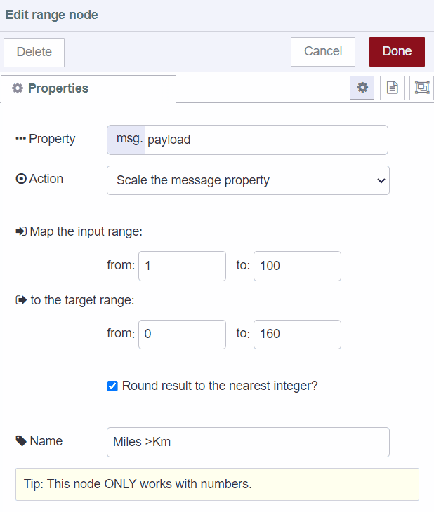

---
eleventyNavigation:
  key: Range
  parent : Function
---

# Node-RED Range Node

## What's the Range node in Node-RED used for?

The "Range" node in Node-RED allows you to map a numeric value from one range to another. For example, if you wanted to map miles to kilometers, you can specific the input range at 1 to 100 and the target range as 1 to 160.

Besides unit conversion, the range node can be used for:

**Data Scaling**: Use the "Range" node to scale or normalize data. For example, if you have sensor readings that range from 0 to 1023 but you want to convert them to a 0-100 percentage scale, you can use the "Range" node for this transformation.

**Data Compression**: Reduce the range of data values while preserving the relationships between values. This can be useful for displaying data on a smaller scale without losing important variations.

**Analog-to-Digital Conversion**: When interfacing with analog sensors, you can map the analog voltage range to a digital value range for processing.

**Data Smoothing**: Smooth out data fluctuations by mapping values within a range to a single value.

## Examples for the Range node

An example of a change node that converts from miles to kilometers.


[{"id":"183739aecda7dc43","type":"range","z":"e92fb6c3b304fd7c","minin":"1","maxin":"100","minout":"0","maxout":"160","action":"scale","round":true,"property":"payload","name":"Miles >Km","x":390,"y":220,"wires":[["9c4edf7250c34cdb"]]}]
