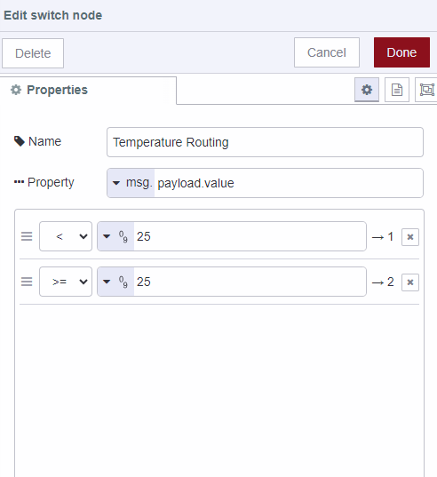

---
eleventyNavigation:
  key: Switch
  parent : Function
---

# Node-RED Switch Node

## What is the Switch node used for in Node-RED

The Switch node allows you to route messages based on certain conditions. It acts as a decision-making tool within your flow, allowing you to define rules for directing messages to different output branches. 

Here are some common use cases for using the Switch node in Node-RED:

**Message Filtering**: You can use the Switch node to filter messages based on specific criteria. For example, you might want to filter out messages that don't meet a certain threshold or that don't contain certain keywords.

**Conditional Routing**: The Switch node enables you to route messages down different paths in your flow based on conditions. You can set up rules that determine which output branch a message should be sent to, depending on its content or properties.

**Event Processing**: If you're working with events or data streams, the Switch node can help you process different types of events differently. For instance, you might have events related to temperature and humidity readings, and you want to process them separately.

**Value Conversion**: In cases where you need to convert values from one format to another, the Switch node can route messages to different converters based on the incoming value's properties.

**Error Handling**: When working with data or APIs, you might receive error messages that need to be handled differently from regular data. The Switch node can direct error messages to a separate branch for appropriate handling.

**Language or Region-Based Processing**: In applications involving localization or multilingual support, the Switch node can route messages based on language or region information in the message.

## Examples


[{"id":"1401d664616fc956","type":"tab","label":"Flow 8","disabled":false,"info":"","env":[]},{"id":"inject-node","type":"inject","z":"1401d664616fc956","name":"Simulate Temperature Data","props":[{"p":"payload"},{"p":"topic","vt":"str"}],"repeat":"","crontab":"","once":false,"onceDelay":0.1,"topic":"","payload":"{\"sensorType\": \"temperature\", \"value\": 28}","payloadType":"json","x":190,"y":200,"wires":[["temperature-route-node"]]},{"id":"temperature-route-node","type":"switch","z":"1401d664616fc956","name":"Temperature Routing","property":"payload.value","propertyType":"msg","rules":[{"t":"lt","v":"25","vt":"num"},{"t":"gte","v":"25","vt":"num"}],"checkall":"true","outputs":2,"x":470,"y":200,"wires":[["below-25-node"],["above-25-node"]]},{"id":"below-25-node","type":"debug","z":"1401d664616fc956","name":"Below 25°C","active":true,"tosidebar":true,"console":false,"tostatus":false,"complete":"payload","targetType":"msg","statusVal":"","statusType":"auto","x":680,"y":160,"wires":[]},{"id":"above-25-node","type":"debug","z":"1401d664616fc956","name":"Above 25°C","active":true,"tosidebar":true,"console":false,"tostatus":false,"complete":"payload","targetType":"msg","x":680,"y":240,"wires":[]}]
