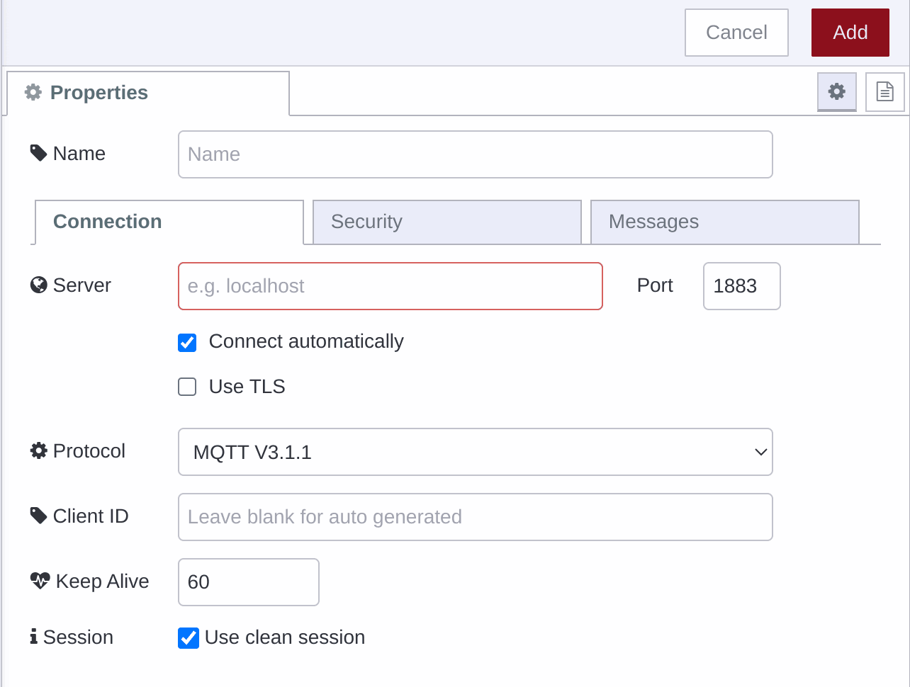

---
eleventyNavigation:
  key: MQTT
  parent : Network
---

# Node-RED MQTT Node

## What is are MQTT nodes used for in Node-RED

Node-RED comes with 2 MQTT nodes. 

### MQTT-in

The MQTT-in node is used to subscribe to a topic pattern on a given MQTT broker. This means messages published to a topic that matches the pattern will be delivered to the flow by this node.

### MQTT-out

The MQTT-out noe is used to publish messages to a topic from the flow.

### Configuring

Both of the nodes mentioned above make use a configuration node which holds all the details about connecting to a given MQTT broker. This includes things like:

 - hostname
 - port
 - username/password

 

 Node-RED supports MQTT v3.x and v5 as well as allowing connecting to
 brokers using both native MQTT and MQTT over WebSockets.

## Examples

Simple publish and subscribe


[{"id":"a149bb66646389a3","type":"tab","label":"MQTT Example","disabled":false,"info":"","env":[]},{"id":"bb79f2f114f79b39","type":"mqtt in","z":"a149bb66646389a3","name":"","topic":"ff/#","qos":"0","datatype":"auto-detect","broker":"037ca6b6ca0d7699","nl":false,"rap":true,"rh":0,"inputs":0,"x":210,"y":160,"wires":[["75dbd3c2f8e97550"]]},{"id":"cbc885829f5cf0dc","type":"mqtt out","z":"a149bb66646389a3","name":"","topic":"ff/test","qos":"","retain":"","respTopic":"","contentType":"","userProps":"","correl":"","expiry":"","broker":"037ca6b6ca0d7699","x":490,"y":100,"wires":[]},{"id":"f2641dab58edbc70","type":"inject","z":"a149bb66646389a3","name":"","props":[{"p":"payload"},{"p":"topic","vt":"str"}],"repeat":"","crontab":"","once":false,"onceDelay":0.1,"topic":"","payload":"","payloadType":"date","x":200,"y":100,"wires":[["cbc885829f5cf0dc"]]},{"id":"75dbd3c2f8e97550","type":"debug","z":"a149bb66646389a3","name":"debug 3","active":true,"tosidebar":true,"console":false,"tostatus":false,"complete":"true","targetType":"full","statusVal":"","statusType":"auto","x":500,"y":160,"wires":[]},{"id":"037ca6b6ca0d7699","type":"mqtt-broker","name":"","broker":"test.mosquitto.org","port":"1883","clientid":"","autoConnect":true,"usetls":false,"protocolVersion":"4","keepalive":"60","cleansession":true,"birthTopic":"","birthQos":"0","birthPayload":"","birthMsg":{},"closeTopic":"","closeQos":"0","closePayload":"","closeMsg":{},"willTopic":"","willQos":"0","willPayload":"","willMsg":{},"userProps":"","sessionExpiry":""}]


Cheerlights


[{"id":"0e7402215650517c","type":"mqtt in","z":"a149bb66646389a3","name":"","topic":"cheerlights/coloured/hex","qos":"2","datatype":"auto-detect","broker":"037ca6b6ca0d7699","nl":false,"rap":true,"rh":0,"inputs":0,"x":190,"y":300,"wires":[["6173b5c60df9bfee"]]},{"id":"6173b5c60df9bfee","type":"debug","z":"a149bb66646389a3","name":"debug 4","active":true,"tosidebar":true,"console":false,"tostatus":false,"complete":"false","statusVal":"","statusType":"auto","x":480,"y":300,"wires":[]},{"id":"037ca6b6ca0d7699","type":"mqtt-broker","name":"","broker":"test.mosquitto.org","port":"1883","clientid":"","autoConnect":true,"usetls":false,"protocolVersion":"4","keepalive":"60","cleansession":true,"birthTopic":"","birthQos":"0","birthPayload":"","birthMsg":{},"closeTopic":"","closeQos":"0","closePayload":"","closeMsg":{},"willTopic":"","willQos":"0","willPayload":"","willMsg":{},"userProps":"","sessionExpiry":""}]
