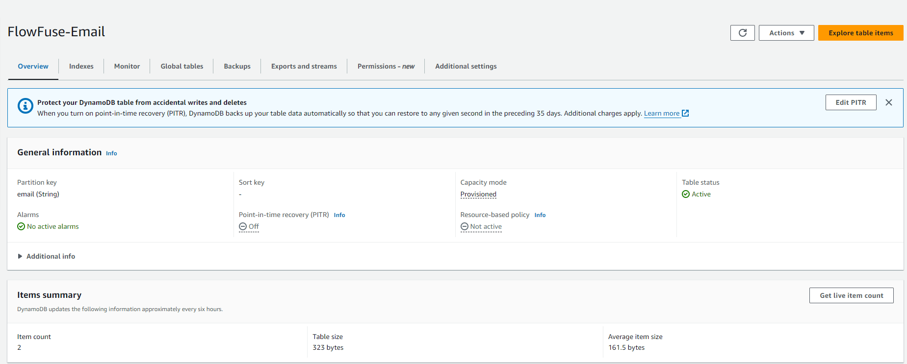
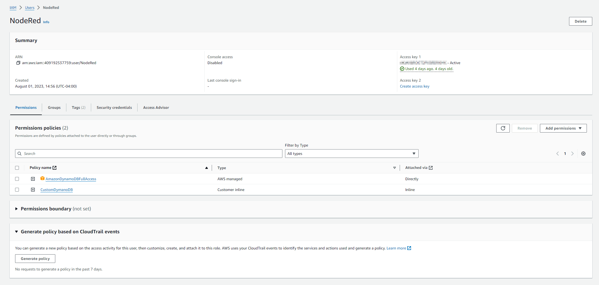
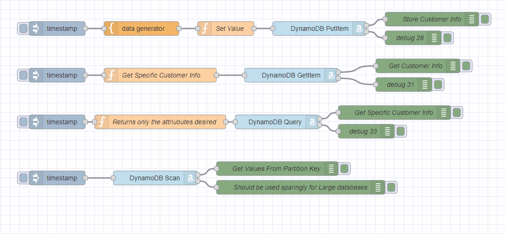
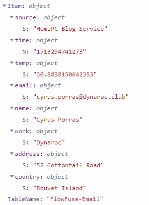
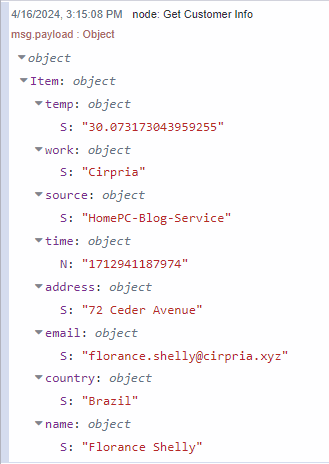
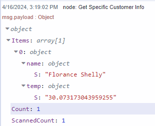
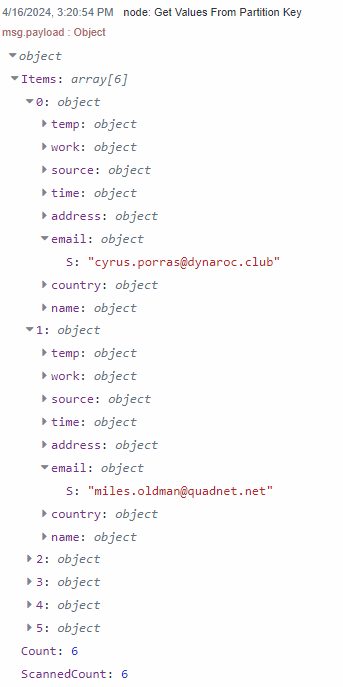

---
eleventyNavigation:
  key: DynamoDB
  parent: Database
meta:
  title: Using DynamoDB with Node-RED
  description: Get started with AWS' NoSQL database DynamoDB with Node-RED
  keywords: node-red, flowfuse, integration, dynamodb, aws, nosql
image: /node-red/core-nodes/images/node-red-dynamodb.png
---

# {{ meta.title }}

Amazon's DynamoDB is a fully managed NoSQL database service known for its fast and predictable performance and scalable design. This makes it suitable for applications needing low-latency responses. In this  documentation, we’ll look at how to set up and use DynamoDB, configure the necessary IAM roles, and apply Node-RED flows to store and retrieve data effectively.

## Setting Up DynamoDB

### Creating a DynamoDB Table

{data-zoomable}

There's no need to create a DynamoDB database, you do need to create a table. Here’s how you can do it:

1. Log into the AWS Management Console and navigate to the DynamoDB section.
2. Click on **Create table**.
3. For the table name, enter a table name. We will use **FlowFuse-Email** for this demonstration. For the partition key, use **email** with type String.
4. We will keep the **default settings**.
5. Finally, click on **Create** to establish your table.

### Configuring IAM for DynamoDB

{data-zoomable}

When working with Amazon DynamoDB, it’s crucial to ensure that the right entities have the appropriate permissions to perform actions on your database. This is where [AWS Identity and Access Management (IAM)](https://aws.amazon.com/iam/) plays an important role. By properly configuring IAM, you ensure that your data is not only secure from unauthorized access but also that the correct roles and users have the precise level of access needed, avoiding any unnecessary permissions that could lead to security risks.

#### Create a New IAM Role with Necessary Policies:

  1. Go to IAM in the AWS Console.
  2. Create a new role and give a name.
  3. For permission options select **Attach Policies Directly**.
  4. Search for the policy **AmazonDynamoDBFullAccess** and select **Next**.
  5. For finer control, customize the policy to restrict access as needed.
  6. Lastly click **Create User**.

#### Generate Access Keys:

  1. Inside the IAM console select **Users**.
  2. Select the newly created user.
  3. Navigate to **Security credentials**.
  4. Navigate to Access Keys and select **Create access key**.
  5. Select **Application running outside AWS** and click **Next**.
  6. Give description tag if desired and click **Create access Key**.
  7. Save the **Access ID** and **Secret Key** for use later.

## Working with DynamoDB: Use Case Flows

{data-zoomable}

### Prerequisites

Please install the following nodes:

1. [node-red-contrib-aws](https://flows.nodered.org/node/node-red-contrib-aws)
2. [node-red-node-data-generator](https://flows.nodered.org/node/node-red-node-data-generator)

Now, let's dive into some practical examples using Node-RED to manage a customer list:

### Inserting Data into DynamoDB

This first flow will generate data and send it to DynamoDB via the PutItem operation. 


[{"id":"10b0b970739d616f","type":"AWS DynamoDB","z":"37b2bc0d1ebdc616","aws":"","operation":"PutItem","Statements":"","RequestItems":"","TableName":"FlowFuse-Demo","BackupName":"","GlobalTableName":"","ReplicationGroup":"","AttributeDefinitions":"","KeySchema":"","BackupArn":"","Key":"","ExportArn":"","Statement":"","TransactStatements":"","TableArn":"","S3Bucket":"","ResourceArn":"","Item":"","TargetTableName":"","Tags":"","TransactItems":"","TagKeys":"","PointInTimeRecoverySpecification":"","ContributorInsightsAction":"","ReplicaUpdates":"","TimeToLiveSpecification":"","name":"","x":820,"y":240,"wires":[["0157a98fa69fe514"],["dc92470ddaa225bf"]]},{"id":"functionNode","type":"function","z":"37b2bc0d1ebdc616","name":"Set Value","func":"msg.Item = {\n    \"source\": { \"S\": msg.source },\n    \"time\": { \"N\": String(msg.payload) },\n    \"temp\": {\"S\": String(msg.datagen.temp) },\n    \"email\": {\"S\": msg.datagen.email},\n    \"name\": {\"S\": msg.datagen.name},\n    \"work\": {\"S\": msg.datagen.work},\n    \"address\": {\"S\": msg.datagen.address},\n    \"country\": {\"S\": msg.datagen.country},\n};\n\nmsg.TableName = \"FlowFuse-Email\";\n\nreturn msg;","outputs":1,"timeout":"","noerr":0,"initialize":"","finalize":"","libs":[],"x":620,"y":240,"wires":[["10b0b970739d616f"]]},{"id":"0157a98fa69fe514","type":"debug","z":"37b2bc0d1ebdc616","name":"Store Customer Info","active":true,"tosidebar":true,"console":false,"tostatus":false,"complete":"payload","targetType":"msg","statusVal":"","statusType":"auto","x":1060,"y":220,"wires":[]},{"id":"dc92470ddaa225bf","type":"debug","z":"37b2bc0d1ebdc616","name":"debug 28","active":true,"tosidebar":true,"console":false,"tostatus":false,"complete":"false","statusVal":"","statusType":"auto","x":1020,"y":260,"wires":[]},{"id":"45d46649bae57332","type":"inject","z":"37b2bc0d1ebdc616","name":"","props":[{"p":"payload"},{"p":"source","v":"FF_DEVICE_NAME","vt":"env"}],"repeat":"","crontab":"","once":false,"onceDelay":0.1,"topic":"","payload":"","payloadType":"date","x":260,"y":240,"wires":[["1160ce65b26429f3"]]},{"id":"1160ce65b26429f3","type":"data-generator","z":"37b2bc0d1ebdc616","name":"","field":"datagen","fieldType":"msg","syntax":"json","template":"{\n    \"name\": \"{{firstName}} {{lastName}}\",\n    \"work\": \"{{company}}\",\n    \"email\": \"{{email}}\",\n    \"address\": \"{{int 1 100}} {{street}}\",\n    \"country\": \"{{country}}\",\n    \"temp\": {{float 30 36}}\n}","x":440,"y":240,"wires":[["functionNode"]]}]


  1. Configure the AWS DyanamoDB node by **editing** the node.
  2. Click the **pencil** to create a new config.
  3. Give it a **name**.
  4. Input the **region** where your DynamoDB is located. (e.g. us-east-1)
  5. Input Access ID and Secrete key provide in the step above "**Configuring IAM for DynamoDB**."
  6. Click **Confirm**.
  7. **Trigger** the inject node and confirm you don't have any errors.
  8. The Debug node can confirm the data is stored correctly.
  9. The data structure will look similar to the image below.

{data-zoomable}

### Retrieving All Data for a specific Partition Key

The GetItem operation fetches data, which you can then display using debug nodes. To retrieve specific customer information based on their email import this flow:


[{"id":"f7e069b78d2ef5c5","type":"inject","z":"37b2bc0d1ebdc616","name":"","props":[{"p":"payload"},{"p":"topic","vt":"str"}],"repeat":"","crontab":"","once":false,"onceDelay":0.1,"topic":"","payload":"","payloadType":"date","x":260,"y":340,"wires":[["07caf16318aea2f6"]]},{"id":"07caf16318aea2f6","type":"function","z":"37b2bc0d1ebdc616","name":"Get Specific Customer Info","func":"msg = {\n    TableName: \"FlowFuse-Email\",\n    Key: {\n        \"email\": { \"S\": \"florance.shelly@cirpria.xyz\" }  //put email you want to search here\n    }\n};\nreturn msg;","outputs":1,"timeout":0,"noerr":0,"initialize":"","finalize":"","libs":[],"x":480,"y":340,"wires":[["3485e6cddd28c3eb"]]},{"id":"3485e6cddd28c3eb","type":"AWS DynamoDB","z":"37b2bc0d1ebdc616","aws":"","operation":"GetItem","Statements":"","RequestItems":"","TableName":"","BackupName":"","GlobalTableName":"","ReplicationGroup":"","AttributeDefinitions":"","KeySchema":"","BackupArn":"","Key":"","ExportArn":"","Statement":"","TransactStatements":"","TableArn":"","S3Bucket":"","ResourceArn":"","Item":"","TargetTableName":"","Tags":"","TransactItems":"","TagKeys":"","PointInTimeRecoverySpecification":"","ContributorInsightsAction":"","ReplicaUpdates":"","TimeToLiveSpecification":"","name":"","x":760,"y":340,"wires":[["0c0b39c735d71d77"],["ae673a52c1c7a123"]]},{"id":"0c0b39c735d71d77","type":"debug","z":"37b2bc0d1ebdc616","name":"debug 30","active":true,"tosidebar":true,"console":false,"tostatus":false,"complete":"false","statusVal":"","statusType":"auto","x":1000,"y":320,"wires":[]},{"id":"ae673a52c1c7a123","type":"debug","z":"37b2bc0d1ebdc616","name":"debug 31","active":true,"tosidebar":true,"console":false,"tostatus":false,"complete":"false","statusVal":"","statusType":"auto","x":1000,"y":360,"wires":[]}]


{data-zoomable}

The function node specifies the **TableName** and **Partition key** to search against.

### Querying Data

When you need to find items under specific criteria, set up your query with partition keys and conditions. The Query operation allows you to efficiently retrieve data without scanning the entire contents of a particular partition key.  If a key has significant about of data, but only need one particular value.  This would then be the ideal path.


[{"id":"99a876a56a78ae25","type":"inject","z":"37b2bc0d1ebdc616","name":"","props":[{"p":"payload"},{"p":"topic","vt":"str"}],"repeat":"","crontab":"","once":false,"onceDelay":0.1,"topic":"","payload":"","payloadType":"date","x":260,"y":420,"wires":[["d59f213bc3f6712a"]]},{"id":"d59f213bc3f6712a","type":"function","z":"37b2bc0d1ebdc616","name":"Returns only the attriubutes desired","func":"msg.TableName = \"FlowFuse-Email\";\nmsg.KeyConditionExpression = \"email = :email\";\nmsg.ExpressionAttributeValues = {\n    \":email\": { \"S\": \"florance.shelly@cirpria.xyz\" }\n};\nmsg.ProjectionExpression =  \"#n, #t\";\nmsg.ExpressionAttributeNames = {\n    \"#t\": \"temp\",\n    \"#n\": \"name\"\n}  // Only retrieve these attributes\n\nreturn msg;\n","outputs":1,"timeout":0,"noerr":0,"initialize":"","finalize":"","libs":[],"x":480,"y":420,"wires":[["e178ffb9a87226a5"]]},{"id":"e178ffb9a87226a5","type":"AWS DynamoDB","z":"37b2bc0d1ebdc616","aws":"","operation":"Query","Statements":"","RequestItems":"","TableName":"","BackupName":"","GlobalTableName":"","ReplicationGroup":"","AttributeDefinitions":"","KeySchema":"","BackupArn":"","Key":"","ExportArn":"","Statement":"","TransactStatements":"","TableArn":"","S3Bucket":"","ResourceArn":"","Item":"","TargetTableName":"","Tags":"","TransactItems":"","TagKeys":"","PointInTimeRecoverySpecification":"","ContributorInsightsAction":"","ReplicaUpdates":"","TimeToLiveSpecification":"","name":"","x":730,"y":420,"wires":[["b2e6d9d9dcf9dcd3"],["b2595472f1dc6570"]]},{"id":"b2e6d9d9dcf9dcd3","type":"debug","z":"37b2bc0d1ebdc616","name":"debug 32","active":true,"tosidebar":true,"console":false,"tostatus":false,"complete":"false","statusVal":"","statusType":"auto","x":920,"y":400,"wires":[]},{"id":"b2595472f1dc6570","type":"debug","z":"37b2bc0d1ebdc616","name":"debug 33","active":true,"tosidebar":true,"console":false,"tostatus":false,"complete":"false","statusVal":"","statusType":"auto","x":920,"y":440,"wires":[]}]


In this example we are retrieving only **name** and **temp** from the matching partition key match.

{data-zoomable}

### Scanning Data

While scanning is available, it should be used sparingly due to its high demand on resources, especially in large databases. Use it when necessary prioritize using query for regular operations.


[{"id":"671cf37c1ae941d2","type":"inject","z":"37b2bc0d1ebdc616","name":"","props":[{"p":"payload"},{"p":"TableName","v":"FlowFuse-Email","vt":"str"}],"repeat":"","crontab":"","once":false,"onceDelay":0.1,"topic":"","payload":"","payloadType":"date","x":260,"y":540,"wires":[["8cb14f9530eeb524"]]},{"id":"8cb14f9530eeb524","type":"AWS DynamoDB","z":"37b2bc0d1ebdc616","aws":"","operation":"Scan","Statements":"","RequestItems":"","TableName":"","BackupName":"","GlobalTableName":"","ReplicationGroup":"","AttributeDefinitions":"","KeySchema":"","BackupArn":"","Key":"","ExportArn":"","Statement":"","TransactStatements":"","TableArn":"","S3Bucket":"","ResourceArn":"","Item":"","TargetTableName":"","Tags":"","TransactItems":"","TagKeys":"","PointInTimeRecoverySpecification":"","ContributorInsightsAction":"","ReplicaUpdates":"","TimeToLiveSpecification":"","name":"","x":470,"y":540,"wires":[["86e3a35428218d91"],["5c6e85699cc783fc"]]},{"id":"86e3a35428218d91","type":"debug","z":"37b2bc0d1ebdc616","name":"Get Values From Partition Key","active":true,"tosidebar":true,"console":false,"tostatus":false,"complete":"payload","targetType":"msg","statusVal":"","statusType":"auto","x":730,"y":520,"wires":[]},{"id":"5c6e85699cc783fc","type":"debug","z":"37b2bc0d1ebdc616","name":"Should be used sparingly for Large databases","active":true,"tosidebar":true,"console":false,"tostatus":false,"complete":"payload","targetType":"msg","statusVal":"","statusType":"auto","x":780,"y":560,"wires":[]}]


{data-zoomable}

## Full Flow


[{"id":"10b0b970739d616f","type":"AWS DynamoDB","z":"37b2bc0d1ebdc616","aws":"75ba91a6ba62cece","operation":"PutItem","Statements":"","RequestItems":"","TableName":"FlowFuse-Email","BackupName":"","GlobalTableName":"","ReplicationGroup":"","AttributeDefinitions":"","KeySchema":"","BackupArn":"","Key":"","ExportArn":"","Statement":"","TransactStatements":"","TableArn":"","S3Bucket":"","ResourceArn":"","Item":"","TargetTableName":"","Tags":"","TransactItems":"","TagKeys":"","PointInTimeRecoverySpecification":"","ContributorInsightsAction":"","ReplicaUpdates":"","TimeToLiveSpecification":"","name":"","x":820,"y":220,"wires":[["0157a98fa69fe514"],["dc92470ddaa225bf"]]},{"id":"functionNode","type":"function","z":"37b2bc0d1ebdc616","name":"Set Value","func":"msg.Item = {\n    \"source\": { \"S\": msg.source },\n    \"time\": { \"N\": String(msg.payload) },\n    \"temp\": {\"S\": String(msg.datagen.temp) },\n    \"email\": {\"S\": msg.datagen.email},\n    \"name\": {\"S\": msg.datagen.name},\n    \"work\": {\"S\": msg.datagen.work},\n    \"address\": {\"S\": msg.datagen.address},\n    \"country\": {\"S\": msg.datagen.country},\n};\n\nmsg.TableName = \"FlowFuse-Email\";\n\nreturn msg;","outputs":1,"timeout":"","noerr":0,"initialize":"","finalize":"","libs":[],"x":620,"y":220,"wires":[["10b0b970739d616f"]]},{"id":"0157a98fa69fe514","type":"debug","z":"37b2bc0d1ebdc616","name":"Store Customer Info","active":true,"tosidebar":true,"console":false,"tostatus":false,"complete":"payload","targetType":"msg","statusVal":"","statusType":"auto","x":1060,"y":200,"wires":[]},{"id":"dc92470ddaa225bf","type":"debug","z":"37b2bc0d1ebdc616","name":"debug 28","active":true,"tosidebar":true,"console":false,"tostatus":false,"complete":"false","statusVal":"","statusType":"auto","x":1020,"y":240,"wires":[]},{"id":"45d46649bae57332","type":"inject","z":"37b2bc0d1ebdc616","name":"","props":[{"p":"payload"},{"p":"source","v":"FF_DEVICE_NAME","vt":"env"}],"repeat":"","crontab":"","once":false,"onceDelay":0.1,"topic":"","payload":"","payloadType":"date","x":260,"y":220,"wires":[["1160ce65b26429f3"]]},{"id":"f7e069b78d2ef5c5","type":"inject","z":"37b2bc0d1ebdc616","name":"","props":[{"p":"payload"},{"p":"topic","vt":"str"}],"repeat":"","crontab":"","once":false,"onceDelay":0.1,"topic":"","payload":"","payloadType":"date","x":260,"y":320,"wires":[["07caf16318aea2f6"]]},{"id":"07caf16318aea2f6","type":"function","z":"37b2bc0d1ebdc616","name":"Get Specific Customer Info","func":"msg = {\n    TableName: \"FlowFuse-Email\",\n    Key: {\n        \"email\": { \"S\": \"florance.shelly@cirpria.xyz\" }  //put email you want to search here\n    }\n};\nreturn msg;","outputs":1,"timeout":0,"noerr":0,"initialize":"","finalize":"","libs":[],"x":480,"y":320,"wires":[["3485e6cddd28c3eb"]]},{"id":"3485e6cddd28c3eb","type":"AWS DynamoDB","z":"37b2bc0d1ebdc616","aws":"75ba91a6ba62cece","operation":"GetItem","Statements":"","RequestItems":"","TableName":"","BackupName":"","GlobalTableName":"","ReplicationGroup":"","AttributeDefinitions":"","KeySchema":"","BackupArn":"","Key":"","ExportArn":"","Statement":"","TransactStatements":"","TableArn":"","S3Bucket":"","ResourceArn":"","Item":"","TargetTableName":"","Tags":"","TransactItems":"","TagKeys":"","PointInTimeRecoverySpecification":"","ContributorInsightsAction":"","ReplicaUpdates":"","TimeToLiveSpecification":"","name":"","x":760,"y":320,"wires":[["0c0b39c735d71d77"],["ae673a52c1c7a123"]]},{"id":"0c0b39c735d71d77","type":"debug","z":"37b2bc0d1ebdc616","name":"Get Customer Info","active":true,"tosidebar":true,"console":false,"tostatus":false,"complete":"payload","targetType":"msg","statusVal":"","statusType":"auto","x":1030,"y":300,"wires":[]},{"id":"ae673a52c1c7a123","type":"debug","z":"37b2bc0d1ebdc616","name":"debug 31","active":true,"tosidebar":true,"console":false,"tostatus":false,"complete":"false","statusVal":"","statusType":"auto","x":1000,"y":340,"wires":[]},{"id":"99a876a56a78ae25","type":"inject","z":"37b2bc0d1ebdc616","name":"","props":[{"p":"payload"},{"p":"topic","vt":"str"}],"repeat":"","crontab":"","once":false,"onceDelay":0.1,"topic":"","payload":"","payloadType":"date","x":260,"y":420,"wires":[["d59f213bc3f6712a"]]},{"id":"d59f213bc3f6712a","type":"function","z":"37b2bc0d1ebdc616","name":"Returns only the attriubutes desired","func":"msg.TableName = \"FlowFuse-Email\";\nmsg.KeyConditionExpression = \"email = :email\";\nmsg.ExpressionAttributeValues = {\n    \":email\": { \"S\": \"florance.shelly@cirpria.xyz\" }\n};\nmsg.ProjectionExpression =  \"#n, #t\";\nmsg.ExpressionAttributeNames = {\n    \"#t\": \"temp\",\n    \"#n\": \"name\"\n}  // Only retrieve these attributes\n\nreturn msg;\n","outputs":1,"timeout":0,"noerr":0,"initialize":"","finalize":"","libs":[],"x":480,"y":420,"wires":[["e178ffb9a87226a5"]]},{"id":"e178ffb9a87226a5","type":"AWS DynamoDB","z":"37b2bc0d1ebdc616","aws":"75ba91a6ba62cece","operation":"Query","Statements":"","RequestItems":"","TableName":"","BackupName":"","GlobalTableName":"","ReplicationGroup":"","AttributeDefinitions":"","KeySchema":"","BackupArn":"","Key":"","ExportArn":"","Statement":"","TransactStatements":"","TableArn":"","S3Bucket":"","ResourceArn":"","Item":"","TargetTableName":"","Tags":"","TransactItems":"","TagKeys":"","PointInTimeRecoverySpecification":"","ContributorInsightsAction":"","ReplicaUpdates":"","TimeToLiveSpecification":"","name":"","x":730,"y":420,"wires":[["b2e6d9d9dcf9dcd3"],["b2595472f1dc6570"]]},{"id":"b2e6d9d9dcf9dcd3","type":"debug","z":"37b2bc0d1ebdc616","name":"Get Specific Customer Info","active":true,"tosidebar":true,"console":false,"tostatus":false,"complete":"payload","targetType":"msg","statusVal":"","statusType":"auto","x":980,"y":400,"wires":[]},{"id":"b2595472f1dc6570","type":"debug","z":"37b2bc0d1ebdc616","name":"debug 33","active":true,"tosidebar":true,"console":false,"tostatus":false,"complete":"false","statusVal":"","statusType":"auto","x":920,"y":440,"wires":[]},{"id":"1160ce65b26429f3","type":"data-generator","z":"37b2bc0d1ebdc616","name":"","field":"datagen","fieldType":"msg","syntax":"json","template":"{\n    \"name\": \"{{firstName}} {{lastName}}\",\n    \"work\": \"{{company}}\",\n    \"email\": \"{{email}}\",\n    \"address\": \"{{int 1 100}} {{street}}\",\n    \"country\": \"{{country}}\",\n    \"temp\": {{float 30 36}}\n}","x":440,"y":220,"wires":[["functionNode"]]},{"id":"671cf37c1ae941d2","type":"inject","z":"37b2bc0d1ebdc616","name":"","props":[{"p":"payload"},{"p":"TableName","v":"FlowFuse-Email","vt":"str"}],"repeat":"","crontab":"","once":false,"onceDelay":0.1,"topic":"","payload":"","payloadType":"date","x":260,"y":540,"wires":[["8cb14f9530eeb524"]]},{"id":"8cb14f9530eeb524","type":"AWS DynamoDB","z":"37b2bc0d1ebdc616","aws":"75ba91a6ba62cece","operation":"Scan","Statements":"","RequestItems":"","TableName":"","BackupName":"","GlobalTableName":"","ReplicationGroup":"","AttributeDefinitions":"","KeySchema":"","BackupArn":"","Key":"","ExportArn":"","Statement":"","TransactStatements":"","TableArn":"","S3Bucket":"","ResourceArn":"","Item":"","TargetTableName":"","Tags":"","TransactItems":"","TagKeys":"","PointInTimeRecoverySpecification":"","ContributorInsightsAction":"","ReplicaUpdates":"","TimeToLiveSpecification":"","name":"","x":470,"y":540,"wires":[["86e3a35428218d91"],["5c6e85699cc783fc"]]},{"id":"86e3a35428218d91","type":"debug","z":"37b2bc0d1ebdc616","name":"Get Values From Partition Key","active":true,"tosidebar":true,"console":false,"tostatus":false,"complete":"payload","targetType":"msg","statusVal":"","statusType":"auto","x":730,"y":520,"wires":[]},{"id":"5c6e85699cc783fc","type":"debug","z":"37b2bc0d1ebdc616","name":"Should be used sparingly for Large databases","active":true,"tosidebar":true,"console":false,"tostatus":false,"complete":"payload","targetType":"msg","statusVal":"","statusType":"auto","x":780,"y":560,"wires":[]},{"id":"75ba91a6ba62cece","type":"amazon config","name":"AWS-gdziuba","region":"us-east-1","proxyRequired":false,"proxy":""}]


### Try FlowFuse's Built-In Database Service

[FlowFuse now includes a fully integrated database service that makes connecting and querying your data effortless](/blog/2025/08/getting-started-with-flowfuse-tables/). With the FlowFuse Query Node, you do not need to configure the connection manually—the node sets itself up automatically.

Even better, the [FlowFuse AI Assistant allows you to query your tables using natural language](/blog/2025/09/ai-assistant-flowfuse-tables/). Simply type your request, and it will generate the correct SQL for you based on your table.

Deploy, manage, scale, and secure your Node-RED applications with FlowFuse, and take full control of your industrial workflows and data.

[**Start with FlowFuse today**](https://app.flowfuse.com/) 

