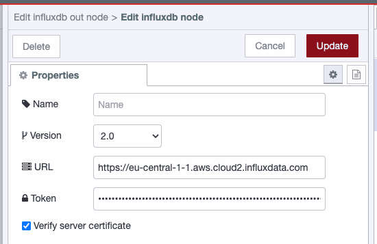
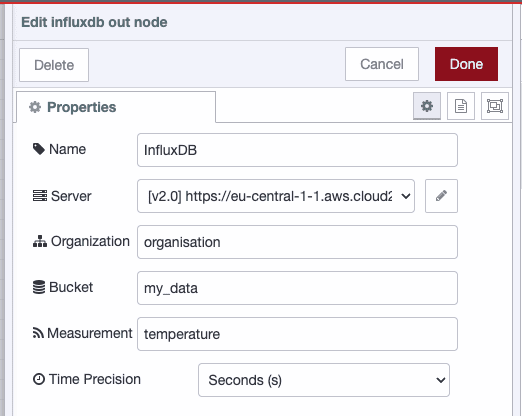
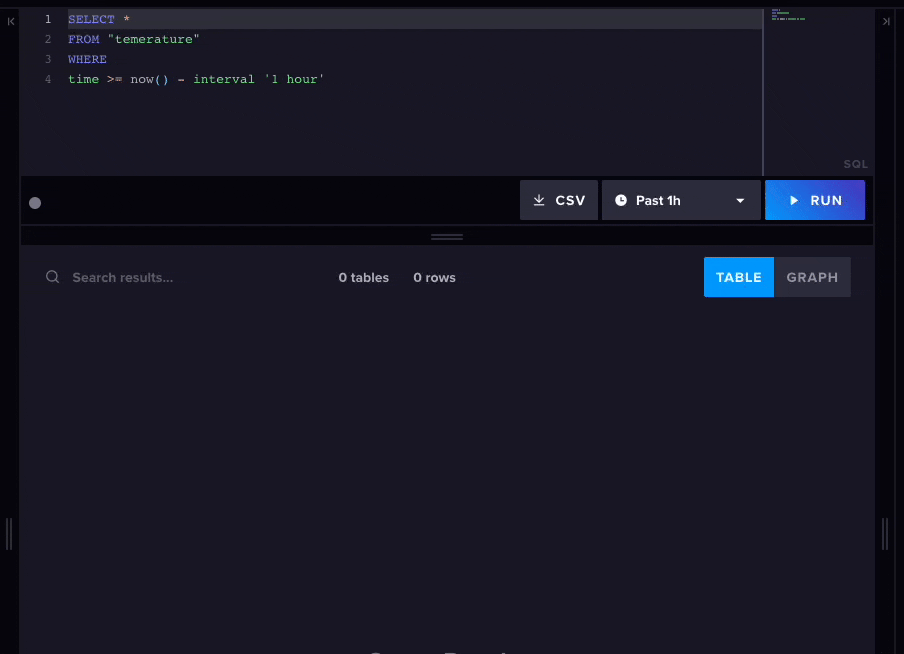

---
eleventyNavigation:
  key: InfluxDB
  parent: Database
meta:
  title: Using InfluxDB with Node-RED (2026 Updated)
  description: Node-RED has great support for InfluxDB. In this guide, we'll explain how to get your data flowing into one of the most popular time-series databases.
  keywords: node-red, databases, integration, influxdb, time-series database
image: /node-red/core-nodes/images/node-red-influxdb.png
---

# {{ meta.title }}

InfluxDB is a time series database that is commonly used for storing and analysing IoT data. Node-RED is a visual programming tool that makes it easy to connect different data sources and create flows that automate tasks.

In this documentation, we will show you how to write data to InfluxDB from a Node-RED flow. We will also provide you with a few tips for writing data to InfluxDB effectively.

## Step 1: Install the InfluxDB Node-RED package

The first step is to install the InfluxDB Node-RED package. You can do this by opening the Node-RED editor and clicking on the Manage Palette button. In the search bar, type InfluxDB and select the package called node-red-contrib-influxdb.

## Step 2: Configure the InfluxDB node

Once you have installed the InfluxDB node, you need to configure it. Drag an instance of 'influxdb out' onto your canvas and select 'Add new influxdb'. Follow the steps below to configure your connection.

- Version: The version of InfluxDB you are using (we're using 2.0).
- URL: The URL of your InfluxDB server.
- Token: Your token to access your InfluxDB database.



We can now configure the database.

- Organization name.
- Bucket (database) name.
- Measurement (table) name.



## Step 3: Create a data point

A data point is a single piece of data that is written to InfluxDB. A data point consists of a measurement, a set of fields, and a set of tags.

The measurement is the name of the data that you are writing. We've set it in the configuration of the InfluxDB above so we don't need to pass it in with each payload.

The fields are the individual pieces of data that you are writing. The tags are used to categorise the data. 

You can import the flow below into Node-RED to see an example of a payload which will write all the required values to create a data point in InfluxDB:


[{"id":"cb3b0ecc762dbf93","type":"inject","z":"4542482476b9c71d","name":"","props":[{"p":"payload"}],"repeat":"","crontab":"","once":false,"onceDelay":0.1,"topic":"","payload":"[{\"time\":1688718546,\"temperature\":24},{\"device\":\"dQBgXeWLRE\",\"deviceType\":\"Pi4\",\"deviceName\":\"demo-pi-rob\"}]","payloadType":"json","x":450,"y":420,"wires":[["87166c0dafdeea33"]]},{"id":"87166c0dafdeea33","type":"debug","z":"4542482476b9c71d","name":"debug 31","active":true,"tosidebar":true,"console":false,"tostatus":false,"complete":"true","targetType":"full","statusVal":"","statusType":"auto","x":600,"y":420,"wires":[]}]


In this example, the time & temperature fields are hard coded, you will need to overwrite the values stored in ```payload[0].time``` & ```payload[0].temperature``` with real data if you were to connect this flow to a real IOT thermometer.

## Step 4: Write the data point to InfluxDB

Once you have created a data point, you can write it to InfluxDB by using the InfluxDB node. 

- Data: The data point that you want to write.
- Options: The configuration options for the InfluxDB node.

This is an example valid payload:

```json
[
    {
        "time": 1688987984,
        "temperature": 24
    },
    {
        "device": "dQBgXeWLRE",
        "deviceType": "Pi4",
        "deviceName": "demo-pi-rob"
    }
]
```

You can import a demo, including the demo payload flow using the code below:

[{"id":"ecbb02face30cbcd","type":"influxdb out","z":"4542482476b9c71d","influxdb":"1c1a5edef41716e3","name":"InfluxDB","measurement":"temperature","precision":"","retentionPolicy":"","database":"database","precisionV18FluxV20":"s","retentionPolicyV18Flux":"","org":"organization","bucket":"my_data","x":360,"y":220,"wires":[]},{"id":"de83c2b49ba249fd","type":"inject","z":"4542482476b9c71d","name":"","props":[{"p":"measurement","v":"temperature","vt":"str"},{"p":"payload"}],"repeat":"","crontab":"","once":false,"onceDelay":0.1,"topic":"","payload":"[{\"time\":1688987984,\"temperature\":24},{\"device\":\"dQBgXeWLRE\",\"deviceType\":\"Pi4\",\"deviceName\":\"demo-pi-rob\"}]","payloadType":"json","x":190,"y":160,"wires":[["aad6353f2f00333e","ecbb02face30cbcd"]]},{"id":"aad6353f2f00333e","type":"debug","z":"4542482476b9c71d","name":"debug 31","active":true,"tosidebar":true,"console":false,"tostatus":false,"complete":"true","targetType":"full","statusVal":"","statusType":"auto","x":360,"y":160,"wires":[]},{"id":"1c1a5edef41716e3","type":"influxdb","hostname":"127.0.0.1","port":"8086","protocol":"http","database":"my_data","name":"","usetls":false,"tls":"","influxdbVersion":"2.0","url":"https://localhost","rejectUnauthorized":true}]


Bear in mind that you will need to edit the server and database details in your influxdb node for this demo to work.

## Step 5: Test your flow

You should now be ready to test your flow is writing data to InfluxDB correctly. There is no output in Node-RED to confirm you data was written, so you will need to check directly on InfluxDB.



Great, our data has arrived correctly and is ready to be used.

## 5 Tips for writing data to Node-RED from InfluxDB effectively

1. Choose the correct InfluxDB node. There are two InfluxDB nodes available in Node-RED: the 'influxdb out' node and the 'influx batch' node. The influxdb out node writes data to InfluxDB one point at a time, while the influx batch node writes data to InfluxDB in batches. The best node to use depends on the amount of data you are writing and the performance requirements of your application. If you are just getting started with InfluxDB, we suggest starting with influxdb out.
1. Set the correct measurement name. The measurement name is the name of the table in InfluxDB where the data will be stored. It is important to choose a meaningful measurement name that will help you to easily identify the data later. 
1. Set the correct tags and fields. Tags are used to identify the data points, while fields are used to store the actual data values. It is important to set the correct tags and fields for your data so that you can easily query and analyse it later.
1. Set the correct timestamp. The timestamp is the time at which the data point was recorded. It is important to set the correct timestamp so that you can track the evolution of your data over time.
1. Use the correct precision. The precision is the number of decimal places that are stored for each data value. It is important to use the correct precision so that your data is easy to use.
