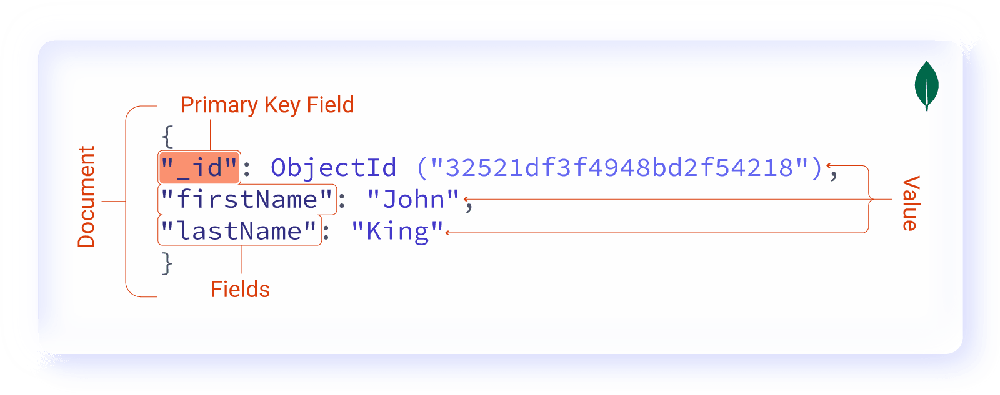

---
eleventyNavigation:
  key: MongoDB
  parent: Database
meta:
  title: Using MongoDB With Node-RED (2026 Updated)
  description: Learn how to seamlessly integrate MongoDB, a NoSQL database, into your Node-RED applications with this step-by-step documentation.
  keywords: node-red, databases, integration, mongodb, no-sql database
image: /node-red/core-nodes/images/using-Mongo-with-nr.png
---

# {{ meta.title }}

This guide provides implementation procedures for integrating MongoDB with Node-RED. It covers configuration requirements, operational patterns, and a complete implementation example using a customer relationship management system.

## Understanding MongoDB

MongoDB is an open-source NoSQL database that stores data in flexible, JSON-like documents rather than rigid table structures. Each document can maintain its own schema, which allows for data model evolution without requiring database-wide migrations. This architectural approach suits applications where data structures change frequently or vary between records.

The database uses a distributed architecture that supports horizontal scaling across multiple nodes. It handles high-volume workloads and provides query performance suitable for real-time operations.

### Data Organization

MongoDB structures data into three hierarchical components, which differ from traditional relational databases:

- **Collections** replace tables
- **Documents** replace rows  
- **Fields** replace columns

{data-zoomable}

## Technical Considerations

Several factors make MongoDB appropriate for Node-RED integration:

MongoDB's document model aligns directly with JSON data structures, which eliminates transformation overhead between Node-RED message objects and database records. The schema-less architecture supports rapid iteration without requiring schema migrations for each data model change.

The database scales horizontally by distributing data across multiple servers. While some SQL databases support horizontal scaling, MongoDB's architecture implements this pattern natively. The query language uses a document-based syntax that matches common programming patterns.

MongoDB Atlas provides managed database services with automated backups, security controls, and monitoring tools. The platform includes specialized implementations for industrial applications. Additional information is available at [MongoDB Atlas for Manufacturing and Automotive](https://www.mongodb.com/company/newsroom/press-releases/mongodb-atlas-for-manufacturing-and-automotive).

## Configuration Procedures

### Installing the MongoDB Node

1. Open Node-RED Settings (top-right menu)
2. Select "Manage Palette"
3. Navigate to the "Install" tab
4. Search for `node-red-contrib-mongodb4`
5. Install the package

### Connection Parameters

Collect the following configuration values before proceeding:

- `Host`: Server IP address or hostname
- `Port`: Connection port (default: 27017; may not be required for managed services)
- `Database`: Target database name
- `User`: Account username with appropriate database privileges
- `Password`: Account password

For TLS/SSL configuration and other advanced options, consult the [node documentation](https://flows.nodered.org/node/node-red-contrib-mongodb4).

### Environment Variable Configuration

Store connection credentials in environment variables rather than embedding them directly in flows. This prevents credential exposure in version control and exported flow definitions. Reference the guide [Using Environment Variables in Node-RED](/blog/2023/01/environment-variables-in-node-red/) for additional context.

{data-zoomable}

1. Navigate to instance settings
2. Select the "Environment" tab
3. Add variables for each configuration parameter
4. Save the configuration
5. Restart the instance using the Actions menu

### Configuring the MongoDB Node

Configure the node to use the environment variables:

1. Add a MongoDB4 node to the canvas
2. Open the node configuration
3. Click the edit icon next to the connection field
4. Reference environment variables as shown below

{data-zoomable}

## Implementation Example: Customer Management System

This section demonstrates MongoDB operations through a functional customer relationship management system. The implementation covers create, read, update, and delete operations using a representative data structure.

### Data Schema

The customer records use the following structure:

```json
{
  "_id": "NXaxeFEK",
  "firstname": "alice",
  "lastname": "demo",
  "email": "userdemo601@gmail.com",
  "phone": "+19876543561",
  "company": "self",
  "status": "Prospect",
  "source": "website"
}
```

### MongoDB Operations

The implementation uses five core operations:

- **InsertOne**: Adds a single document to a collection
- **Find**: Retrieves documents matching specified criteria
- **UpdateOne**: Modifies a single document based on query parameters
- **DeleteOne**: Removes a single document matching query criteria
- **Drop**: Deletes an entire collection

Refer to the [MongoDB CRUD documentation](https://www.mongodb.com/basics/crud) for the complete operation set.

### Additional Dependencies

#### NanoID Generator

Install `node-red-contrib-friendly-id` through the palette manager. This package generates compact, URL-safe unique identifiers for customer records. The implementation uses NanoID instead of manual ID entry or sequential numbering.

#### Dashboard Interface

The example uses Node-RED Dashboard 2.0 for the user interface. Follow the [Dashboard setup instructions](/blog/2024/03/dashboard-getting-started/) to install and configure the dashboard nodes.

### Creating Customer Records

1. Add a ui-form widget to the canvas
2. Configure form elements for `firstname`, `lastname`, `email`, `phone`, `company`, `status`, and `source`

{data-zoomable}

3. Add a friendly-id node
4. Configure it to generate a random ID with your preferred length
5. Set output destination to `msg.payload._id`

{data-zoomable}

6. Add a change node
7. Set `msg.payload` to `[msg.payload]` using JSONata expression type
8. This wraps the payload in an array as required by the insertOne operation

{data-zoomable}

9. Configure the MongoDB4 node:
   - Select the previously configured connection
   - Set collection name to "customers"
   - Set operation to "insertOne"

{data-zoomable}

10. Wire the nodes as shown:

{data-zoomable}

### Retrieving Customer Records

1. Add an inject node
2. Configure it to send an empty object `{}`
3. Set the node to repeat at your preferred interval for automatic table updates
4. Add a MongoDB4 node
5. Select your connection and set operation to "find"

{data-zoomable}

6. Add a ui-table widget
7. Configure the maximum rows according to your requirements

{data-zoomable}

8. Wire the nodes as shown:

{data-zoomable}

### Updating Customer Records

1. Add a ui-form widget with fields for "id" and "status"

{data-zoomable}

2. Add a change node
3. Set `msg.payload` to the following JSON structure:

```json
[
  { "_id": msg.payload._id },
  { "$set": { "status": msg.payload.status } }
]
```

The first object specifies the query criteria (which document to update). The second object defines the update operation using MongoDB's `$set` operator.

{data-zoomable}

4. Add a MongoDB4 node and set operation to "updateOne"

{data-zoomable}

5. Wire the nodes as shown:

{data-zoomable}

### Deleting Customer Records

1. Add a ui-form widget with fields for "id" and "firstname"

{data-zoomable}

2. Add a change node
3. Set `msg.payload` to the following structure:

```json
[
  {
    "_id": msg.payload._id,
    "firstname": msg.payload.firstname
  },
  {
    "$delete": ""
  }
]
```

The query includes both ID and firstname to provide additional verification before deletion.

{data-zoomable}

4. Add a MongoDB4 node and set operation to "deleteOne"

{data-zoomable}

5. Wire the nodes as shown:

{data-zoomable}

### Removing Collections

1. Add an inject node configured to send an empty object
2. Add a MongoDB4 node
3. Specify the collection name to remove
4. Set operation to "drop"

{data-zoomable}

5. Wire the nodes as shown:

{data-zoomable}

## Verification and Troubleshooting

Connect a debug node to the output of any MongoDB4 node to monitor operation results and diagnose errors. The following examples show successful operation responses:

### Operation Response Messages

```js
// Insert operation
{
  "acknowledged": true,
  "insertedId": "BKoIzMuW"
}

// Update operation
{
  "acknowledged": true,
  "modifiedCount": 1,
  "upsertedId": null,
  "upsertedCount": 0,
  "matchedCount": 1
}

// Delete operation
{
  "acknowledged": true,
  "deletedCount": 1
}

// Drop operation returns boolean true
```

### Deployment

{data-zoomable}

1. Deploy the flow using the Deploy button
2. Open the dashboard using the button in the Dashboard 2.0 sidebar
3. Use inject nodes for retrieval and drop operations
4. Use the forms for create, update, and delete operations

{data-zoomable}