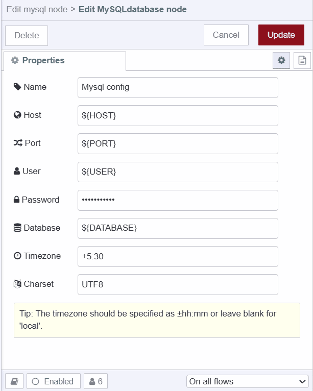

---
eleventyNavigation:
  key: MySQL
  parent: Database
meta:
  title: Using MySQL with Node-RED (2026 Updated)
  description: Learn how to seamlessly integrate MySQL with Node-RED for efficient data management and application development.
  keywords: nodered mysql, node red mysql, node-red-node-mysql, mysql nodered, mysql node red
image: /node-red/database/images/timescaledb-with-node-red.png
---

# {{ meta.title }}

When discussing popular and widely used databases, MySQL inevitably stands out. This is especially evident within the Node-RED community, where the MySQL contrib node has the highest number of downloads among all database contrib nodes. However, popularity often brings its own set of challenges. We've prepared this comprehensive guide to help our Node-RED community members navigate these challenges. It covers all aspects of using MySQL with Node-RED, including an overview of what MySQL is, the differences between PostgreSQL and MySQL, when to choose one over the other, essential MySQL operations, and more.

## What is MySQL 

[MySQL](https://dev.mysql.com/doc/) is an open-source relational database management system (RDBMS) developed by MySQL AB, which Sun Microsystems later acquired and then Oracle Corporation. It uses SQL (Structured Query Language) to query and manage databases. MySQL is widely recognized for its performance, scalability, and ease of use.

## MySQL vs PostgreSQL 

| Feature                      | PostgreSQL                                             | MySQL                                                 |
|------------------------------|--------------------------------------------------------|-------------------------------------------------------|
| **ACID Compliance**          | Ensures all changes to data are reliable and consistent, even during unexpected events like system crashes. | Ensures data integrity but requires InnoDB or NDB Cluster for full ACID compliance. |
| **Concurrency Control**      | Handles multiple users updating data simultaneously without conflicting changes, using MVCC to manage versions of data. | Manages simultaneous data access differently across storage engines like InnoDB and MyISAM. |
| **Indexes**                  | Structures data for quick retrieval; supports various index types like B-tree and hash for efficient queries. | Uses B-tree and R-tree indexes, suitable for different data structures and retrieval needs. |
| **Data Types**               | Supports complex data types like arrays and JSON, useful for applications needing flexible data handling. | Focuses on traditional relational data types (e.g., integers, strings) with less support for complex data structures. |
| **Views**                    | Materialized views store query results, improving performance for complex queries that require frequent data summarization. | Standard views are available for simplifying query execution but lack advanced performance optimization. |
| **Stored Procedures**        | Allows defining custom functions in multiple programming languages, enhancing database functionality beyond SQL queries. | Supports SQL-based procedures for automating tasks like data validation and complex logic execution. |
| **Triggers**                 | Triggers execute actions automatically when specific events occur (e.g., before or after data insertion or updates), enhancing database automation. | Offers triggers to automate tasks based on events, though functionality varies by storage engine and configuration. |

## Choosing Between PostgreSQL and MySQL

Deciding between [PostgreSQL](/node-red/database/postgresql/) and MySQL depends on your project's needs and what each database system does best. PostgreSQL is ideal for big projects requiring complex data handling, reliability, and often updated data. It works well in environments where keeping data consistent is crucial. PostgreSQL's advanced features, like materialized views and support for writing procedures in different languages beyond SQL make it great for managing sophisticated data needs.

On the other hand, MySQL is excellent for projects that prioritize fast data reading and are easy to set up and use. It's commonly used for smaller projects, quick prototypes, or applications where quick deployment is critical. MySQL offers flexibility with different storage options—like InnoDB for transactions and MyISAM for handling lots of reads simultaneously—making it versatile depending on your workload.

Knowing what performance your project needs, how familiar your team is with each database, and how much your project might grow will help you pick the database that's best for you.

## Using MySQL with Node-RED

This section of the article will cover how to configure MySQL with Node-RED, create and delete tables, and perform essential operations such as inserting, retrieving, updating, and deleting data. These operations are crucial for any application.

Additionally, for the demonstration purpose, the article uses a simple weather data example, so make sure you update the SQL queries according to your data and application needs. Also, through the article, we have used the inject nodes for ease to set the example data and trigger, but instead, you could utilize the Node-RED Dashboard 2.0 to grab the data from the user and trigger it.

### Prerequisite

Before proceeding further, ensure the following:

- A running MySQL database instance, whether hosted in the cloud or locally, along with connection details, should be ready, and environment variables for those connection details should be added. For more information on how to add environment variables, refer to [Using Environment Variables in Node-RED](https://flowfuse.com/blog/2023/01/environment-variables-in-node-red/).
- The MySQL custom node [node-red-contrib-mysql](https://flows.nodered.org/node/node-red-node-mysql) is installed in your Node-RED environment.

### Configuring MySQL Custom Node

1. Drag the MySQL node onto the canvas.
2. Double-click on it, then Click on the "+" button located next to the "Database" field.
3. Enter the Environment variables added for Host, Port, User, Password, and Database into their corresponding fields.
4. Keep the Charset to default as it is set to "UTF8" which is widely compatible and supports various languages and characters.
5. Click on "Add" to save the configuration.



To check whether your configuration is correct and Node-RED can connect, deploy the flow by clicking on the top-right "Deploy" button. If the connection is successful, each MySQL node will show a green dot with "connected" text underneath.

### Creating Table in MySQL Database

1. Drag an Inject node on the canvas.
2. Drag a Template node onto the canvas and set its property to `msg.topic`. 
3. Insert the following SQL into the Template node:

```sql
-- Create a table to store weather data if it doesn't already exist
CREATE TABLE IF NOT EXISTS weather_data (
    id INT AUTO_INCREMENT PRIMARY KEY,     -- Primary key with auto-increment
    location VARCHAR(100) NOT NULL,        -- Location name, cannot be null
    date DATETIME NOT NULL,                -- Date and time of the recorded data, cannot be null
    tem DECIMAL(5, 2) NOT NULL             -- Temperature with precision 5, scale 2, cannot be null
);
```

3. Connect the output of the Inject node to the input of the Template node and the output of the Template node to the input of the MySQL node.

The MySQL node allows sending queries through the `msg.topic` property. We use the Template node because it enables us to use Mustache syntax, which is useful for setting things dynamically. This flexibility is not crucial when creating or deleting tables but is essential for operations like inserts.

### Inserting Data in the MySQL Database Table

1. Drag an Inject node onto the canvas, and set `msg.payload` to the data you want to insert.
2. Drag a Template node onto the canvas. Insert the following SQL into it. Note how the Template node dynamically inserts the value of `msg.payload` into the query. If you want to set the date and time using Node-RED, you can similarly set it up as you did for `msg.payload`, currently, we are using the MySQL function for setting time.

```sql
-- Insert a record into the weather_data table
INSERT INTO weather_data (location, date, tem)
VALUES 
-- Insert the location as 'New York'
('New York', 
-- Insert the current time as the date
CURTIME(), 
-- Insert the temperature value from the payload
{{payload}});
```

3. Drag another MySQL node onto the canvas, and ensure that it is using the correct configuration by double-clicking on it. While you can use a single MySQL node for all operations, However separating and organizing nodes can aid in better management, understanding, and debugging if issues occur.

4. Connect the output of the Inject node to the input of the Template node, and connect the output of the Template node to the input of the MySQL node.

### Retrieving Data from the MySQL Database Table

1. Drag an Inject node onto the canvas. This node will trigger the retrieval process.

1. Drag a Template node onto the canvas. Insert the following SQL query into it to retrieve all records from the `weather_data` table.

````sql
   -- Retrieve all records from the weather_data table
SELECT * 
    -- Select all columns from the table
FROM weather_data;
    -- Specify the table from which to retrieve the records
````

You can modify the query as needed to filter or sort the data. An example SQL query is provided to demonstrate this

```sql
   -- Retrieve records where the temperature is greater than 25 and sort by date in descending order
SELECT * 
    -- Select all columns from the table
FROM weather_data
    -- Specify the table from which to retrieve the records
WHERE tem > 25
    -- Filter records to include only those where the temperature is greater than 25
ORDER BY date DESC;
    -- Sort the results by date in descending order (most recent first)
```

4. Drag a MySQL node onto the canvas.
6. Connect the output of the Inject node to the input of the Template node, and connect the output of the Template node to the input of the MySQL node.

### Updating Data of the MySQL Database Table

1. Drag an Inject node onto the canvas and set the message.payload to the data you want to update
2. Drag a Template node onto the canvas. Insert the following SQL into it. In this SQL query, we are setting the `id` statically, which we are using to update the data, but you can also dynamically set it just like we did for `tem`. We have utilized the `WHERE` clause here, but there are plenty of other SQL clauses available for more complex operations. For more information, refer to this blog on [SQL Clauses (https://www.educba.com/sql-clauses/)

```sql
-- Update the temperature for a specific record in the weather_data table
UPDATE weather_data
    -- Specify the table to update
SET tem = {{payload}}
    -- Set the temperature value to the value from the payload
WHERE id = 3;
    -- Update only the record where the id is 3
```

3. Drag a MySQL node onto the canvas.
4. Connect the output of the Inject node to the input of the Template node, and connect the output of the Template node to the input of the MySQL node.

### Deleting Data from the MySQL Database Table

1. Drag an Inject node onto the canvas.
2. Drag a Template node onto the canvas.

```sql
DELETE FROM weather_data
    -- Specify the table from which to delete records
WHERE tem < 15
    -- Filter records to include only those where the temperature is less than 15
AND location = 'New York';
    -- Further filter records to include only those where the location is New York
```

3. Drag a MySQL node onto the canvas.
4. Connect the output of the Inject node to the input of the Template node, and connect the output of the Template node to the input of the MySQL node.

### Deleting MySQL Database Table

1. Drag an Inject node onto the canvas.
2. Drag a Template node onto the canvas. Insert the following SQL into it:

```sql
  -- Drop the weather_data table if it exists
DROP TABLE IF EXISTS weather_data;
    -- Remove the table named weather_data from the database if it already exists
```

3. Drag a MySQL node onto the canvas.
4. Connect the output of the Inject node to the input of the Template node, and connect the output of the Template node to the input of the MySQL node.

Below is the complete flow covering all the operations discussed throughout this blog.


[{"id":"01aeec8769243693","type":"mysql","z":"a9e5683585deb91e","mydb":"bceed1e54606b872","name":"MySQL","x":980,"y":1660,"wires":[["e9ae7f0a3fdbfbc5"]]},{"id":"e9ae7f0a3fdbfbc5","type":"debug","z":"a9e5683585deb91e","name":"debug 1","active":true,"tosidebar":true,"console":false,"tostatus":false,"complete":"true","targetType":"full","statusVal":"","statusType":"auto","x":1160,"y":1660,"wires":[]},{"id":"faf229c38d675b2b","type":"inject","z":"a9e5683585deb91e","name":"Create the table","props":[],"repeat":"","crontab":"","once":false,"onceDelay":"","topic":"","x":600,"y":1660,"wires":[["b407dbb1901749bf"]]},{"id":"b407dbb1901749bf","type":"template","z":"a9e5683585deb91e","name":"","field":"topic","fieldType":"msg","format":"handlebars","syntax":"mustache","template":"CREATE TABLE IF NOT EXISTS weather_data (\n id INT AUTO_INCREMENT PRIMARY KEY,\n location VARCHAR(100) NOT NULL,\n date DATETIME NOT NULL,\n tem DECIMAL(5, 2) NOT NULL\n);\n","output":"str","x":820,"y":1660,"wires":[["01aeec8769243693"]]},{"id":"cfc26503f0812a88","type":"mysql","z":"a9e5683585deb91e","mydb":"bceed1e54606b872","name":"MySQL","x":980,"y":1760,"wires":[["236d40b1edb920d2"]]},{"id":"236d40b1edb920d2","type":"debug","z":"a9e5683585deb91e","name":"debug 2","active":true,"tosidebar":true,"console":false,"tostatus":false,"complete":"true","targetType":"full","statusVal":"","statusType":"auto","x":1160,"y":1760,"wires":[]},{"id":"25790e7a3aef22bf","type":"inject","z":"a9e5683585deb91e","name":"Insert the data into the table","props":[{"p":"payload"}],"repeat":"","crontab":"","once":false,"onceDelay":"","topic":"","payload":"$random() * 100","payloadType":"jsonata","x":560,"y":1760,"wires":[["7a798b3539da9547"]]},{"id":"7a798b3539da9547","type":"template","z":"a9e5683585deb91e","name":"","field":"topic","fieldType":"msg","format":"handlebars","syntax":"mustache","template":"INSERT INTO weather_data (location, date, tem)\nVALUES ('New York', CURTIME(), {{ payload }});","output":"str","x":820,"y":1760,"wires":[["cfc26503f0812a88"]]},{"id":"0bbb4d17defe3067","type":"mysql","z":"a9e5683585deb91e","mydb":"bceed1e54606b872","name":"MySQL","x":980,"y":1860,"wires":[["ef2de8cb0673de47"]]},{"id":"ef2de8cb0673de47","type":"debug","z":"a9e5683585deb91e","name":"debug 3","active":true,"tosidebar":true,"console":false,"tostatus":false,"complete":"true","targetType":"full","statusVal":"","statusType":"auto","x":1180,"y":1860,"wires":[]},{"id":"027c2c3801bf71a3","type":"inject","z":"a9e5683585deb91e","name":"Retrieve data from table","props":[],"repeat":"","crontab":"","once":false,"onceDelay":"","topic":"","x":580,"y":1860,"wires":[["079031046156b6a0"]]},{"id":"079031046156b6a0","type":"template","z":"a9e5683585deb91e","name":"","field":"topic","fieldType":"msg","format":"handlebars","syntax":"mustache","template":"SELECT * FROM weather_data;\n","output":"str","x":820,"y":1860,"wires":[["0bbb4d17defe3067"]]},{"id":"eb38532de73213cf","type":"mysql","z":"a9e5683585deb91e","mydb":"bceed1e54606b872","name":"MySQL","x":980,"y":2080,"wires":[["281838d687cea172"]]},{"id":"281838d687cea172","type":"debug","z":"a9e5683585deb91e","name":"debug 4","active":true,"tosidebar":true,"console":false,"tostatus":false,"complete":"true","targetType":"full","statusVal":"","statusType":"auto","x":1180,"y":2080,"wires":[]},{"id":"d4dfbbac635e8a3f","type":"inject","z":"a9e5683585deb91e","name":"Drop the table if it exist","props":[],"repeat":"","crontab":"","once":false,"onceDelay":"","topic":"","x":580,"y":2080,"wires":[["4442ad0bbc50a256"]]},{"id":"4442ad0bbc50a256","type":"template","z":"a9e5683585deb91e","name":"","field":"topic","fieldType":"msg","format":"handlebars","syntax":"mustache","template":"DROP TABLE IF EXISTS weather_data;\n","output":"str","x":820,"y":2080,"wires":[["eb38532de73213cf"]]},{"id":"668ed2021704c543","type":"mysql","z":"a9e5683585deb91e","mydb":"bceed1e54606b872","name":"MySQL","x":980,"y":1940,"wires":[["666152e3362a25d5"]]},{"id":"666152e3362a25d5","type":"debug","z":"a9e5683585deb91e","name":"debug 5","active":true,"tosidebar":true,"console":false,"tostatus":false,"complete":"true","targetType":"full","statusVal":"","statusType":"auto","x":1180,"y":1940,"wires":[]},{"id":"fbcbad8039d05e8e","type":"inject","z":"a9e5683585deb91e","name":"Delete data from the table","props":[],"repeat":"","crontab":"","once":false,"onceDelay":"","topic":"","x":570,"y":1940,"wires":[["aa929706ed813892"]]},{"id":"aa929706ed813892","type":"template","z":"a9e5683585deb91e","name":"","field":"topic","fieldType":"msg","format":"handlebars","syntax":"mustache","template":"DELETE FROM weather_data\nWHERE tem > 15\nAND location = 'New York';","output":"str","x":820,"y":1940,"wires":[["668ed2021704c543"]]},{"id":"9c2befca464db660","type":"mysql","z":"a9e5683585deb91e","mydb":"bceed1e54606b872","name":"MySQL","x":980,"y":2020,"wires":[["d28cb3472c5fc357"]]},{"id":"d28cb3472c5fc357","type":"debug","z":"a9e5683585deb91e","name":"debug 6","active":true,"tosidebar":true,"console":false,"tostatus":false,"complete":"true","targetType":"full","statusVal":"","statusType":"auto","x":1180,"y":2020,"wires":[]},{"id":"49297922b9784f8e","type":"inject","z":"a9e5683585deb91e","name":"Update data from the table","props":[{"p":"payload"}],"repeat":"","crontab":"","once":false,"onceDelay":"","topic":"","payload":"10","payloadType":"num","x":570,"y":2020,"wires":[["bbae98e54824b222"]]},{"id":"bbae98e54824b222","type":"template","z":"a9e5683585deb91e","name":"","field":"topic","fieldType":"msg","format":"handlebars","syntax":"mustache","template":"UPDATE weather_data\nSET tem = {{payload}}\nWHERE id = 3","output":"str","x":820,"y":2020,"wires":[["9c2befca464db660"]]},{"id":"bceed1e54606b872","type":"MySQLdatabase","name":"Mysql config","host":"${HOST}","port":"${PORT}","db":"${DATABASE}","tz":"+5:30","charset":"UTF8"}]


### Deploying the Flow 

1. To test the imported flows, you need to deploy them. To do that, click the deploy button at the top right corner.

After deploying the flow, you can test each operation—such as creating, deleting, updating, and executing other queries—by clicking the inject button. For debugging purposes, add debug nodes to the flow. 

Additionally, if you want to explore the integration of other databases with Node-RED, you can refer to our [database section](/node-red/database/) in the Node-RED learning resources, where we cover databases such as PostgreSQL, MongoDB, InfluxDB, DynamoDB, and more.