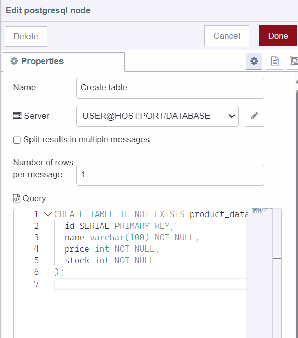
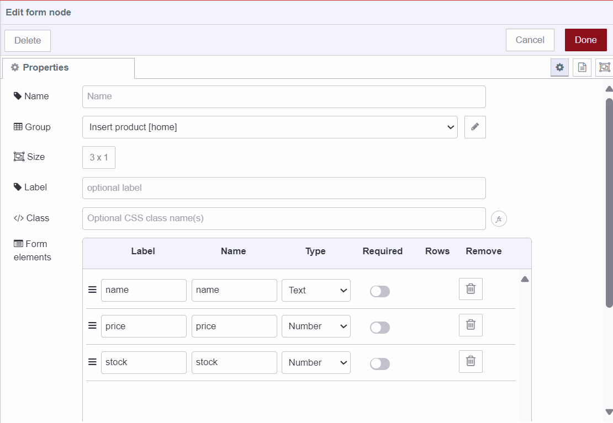
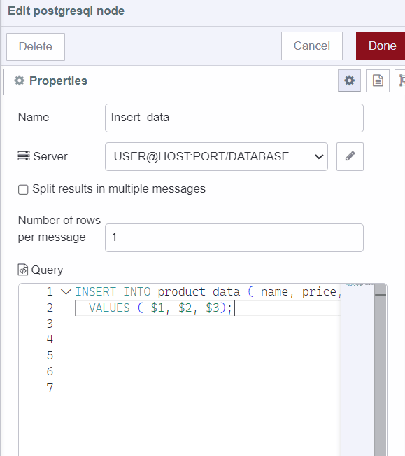
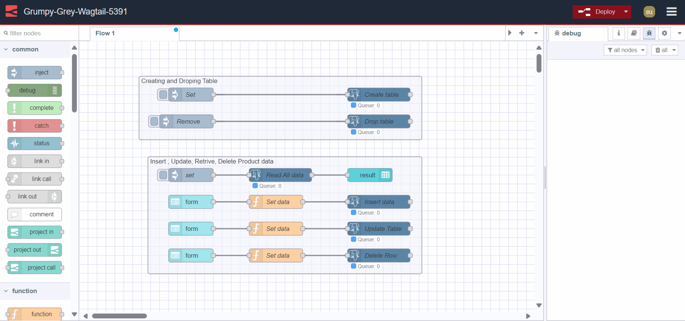

---
eleventyNavigation:
  key: PostgreSQL
  parent: Database
meta:
  title: Using PostgreSQL with Node-RED (2026 Updated)
  description: Learn how to seamlessly integrate PostgreSQL with Node-RED for efficient data management and application development.
  keywords: node-red, databases, integration, PostgreSQL, SQL database
image: /node-red/core-nodes/images/postgresql_with_node-red.png
---

# {{ meta.title }}

PostgreSQL is a highly reliable open-source relational database known for its extensive features. It supports diverse data types, robust SQL, and ACID compliance, allowing high-performance systems. Over the years, it has demonstrated reliability, security, and compatibility, which makes it a popular choice for businesses worldwide.

## Getting Started

The first thing we need to do to get things started is to install the PostgreSQL custom node and gain an understanding of PostgreSQL configuration details.

1. Install `node-red-contrib-postgresql` by the pallet manager. You can choose other nodes too, but we chose this node because it is part of the [certified node catalog by FlowFuse](/certified-nodes/) which assures that the node is robust, secure, and developed with high quality.
2. Before connecting to your PostgreSQL database, ensure you have the following information ready and environment variables set up as discussed below in the `Adding environment variable` section:

- Host: IP address or hostname of your PostgreSQL server.
- Port: By default, PostgreSQL uses port 5432. Ensure this matches your PostgreSQL server configuration.
- Database: The name of the PostgreSQL database you want to connect to.
- User: Username with the necessary privileges to access the specified database.
- Password: Corresponding password for the username.

3. Drag the PostgreSQL node onto the canvas, click on that node, and click on the edit icon next to the server input field to configure it.


## Adding environment variables 

Environment variables are used to securely manage sensitive configuration details, such as API keys, passwords, and secret keys, within your applications. This prevents exposing such information directly in the code or configuration files, for more details refer to [Using Environment Variables in Node-RED](/blog/2023/01/environment-variables-in-node-red/).

1. Navigate to the instance's setting and then go to the environment section.
2. Click on the `add variable` button and add variables for each of the configuration data that we discussed in the above section.
3. Click on the save button and restart the instance by clicking on the top right `Action` button and selecting the restart option.


## Creating Table

In this section, we will create a table in our database to store product data.

1. Drag an Inject node onto canvas, and keep it unchanged.
2. Click on the PostgreSQL node we added previously and paste the following SQL command into the query input field. (I have added comments for your understanding of SQL commands)

```sql
-- Create a table named product_data if it does not already exist
CREATE TABLE IF NOT EXISTS product_data (
  -- Define a column named id as a SERIAL type, which serves as the primary key
 id SERIAL PRIMARY KEY, -- SERIAL data type automatically generates unique integer values for each row inserted into the table
  
  -- Define a column named name to store product names as variable-length character strings with a maximum length of 100 characters, ensuring it's not null
  name varchar(100) NOT NULL,
  
  -- Define a column named price to store product prices, ensuring it's not null
 price int NOT NULL,
  
  -- Define a column named stock to store product stock levels, ensuring it's not null
 stock int NOT NULL
);
```


3. Connect the inject node’s output to the PostgreSQL node’s input.

## Installing Dashboard 2.0 

Install Dashboard 2.0. Follow these [instructions](/blog/2024/03/dashboard-getting-started/) to get up and running.

## Inserting Product Data into the Database
In this section, we will add a Form interface that will enable us to obtain product data that we need to insert into the database. Moreover, we will use the PostgreSQL node to interact with the database.


1. Drag a `ui-form` widget onto the canvas and select the created `ui-group`.
2. Add an element for all required input data in the form widget and give it a name, label, and select type, I have selected 'number' as a type for 'price' and 'stock', and 'text' for 'name', but feel free to adjust according to your preference and data requirements.
3. Drag the function node onto Canvas and paste the following script.

```javascript
// Destructure the properties from msg.payload (obtained data by using form)
const {name, price, stock } = msg.payload;
// Create an array containing name, price, and stock
// The order of the array items in msg.params will correspond to the placeholders in the SQL query
// For example, $1 will be replaced by the value of name, $2 will be replaced by the value of the price, and so on
msg.params = [name, price, stock];
return msg;
```

4. Drag a PostgreSQL node onto the Canvas and click on that node and paste the following SQL command into the query input field

```sql
-- This is an SQL INSERT statement used to add data into the product_data table.
INSERT INTO product_data ( name, price, stock)
-- This line specifies the columns into which data will be inserted. The columns are name, price, and stock.
-- It's important to match the columns in the same order as the values in the next line.
VALUES ($1, $2, $3);
```


5. Connect ui-form’s output to the function node’s input and the function node's output to the PostgreSQL node’s input.

## Displaying product data on Dashboard 2.0
In this section, we will retrieve all data from our database table and display it on Dashboard 2.0 using the ui-table widget.

1. Drag an Inject node onto the canvas.
2. Drag a PostgreSQL node onto the Canvas and click on that node and paste the following SQL command into the query input field. 
3. Drag a ui-table widget onto the canvas and create a new ui-group for it.
4. Connect the inject node's output to the PostgreSQL node’s input and the PostgreSQL node's output to the ui-table's input.
```sql
-- Retrieve all data from the product_data table
SELECT * FROM product_data;
```


## Updating product data to the Database


In this section, we will add a form interface to collect the product ID and the new stock value for the update process. Feel free to select other data fields that you need to update. To achieve this, we will add a form interface using Dashboard 2.0. Additionally, we will interact with the database using the same PostgreSQL node that we have used so far in this guide.

1. Drag a ui-form widget onto the canvas and create a new ui-group for it.
2. Add elements for product id and stock in the form widget and give it a name, label, and select type.
3. Drag a function node onto Canvas and paste the following script.

```javascript 
// Destructure the properties from msg.payload
const { id, stock } = msg.payload;
// Create an array containing id and stock
// The order of the array items in msg.params will correspond to the placeholders in the SQL query
// For example, $1 will be replaced by the value of id, $2 will be replaced by the value of stock
msg.params = [id, stock];
return msg;
```
4. Drag a PostgreSQL node on canvas, click on that node and paste the following SQL command into the query input field.

```sql 
-- UPDATE statement to modify data in the product_data table

UPDATE product_data 
-- Specifies the table to be updated (product_data)

SET 
 stock = $2
-- Sets the value of the "stock" column to the value represented by the parameter $2.
-- The value to be set is typically provided externally, In our context, we get this parameter by "msg.params"

WHERE id = $1;
-- Specifies the condition that must be met for the update to occur.
-- In this case, it updates rows where the "id" column matches the value represented by the parameter $1.
```


5. Connect ui-form’s output to the function node’s input and the function node's output to the PostgreSQL node’s input.

## Deleting product data from the database


In this section, we'll cover how to delete product data from the database. We will use Dashboard 2.0's form interface to collect essential information like the product id and name. While the product id alone is sufficient to delete a product from the database, we include the product name as an additional precaution to prevent accidental deletion of product data.

1. Drag a ui-form widget onto the canvas and create a new ui-group for it.
2. Add elements for product id and name in the form widget and give it a name, label, and select type.
3. Drag a function node onto Canvas and paste the following script.

```javascript 
// Destructure the properties from msg.payload
const { id, name } = msg.payload;
// Create an array containing id and name
// The order of the array items in msg.params will correspond to the placeholders in the SQL query
// For example, $1 will be replaced by the value of id, $2 will be replaced by the value of name
msg.params = [id, name ];
return msg;
```
4. Drag a PostgreSQL node on canvas, click on that node, and paste the following SQL command into the query input field.

```sql 
-- Deletes rows from the "product_data" table where both "id" and "name" match the given parameters
DELETE FROM product_data 
-- Specifies the conditions for deletion
WHERE id = $1 AND name = $2;
```


5. Connect ui-form’s output to the function node’s input and the function node's output to the PostgreSQL node’s input.

## Dropping Table
This section will explain how to drop ( delete ) tables from the database.

1. Drag an Inject node onto the canvas.
2. Drag a PostgreSQL node onto canvas and paste the following SQL command into the query input field.

```sql 
-- Drop the table 'product_data' if it exists to avoid conflicts.
DROP TABLE IF EXISTS product_data;

-- Note: 'IF EXISTS' is used to check if the table exists in the database before attempting to drop it.
```


## Deploying Flow


Our Inventory Management System is now complete and ready for deployment. To initiate the deployment process, locate the red 'Deploy' button positioned in the top right corner. To create, drop tables, and retrieve table data, click on the 'Inject Node' button. For product data insertion, updates, and deletions, navigate to `https://<your-instance-name>.flowfuse.cloud/dashboard`.


### Best practices to follow

1. Connection Pooling: Implementing connection pooling can significantly enhance the performance of PostgreSQL. It allows multiple clients to reuse database connections, reducing the overhead of establishing new connections for each query. By configuring PostgreSQL to use connection pooling, you can optimize resource usage and improve overall system performance. In this guide, we have configured our PostgreSQL to use connection pooling via the Postgres Config node/tab.

2. Environment Variables: The [Twelve Factors](https://12factor.net/) emphasize the importance of separating configuration details from the code (flow) to ensure better security. Storing database credentials within the codebase can pose a security risk. Instead, expose the configuration details, as environment variables. This ensures that sensitive information remains secure and can be managed separately from the codebase.

3. Credential Rotation: Regularly rotating database credentials is essential for maintaining robust security practices. This includes changing login information for managed databases and other database access points. Implementing a scheduled credential rotation process, such as quarterly 'rotation days,' streamlines the task and reduces the risk of unauthorized access.
