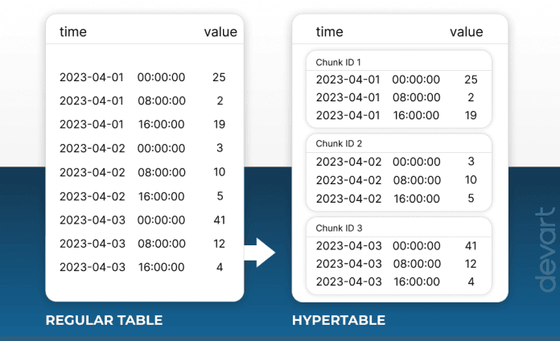
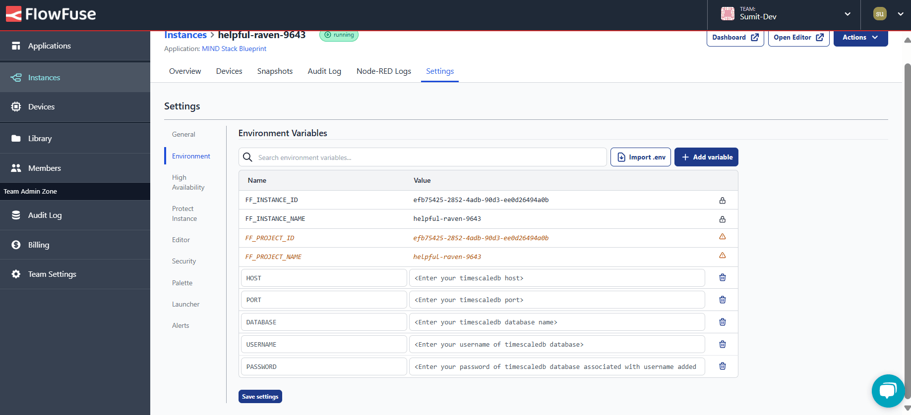
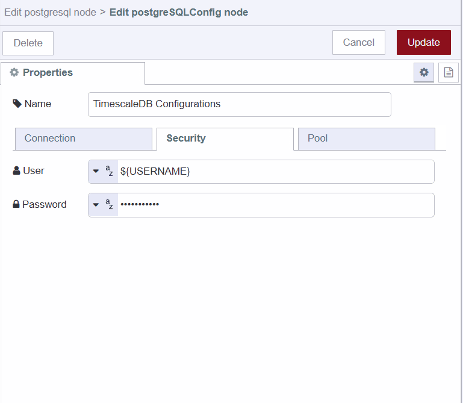
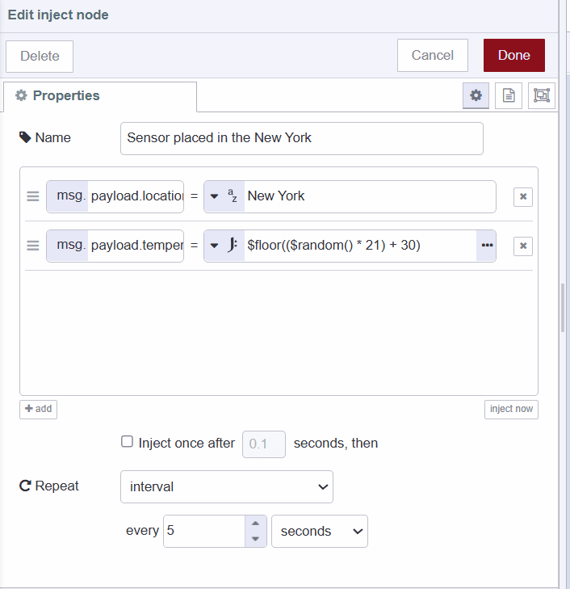
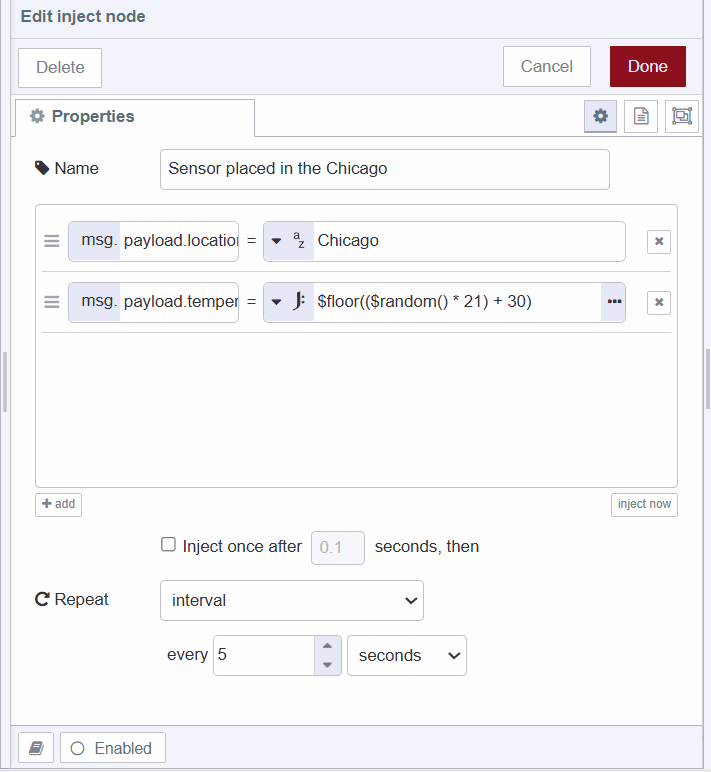

---
eleventyNavigation:
  key: TimescaleDB
  parent: Database
meta:
  title: Using TimescaleDB with Node-RED
  description: Learn how to integrate TimescaleDB with Node-RED for storing and managing time-series data efficiently.
  keywords: node-red timescaledb, nodered postgresql, nodered time-series database
image: /node-red/database/images/timescaledb-with-node-red.png
---

# {{ meta.title }}

In the context of IoT and IIoT applications, time series databases are essential for storing data based on timestamps. While InfluxDB has been a popular choice for a long time, another time series database, TimescaleDB, is gaining popularity. This guide will cover how to use TimescaleDB with Node-RED, how TimescaleDB works, and the queries needed when building IoT applications.

If you prefer video tutorials, a few months ago, Grey, OT Data & Community Strategist at Flowfuse, conducted a [live session on TimescaleDB](https://www.youtube.com/watch?v=MD1U6LDqJ1c).


## What is TimeScaleDB

TimescaleDB is a time-series database built on PostgreSQL for efficiently handling large volumes of event data. This means that a TimescaleDB runs within an overall PostgreSQL instance which enables it to take advantage of many of the attributes of PostgreSQL such as reliability, security, and connectivity to a wide range of third-party tools. 

{data-zoomable}

Unlike PostgreSQL, TimescaleDB uses a distributed hypertable architecture that automatically partitions your data by time. You interact with hypertables in the same way as regular PostgreSQL tables, but with extra features that make managing your time-series data much easier. Each hypertable consists of multiple PostgreSQL tables (chunks). Each chunk is assigned a range of time and only contains data from that range.

## Setting up TimescaleDB environment

### Installing TimescaleDB locally

If you want to install TimescaleDB locally, you can follow their official documentation on [Install TimescaleDB](https://docs.timescale.com/self-hosted/latest/install/).

### Using TimescaleDB cloud option

TimescaleDB also offers a cloud option that simplifies deployment and management. Here’s how to set it up:

1. Go to the [Timescale Cloud](https://console.cloud.timescale.com/signup) website and sign up for an account.
2. Once logged in, create a new TimescaleDB service by following the on-screen instructions.
3. Choose your service settings, such as region, CPU, memory, and storage requirements, based on your application's needs.
4. After creating the service, you’ll see the connection details. If you cannot see them, go to the "Services" option in the sidebar, click on the created service, and then in the "Overview" tab at the bottom, you will see your configuration details.

## Using TimescaleDB with Node-RED

In this section of the guide, we will explore integrating TimescaleDB with Node-RED. We'll cover creating and deleting Hypertables, and inserting, updating, and deleting data from these tables. Additionally, we'll delve into advanced queries for comprehensive data analysis. Throughout this guide, we'll use a temperature example to illustrate each operation.

### Installing PostgreSQL Custom Node

Since TimescaleDB is built on top of PostgreSQL, we can use the PostgreSQL node.

1. Click the Node-RED Settings (top-right).
2. Click "Manage Palette".
3. Search for `node-red-contrib-postgresql`.
4. Click "Install".

### Configuring PostgreSQL node with TimescaleDB configurations

Before proceeding, make sure you have added environment variables for your TimescaleDB configuration details. For more information, refer to [Using environment variables with Node-RED](/blog/2023/01/environment-variables-in-node-red/).

1. Drag a PostgreSQL node onto the canvas and double-click on it.
2. Click on the edit icon next to the Server input field to add configuration details in the PostgreSQL config node.
3. Enter the environment variables set for each of your configuration details in the corresponding input fields.

{data-zoomable}

{data-zoomable}

{data-zoomable}

### Creating Hypertables

To create a hypertable, start with creating a standard PostgreSQL table and convert it into a hypertable.

1. Insert the following SQL commands into the PostgreSQL node's query field.

```sql
-- Create a standard PostgreSQL table

CREATE TABLE sensor_data (
        time TIMESTAMPTZ NOT NULL,
        location STRING,
 temperature DOUBLE PRECISION
 );

-- Convert the table into a hypertable for efficient time-series data management
SELECT create_hypertable('sensor_data', 'time');
```
2. Drag an Inject node onto the canvas, which we will use to trigger the operation.
3. Connect the Inject node's output to the input of the PostgreSQL node.


[{"id":"d766709f13c8410b","type":"inject","z":"7748186d67ad0a58","name":"Create hypertable","props":[{"p":"payload"},{"p":"topic","vt":"str"}],"repeat":"","crontab":"","once":false,"onceDelay":0.1,"topic":"","payload":"","payloadType":"date","x":210,"y":140,"wires":[["a977cb646de2a30b"]]},{"id":"a977cb646de2a30b","type":"postgresql","z":"7748186d67ad0a58","name":"PostgreSQL","query":"CREATE TABLE sensor_data (\n    time TIMESTAMPTZ NOT NULL,\n    location TEXT,\n    temperature DOUBLE PRECISION\n);\n\nSELECT create_hypertable('sensor_data', 'time');\n","postgreSQLConfig":"ea1f8e3d9db95245","split":false,"rowsPerMsg":1,"outputs":1,"x":490,"y":140,"wires":[["c843732f2088f83e"]]},{"id":"c843732f2088f83e","type":"debug","z":"7748186d67ad0a58","name":"debug 1","active":true,"tosidebar":true,"console":false,"tostatus":false,"complete":"false","statusVal":"","statusType":"auto","x":740,"y":140,"wires":[]},{"id":"ea1f8e3d9db95245","type":"postgreSQLConfig","name":"TimescaleDB Configurations","host":"${HOST}","hostFieldType":"str","port":"${PORT}","portFieldType":"num","database":"${DATABASE}","databaseFieldType":"str","ssl":"false","sslFieldType":"bool","applicationName":"","applicationNameType":"str","max":"10","maxFieldType":"num","idle":"1000","idleFieldType":"num","connectionTimeout":"10000","connectionTimeoutFieldType":"num","user":"${USERNAME}","userFieldType":"str","password":"${PASSWORD}","passwordFieldType":"str"}]


### Inserting Data into the Table

The steps to insert data into a TimescaleDB Hypertable are similar to inserting data into a standard PostgreSQL table.

1. Drag the Inject nodes onto the canvas.
2. Set the `msg.payload.temperature` to the JSONata expression `$floor(($random() * 21) + 30)` which will generate random data for us,  and `msg.payload.location` to "New York" for the first Inject node, and do the same for the second Inject node but with a different location.

{data-zoomable}

{data-zoomable}

3. For both Inject nodes, set the repeat interval to 5 seconds, which inserts data every 5 seconds.
4. Drag a PostgreSQL node onto the canvas and insert the following SQL command into the query field:

```sql
-- Insert a new row into the sensor_data table
INSERT INTO sensor_data (time, location, temperature)
VALUES (
    now(), -- Current timestamp
    '{{msg.payload.location}}', -- Location of the sensor reading
    '{{msg.payload.temperature}}' -- Temperature recorded by the sensor
);

```

5. Drag a Debug node onto the canvas.
6. Connect the output of the Inject nodes to the input of the PostgreSQL node and the output of PostgreSQL to the input of the Debug node.


[{"id":"c42dfdaa44a02eda","type":"postgresql","z":"7748186d67ad0a58","name":"","query":"INSERT INTO sensor_data (time, location, temperature)\nVALUES (now(), '{{msg.payload.location}}', '{{msg.payload.temperature}}');\n","postgreSQLConfig":"ea1f8e3d9db95245","split":false,"rowsPerMsg":1,"outputs":1,"x":490,"y":540,"wires":[["f88822fc9fdf90dc"]]},{"id":"f88822fc9fdf90dc","type":"debug","z":"7748186d67ad0a58","name":"debug 2","active":true,"tosidebar":true,"console":false,"tostatus":false,"complete":"false","statusVal":"","statusType":"auto","x":700,"y":540,"wires":[]},{"id":"b3b5fc6ad830145e","type":"inject","z":"7748186d67ad0a58","name":"Sensor placed in the New York","props":[{"p":"payload.location","v":"New York","vt":"str"},{"p":"payload.temperature","v":"$floor(($random() * 21) + 30)","vt":"jsonata"}],"repeat":"5","crontab":"","once":false,"onceDelay":0.1,"topic":"","x":230,"y":580,"wires":[["c42dfdaa44a02eda"]]},{"id":"2d07d8d73ed43f37","type":"inject","z":"7748186d67ad0a58","name":"Sensor placed in the Chicago","props":[{"p":"payload.location","v":"Chicago","vt":"str"},{"p":"payload.temperature","v":"$floor(($random() * 21) + 30)","vt":"jsonata"}],"repeat":"5","crontab":"","once":false,"onceDelay":0.1,"topic":"","x":230,"y":520,"wires":[["c42dfdaa44a02eda"]]},{"id":"ea1f8e3d9db95245","type":"postgreSQLConfig","name":"TimescaleDB Configurations","host":"${HOST}","hostFieldType":"str","port":"${PORT}","portFieldType":"num","database":"${DATABASE}","databaseFieldType":"str","ssl":"false","sslFieldType":"bool","applicationName":"","applicationNameType":"str","max":"10","maxFieldType":"num","idle":"1000","idleFieldType":"num","connectionTimeout":"10000","connectionTimeoutFieldType":"num","user":"${USERNAME}","userFieldType":"str","password":"${PASSWORD}","passwordFieldType":"str"}]


### Updating data to the table

When you need to update multiple rows of a table based on specific conditions, you can do so as follows. In the following flow, we are updating the temperature of rows where the time falls within the specified time range to increase by 0.1 degree:

1. Drag an Inject node onto the canvas.
2. Drag a PostgreSQL node onto the canvas and insert the following SQL command into the query field:

```sql
-- Update temperature data in the sensor_data table
UPDATE sensor_data
  SET temperature = temperature + 0.1
  WHERE time >= '2024-05-29 16:40' -- Starting timestamp for the update
    AND time < '20124-05-29 16:50'; -- Ending timestamp for the update
```
3. Drag a Debug node onto the canvas.
4. Connect the output of the Inject node to the input of the PostgreSQL node and the output of the PostgreSQL node to the input of the Debug node.


[{"id":"702b9169ff00396c","type":"inject","z":"7748186d67ad0a58","name":"Updating data based on condition","props":[{"p":"payload"},{"p":"topic","vt":"str"}],"repeat":"","crontab":"","once":false,"onceDelay":0.1,"topic":"","payload":"","payloadType":"date","x":210,"y":1120,"wires":[["81dcb2d851bb9316"]]},{"id":"81dcb2d851bb9316","type":"postgresql","z":"7748186d67ad0a58","name":"","query":"-- Update temperature data in the sensor_data table\nUPDATE sensor_data\n  SET temperature = temperature + 0.1\n  WHERE time >= '2024-05-29T11:50:25.859Z' -- Starting timestamp for the update\n    AND time < '2024-05-29T12:17:43.305Z'; -- Ending timestamp for the update\n","postgreSQLConfig":"ea1f8e3d9db95245","split":false,"rowsPerMsg":1,"outputs":1,"x":530,"y":1120,"wires":[["29e28595a9f5a0df"]]},{"id":"29e28595a9f5a0df","type":"debug","z":"7748186d67ad0a58","name":"debug 14","active":true,"tosidebar":true,"console":false,"tostatus":false,"complete":"false","statusVal":"","statusType":"auto","x":760,"y":1120,"wires":[]},{"id":"ea1f8e3d9db95245","type":"postgreSQLConfig","name":"TimescaleDB Configurations","host":"${HOST}","hostFieldType":"str","port":"${PORT}","portFieldType":"num","database":"${DATABASE}","databaseFieldType":"str","ssl":"false","sslFieldType":"bool","applicationName":"","applicationNameType":"str","max":"10","maxFieldType":"num","idle":"1000","idleFieldType":"num","connectionTimeout":"10000","connectionTimeoutFieldType":"num","user":"${USERNAME}","userFieldType":"str","password":"${PASSWORD}","passwordFieldType":"str"}]


### Deleting data to the table

1. Drag an Inject node onto the canvas.
2. Drag a PostgreSQL node onto the canvas and insert the following SQL into the query field:

```sql
-- Delete rows from the sensor_data table where the temperature is below 35 degrees Celsius or humidity is below 60%
DELETE FROM sensor_data
WHERE temperature < 35 -- Delete rows where the temperature is less than 35 degrees Celsius
```
3. Drag a Debug node onto the canvas.
4. Connect the output of the Inject node to the input of the PostgreSQL node and the output of the PostgreSQL node to the input of the Debug node.


[{"id":"702b9169ff00396c","type":"inject","z":"7748186d67ad0a58","name":"Delete data based on condition","props":[{"p":"payload"},{"p":"topic","vt":"str"}],"repeat":"","crontab":"","once":false,"onceDelay":0.1,"topic":"","payload":"","payloadType":"date","x":210,"y":1120,"wires":[["81dcb2d851bb9316"]]},{"id":"81dcb2d851bb9316","type":"postgresql","z":"7748186d67ad0a58","name":"","query":"-- Delete rows from the sensor_data table where the temperature is below 35 degrees Celsius or humidity is below 60%\nDELETE FROM sensor_data\nWHERE temperature < 35 -- Delete rows where the temperature is less than 35 degrees Celsius","postgreSQLConfig":"ea1f8e3d9db95245","split":false,"rowsPerMsg":1,"outputs":1,"x":530,"y":1120,"wires":[["29e28595a9f5a0df"]]},{"id":"29e28595a9f5a0df","type":"debug","z":"7748186d67ad0a58","name":"debug 14","active":true,"tosidebar":true,"console":false,"tostatus":false,"complete":"false","statusVal":"","statusType":"auto","x":760,"y":1120,"wires":[]},{"id":"ea1f8e3d9db95245","type":"postgreSQLConfig","name":"TimescaleDB Configurations","host":"${HOST}","hostFieldType":"str","port":"${PORT}","portFieldType":"num","database":"${DATABASE}","databaseFieldType":"str","ssl":"false","sslFieldType":"bool","applicationName":"","applicationNameType":"str","max":"10","maxFieldType":"num","idle":"1000","idleFieldType":"num","connectionTimeout":"10000","connectionTimeoutFieldType":"num","user":"${USERNAME}","userFieldType":"str","password":"${PASSWORD}","passwordFieldType":"str"}]


### Retrieving all data from the table

1. Drag an Inject node onto the canvas.
2. Drag a PostgreSQL node onto the canvas and insert the following SQL into the query field:

```sql
-- Retrieve all rows from the sensor_data table
SELECT * FROM sensor_data;
```
3. Drag a Debug node onto the canvas.
4. Connect the output of the Inject node to the input of the PostgreSQL node and the output of the PostgreSQL node to the input of the Debug node.


[{"id":"d551e15f7013e970","type":"inject","z":"7748186d67ad0a58","name":"Retrieve all data","props":[{"p":"payload"},{"p":"topic","vt":"str"}],"repeat":"","crontab":"","once":false,"onceDelay":0.1,"topic":"","payload":"","payloadType":"date","x":180,"y":660,"wires":[["858063c8e7d90f50"]]},{"id":"858063c8e7d90f50","type":"postgresql","z":"7748186d67ad0a58","name":"","query":"SELECT * FROM sensor_data;","postgreSQLConfig":"ea1f8e3d9db95245","split":false,"rowsPerMsg":1,"outputs":1,"x":550,"y":660,"wires":[["79156835d5ad4c4d"]]},{"id":"79156835d5ad4c4d","type":"debug","z":"7748186d67ad0a58","name":"debug 9","active":true,"tosidebar":true,"console":false,"tostatus":false,"complete":"false","statusVal":"","statusType":"auto","x":780,"y":660,"wires":[]},{"id":"ea1f8e3d9db95245","type":"postgreSQLConfig","name":"TimescaleDB Configurations","host":"${HOST}","hostFieldType":"str","port":"${PORT}","portFieldType":"num","database":"${DATABASE}","databaseFieldType":"str","ssl":"false","sslFieldType":"bool","applicationName":"","applicationNameType":"str","max":"10","maxFieldType":"num","idle":"1000","idleFieldType":"num","connectionTimeout":"10000","connectionTimeoutFieldType":"num","user":"${USERNAME}","userFieldType":"str","password":"${PASSWORD}","passwordFieldType":"str"}]


### Retrieve Recent Data

In situations where you need to quickly access the most recent data, such as monitoring real-time sensor readings or analyzing recent transactions, you can follow these steps:

1. Drag an Inject node onto the canvas.
2. Drag a PostgreSQL node onto the canvas and insert the following SQL into the query field:

```sql
-- Retrieve the most recent 100 rows from the sensor_data table, ordered by timestamp in descending order
SELECT *
FROM sensor_data
ORDER BY time DESC -- Order the results by timestamp in descending order
LIMIT 100; -- Limit the results to 100 rows
```

3. Drag a Debug node onto the canvas.
4. Connect the output of the Inject node to the input of the PostgreSQL node and the output of the PostgreSQL node to the input of the Debug node.


[{"id":"9436c79e9d9e3593","type":"inject","z":"7748186d67ad0a58","name":"Retrieve last 100 data ordered by time","props":[{"p":"payload"},{"p":"topic","vt":"str"}],"repeat":"","crontab":"","once":false,"onceDelay":0.1,"topic":"","payload":"","payloadType":"date","x":250,"y":720,"wires":[["6d26117dd61d0ecc"]]},{"id":"6d26117dd61d0ecc","type":"postgresql","z":"7748186d67ad0a58","name":"","query":"SELECT * FROM sensor_data ORDER BY time DESC LIMIT 100;","postgreSQLConfig":"ea1f8e3d9db95245","split":false,"rowsPerMsg":1,"outputs":1,"x":550,"y":720,"wires":[["092a08307ae6d63c"]]},{"id":"092a08307ae6d63c","type":"debug","z":"7748186d67ad0a58","name":"debug 10","active":true,"tosidebar":true,"console":false,"tostatus":false,"complete":"false","statusVal":"","statusType":"auto","x":780,"y":720,"wires":[]},{"id":"ea1f8e3d9db95245","type":"postgreSQLConfig","name":"TimescaleDB Configurations","host":"${HOST}","hostFieldType":"str","port":"${PORT}","portFieldType":"num","database":"${DATABASE}","databaseFieldType":"str","ssl":"false","sslFieldType":"bool","applicationName":"","applicationNameType":"str","max":"10","maxFieldType":"num","idle":"1000","idleFieldType":"num","connectionTimeout":"10000","connectionTimeoutFieldType":"num","user":"${USERNAME}","userFieldType":"str","password":"${PASSWORD}","passwordFieldType":"str"}]


### Retrieve Data Based on Time Range

When you need to retrieve historical records within a specific time frame, follow these steps:

1. Drag an Inject node onto the canvas.
2. Drag a PostgreSQL node onto the canvas and insert the following SQL command into the query field:

```sql
-- Retrieve data from the sensor_data table where the timestamp is within the last 400 seconds
SELECT *
FROM sensor_data
WHERE time > NOW() - INTERVAL '400 SECONDS';
``` 

3. Drag a Debug node onto the canvas.
4. Connect the output of the inject node to the input of the PostgreSQL node, and connect the output of the PostgreSQL node to the input of the debug node.


[{"id":"60e111b1f6e09613","type":"inject","z":"7748186d67ad0a58","name":"Retrieve data based on time range","props":[{"p":"payload"},{"p":"topic","vt":"str"}],"repeat":"","crontab":"","once":false,"onceDelay":0.1,"topic":"","payload":"","payloadType":"date","x":240,"y":880,"wires":[["0b1ec338dbb164f9"]]},{"id":"0b1ec338dbb164f9","type":"postgresql","z":"7748186d67ad0a58","name":"","query":"-- Aggregate data into specific time buckets\nSELECT time_bucket('15 minutes', time) AS fifteen_min, -- Create time buckets of 15 minutes\n       location, -- Location of the sensor\n       MAX(temperature) AS max_temp -- Calculate the maximum temperature within each time bucket\nFROM sensor_data -- Select data from the conditions table\nWHERE time > NOW() - INTERVAL '3 hours' -- Filter data to include only the last 3 hours\nGROUP BY fifteen_min, location -- Group data by time buckets and location\nORDER BY fifteen_min DESC, max_temp DESC; -- Order the results by time bucket in descending order, and then by maximum temperature in descending order\n","postgreSQLConfig":"ea1f8e3d9db95245","split":false,"rowsPerMsg":1,"outputs":1,"x":550,"y":880,"wires":[["f6f6c4fa651ee351"]]},{"id":"f6f6c4fa651ee351","type":"debug","z":"7748186d67ad0a58","name":"debug 13","active":true,"tosidebar":true,"console":false,"tostatus":false,"complete":"false","statusVal":"","statusType":"auto","x":780,"y":880,"wires":[]},{"id":"ea1f8e3d9db95245","type":"postgreSQLConfig","name":"TimescaleDB Configurations","host":"${HOST}","hostFieldType":"str","port":"${PORT}","portFieldType":"num","database":"${DATABASE}","databaseFieldType":"str","ssl":"false","sslFieldType":"bool","applicationName":"","applicationNameType":"str","max":"10","maxFieldType":"num","idle":"1000","idleFieldType":"num","connectionTimeout":"10000","connectionTimeoutFieldType":"num","user":"${USERNAME}","userFieldType":"str","password":"${PASSWORD}","passwordFieldType":"str"}]


### Aggregating data into specific time bucket

Aggregating data involves combining multiple data points into summary statistics, usually over a specified time period or category. In the following flow, we aggregate sensor data from the last three hours into 15-minute intervals, computing summary statistics such as the maximum temperature per interval for each location.

1. Drag an inject node onto the canvas.
2. Drag a PostgreSQL node onto the canvas and insert the following SQL query into the query field:

```sql
-- Aggregate data into specific time buckets
SELECT time_bucket('15 minutes', time) AS fifteen_min, -- Create time buckets of 15 minutes
       location, -- Location of the sensor
       *, -- Select all columns
       MAX(temperature) AS max_temp -- Calculate the maximum temperature within each time bucket
FROM conditions -- Select data from the conditions table
WHERE time > NOW() - INTERVAL '3 hours' -- Filter data to include only the last 3 hours
GROUP BY fifteen_min, location -- Group data by time buckets and location
ORDER BY fifteen_min DESC, max_temp DESC; -- Order the results by time bucket in descending order, and then by maximum temperature in descending order
```
3. Drag the Debug node onto the canvas.
4. Connect the output of the inject node to the input of the PostgreSQL node, and connect the output of the PostgreSQL node to the input of the debug node.


[{"id":"60e111b1f6e09613","type":"inject","z":"7748186d67ad0a58","name":"Aggregating data into specific time bucket","props":[{"p":"payload"},{"p":"topic","vt":"str"}],"repeat":"","crontab":"","once":false,"onceDelay":0.1,"topic":"","payload":"","payloadType":"date","x":260,"y":880,"wires":[["0b1ec338dbb164f9"]]},{"id":"0b1ec338dbb164f9","type":"postgresql","z":"7748186d67ad0a58","name":"","query":"-- Aggregate data into specific time buckets\nSELECT time_bucket('15 minutes', time) AS fifteen_min, -- Create time buckets of 15 minutes\n       location, -- Location of the sensor\n       MAX(temperature) AS max_temp -- Calculate the maximum temperature within each time bucket\nFROM sensor_data -- Select data from the conditions table\nWHERE time > NOW() - INTERVAL '3 hours' -- Filter data to include only the last 3 hours\nGROUP BY fifteen_min, location -- Group data by time buckets and location\nORDER BY fifteen_min DESC, max_temp DESC; -- Order the results by time bucket in descending order, and then by maximum temperature in descending order\n","postgreSQLConfig":"ea1f8e3d9db95245","split":false,"rowsPerMsg":1,"outputs":1,"x":550,"y":880,"wires":[["f6f6c4fa651ee351"]]},{"id":"f6f6c4fa651ee351","type":"debug","z":"7748186d67ad0a58","name":"debug 13","active":true,"tosidebar":true,"console":false,"tostatus":false,"complete":"false","statusVal":"","statusType":"auto","x":780,"y":880,"wires":[]},{"id":"ea1f8e3d9db95245","type":"postgreSQLConfig","name":"TimescaleDB Configurations","host":"${HOST}","hostFieldType":"str","port":"${PORT}","portFieldType":"num","database":"${DATABASE}","databaseFieldType":"str","ssl":"false","sslFieldType":"bool","applicationName":"","applicationNameType":"str","max":"10","maxFieldType":"num","idle":"1000","idleFieldType":"num","connectionTimeout":"10000","connectionTimeoutFieldType":"num","user":"${USERNAME}","userFieldType":"str","password":"${PASSWORD}","passwordFieldType":"str"}]


### Dropping the table 

1. Drag an inject node onto the canvas.
2. Drag a PostgreSQL node onto the canvas and insert the following SQL query into the query field:

```sql
-- Drop the table if it exists
DROP TABLE IF EXISTS sensor_data;
```
3. Drag the Debug node onto the canvas.
4. Connect the output of the inject node to the input of the PostgreSQL node, and connect the output of the PostgreSQL node to the input of the debug node.


[{"id":"5275332fecd1c715","type":"inject","z":"7748186d67ad0a58","name":"Drop table","props":[{"p":"payload"},{"p":"topic","vt":"str"}],"repeat":"","crontab":"","once":false,"onceDelay":0.1,"topic":"","payload":"","payloadType":"date","x":160,"y":960,"wires":[["382c26de90712487"]]},{"id":"382c26de90712487","type":"postgresql","z":"7748186d67ad0a58","name":"","query":"DROP TABLE IF EXISTS sensor_data;","postgreSQLConfig":"ea1f8e3d9db95245","split":false,"rowsPerMsg":1,"outputs":1,"x":450,"y":960,"wires":[["d7eb0c9020c968c5"]]},{"id":"d7eb0c9020c968c5","type":"debug","z":"7748186d67ad0a58","name":"debug 12","active":true,"tosidebar":true,"console":false,"tostatus":false,"complete":"false","statusVal":"","statusType":"auto","x":720,"y":960,"wires":[]},{"id":"ea1f8e3d9db95245","type":"postgreSQLConfig","name":"TimescaleDB Configurations","host":"${HOST}","hostFieldType":"str","port":"${PORT}","portFieldType":"num","database":"${DATABASE}","databaseFieldType":"str","ssl":"false","sslFieldType":"bool","applicationName":"","applicationNameType":"str","max":"10","maxFieldType":"num","idle":"1000","idleFieldType":"num","connectionTimeout":"10000","connectionTimeoutFieldType":"num","user":"${USERNAME}","userFieldType":"str","password":"${PASSWORD}","passwordFieldType":"str"}]


## Deploying the Flow

1. To test the imported flows, you need to deploy them. To do that, click on the deploy button located in the top right corner.

After deploying the flow, you can test each operation such as creating, deleting, updating, and other queries by clicking on the inject button. Upon successful operation, you will be able to see the results in the debug panel of the sidebar. If you want to learn any additional information about PostgreSQL, you can refer to the [Using PostgreSQL with Node-RED](/node-red/database/postgresql/) where you will also find the section which shows the messages received after a successful operation by the PostgresWQL node.

<div style="border: 2px solid #7fb7df; padding: 20px; border-radius: 10px; margin-top: 40px; background-color: #f5faff;">

### Try FlowFuse's Built-In Database Service

[FlowFuse now includes a fully integrated database service that makes connecting and querying your data effortless](/blog/2025/08/getting-started-with-flowfuse-tables/). With the FlowFuse Query Node, you do not need to configure the connection manually—the node sets itself up automatically.

Even better, the [FlowFuse AI Assistant allows you to query your tables using natural language](/blog/2025/09/ai-assistant-flowfuse-tables/). Simply type your request, and it will generate the correct SQL for you based on your table.

Deploy, manage, scale, and secure your Node-RED applications with FlowFuse, and take full control of your industrial workflows and data.

[**Start with FlowFuse today**](https://app.flowfuse.com/) 

</div>