---
eleventyNavigation:
  key: OPC UA
  parent: Edge
meta:
  title: "OPC UA for FlowFuse - FlowFuse Certified Node"
  description: "Connect a FlowFuse instance to industrial OPC UA servers: read, write, monitor, call methods, browse, read history, work with files, or host your own OPC UA server. A FlowFuse Certified Node."
---

# {{meta.title}}

Connect a FlowFuse instance to industrial OPC UA servers. Read and write values, monitor changes in real time, call methods, browse the address space, read history, work with files, or host your own OPC UA server, all from within your flows.

This is a **FlowFuse Certified Node**. Unlike community nodes, which vary in quality and can go unmaintained without warning, FlowFuse vets Certified Nodes for quality, security, and support, and maintains them on an ongoing basis. [Read more about Certified Nodes](/blog/2025/07/certified-nodes-v2/).

## Table of contents

1. [Overview](#1.-overview)
2. [Get the certified node in FlowFuse](#2.-get-the-certified-node-in-flowfuse)
3. [The node set](#3.-the-node-set)
4. [NodeIds and how to address data](#4.-nodeids-and-how-to-address-data)
5. [Configure a connection](#5.-configure-a-connection)
6. [Read](#6.-read)
7. [Write](#7.-write)
8. [Extension Object](#8.-extension-object)
9. [Call](#9.-call)
10. [Monitor](#10.-monitor)
11. [Monitor Event](#11.-monitor-event)
12. [Browse](#12.-browse)
13. [Explore](#13.-explore)
14. [History Read](#14.-history-read)
15. [File Operation](#15.-file-operation)
16. [Hosting an OPC UA server](#16.-hosting-an-opc-ua-server)
17. [Network requirements](#17.-network-requirements)
18. [Troubleshooting](#18.-troubleshooting)

## 1. Overview

OPC UA (Unified Architecture) is the leading standard for industrial communication, supported by thousands of devices and systems. This certified node lets a FlowFuse instance act as an OPC UA client and, on self-hosted FlowFuse, as an OPC UA server.

Everything runs inside your FlowFuse instance. Connections, certificates, and credentials live alongside the rest of your flow configuration. Define a connection once and every OPC UA node in the instance shares it. Client and server nodes share a single certificate store, so a trust decision you make for one applies to the other.

### Capabilities

- Connect to one or many OPC UA servers, with optional security and authentication.
- Read single values, all attributes, arrays, or values mapped into a structured object.
- Write single values, batches, arrays, matrices, and complex extension-object structures.
- Monitor in real time through subscriptions, with deadband filtering and event/alarm monitoring.
- Call methods to drive device operations.
- Discover the address space through Browse (one level) and Explore (recursive).
- Access historical data — raw, modified, and aggregated.
- Read, write, and append files on servers that implement the OPC UA FileType interface.
- Host an OPC UA server from within a self-hosted FlowFuse instance using Function nodes.

### Use case

Most industrial equipment already speaks OPC UA, but the data usually stays inside the machine's own server: readable by the vendor's tools, invisible to dashboards, brokers, and databases. This certified node closes that gap. A FlowFuse instance connects to the equipment as an OPC UA client, so the values, alarms, and history locked inside each machine become ordinary flow data you can route, transform, and act on. On self-hosted FlowFuse it also works in the other direction, exposing flow data as an OPC UA server for SCADA systems and historians to consume.

#### Example: connecting a filling machine to the plant

A filling machine exposes `FillLevel`, `LineSpeed`, and an alarm hierarchy through its embedded OPC UA server. Today that data lives on the machine's own panel. With one shared connection, a Monitor node streams the process values into the plant's Unified Namespace over MQTT, with a deadband filter suppressing sensor jitter before it ever reaches the network. A Monitor Event node subscribed with `Severity >= 600` routes machine alarms to the maintenance team's chat channel. And when the recipe changes, a Write node, gated behind an operator confirmation on a dashboard, pushes the new fill setpoint back to the machine. One connection replaces a per-machine SCADA tag mapping exercise, and the same flow pattern repeats for every OPC UA machine on the floor.

#### Where this shows up in practice

Real deployments usually combine several of the nodes on a single shared connection (see [The node set](#3.-the-node-set) for what each one does):

- **Unified Namespace and broker integration**: subscribe to the variables that matter with [Monitor](#10.-monitor) and publish changes to MQTT, so every system in the plant consumes the same live equipment data instead of integrating with each machine separately.
- **Supervisory control**: fetch current values on demand with [Read](#6.-read), push setpoints and recipe parameters back with [Write](#7.-write), and invoke machine operations such as starting a batch or acknowledging an alarm with [Call](#9.-call). Writes change real-world state, so gate them behind validation or an operator confirmation step.
- **Alarm-driven maintenance**: subscribe to a server's alarms and events with [Monitor Event](#11.-monitor-event), filter by type and severity on the server side, and route what remains to notifications, dashboards, or logs, so the maintenance team hears about a fault from the machine, not from the operator.
- **Shift reports, trends, and audits**: pull raw or server-aggregated values over a time range with [History Read](#14.-history-read) to build end-of-shift reports, quality trends, and incident timelines from data the equipment already recorded.
- **Fast commissioning**: map a machine's entire address space with [Explore](#13.-explore) and feed the result straight into a Monitor node, turning hours of manual tag mapping into a single deploy.
- **Exposing flow data to SCADA and historians**: on self-hosted FlowFuse, [host an OPC UA server](#16.-hosting-an-opc-ua-server) so external OPC UA clients, including another FlowFuse instance, can read the data your flows produce. This is not available on FlowFuse Cloud.

## 2. Get the Certified Node in FlowFuse

FlowFuse delivers Certified Nodes to your instances as a managed catalogue. The OPC UA package is part of the FlowFuse Edge Certified Nodes catalogue, which is part of the **FlowFuse Edge** offering. [contact us](/contact-us/) to enable it for your team

### Installation steps

1. Open your instance in the FlowFuse editor.
2. Click the menu icon (☰) in the top-right corner.
3. Select **Manage palette**.
4. Go to the **Install** tab.
5. Switch to the **FlowFuse Edge Certified Nodes** category.
6. Search for `@flowfuse-certified-nodes/opcua`.
7. Click **Install**.

The OPC UA nodes then appear in your palette, ready to drag onto the canvas.

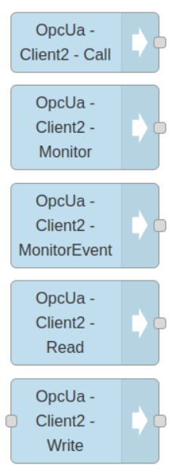{data-zoomable}


Newly installed nodes are picked up automatically — no restart needed. Restart is only required when you update a node that's already installed: restart any remote instance or hosted instance running the previous version.



Keep endpoint URLs, usernames, and passwords in FlowFuse Environment Variables (your instance's **Settings → Environment**) rather than hard-coding them in nodes. This keeps credentials out of your flow JSON and lets you promote the same flow across instances.


## 3. The Node Set

Each node performs one OPC UA operation and reuses the shared connection you configure once.

| Node | Purpose |
|---|---|
| OPC UA Client (config) | Defines the server endpoint, security, authentication, subscription parameters, and namespace aliases. Every other node references it. |
| Read | Fetch a value, all attributes, an array of values, or a structured object — on demand, triggered by an input message. |
| Write | Send single values, batches, arrays, matrices, or extension objects to writable variables. |
| Extension Object | Builds a correctly encoded ExtensionObject from a plain JavaScript object before a Write. |
| Call | Invoke a server method with input arguments and receive its output arguments. |
| Monitor | Subscribe to variable value changes and emit a message on each change, with optional deadband filtering. |
| Monitor Event | Subscribe to events and alarms, with server-side Where/Select filtering. |
| Browse | List the references (children) of a single node, one level. |
| Explore | Recursively traverse a subtree and return its structure as JSON. |
| History Read | Retrieve raw, modified, or aggregated historical data over a time range. |
| File Operation | Read, write, append, or size files on servers implementing the FileType interface. |


Properties of the input message take precedence over a node's own configuration. Configure a node statically, or drive it dynamically from upstream messages.



Each node reports its state in the editor with a coloured status dot — grey (not connected), blue (operation in progress), green (success), red (failure), and on some nodes (such as History Read) yellow (partial success or quality issues). Watch it alongside the debug sidebar when wiring up a flow.


## 4. NodeIds and How to Address Data

A NodeId is the unique identifier of a node in a server's address space. It has a namespace index, an identifier type, and an identifier value. The certified node accepts several formats:

| Format | Example |
|---|---|
| Numeric | `ns=2;i=1001` |
| String | `ns=2;s=TemperatureSetpoint` |
| GUID | `ns=2;g=12345678-1234-1234-1234-123456789abc` |
| Unified (namespace URI) | `nsu=http://opcfoundation.org/UA/ADI;i=1234` |
| Browse path | `/Objects/2:DeviceSet/3:MyDevice/3:Temperature` |
| Aliased browse path | `/Objects/di:DeviceSet/ns3:MyDevice/ns3:Temperature` |
| Verified browse path | `[/2:MyDevice/3:Temperature](ns=1;s=Temperature)` |

When you give a browse path, the node resolves it against the server's address space and caches the result, so there is only a small one-time cost on the first read or after a reconnect. The cache clears when the connection is re-established, in case the server's address space has changed. Use the flask button to verify a NodeId or browse path; use the `...` button to browse the live server. These buttons work only once the endpoint is configured and the flow is deployed.

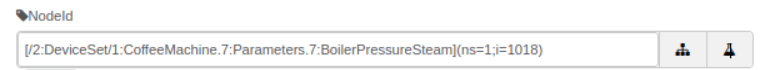{data-zoomable}

Clicking the browse (`...`) button opens the live address space, so you can pick a node visually instead of typing its NodeId:

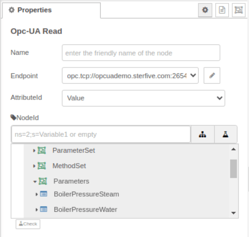{data-zoomable}


Namespace indexes are not guaranteed stable across servers. If you move a flow between servers, prefer browse paths or the namespace alias table over hard-coded numeric namespace indexes.


### Browse path syntax

Every browse path starts with a reference-type separator and then a sequence of browse names. The certified node follows the OPC Foundation Part 4 specification.

- **Namespace qualification** — every browse name needs a namespace-index prefix (`2:DeviceSet`) **except** names in the standard namespace 0, where the prefix is optional. Omitting a required prefix is the most common cause of a path that won't resolve.
- **Hierarchical references (`/`)** — follow any hierarchical reference: `/Objects/2:DeviceSet/3:MyDevice/3:Temperature`.
- **Aggregates references (`.`)** — follow an Aggregates (component/property) reference: `/Objects/Server.NamespaceArray`.
- **Specific reference types (`<RefType>`)** — follow one named reference type: `<HasComponent>2:Boiler/<HasProperty>2:Temperature`.
- **Reference-type modifiers** — `<#HasComponent>` follows only that exact type, not its subtypes; `<!HasChild>2:Parent` follows the reference in the inverse direction; a namespace-qualified reference type uses `<0:HasProperty>`.
- **Wildcards** — omit the final browse name to match all targets of the last step: `/Objects/2:Server/`.
- **Escaping special characters** — escape `/ . : & < > # !` inside a browse name with a leading `&`. A node literally named `Device.Name` becomes `Device&.Name`.

### Browse path errors

| Status code | Likely cause |
|---|---|
| BadBrowseNameInvalid | A missing required namespace prefix, an unescaped special character, or a case mismatch in a browse name. |
| BadNoMatch | The full path does not exist on the server, or a namespace index is wrong. |
| BadReferenceTypeIdInvalid | A reference type name in the path is unknown or not namespace-qualified. |


Browse paths are convenient and portable, but resolution has a cost. For variables you read or write frequently, resolve the path once and use the returned NodeId, or use the verified-browse-path format that caches the NodeId alongside the path.


## 5. Configure a Connection

Every OPC UA node depends on a connection defined by the **OPC UA Client** configuration node. Create it once and reference it through the endpoint field on any node.

1. Drag any OPC UA node (e.g. Read) onto the canvas and double-click to edit it. Every node carries an **Endpoint** field.

   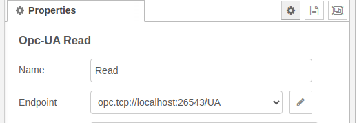{data-zoomable}

2. Open the endpoint dropdown and choose **add new opcua endpoint**, or click `[+]`.

   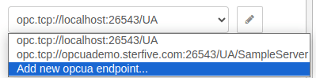{data-zoomable}

3. Enter the endpoint URL — for example `opc.tcp://192.168.1.10:4840` — and the security and authentication settings. Only the `opc.tcp://` protocol is supported; `http`/`https` endpoint URLs are not.
4. Click **Save**, then **Done**.
5. Click **Deploy**, then open the debug sidebar to confirm data flows.


The connection is shared. Changing its parameters affects every node that uses it, and you must redeploy the flow for connection changes to take effect.


### Connection editor areas

- **Check the connection** — confirm the endpoint is reachable before building on it. A successful test reports the connection as established:

  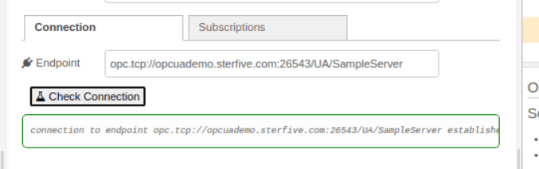{data-zoomable}

- **Secure connection** — choose a security policy and message security mode, then an authentication method.
- **Custom certificate** — supply your own certificate and private key when the server requires mutual trust.
- **Subscription parameters** — set publishing interval, lifetime, keep-alive, max notifications per publish, and priority once; every Monitor and Monitor Event node inherits them. The connection ships with three subscriptions — **Default** (1000 ms publishing interval), **Fast** (500 ms), and **Slow** (5000 ms) — and you can add more for items that need a different publishing rate. The default subscription cannot be deleted, as it also drives keep-alive.

  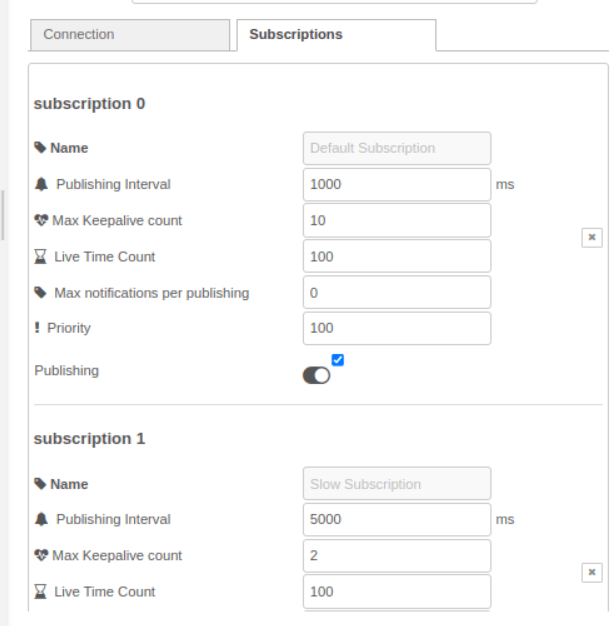{data-zoomable}
- **Namespace alias table** — map a stable short alias to a namespace URI so your NodeIds survive server reassignments. The **Extract** button reads the server's namespace array and fills the table for you; you can press it again after a server change without losing aliases you already set.

### Security policy and message mode

- **Security policy** — the cipher suite used to protect the channel. Common values are `None`, `Basic256`, and `Basic256Sha256` (the modern SHA-256 choice; prefer it over the older SHA-1-based `Basic256`).
- **Message security mode** — `None` sends messages in cleartext; `Sign` adds integrity (messages are signed but not encrypted); `SignAndEncrypt` adds both integrity and confidentiality. Match the policy and mode the server advertises.
- **Authentication** — connect anonymously, with a username and password, or with an X.509 certificate. If credentials are wrong or the account lacks rights, the check reports `BadUserAccessDenied`:

  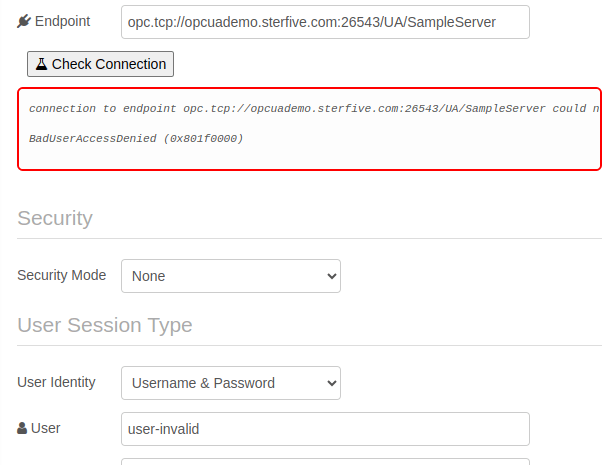{data-zoomable}


A username and password sent over message security mode `None` travel in cleartext. Combine credentials with at least `Sign` mode.


### Certificate trust

Secure connections rely on mutual certificate trust. By default the client side automatically accepts the server's certificate, so the step that usually needs action is the reverse: **the server must trust the client's certificate**. For a `Sign` or `SignAndEncrypt` connection, download the client certificate from the connection editor (in PEM or DER format) and add it to your OPC UA server's trusted list — otherwise the server refuses the connection.


Auto-accepting the server certificate is convenient but means the client does not verify the server's identity. To enforce server-certificate validation, set `rejectUnauthorized` to `true` in the connection node's global settings. The client then refuses any server whose certificate is not already in its trusted store, so you must add the server's certificate to the client side first.


Client and server nodes in your instance share one PKI store. On FlowFuse it lives under `<instance working directory>/opcua-for-flow-fuse/PKI`. For trust decisions to survive restarts and redeploys, that directory must be on persistent storage — see [Hosting an OPC UA server](#16.-hosting-an-opc-ua-server) for the storage details, which apply to client connections too.

If the client certificate is not yet trusted by the server, **Check Connection** reports the handshake failure and reminds you to add the client certificate to the server's trusted list:

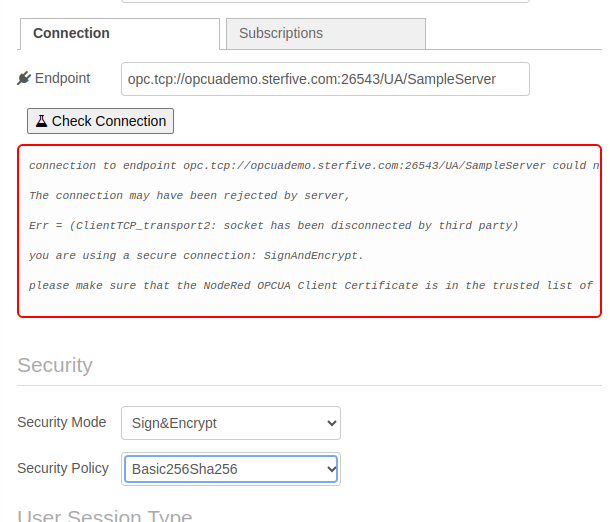{data-zoomable}

## 6. Read

The Read node fetches data on demand — it acts only when it receives an input message.

```
[Inject]  →  [Read]  →  [Debug]
```

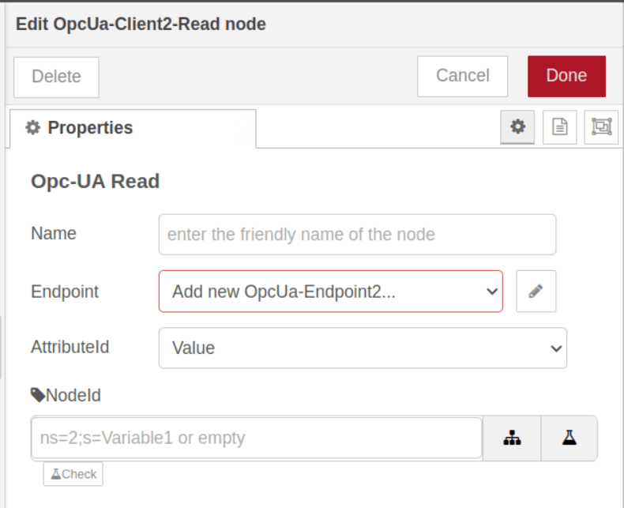{data-zoomable}

### NodeId source (priority order)

1. `msg.nodeId`
2. `msg.topic`
3. `msg.payload`
4. The node's configured NodeId


A default Inject node sets `msg.payload` to a timestamp, which silently overrides the node's configured NodeId (priority rule 3). To use the node's own configuration, ensure the Inject node does **not** set `msg.nodeId`, `msg.topic`, or `msg.payload`.


### Message properties

- `msg.attributeId` — which attribute to read: `Value` (default), `DataType`, `BrowseName`, `DisplayName`, or `All`.
- `msg.outputType` — `Value` returns the bare value on `msg.payload`; `DataValue` returns the full DataValue (value plus `statusCode`, `sourceTimestamp`, `serverTimestamp`, and picoseconds).

### Read modes

- **Single value** — one NodeId; the value comes back on `msg.payload`.
- **All attributes** — set `msg.attributeId` to `All` to get every attribute of one node. Reads a single NodeId only — use multiple Read nodes for multiple nodes. The payload then contains `nodeId`, `statusCode`, `nodeClass`, `browseName`, `displayName`, `description`, `writeMask`/`writeMaskAsString`, `userWriteMask`/`userWriteMaskAsString`, `value` (with timestamps), `dataType`/`dataTypeName`, `valueRank`, `arrayDimensions`, `accessLevel`/`accessLevelAsString`, `userAccessLevel`/`userAccessLevelAsString`, and `minimumSamplingInterval`.
- **Multiple values as an array** — inject an array of NodeIds via `msg.topics`; `msg.payload` comes back as a parallel value array, with a parallel `msg.dataType` array. Array reads are only available by injecting a message (the node's own config holds a single NodeId).
- **Multiple values as a structure** — inject a JSON object in `msg.topic` whose leaves are NodeIds; the node returns the same shape with values substituted. The Explore node can generate this structure.

Example — read a single value by injecting the NodeId:

```js
msg.topic = "ns=2;s=TemperatureSetpoint";
// msg.payload comes back as the current value
```

Example — read every attribute of one node:

```js
msg.nodeId = "ns=2;s=TemperatureSetpoint";
msg.attributeId = "All";
```

Reading `All` on a structured DataType node returns its full definition — for example the fields of an `RfidScanResult` extension object:

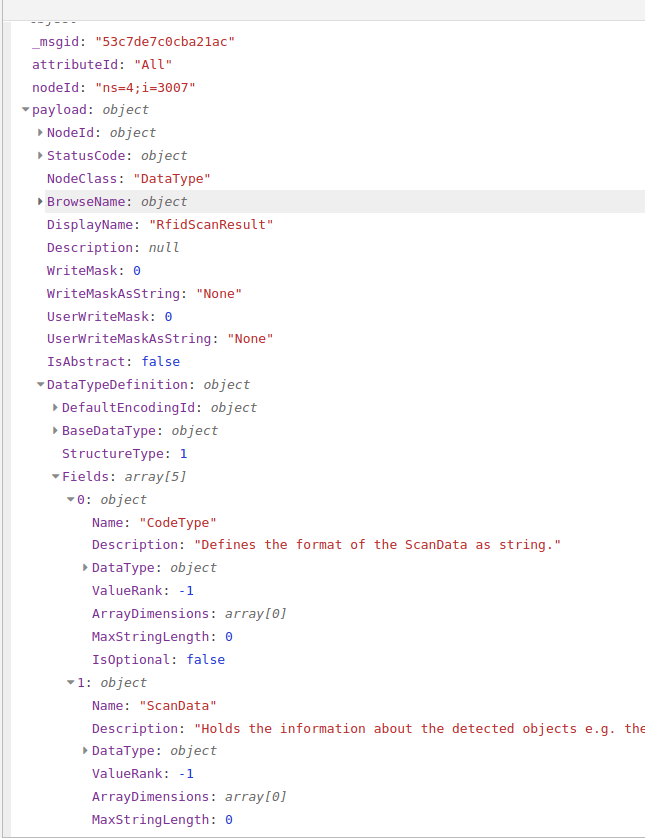{data-zoomable}

Example — read several values as an array:

```js
msg.topics = ["ns=1;s=Temperature", "ns=0;s=Pressure"];
msg.attributeId = "Value";
// msg.payload → [23.4, 1.2] ; msg.dataType → ["Double", "Double"]
```

## 7. Write

The Write node sends values to writable variables. It determines the target type automatically from the server in most cases.

### NodeId source (priority order)

1. `msg.nodeId`
2. `msg.topic`
3. Node configuration

### Write modes

- **Single value** — inject the value as `msg.payload` and the target as `msg.topic` (or `msg.nodeId`). A successful write reports `statusCode: "Good"`.
- **Explicit data type** — set `msg.dataType` when automatic conversion is insufficient. Valid values: `Boolean`, `SByte`, `Byte`, `Int16`, `UInt16`, `Int32`, `UInt32`, `Int64`, `UInt64`, `Float`, `Double`, `String`, `DateTime`, `ByteString`, `Guid`, `LocalizedText`, and `ExtensionObject`.
- **Variant** — send `{ dataType, value, arrayType }` for finer control, including arrays. Use `dimensions` for a matrix layout. `dataType` and `arrayType` are optional — the node can infer them from the server.
- **DataValue** — send a full DataValue (`statusCode`, `sourceTimestamp`/`serverTimestamp`, picoseconds, and a nested `value`) when you need to set timestamps or quality alongside the value.
- **Batch write** — send an array of write requests in `msg.payload`. Returns `msg.results` with one status per write. Keep batches under 50–100 items and always inspect individual `statusCode` values.
- **Extension objects** — use OPC UA JSON encoding. Both the 1.05 encoding (`UaTypeId` / `UaBody`) and legacy 1.04 (`TypeId` / `Body`) are supported.

Automatic conversion maps JavaScript values to OPC UA types: integers → Int32/UInt32, decimals → Float/Double, text → String, booleans → Boolean, and arrays → OPC UA arrays. Override it with `msg.dataType` only when needed.

Example — write a single value:

```js
msg.topic = "ns=2;s=TemperatureSetpoint";
msg.payload = 25.5;   // dataType inferred from the server
```

Example — batch write several variables in one message:

```js
msg.payload = [
    { nodeId: "ns=2;s=TemperatureSetpoint", value: 25.5 },
    { nodeId: "ns=2;s=PressureSetpoint",    value: 1013 },
    { nodeId: "ns=2;s=EnableFlag",          value: true }
];
// inspect msg.results — one statusCode per write
```

Example — write a 2×3 matrix using explicit dimensions:

```js
msg.payload = {
    dataType: "Double",
    value: [1, 2, 3, 4, 5, 6],
    arrayType: "Matrix",
    dimensions: [2, 3]   // 2 rows, 3 columns
};
```

Example — write an extension object using OPC UA JSON encoding, in both the 1.05 and legacy 1.04 forms:

```js
// 1.05 — UaTypeId is a NodeId string, UaBody holds the fields
msg.payload = {
    UaTypeId: "nsu=http://opcfoundation.org/UA/AutoID/;i=3007",
    UaBody: { CodeType: "Ean13", ScanData: { Epc: { PC: 12, UId: "XBASE64d=" } } }
};

// 1.04 (legacy) — TypeId is an object (IdType/Namespace/Id); binary fields use a Buffer
msg.payload = {
    TypeId: { IdType: 0, Namespace: 3, Id: 3007 },
    Body:   { CodeType: "Ean13", ScanData: { Epc: { PC: 12, UId: Buffer.from("Hello") } } }
};
```

### Output message

A Write returns the original `payload` and `nodeId` plus the result: `statusCode`, the `dataType` actually written, the `attributeId`, and a `message` field carrying an error description when the write fails.

### Common write status codes

| Status code | Meaning |
|---|---|
| Good | Write succeeded. |
| BadNodeIdUnknown | Variable not found. |
| BadTypeMismatch | Conversion failed — set the correct `dataType`. |
| BadUserAccessDenied | Account lacks write permission. |
| BadNotWritable | Variable is read-only. |
| BadConnectionClosed | Connection was lost during the write. |


Writes to production equipment change real-world state. Gate write nodes behind validation or an operator confirmation step before deploying to a live instance.


## 8. Extension Object

The Extension Object node builds a correctly encoded ExtensionObject from a plain JavaScript object, so you do not have to hand-encode it for a Write. It queries the server for the target node's DataType definition, constructs the encoded value, and passes it to Write.

```
[Inject payload]  →  [Extension Object]  →  [Write]  →  [Debug]
```

Inject a plain JavaScript object as `msg.payload`; the node encodes it for the server's DataType and emits the ExtensionObject ready for the Write node.

```js
msg.nodeId = "ns=2;s=DeviceConfiguration";
msg.payload = {
    setpoint: 72.0,
    mode: "Auto",
    enabled: true
};
```

The node also accepts an array of objects and encodes it as an array of ExtensionObjects, detecting the array type from the server's definition.

## 9. Call

The Call node invokes a server method — a server-side function such as start a batch, reset a counter, or acknowledge an alarm — that takes input arguments and returns output arguments.

### Configuration

- **ObjectId** — the NodeId of the object that owns the method.
- **MethodId** — the NodeId of the method itself.
- **Check button** — validates the method and loads its input/output argument definitions. Use the Browse node first if you need to discover an object's methods.

Pass the method's arguments as a named-property object in `msg.payload`. Override the object and method dynamically with `msg.objectId` and `msg.methodId` (these take precedence over the node configuration). Arguments may themselves be arrays or ExtensionObjects. The result carries output arguments on `msg.payload`, plus a `statusCode` and the echoed `objectId` and `methodId`.

```js
msg.objectId = "ns=2;s=ProcessController";
msg.methodId = "ns=2;s=StartProcess";
msg.payload = {
    processId: "PROC_001",
    targetTemperature: 150.0
};
```

Example — pass an array argument and an ExtensionObject argument:

```js
msg.payload = {
    setpoints: [25.0, 30.0, 35.0],
    config: { UaTypeId: "ns=2;i=1001", UaBody: { mode: "Auto", limit: 80 } }
};
```

### Method status code categories

| Category | Examples | Retryable? |
|---|---|---|
| Success | Good | — |
| Parameter | BadInvalidArgument, BadArgumentsMissing, BadTypeMismatch, BadOutOfRange | No — fix inputs |
| Method availability | BadMethodInvalid, BadMethodNotCallable, BadNotExecutable | No |
| Security | BadUserAccessDenied, BadNoValidCertificate | No — fix access/certs |
| Communication | BadCommunicationError, BadTimeout, BadServerNotConnected | Yes — retry/back off |
| Server state | BadStateNotActive, BadShutdown | Sometimes |
| Resource | BadOutOfMemory, BadResourceUnavailable, BadTooManyOps | Yes — wait and retry |

## 10. Monitor

The Monitor node subscribes to variables and emits a message whenever a value changes — no polling. Use Monitor for live data; use Read for occasional on-demand checks.

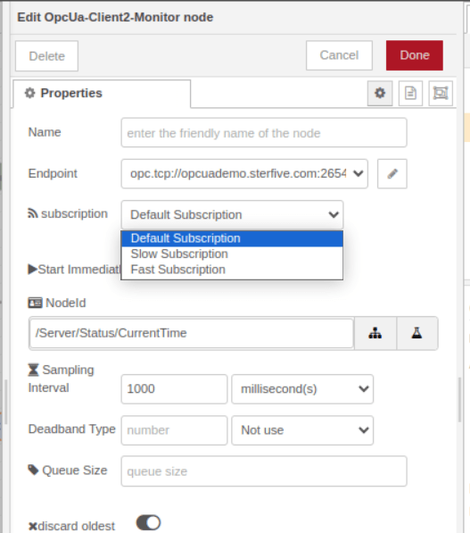{data-zoomable}

### Concepts

- **Subscription** — configured on the connection (publishing interval, lifetime, priority). One subscription efficiently carries many monitored items.
- **Monitored item** — each tracked variable, with its own sampling interval, queue size, and optional filter.
- **Notification behaviour** — a monitored item notifies only when the value actually changes (per the OPC UA spec), and once at monitoring start: the initial value is always reported.
- **Resilience** — the Monitor node reconnects automatically after a connection loss and re-establishes its subscription and monitored items, resuming without manual intervention.


Each notification carries `msg.sequenceNumber`. Watch it for gaps to detect dropped notifications — for example when a server-side queue overflows under a heavy change rate.


### NodeId source (priority order)

1. `msg.nodeId`
2. `msg.topic`
3. The node's configured NodeId

### Modes

- **Single variable** — configure a static NodeId, or inject one via `msg.nodeId` at runtime to change which variable is monitored without redeploying. To inject, clear the NodeId field and turn off **Start Immediately**.
- **Multiple variables (array)** — inject an array of NodeIds; the output `msg.payload` is the full array of current values in the same order, re-sent whenever any one of them changes. All items share the subscription's sampling interval.
- **Named JSON structure** — inject a JSON object whose leaf values are NodeIds (the shape Explore produces); notifications arrive in the same shape with current readings.
- **Entire subtree** — use Explore once (output type `NodeId`) to discover all variables under a branch, then feed that structure into Monitor to watch them all live.

### Message properties (override node config per message)

- `msg.outputType` — `Value` or `DataValue`.
- `msg.samplingInterval` — milliseconds, or `0` to use the variable's minimum sampling interval.
- `msg.deadbandType` — `None`, `Absolute`, or `Percent`.
- `msg.deadbandValue` — the deadband threshold.
- `msg.queueSize` — server-side queue depth (default 1000).
- `msg.discardOldest` — when the queue is full, drop the oldest (`true`) or the newest (`false`). Note the message property defaults to `false`, the opposite of the node's **Discard Oldest** field (which defaults to `true`): set it explicitly when injecting to avoid silently discarding the newest values.

### Quick start

1. Add a Monitor node and select the endpoint and a subscription.
2. Enter the NodeId (e.g. `ns=1;s=Temperature`).
3. Enable **Start Immediately** and deploy. The node emits a message on each value change.

Example — monitor several variables by injecting an array of NodeIds:

```js
msg.payload = [
    "ns=1;s=Temperature",
    "ns=1;s=Pressure",
    "ns=1;s=FlowRate"
];
```

All items in the array share one subscription, sampling interval, and queue — more efficient than one Monitor node per variable. As a rough guide: under 10 items is trivial, 10–100 is the efficient sweet spot, 100–1000 may need tuned subscription parameters, and beyond 1000 split the work across multiple Monitor nodes.

### Deadband filtering

[Deadband filtering](/blog/2026/04/stop-noisy-sensor-data-deadband-filter-flowfuse/#what-is-a-deadband-filter%3F) suppresses insignificant changes — essential for analog values that jitter. The server applies it, so it also reduces network traffic.

| Type | Behaviour |
|---|---|
| None | All changes reported (default). |
| Absolute | Report only when `abs(new − lastReported) > value`. |
| Percent | Report only when the change exceeds a percentage of the variable's EURange. Requires the variable to expose an EURange property. |


Deadband compares against the last reported value, not the last sampled value. The initial value is always reported. Use Absolute when a variable has no EURange — Percent silently does nothing without one.


## 11. Monitor Event

The Monitor Event node subscribes to events and alarms rather than value changes — alarm activations, state transitions, audit/security events, and system notifications.

### Filtering

- **Where Clause** — a server-side filter selecting which events to receive. Far more efficient than post-filtering in a Function node.
- **Select Clause** — comma-separated fields to retrieve (e.g. `EventId, Time, Message, Severity`). The `...` button opens a graphical selector that browses the event type hierarchy. Request only the fields you use — smaller messages, less processing. Common sets: basic `EventId,Time,Message,Severity`; alarms add `SourceName,ActiveState,AckedState`; audits add `ActionTimeStamp,ClientUserId`.

Match the subscription to the event rate: a slower publishing interval suits alarms and audits, a faster one suits high-frequency process events. For mixed workloads, use separate Monitor Event nodes on different subscriptions (see [Configure a connection](#5.-configure-a-connection)) so critical alarms don't queue behind noisy low-priority events.

### Where Clause syntax

Filter on the standard event fields (`EventId`, `EventType`, `SourceName`, `Time`, `Message`, `Severity`):

- Type filtering — `ofType('AlarmConditionType')`
- Numeric comparison — `Severity >= 700`
- String equality — `SourceName = "Reactor1"`
- Boolean fields — `ActiveState = true`
- Combine with `AND` / `OR` — `ofType('AlarmConditionType') AND Severity >= 700`

Common syntax mistakes: quote type names (`ofType('AlarmConditionType')`, not `ofType(AlarmConditionType)`); use `>=` not `=>`; and use `AND`/`OR`, not `&&`/`||`. Restrict the Where Clause to standard fields — type-specific fields belong in the Select Clause, not the filter.

### Event type hierarchy and severity

Events derive from `BaseEventType`, with `SystemEventType`, `AuditEventType`, and `AlarmConditionType` (and alarm subtypes such as `LimitAlarmType` and `DiscreteAlarmType`) beneath it. The Select Clause fields available depend on the event type — alarms expose `ActiveState`, `AckedState`, `ConfirmedState`, and `Retain`; audit events expose `ActionTimeStamp`, `Status`, and related fields.

Severity runs from 1 (informational) to 1000 (critical). A rough scale: 1–200 low/informational, 201–400 minor, 401–600 noteworthy, 601–800 important warnings, 801–1000 critical. A common production filter is `Severity >= 600`. To capture all server events, monitor the Server object at `i=2253` with an empty Where Clause.

Example — monitor all server events:

```
NodeId:        i=2253
Where Clause:  (empty)
Select Clause: EventId,EventType,SourceName,Time,Message,Severity
```


If no events arrive, verify the server supports events (read the object's `EventNotifier` attribute — a non-zero value means it emits events), point the NodeId at an event-generating object (try `i=2253`), and clear the Where Clause. If too many arrive, tighten the Where Clause by type and severity, or point at specific equipment instead of the Server object.


## 12. Browse

The Browse node lists the references of one node — one level of the address space. Specify the node with `msg.nodeId` or `msg.topic`.

### Configuration options

- **NodeId** — the node whose references to list.
- **ReferenceTypeId** — which reference type to follow, chosen from the reference-type hierarchy (e.g. `HasComponent`).
- **IncludeSubType** — follow only the exact type (`false`) or also its subtypes (`true`).
- **BrowseDirection** — forward, inverse, or both.
- **Node Class Mask** — return only targets of selected node classes: Object, Variable, Method, ObjectType, VariableType, ReferenceType, DataType, View.
- **Result Mask** — which fields to return: ReferenceType, IsForward, NodeClass, BrowseName, DisplayName, TypeDefinition. The NodeId is always included regardless of the mask.

Any of these can be overridden per message (for example `msg.referenceTypeId`), so a single Browse node can serve different queries driven from upstream.

```js
msg.nodeId = "ns=0;i=85";   // the Objects folder
```

The node returns the node's direct children on `msg.payload` — each entry carries the fields selected in the Result Mask, for example:

```json
[
    { "nodeId": "ns=2;s=DeviceSet",  "browseName": "DeviceSet",  "nodeClass": "Object" },
    { "nodeId": "ns=2;s=Boiler",     "browseName": "Boiler",     "nodeClass": "Object" }
]
```

Browse is also how you discover a method's owning object and arguments before configuring a Call node: browse the object for `HasComponent` references of node class Method.

## 13. Explore

The Explore node recursively traverses a subtree and returns the whole structure as a JSON object — unlike Browse, which shows a single level.

### Features

- Recursive traversal of an entire subtree in one operation.
- Multiple output types for leaf variables (see below).
- Depth control, exclusion of empty nodes, and selection of which references to follow.
- Output that feeds directly into the Monitor node and the Read-as-structure mode.

Traversal stops at variable nodes: the explorer reads each variable (returning the selected output type) and does not recurse into a variable's own children. To inspect a variable's children, start an Explore directly on that variable node.

### Output types

The output type sets what each leaf variable returns:

| Output type | Returns | Typical use |
|---|---|---|
| Value | Current values | Display, analysis, dashboards |
| NodeId | Node identifiers | Wiring into Monitor / Read / Write |
| DataValue | Values with quality and timestamps | Quality checks, freshness validation |
| Variant | Value with its data-type information | Typed values without full quality/timestamp metadata |
| StatusCode | Quality only (Good/Bad/Uncertain) | Health checks, finding bad sensors |
| BrowsePath | Full browse paths with namespace indices | Documentation, technical reference |
| AliasedBrowsePath | Simplified dotted paths | Human-readable references, config files |
| NSUNodeId | NodeIds with namespace URIs | Cross-server / portable configurations |

### Scope controls

- **followOrganizes** — `true` follows `Organizes`, `HasProperty`, and `HasComponent` (complete equipment discovery); `false` follows only `HasProperty`/`HasComponent` (direct properties).
- **excludeEmpty** — set `msg.excludeEmpty = true` to drop branches that contain no variables, for cleaner output.
- **Depth** — Explore follows the full hierarchy under the start node (default maximum depth 10). Rather than a depth setting, control scope by choosing a more specific start NodeId: roughly 2–3 levels for one piece of equipment, 4–6 for a production line, 7–10 for a whole plant.


Starting Explore at the Objects folder (`ns=0;i=85`) or another root node traverses the entire server and can return a very large structure. Start from a specific NodeId (or `/Server/ServerStatus` if you are just getting your bearings) and expand scope deliberately.


Example — exploring `/Server/ServerStatus` with output type `NodeId` returns a nested object whose leaves are the NodeIds of each variable:

```json
{
    "StartTime":   "ns=0;i=2257",
    "CurrentTime": "ns=0;i=2258",
    "State":       "ns=0;i=2259",
    "BuildInfo": {
        "ProductName":     "ns=0;i=2263",
        "SoftwareVersion": "ns=0;i=2264"
    }
}
```

### Common pattern — explore to monitor

Explore a subtree once to discover all its variables, then feed that structure straight into a Monitor node — Monitor returns the same shape with each leaf replaced by its live value.

```
[Inject]  →  [Explore]  →  [Monitor]  →  [Debug]
```


Address spaces rarely change, so cache the Explore result (with a timestamp) and reuse it rather than re-exploring on every deploy. Re-explore periodically only if your server adds or removes variables at runtime.


## 14. History Read

The History Read node retrieves historical data from servers that store it — the basis for trends, shift reports, audits, and incident investigation.

### History types

- **Raw** — the raw historical values stored on the server.
- **Raw Modified** — raw values that have since been edited or corrected, with modification tracking.
- **Processed Details** — server-side aggregates over a processing interval (set the **Aggregate Type**).

### Key options

- **Start Time / End Time** — absolute (ISO 8601, e.g. `2024-11-20T08:00:00Z`, with optional timezone offset) or relative (`now`, `1 hour ago`, `30 minutes ago`, `7 days ago`).
- **Processing Interval** — the aggregation bucket for Processed Details: `30 seconds`, `5 minutes`, `1 hour`, `1 day`, `1 week`.
- **numValuesPerNode** (`msg.numValuesPerNode`) — cap on values returned per node (default 100).
- **returnBounds** (`msg.returnBounds`) — include the bounding values just outside the time range, for continuous trends.

The NodeId follows the usual priority (`msg.nodeId` → `msg.topic` → `msg.payload` → node config). Multiple variables can be read by injecting an array of NodeIds.

### Aggregate types (Processed Details)

`Average`, `Count`, `Delta`, `DeltaBounds`, `DurationBad`, `DurationGood`, `Interpolative`, `Maximum`, `Minimum`, `PercentBad`, `PercentGood`, `Range`, `StandardDeviationPopulation`, `StandardDeviationSample`, `Total`, `VariancePopulation`, `VarianceSample`, `WorstQuality`.

### Output types

- **Time+Value** — `{ value, sourceTimestamp }` per point.
- **Time+Variant** — adds the full Variant (`value: { dataType, value }`).
- **DataValue** — adds `statusCode` and `serverTimestamp`.
- **StatusCode** — quality only.
- **DataValueReversible** — DataValue with reversible encoding.

`msg.payload` is an array of points, and the node echoes the request (`nodeId`, `startTime`, `endTime`) alongside it. Always check each point's `statusCode` and filter out bad-quality points before charting or reporting. On failure the payload is an empty array carrying a top-level `statusCode` and a `message`; an empty array with a `Good` status simply means no data exists in the requested range — distinguish the two before treating it as an error.

```js
msg.startTime = "1 hour ago";   msg.endTime = "now";                          // last hour, raw
msg.startTime = "7 days ago";   msg.processingInterval = "1 day";             // daily averages (Processed Details + Average)
msg.startTime = "2024-11-20T08:00:00Z";  msg.endTime = "2024-11-20T17:00:00Z"; // explicit range
```

### Status codes

| Status code | Meaning |
|---|---|
| Good | Data retrieved. |
| BadHistoryOperationUnsupported | The server does not store history. |
| BadNodeIdUnknown | Variable not found. |
| BadHistoryOperationInvalid | Invalid history parameters. |
| BadTimestampsToReturnInvalid | Invalid timestamp specification. |
| BadMaxAgeInvalid | Invalid time range specified. |


Keep time ranges and `numValuesPerNode` bounded, prefer aggregation to thin large ranges for charts, and verify the server supports history before relying on it. For very long ranges, chunk the request into smaller windows.


## 15. File Operation

The File Operation node reads and writes files on servers implementing the OPC UA FileType interface (`ns=0;i=11575`) — useful for recipes, configurations, and logs. The NodeId may be a standard NodeId or a browse path (e.g. `/ns1:Logs/ns1:system.log`), set in the node or via `msg.nodeId`.

### Modes

| Mode | Use |
|---|---|
| Read | Read file contents. |
| ReadSize | Return the file size in bytes on `msg.payload`. |
| Write (a.k.a. WriteEraseExisting) | Create or overwrite a file. An object/array payload is auto-converted to JSON; booleans/numbers become strings. |
| WriteAppend | Append data to an **existing** file. End the payload string with `\n` for log lines. |

### Encoding and format

- **Encoding** (read/write) — `none` (raw binary, default), `setbymsg` (use `msg.encoding` at runtime), `utf8`, `ascii`, `utf-16le`, `Shift_JIS`, `EUC-JP`, `GB2312`, `GBK`, `Big5`, plus many regional Windows / ISO / IBM / Mac / KOI8 encodings.
- **Format** (read only) — `buffer` (raw Buffer, default), `utf8` (decoded string), or `lines` (array split on newlines, ideal for CSV).

For text, pair `encoding: utf8` with `format: utf8`; for binary files (images, PDFs, executables) use `encoding: none` with `format: buffer`. The node chunks large files automatically based on the server's `MaxByteStringLength` and transport limits, so there is no practical size cap beyond the server's own.

### Output and status

Read returns content on `msg.payload` (Buffer, string, or string array per the Format). A write returns the byte count on `msg.size`. The node status shows `Operating` during transfer, `size = X` on success, and `failed` on error (details in the debug panel).

```js
msg.nodeId = "ns=2;s=RecipeFile";
msg.payload = "appended log line\n";   // WriteAppend mode
```

### Safe write patterns

- **Create-or-update** — run a `ReadSize` first, then branch on the result: route to `Write` when the file is missing and to `WriteAppend` when it already exists.
- **Atomic write** — write to a temporary file, then rename it over the target once the write succeeds, so a failure mid-write cannot corrupt the original.

### File operation errors

| Error | Cause |
|---|---|
| `nothing to write` | `msg.payload` is empty or undefined. |
| `expecting a nodeIdString` | Invalid NodeId format. |
| BadNodeIdUnknown | File not found — for WriteAppend, create it first with Write. |
| BadNotWritable / BadUserAccessDenied | File is read-only or your account lacks permission. |


Use the Browse node to discover available File objects, and the Read node to inspect file metadata such as `Size`, `OpenCount`, and `UserWritable`. Garbled text usually means the wrong encoding — try a different one.


## 16. Hosting an OPC UA Server

On **self-hosted FlowFuse**, the certified node can run an OPC UA server inside your instance using only Function nodes — no `settings.js` edit, no external module declaration, no extra npm install.


Server hosting is **not supported on FlowFuse Cloud** — Cloud exposes HTTP/HTTPS only and cannot expose the arbitrary TCP port (`opc.tcp://`) a server needs. Use a self-hosted FlowFuse instance and ensure the chosen port is reachable through your container and network configuration.


When the palette loads, it publishes a bootstrap helper in the Node-RED global context. Retrieve it and destructure `{ bootstrap, opcua }`: `bootstrap` carries the server helpers and `opcua` re-exports the full `node-opcua` namespace. This works even with `functionExternalModules: false`.


`global.get("sterfive")` below is the literal runtime key the certified node exposes. Keep it exactly as written in your Function nodes, or the code will not find the helper.


### Basic pattern

Two Function nodes share live variables through flow context: one boots the server once on deploy, the other updates a variable's value at any time without restarting.

```
[Inject once after deploy]  →  [Boot Server]   →  [Debug]
[Inject value]              →  [Update Value]
```

Boot Server calls `bootstrapServer({...})`. The helper is idempotent — the same config reuses the running handle; a changed config tears down and rebuilds. It runs `onPopulate` exactly once on first build and registers `SIGINT`/`SIGTERM`/`exit` handlers for clean shutdown, so you do not add your own. Update Value writes new values with `setValueFromSource()`, which does no I/O and is safe to call thousands of times per second.

```js
// Boot Server
const { bootstrap, opcua } = global.get("sterfive");
const { bootstrapServer } = bootstrap;

const handle = await bootstrapServer({
    port: 4840,
    endpoint: "node-red-server",
    nodesets: ["standard"],
    onPopulate: (addressSpace, exposed) => {
        const ns = addressSpace.getOwnNamespace();
        const device = ns.addObject({ organizedBy: "ObjectsFolder", browseName: "Device001" });
        exposed.temperature = ns.addVariable({
            componentOf: device,
            browseName: "Temperature",
            nodeId: "s=Temperature",
            dataType: "Double",
        });
        exposed.temperature.setValueFromSource({ dataType: opcua.DataType.Double, value: 20.0 });
    }
});
flow.set("$opcuaHandle", handle);
```

```js
// Update Value
const handle = flow.get("$opcuaHandle");
handle.exposed.temperature.setValueFromSource({
    dataType: "Double",
    value: msg.payload
});
```


Keep the handle in flow context, never in a local `const`/`let` — a Function node's body re-runs on every message. Prefix context keys with `$` (e.g. `$opcuaHandle`) and avoid the bare key `opcua` (it collides with other vendors), dotted keys (Node-RED reads them as nested paths), and colon-separated keys. Put construction-time options (`port`, `nodesets`, security, `users`) only in the Boot node, never in the Update node.


### Key `bootstrapServer` options

| Option | Description |
|---|---|
| `port` | TCP port to listen on (default 4840). |
| `endpoint` | Endpoint name string. |
| `applicationName` / `productUri` | Identity strings the server advertises. |
| `nodesets` | Built-in names (`"standard"`, `"di"`, `"autoId"`, `"machinery"`, `"ia"`) or absolute paths to `.NodeSet2.xml` files. |
| `securityPolicies` | Array of SecurityPolicy values (e.g. None, Basic256Sha256). |
| `securityModes` | Array of MessageSecurityMode values (None, Sign, SignAndEncrypt). |
| `allowAnonymous` | Allow anonymous sessions (default `true`). |
| `users` | Array of `{ username, password, roles }` objects. |
| `discoveryServerEndpointUrl` | Discovery-server (LDS) registration setting — advanced. |
| `registerServerMethod` | Discovery-server (LDS) registration setting — advanced. |
| `shutdownTimeoutMs` | Grace period for clean shutdown. |
| `onPopulate` | Callback run once when a new server is built — add your variables, objects, and methods here. |
| `forceRebuild` | Set `true` to rebuild without a config change (e.g. after editing the trust store). |


The server's identity is a config hash of `port`, `endpoint`, `applicationName`, `productUri`, `nodesets`, `securityPolicies`, `securityModes`, `allowAnonymous`, and `users`. Change any of these and the next deploy rebuilds the server (re-running `onPopulate`). `onPopulate` and `forceRebuild` are excluded from the hash, so editing `onPopulate` alone does not trigger a rebuild — use `forceRebuild: true` if you need one.


### Adding methods

All address-space construction must happen inside `onPopulate` — it runs exactly once on a fresh build, never on a same-config redeploy. Do not put `addObject` or `addMethod` calls in nodes that handle every message; they throw on a duplicate `browseName` and pile up across redeploys.

```js
const resetMethod = ns.addMethod(device, {
    browseName: "Reset",
    inputArguments: [],
    outputArguments: [],
});
resetMethod.bindMethod(async (_inputArguments, _context) => {
    exposed.temperature.setValueFromSource({ dataType: opcua.DataType.Double, value: 20.0 });
    return { statusCode: opcua.StatusCodes.Good, outputArguments: [] };
});
```

### Cleaning up timers

If `onPopulate` starts intervals or timeouts, register them with the address space so they stop automatically on shutdown. Otherwise they fire against a disposed address space and cause `'AddressSpace has been disposed'` on the next deploy.

```js
const timerId = setInterval(() => {
    sensor.setValueFromSource({ dataType: "Double", value: Math.random() });
}, 250);
addressSpace.registerShutdownTask(() => clearInterval(timerId));
```

### Structured namespaces and companion specifications

Organise large address spaces with folders and objects (`addressSpace.getOwnNamespace().addFolder(...)`, `addObject(...)`), and prefer string NodeIds (`nodeId: "s=DeviceA.Speed"`) so subscribers stay stable. For a scalable Update node, key your variables by `msg.topic` and look them up with `handle.addressSpace.findNode("ns=1;s=...")` rather than adding a Function node per variable.

To expose standard companion-spec types (DI, Machinery, AutoID/RFID, IA), load the nodesets, then instantiate their object types inside `onPopulate`:

```js
const nsDI = addressSpace.getNamespaceIndex("http://opcfoundation.org/UA/DI/");
const deviceType = addressSpace.findObjectType("DeviceType", nsDI);
const device = deviceType.instantiate({
    organizedBy: addressSpace.rootFolder.objects,
    browseName: "MyDevice",
    optionals: ["SerialNumber"],
});
```

Access a component of an instantiated type with `device.getComponentByName(name, namespaceIndex)` — pass the namespace index, since the same browse name can exist in several namespaces. For composite extension-object values (for example an `RfidScanResult`), build the value with `addressSpace.constructExtensionObject(dataTypeNode, fields)`, then write it with `setValueFromSource({ dataType: opcua.DataType.ExtensionObject, value: extObj })`.

Load companion nodesets in dependency order (AutoID needs DI, MachineTool needs Machinery, and so on); the helper reports a clear validation error if a dependency is missing.

### Large variable sets

When populating thousands of variables, enable `addressSpace.isFrugal = true` during construction to skip reverse-reference materialisation and cut memory overhead. Re-enable normal mode before adding nodes that need full bidirectional references (type instances, browsable methods).

```js
addressSpace.isFrugal = true;
for (let i = 0; i < 5000; i++) {
    ns.addVariable({ componentOf: dataset, browseName: `Var${i}`, dataType: "Double" });
}
addressSpace.isFrugal = false;
```

### High-frequency variables

For variables that change faster than clients need to sample, set `minimumSamplingInterval` (ms) to hint the server's fastest meaningful sample rate and stop clients requesting sub-millisecond rates. For values that update sub-millisecond in your code, batch externally — call `setValueFromSource` once per tick (e.g. every 50 ms) rather than from a tight loop.

```js
ns.addVariable({
    browseName: "FastSensor",
    nodeId: "s=FastSensor",
    dataType: "Double",
    minimumSamplingInterval: 50,   // 50 ms = 20 Hz maximum
    value: { dataType: "Double", value: 0 },
});
```

### Multiple servers in one instance

`bootstrapServer` accepts an optional second `ownerKey` argument. Without distinct keys, a second call tears down the first server. Each server must bind a different port and use a different flow-context key.

```js
const handleAlpha = await bootstrapServer({ port: 4840, endpoint: "alpha" }, "alpha");
const handleBeta  = await bootstrapServer({ port: 4841, endpoint: "beta"  }, "beta");
```

Beyond roughly five servers per instance, prefer separate processes; the event loop becomes the bottleneck before the OPC UA stack does.

### User authentication

Authentication is declarative through the `users` array. Each entry has a username, a password, and roles. The helper bcrypt-hashes clear-text passwords at boot and maps role names to their NodeIds; a value already in bcrypt form (`$2a$`/`$2b$`/`$2y$` prefix) is passed through verbatim. The `users` array controls only session activation — per-node authorization comes from each variable's access-level attributes combined with role mapping. Set `allowAnonymous: false` to refuse anonymous sessions. The helpers `bootstrap.ensureBcryptHash(plain)` and `bootstrap.isBcryptHash(hash)` are available for tooling.


If you omit `users`, the helper installs a default test set (`root/secret`, `gdsadmin/admingds`, `user1/password1`, `user2/password2`) intended only for development. Always set your own `users` for any instance reachable beyond your development machine.


### Security, certificates, and PKI storage

Enable secure endpoints with `securityPolicies` and `securityModes`; the server advertises the cartesian product of allowed (policy, mode) pairs as separate endpoints. A self-signed server certificate is generated on first boot, or you can provision a CA-issued one. A client connecting over a secure mode for the first time lands its certificate in the `rejected` folder — move it to `trusted` and subsequent connections succeed. Every server also installs the push-certificate-management service for over-the-wire certificate rotation.

On FlowFuse, the node stores its PKI (its own certificate, the trusted list, and the rejected list) under `<instance working directory>/opcua-for-flow-fuse/PKI`. For this to survive restarts and redeploys, that directory must be on persistent storage: on container-based FlowFuse (Cloud, Kubernetes, Docker) this is the persistent volume mounted at `/data/storage`; on the FlowFuse Device Agent the working directory is on the device's local filesystem. If you re-trust a server's certificate after every deploy, your PKI directory is not landing on persistent storage.


Username/password over `MessageSecurityMode.None` travels in cleartext. Combine credentials with at least Sign mode. Disabling `SecurityPolicy.None` entirely can break naive clients that probe without security first.


### Lifecycle, diagnostics, and stopping

Process exit and config-change redeploys are handled automatically — do not add your own `process.on("SIGINT")` handler or `node.on("close", ...)` for basic flows. For an explicit stop, call `handle.shutdown(timeoutMs)` (idempotent and concurrency-safe — a second call while a shutdown is in flight returns the same promise) and clear the flow-context references afterwards, so a stale handle isn't reused against a disposed address space. Use `handle.isRunning()` as the single source of truth for server state. `bootstrap.shutdownAllServers(timeoutMs)` stops every registered server at once.

For live diagnostics, `bootstrap.getServerInfo(handle.server)` returns a snapshot of `traffic` (bytes read/written, channel and session counts, subscription counts, rejection counts), `sessions`, `channels`, `certificates`, and `capabilities`. `bootstrap.displayServerInfoOn(info, { log: (m) => node.log(m), warn: (m) => node.warn(m) })` pretty-prints it to the Node-RED log (the second argument is a logger object with `log`/`warn` methods). A growing gap between `cumulatedSessionCount` and `currentSessionCount` is a useful signal that clients are reconnecting in a loop.

## 17. Network Requirements

When the certified node runs inside a corporate or industrial network, allow the following outbound connections through your firewall or URL-filtering proxy. All traffic originates from the host running your FlowFuse instance; the certified node never accepts inbound connections to these endpoints. Share this section with your IT or security team.

| Hostname | Port | Protocol | Purpose | Required? |
|---|---|---|---|---|
| Your OPC UA server(s) | typically 4840 | TCP (`opc.tcp://`) | OPC UA data plane — read, write, subscribe, browse | Yes |
| `registry.npmjs.org` | 443 | HTTPS | Package installation (one-time, via the palette) | Standard Node-RED requirement |

The OPC UA port (default 4840) is configurable per server; update the rule if your server uses a different port. The certified node does not make any external licence-check or activation calls — licensing is managed through FlowFuse — so no outbound connection to a third-party licence service is required.

## 18. Troubleshooting

| Symptom | What to check |
|---|---|
| Connection never goes green | Verify the endpoint URL and that the server is reachable. Use **check the connection** in the connection editor. |
| Changes to connection settings have no effect | The connection is shared and cached — redeploy the flow after editing connection parameters. |
| Security handshake fails | Confirm the security policy and message mode match the server, and that the **client** certificate has been added to the **server's** trusted list — the client auto-accepts the server certificate by default, so the missing trust is usually on the server side. |
| Browse path won't resolve (BadBrowseNameInvalid / BadNoMatch) | Add the required namespace prefix (`2:Name`), escape special characters with `&`, and match the server's case exactly. |
| Write rejected — BadNotWritable / BadUserAccessDenied | The variable is read-only, or your user lacks write permission. |
| Write rejected — BadTypeMismatch | Set the correct `dataType`, or let the node infer it by sending a plain value. |
| BadNodeIdUnknown | Use Browse or Explore to confirm the exact namespace index and identifier — these differ between servers. |
| Browse / verify button does nothing | The endpoint must be configured and the flow deployed first. |
| Read returns wrong value — node config NodeId ignored | A default Inject sets `msg.payload` to a timestamp, which overrides the configured NodeId. Clear `msg.payload`, `msg.topic`, and `msg.nodeId` from the Inject node. |
| Monitor sends nothing | Check the NodeId, lower or remove the deadband, and confirm the value is changing. Percent deadband requires EURange — use Absolute otherwise. |
| Monitor floods the flow | Add or increase a deadband, or raise the sampling interval. |
| No events received (Monitor Event) | Verify the server supports events (read the `EventNotifier` attribute), point the NodeId at an event-generating object (try `i=2253`), and clear the Where Clause. |
| Where Clause has no effect or errors | Quote type names (`ofType('AlarmConditionType')`), use `>=` not `=>`, use `AND`/`OR`, and filter only on standard event fields. |
| Method call keeps failing | Check the status-code category — parameter/security errors need fixing, communication/resource errors are retryable. |
| History Read returns nothing — BadHistoryOperationUnsupported | The server does not store history for that variable. Confirm history is enabled server-side. |
| File read returns garbled text | Wrong encoding — try a different one (`utf8`, `Shift_JIS`, …); for binary use `encoding: none` + `format: buffer`. |
| File append fails — BadNodeIdUnknown | The file must exist before WriteAppend; create it first with Write. |
| Explore returns far too much data | You started at a root node (e.g. `i=85`). Start from a specific NodeId, set `excludeEmpty: true`, or use `followOrganizes: false`. |
| Hosted server: 'AddressSpace has been disposed' | A timer or cached handle outlived a shutdown — register timers with `addressSpace.registerShutdownTask` inside `onPopulate` and clear flow-context keys after `shutdown()`. |
| Hosted server shipped with default users | Set your own `users` array — the built-in `root/secret` set is for development only. |
| Second `bootstrapServer` call tears down the first | Pass a distinct `ownerKey` to each call, and give each server a different port. |
| Memory grows with large address spaces | Enable `addressSpace.isFrugal = true` in `onPopulate` before adding thousands of variables. |
| Cannot host a server on FlowFuse Cloud | Server hosting requires a self-hosted FlowFuse instance with the OPC UA TCP port exposed. Cloud exposes HTTP/HTTPS only. |
| Re-trusting the server certificate after every deploy | The PKI directory (`<instance working directory>/opcua-for-flow-fuse/PKI`) is not on persistent storage. On container-based FlowFuse it must sit under the `/data/storage` persistent volume. Also confirm the certificate is in `trusted`, not `rejected`. |

For help enabling the OPC UA Certified Node, licensing, or anything else, [contact FlowFuse](/contact-us/).