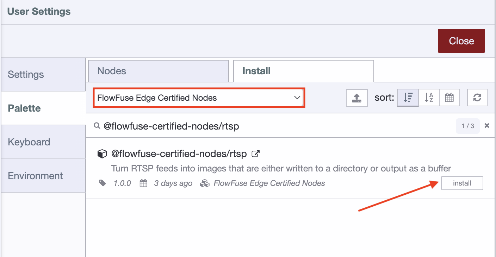
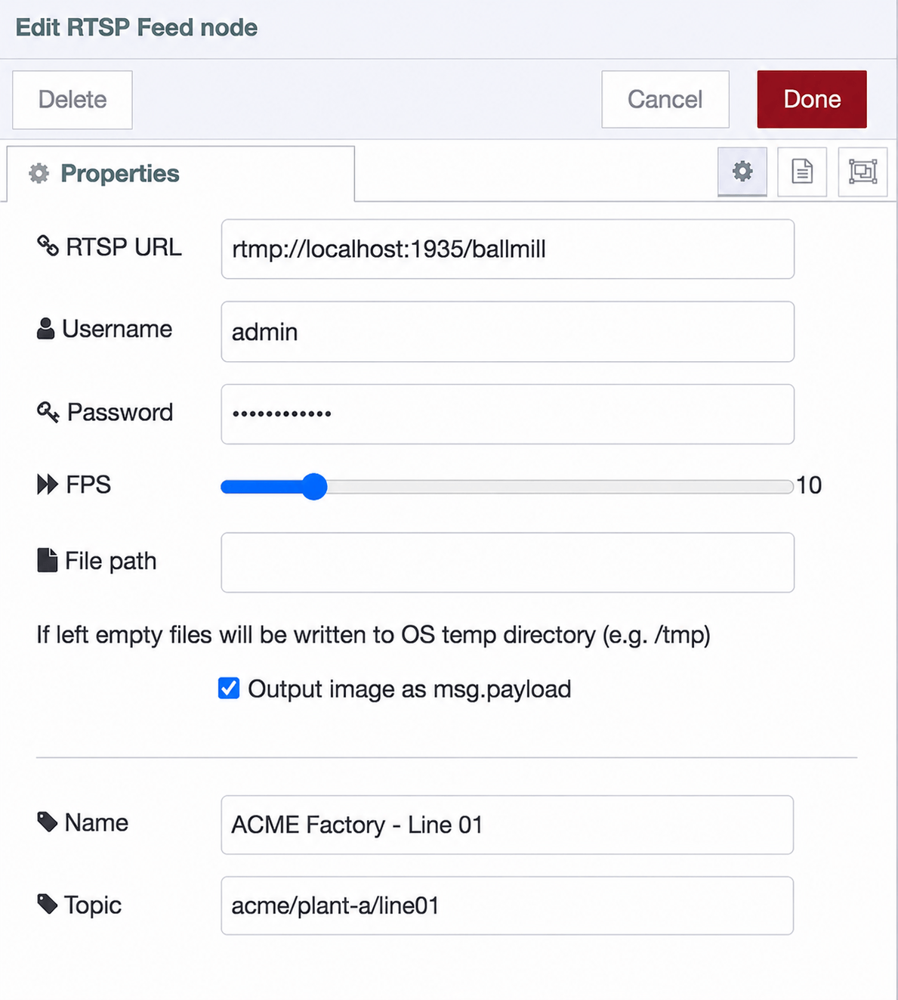

---
eleventyNavigation:
  key: RTSP Video Feed
  parent: Edge
  order: 1
meta:
  title: RTSP Video Feed
  description: Documentation for the FlowFuse RTSP Video Feed node, which connects to an RTSP camera stream and extracts still frames as PNG images for use in flows, dashboards, and local AI models.
---

# {{ meta.title }}

The **RTSP Video Feed** node connects to an [RTSP](https://en.wikipedia.org/wiki/Real-Time_Streaming_Protocol) video stream from an IP camera or NVR and extracts still frames as PNG images.

This is a **FlowFuse Certified Node**. Unlike community nodes, which vary in quality and can go unmaintained without warning, FlowFuse vets Certified Nodes for quality, security, and support, and maintains them on an ongoing basis. [Read more about Certified Nodes](/blog/2025/07/certified-nodes-v2/).

The node orchestrates `ffmpeg` to acquire and decode the video stream. By handling the video decoding externally, `ffmpeg` reduces the processing load on the main FlowFuse event loop. However, higher frame rates and image resolutions generate more image data, which can increase CPU and memory usage as frames are transferred and processed within your flows. The node is a source node with no input connector. It begins capturing frames as soon as the flow is deployed and displays a green **Running** status on the canvas when it has successfully connected to the stream. If `ffmpeg` exits unexpectedly, the node restarts it automatically after a short delay and displays the exit code in the node status.

Extracted frames can either be emitted as messages into the flow or written directly to disk as a numbered sequence of PNG files. See [Operating modes](#operating-modes) for details.


The RTSP Video Feed node is not available by default. It is part of the FlowFuse Edge Certified Nodes catalogue, which is part of the **FlowFuse Edge** offering. Please contact our sales team at [Contact us](/contact-us/) to learn more or to request access.


## Use case

Most plants and facilities already have IP cameras on the network, but the footage is locked inside an NVR: useful for reviewing an incident after the fact, invisible to everything else. The RTSP Video Feed node turns those existing cameras into a live data source. It captures still frames from the stream at a rate you choose and hands them to your flow as PNG images, where they can be analyzed, displayed, filtered, or stored like any other data. No new hardware, no separate video-analytics appliance.

### Example: catching mislabeled products on a packaging line

A camera above a packaging line already streams to the site NVR. Point the RTSP Video Feed node at that same stream, set it to 1 FPS, and wire it to a [FlowFuse AI node](/node-red/flowfuse/ai/) running an image classification model. Each frame is checked for a missing or misprinted label, and when one is detected, the flow raises a dashboard alert and publishes the offending frame over MQTT for the quality team to review. What used to require an operator glancing at a screen, or a dedicated vision system with its own controller and license, becomes a three-node flow on hardware you already own.

### Where this shows up in practice

- **Machine vision**: feed frames to a [FlowFuse AI node](/node-red/flowfuse/ai/) for object detection or image classification, then act on the result, for example counting parts on a line, checking a fill level, or verifying a safety gate is closed.
- **Remote monitoring**: display the frames live on a [FlowFuse Dashboard](https://dashboard.flowfuse.com/) so an operator can watch a machine or area from anywhere the dashboard is reachable, alongside the process data on the same page.
- **Event snapshots**: route frames through a `function` or `switch` node and keep only the ones that matter, for example the frame captured the moment a PLC tag or sensor reports a fault, and forward it with an [`mqtt out`](/node-red/flowfuse/mqtt/mqtt-out/) node or attach it to an alert.
- **Timelapse and archiving**: switch to disk-writing mode and the node writes a numbered sequence of PNG files for later review or timelapse assembly, without adding any messages to the flow.

### Combining video with other plant data

Because the frames arrive as ordinary messages, they combine naturally with everything else in a flow. A single flow can join a camera frame with the PLC tag values captured at the same moment, so a quality event is recorded with both the picture and the process conditions that produced it. That correlation is exactly what standalone camera systems can't do.

Set the FPS no higher than the use case requires: in message mode each captured frame becomes a message, and higher frame rates increase CPU and memory usage.

## Requirements

The node requires `ffmpeg`. In most cases this is handled automatically: the node pulls in `ffmpeg-static` on install, which provides a prebuilt `ffmpeg` binary for your platform.

If a prebuilt binary is not available for your platform, the node falls back to an `ffmpeg` binary on the system `PATH`. If neither is found, the node will not load and an error is written to the FlowFuse log.

## Install

1. Open the **Palette Manager** from the top-right menu in the FlowFuse editor.
2. Switch to the **Install** tab.
3. Find the **FlowFuse Edge Certified Nodes** collection.
4. Locate `@flowfuse-certified-nodes/rtsp` and click **Install**.

`ffmpeg` is pulled in automatically during install.


*Locating and installing the RTSP Video Feed node from the FlowFuse Edge Certified Nodes catalogue.*


Newly installed nodes are picked up automatically, no restart needed. Restart is only required when you update a node that's already installed: restart any remote instance or hosted instance running the previous version.


## Configuration

Open the node's settings by double-clicking it on the canvas.

| Field | Required | Description |
| --- | --- | --- |
| **RTSP URL** | Yes | The stream URL, e.g. `rtsp://192.168.1.50:554/live/ch1`. Must be a valid URL. |
| **Username** | No | Username for streams that require authentication. |
| **Password** | No | Password for streams that require authentication. Stored as a FlowFuse credential and never written to the flow file. |
| **FPS** | No | Frames per second to capture, from `1` to `60`. Defaults to `1`. |
| **File path** | No | Directory frames are written to in disk-writing mode. If left empty, the OS temp directory (e.g. `/tmp`) is used. |
| **Output image as `msg.payload`** | No | Switches between message mode and disk-writing mode. Enabled by default. See [Operating modes](#operating-modes). |
| **Name** | No | Optional label for the node in the FlowFuse editor. |
| **Topic** | No | Sets `msg.topic` on emitted messages. Useful when routing frames to MQTT. |


*The RTSP Video Feed node configuration panel.*

## Operating modes

The **Output image as `msg.payload`** checkbox controls how the node handles captured frames.

### Output enabled (default)

The node emits each captured frame as a message at the configured FPS rate.

**Output properties:**

| Property | Type | Description |
| --- | --- | --- |
| `msg.payload` | Buffer | The captured frame as a PNG image buffer. |
| `msg.topic` | String | The topic configured on the node. |

The output can be wired to any node that accepts an image buffer, including [FlowFuse Dashboard widgets](https://dashboard.flowfuse.com/), [MQTT out nodes](/node-red/flowfuse/mqtt/mqtt-out/), and [FlowFuse AI nodes](/node-red/flowfuse/ai/).


Every captured frame becomes a message in the flow. A high FPS value increases the number and size of messages being processed. Set FPS no higher than your use case requires.


### Output disabled

The node emits no messages. Instead, `ffmpeg` writes a continuous numbered sequence of PNG files to the directory set in **File path**, named as follows:

```
rtsp-<node-id>-<counter>.png
```

If **File path** is left empty, files are written to the OS temp directory (e.g. `/tmp`). On many Linux distributions this is a RAM-backed filesystem, so frames consume memory rather than disk space and are cleared on reboot.

The node does not delete files written to disk. At a high FPS rate, files will accumulate and eventually fill the available storage. Monitor available disk space when using this mode.