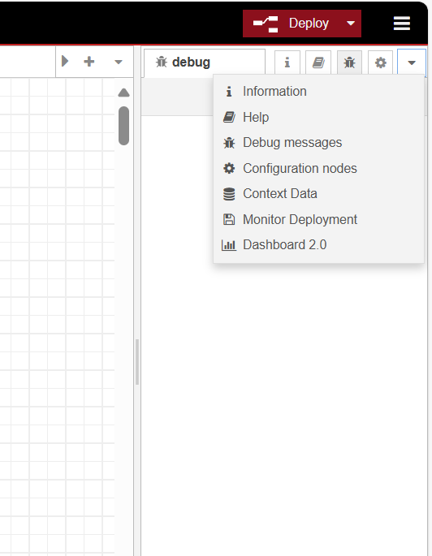
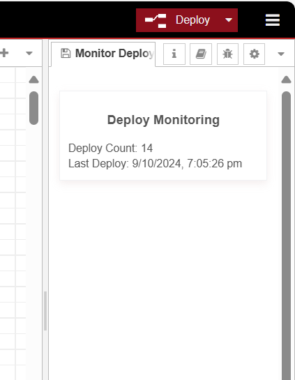

---
eleventyNavigation:
  key: Node-RED Plugins
  order: 3
  parent: Getting Started
meta:
  title: Building Node-RED Plugin
  description: Learn what plugins are and how to build a Node-RED plugin from scratch with our comprehensive step-by-step guide.
  keywords: node-red plugin, how to build node-red plugin, building node-red plugin
---

# {{ meta.title }}

This documentation explains Node-RED plugins and their differences from nodes. It includes a practical example of creating a plugin that displays deployment information, such as the total deployment count and the timestamp of the last deployment, to help you gain a better understanding.

## What Are Node-RED Plugins?

Node-RED plugins are NPM modules designed to extend the functionality of the Node-RED editor and runtime. They enable developers to customize and enhance the Node-RED environment by adding sidebar features, modifying existing ones, or integrating with various tools and services. These plugins can create custom panels or offer additional configuration options tailored to user needs.

For example, imagine a plugin introducing a new sidebar to the Node-RED editor to monitor system performance. This plugin could provide real-time insights into CPU and memory usage, helping developers identify bottlenecks and optimize their flows effectively.

## What's the Difference Between Nodes and Plugins?

Many people confuse nodes and plugins, often considering them the same. However, they serve distinct roles. Nodes are the fundamental components used to build flows, with each node performing a specific function, such as data input, processing, or output. They are the building blocks that define the logic and behavior of a flow by connecting various nodes. In contrast, plugins extend the capabilities of the Node-RED editor and runtime. They allow for customization and enhancement of the environment by adding new sidebars with features. Essentially, plugins do not introduce new nodes to your Node-RED palette.

## Building a Node-RED Plugin

This section will create a simple Node-RED plugin that adds a new sidebar panel to the Node-RED editor. This example will guide you through setting up the required files and coding the functionality step by step.

### Step 1: Create the Plugin Directory

To keep everything organized, create a directory for your Node-RED plugin. You can use your file explorer to create a folder named node-red-plugin-deploy-count. This will be your dedicated space for the plugin files.

#### Step 2: Set Up `package.json`

Next, create a file named [package.json](https://nodered.org/docs/creating-nodes/packaging) in your plugin directory. This file is essential for any Node.js project, as it describes your project and its dependencies and the configurations required by Node-RED to identify plugins or nodes.

Now, open it in your favorite text editor and add the following content:

```json
{
  "name": "node-red-plugin-deploy-count",
  "version": "1.0.0",
  "description": "A plugin counts how many times you have deployed the flow from start",
  "keywords": [],
  "author": "",
  "license": "Apache-2.0",
  "node-red": {
    "plugins": {
      "deploy-monitor-plugin": "deploy-count-plugin.html"
    }
  }
}
```

Here’s what each part means:

- name: This is the name of your plugin.
- version: The current version of your plugin.
- description: A brief overview of what your plugin does.
- node-red.plugins: This section tells Node-RED about your plugin, linking the name of the plugin to its HTML file.

#### Step 3: Create `deploy-count-plugin.html`

Create a new file called `deploy-count-plugin.html` in your plugin directory. This file will contain the `JavaScript` and `HTML` code for your sidebar plugin.

#### Step 4: Register the Plugin

Open `deploy-count-plugin.html` and start by adding the following code to register your plugin with Node-RED:

```javascript
<script type="text/javascript">
    (function() {
        RED.plugins.registerPlugin("node-red-plugin-deploy-count", {
            onadd: function() {
                // This function will execute when the plugin is added
                console.log("Deploy Count Plugin added");
            }
        });
    })();
</script>
```

This code registers the plugin using RED.plugins.registerPlugin. The onadd function is called when the plugin is successfully loaded into Node-RED. It logs a message to the console for now, but you can add any logic you need to execute when developing your plugin.

#### Step 5: Add a Tab in the Sidebar

Next, let’s modify the `onadd` function to create a new tab in the sidebar, Update the `onadd` function in your `deploy-count-plugin.html`:

```javascript
RED.plugins.registerPlugin("node-red-plugin-deploy-count", {
    onadd: function() {
        // Add a new tab in the sidebar
        RED.sidebar.addTab({
            id: "deploy-monitor-tab",
            name: "Monitor Deployment",
            label: "Monitor Deployment",
            iconClass: "fa fa-save",
            action: function() {
                RED.sidebar.show("deploy-monitor-tab");
            }
        });
    }
});
```

Here, we have added a new tab to the sidebar using the RED.sidebar.addTab function. The configuration for the tab includes the following properties:

- id: A unique identifier for the tab, which can be used to reference it later.
- name: The name of the tab is displayed in the sidebar.
- label: The label shown on the tab itself can be different from the name.
- iconClass: The CSS class for the icon on the tab. You can use Font Awesome icon classes for this purpose.
- content: This is where you will define the HTML content that appears in the tab when selected.
- action: A function called when the tab is clicked, allowing you to define what happens when the tab is activated.

#### Step 6: Add Display Elements

In this step, we will add display elements to show the deploy count and the last deploy time in the sidebar. We first created a main container `<div>`, and then appended different elements for the heading, deploy count, and last deploy time in it.

Update the `onadd` function as follows:

```javascript
var content = $("<div>")
var countDisplay = $("<div>").appendTo(content);
var lastDeployDisplay = $("<div>").appendTo(content);
var heading = $("<h3>Deploy Monitoring</h3>").
```

To add this `content` element in the sidebar, in the object passed to the `addTab` method, add the `content` property and set this `content` variable as its value. 

#### Step 7: Adding CSS

To style your plugin content directly in the JavaScript code, you can use the .css() method. This lets you dynamically apply styles to elements without needing an external stylesheet.

Here's an example of applying styles using the .css() method in your plugin:

```javascript
var content = $("<div>").css({
    "margin": "14px",
    "margin-top": "30px",
    "padding": "10px",
    "font-size": "14px",
    "height": "100%",
    "backdrop-filter": "blur(16px) saturate(97%)",
    "-webkit-backdrop-filter": "blur(16px) saturate(97%)",
    "background-color": "rgba(255, 255, 255, 0.46)",
    "border": "1px solid rgba(209, 213, 219, 0.3)",
    "box-shadow": "rgb(201 170 170 / 20%) 0px 4px 10px"
});

var heading = $("<h3>Deploy Monitoring</h3>").css({
    "text-align": "center",
    "font-size": "16px",
    "font-weight": "bold"
});

content.append(heading);
```

#### Step 8: Update the Display

Next, we need a function to update the display elements. Add the following `updateDisplays` function within the `onadd` method, just before the closing brace:

```javascript
function updateDisplays() {
    countDisplay.text("Deploy Count: " + deployCount);
    if (lastDeployTime) {
        lastDeployDisplay.text("Last Deploy: " + lastDeployTime);
    } else {
        lastDeployDisplay.text("Last Deploy: Never");
    }
}
```

#### Step 9: Handle Deploy Events

Let’s handle deploy events to update our deploy `count` and `last deploy time`. Add the following code inside the `onadd` function, below the `updateDisplays` function:

```javascript
RED.events.on("deploy", function() {
    deployCount++; // Increment deploy count

    let currentTime = new Date(); // Get current time
    lastDeployTime = currentTime.toLocaleString(); // Update last deploy time with a readable format

    // Save the updated values to local storage
    localStorage.setItem("deployCount", deployCount);
    localStorage.setItem("lastDeployTime", lastDeployTime);

    updateDisplays(); // Update the displays with new values
});
```

You can utilize any of the [Node-RED Events](https://nodered.org/docs/api/ui/events/) or the [Node-RED Admin API](https://nodered.org/docs/api/admin/methods/) while developing your plugin, as well as any other methods available in the Node-RED `RED` object.

The complete `onadd` function will now look like this:

```javascript
onadd: function() {
    // Create content for the sidebar
    var content = $("<div>").css({"text-align": "center"});
    content.className = "node-red-plugin-deploy-count";

    // Display elements for deploy count and last deploy time
    var countDisplay = $("<div>").appendTo(content);
    var lastDeployDisplay = $("<div>").appendTo(content);

    // Function to update the displays
    function updateDisplays() {
        countDisplay.text("Deploy Count: " + deployCount);
        if (lastDeployTime) {
            lastDeployDisplay.text("Last Deploy: " + lastDeployTime);
        } else {
            lastDeployDisplay.text("Last Deploy: Never");
        }
    }

    // Event listener for the deploy event
    RED.events.on("deploy", function() {
        deployCount++; // Increment deploy count

        let currentTime = new Date(); // Get current time
        lastDeployTime = currentTime.toLocaleString(); // Update last deploy time with a readable format

        // Save the updated values to local storage
        localStorage.setItem("deployCount", deployCount);
        localStorage.setItem("lastDeployTime", lastDeployTime);

        updateDisplays(); // Update the displays with new values
    });

    // Add a new tab in the sidebar
    RED.sidebar.addTab({
        id: "deploy-monitor-tab",
        name: "Monitor Deployment",
        label: "Monitor Deployment",
        iconClass: "fa fa-save",
        content: content,
        action: function() {
            RED.sidebar.show("deploy-monitor-tab");
        }
    });

    // Initialize the counts from local storage
    deployCount = parseInt(localStorage.getItem("deployCount")) || 0;
    lastDeployTime = localStorage.getItem("lastDeployTime");

    updateDisplays(); // Call to update the displays initially
}
```

#### Step 10: Testing Your Plugin

1. Install your plugin by running the following command in the `.node-red` directory, you can find the `.node-red` directory in your user folder, typically located at `C:\Users<YourUsername>.node-red`.

```bash
npm install /<path-to-plugin-folder>/node-red-plugin-deploy-count
```

Replace `<path-to-plugin-folder>` with the actual path where your plugin folder is located.

2. Start Node-RED:

```bash
node-red
```

Open the Node-RED editor in your web browser. You should see your new "Monitor Deployment" tab in the sidebar.

{data-zoomable}
_Image showing newly added tab in the sidebar_

Deploy your flow multiple times and observe how the deploy count and last deploy time update accordingly.

{data-zoomable}
_Image showing the metrics displayed by the newly added plugin in the sidebar tab._
