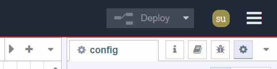
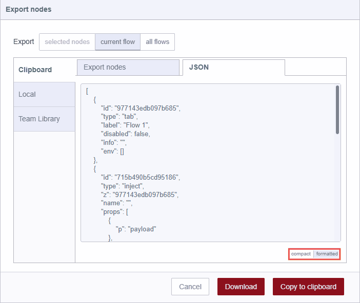
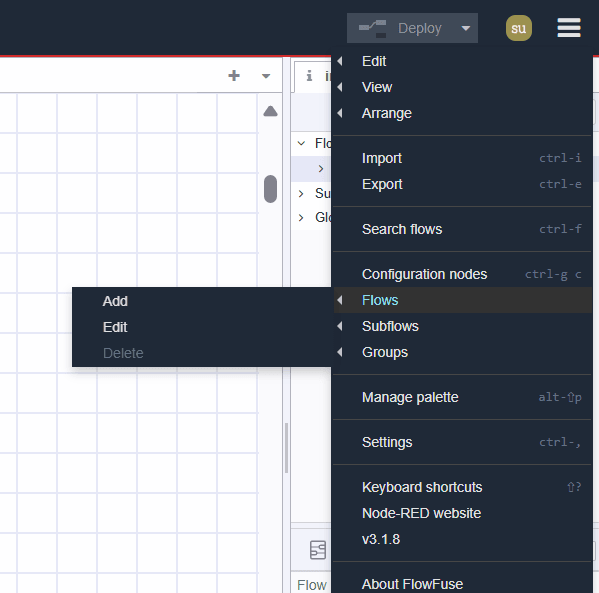
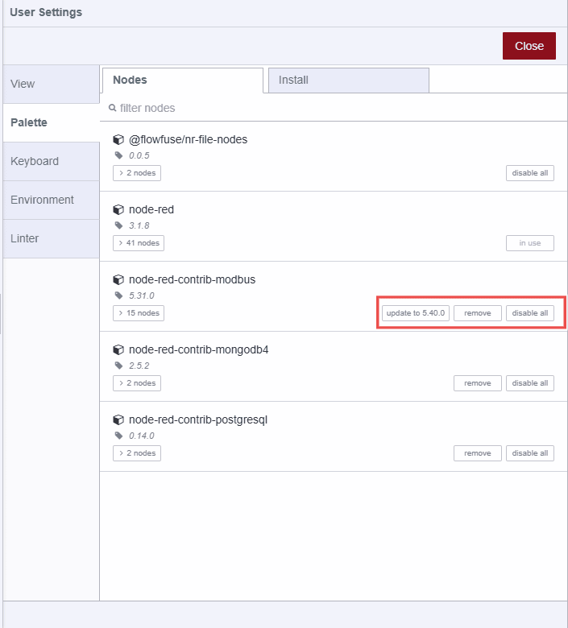

---
eleventyNavigation:
  key: Header
  parent: Editor
meta:
  title: Node-RED Editor Header component
  description:  Explore the features available in the Node-RED Editor header component, essential for navigation and configuration.
  keywords: node-red, node-red editor
---

# {{meta.title}}

The Node-RED editor header is a central component that facilitates navigation to Node-RED main settings, provides a deploy button for executing flows, and access to the user profile.

{data-zoomable}

## Node-RED Instance Name

Clicking on the left instance name redirects you to that instance's advanced options provided by the [FlowFuse Cloud](https://flowfuse.com/). These options include overview, edge devices assigned to that instance, audit logs for monitoring instance activities, settings and more.

{data-zoomable}

For more information, refer to the [FlowFuse Instance](/docs/user/introduction/#working-with-instances).

# Deploy Button

On the right-hand side of the header, you will find a red deploy button. Clicking on it executes all flows within the instance. The red color indicates pending changes to deploy, while gray indicates no pending changes.

{data-zoomable}

{data-zoomable}

To deploy only modified flows or nodes, or to stop/restart flow execution, click the deploy button's expand icon. Select your preferred option and then click the deploy button accordingly.

{data-zoomable}

## User Profile 

After the deploy button, you will see the profile icon. Clicking on it allows you to view your FlowFuse username and provides options to log out from that particular instance. This action redirects you to the advanced options provided by the FlowFuse platform, similar to clicking on the instance name.

## Main Menu

Right after the user profile, you will see the menu icon at the right-hand corner. Clicking on it will open the list of options that make working with Node-RED.

Following are the option available in the main menu

### Edit

The first option in the menu allows you to perform essential editing actions. Hovering over it reveals additional options such as undo, redo, copy selected nodes, and more.

{data-zoomable}

- **Undo**: Reverses the most recent action or series of actions performed within the editor.
- **Redo**: Reapplies an action that was previously undone using the "Undo" command.
- **Cut selected nodes**: Removes the selected nodes from the workspace and temporarily stores them in the clipboard.
- **Copy selected nodes**: Stores a duplicate copy of the selected nodes in the clipboard without removing them from the original flow.
- **Paste nodes**: Allows you to paste the copied or cut nodes from the clipboard back into the workflow.
- **Copy group style**: Stores the selected group's style in the clipboard.
- **Paste group style**: Applies the stored group style to another selected group.
- **Select all**: Selects all flow groups on the current workspace.
- **Select connected nodes**: Selects nodes that are connected to the currently selected nodes.
- **Select none**: Deselects any selected nodes or groups.
- **Split selection with link nodes**: Connects selected nodes using link nodes.

### View

This option allows users to control the display and visibility of various interface elements within the Node-RED editor and allows them to access these elements seamlessly.

{data-zoomable}

- **Show Palette**: Toggles the visibility Node-RED Pallete 
- **Show Sidebar**: Toggles the visibility of the sidebar.
- **Event Log**: Opens a log that records events and actions within Node-RED.
- **Action List**: Provides a list of available actions or tasks within Node-RED, which allows to quick access to commonly used operations and functionalities.
- **Flow Debugger**: Clicking on it will navigate sidebar debugging tool.
- **Linter**: Clicking on it will navigate sidebar [linter tool](/blog/2024/02/software-development-in-node-red/#linting) that provides feedback and suggestions to improve flow readablity, it Checks flows for potential issues or errors based on predefined rules.
- **Debug Messages**: Displays messages generated by debug nodes.

### Arrange

This option allows you to arrange and manipulate selected flow groups within the Node-RED workspace:

{data-zoomable}

- **Align to Left**: Aligns selected flow groups to the left edge of the workspace. *(Keyboard shortcut: `alt + a l`)*
- **Align to Center**: Centers selected flow groups horizontally within the workspace. *(Keyboard shortcut: `alt + a c`)*
- **Align to Right**: Aligns selected flow groups to the right edge of the workspace. *(Keyboard shortcut: `alt + a r`)*
- **Align to Top**: Aligns selected flow groups to the top edge of the workspace. *(Keyboard shortcut: `alt + a t`)*
- **Align to Middle**: Centers selected flow groups vertically within the workspace. *(Keyboard shortcut: `alt + a m`)*
- **Align to Bottom**: Aligns selected flow groups to the bottom edge of the workspace. *(Keyboard shortcut: `alt + a b`)*
- **Distribute Vertically**: Evenly distributes selected flow groups vertically across the workspace. *(Keyboard shortcut: `alt + a v`)*
- **Distribute Horizontally**: Evenly distributes selected flow groups horizontally across the workspace. *(Keyboard shortcut: `alt + a h`)*
- **Move Back**: Moves the selected flow groups one layer back in the stacking order.
- **Move Front**: Moves the selected flow groups one layer forward in the stacking order.
- **Move Backward**: Moves the selected flow groups backward by one position in the stacking order.
- **Move Forward**: Moves the selected flow groups forward by one position in the stacking order.

### Import 

This option allows you to import the application's `flow.json`. In general, you have two main methods available for importing: you can either use the "Clipboard" field or upload the file from your local system by clicking "Select file to import".

{data-zoomable}

Additionally, you can choose the scope in which the flow should be imported from bottom:

- **Current Flow**: Selecting "Current Flow" will import the flow into the existing workspace.
- **New Flow**: Choosing "New Flow" will create a new workspace for the imported flow upon clicking the import button.

On the left-hand side, you will find three options after the clipboard:

- **Local Library**: Here, you can browse the local flow library, which contains flows created within the same Node-RED instance. This library is accessible only from the same instance where the flows were created.
- **Examples**: This section contains the examples flows for all of the core nodes as well as the third-party nodes you have installed if they have added.
- **Team Library**: This section allows you to browse flow collection that are shared across all Node-RED instances within your team.

### Export

This option allows you to export the application flow that you have created. It generally provides two main options: "Copy to Clipboard," which allows you to copy the `flow.json`, and "Download," which downloads the `flow.json` file.

{data-zoomable}

Additionally, you can choose the scope from which the application flow is exported from the top most options:

{data-zoomable}

- **Selected nodes**: Selecting this will only export the selected nodes from the flow.
- **Current flow**: Selecting this will allow you to export the application from the current flow workspace.
- **All flows**: Selecting this will export the flow from all flows within that instance.

At the top, you will have two tabs:

- **Export nodes**: This tab allows you to see the nodes and flows that you are going to export.
- **JSON**: This will show the flow in JSON format that you are going to export.
{data-zoomable}
    - **Compact**: This will compact your flow JSON into one line.
    - **Formatted**: This will format the flow JSON, making it easier to read or check.

On the left-hand side, you will find two other options after the clipboard:

{data-zoomable}

- **Local**: This option allows you to create a collection of the flows that you built into the current Node-RED instance. You can create a new folder by clicking on the three-dot icon in the top-right corner and selecting "New Folder." Additionally, at the bottom, you'll find an input field that allows you to change the flow file name. Clicking on "Export to Library" will save it in the collection. You can now access your collection within the same instance.

- **Team Library**: This option also allows you to create a collection of your flows, but the difference is that this collection is shared across all Node-RED instances of your team.

### Search flows

{data-zoomable}

{data-zoomable}

This option allows to search the flow groups created within that Node-RED instance. 

### Configuration nodes

{data-zoomable}

Clicking on this option will open the sidebars config tab that will allow you to manage all of the configuration nodes of the current Node-RED Instance.

### Flows

{data-zoomable}

This option allows you to manage the [flow](/node-red/terminology/#flow) tabs.

- **Add**: Adds a new flow tab.
- **Edit**: Edits the current flow tab.
- **Delete**: Deletes the current flow tab.

### Subflow

{data-zoomable}

This option allows you to create the [subflow](/node-red/terminology/#subflow).

- **Create Subflow**: Creates a new subflow tab.
- **Selection to Subflow**: Converts the selected nodes into a subflow.

### Groups

{data-zoomable}

This option allows you to manage the flow groups.

- **Group Selection**: Groups the selected nodes.
- **Ungroup Selection**: Ungroups the selected flow group.
- **Merge Selection**: Merges the selected flow groups.
- **Remove from Group**: Removes the selected nodes from the group.

### Manage Palette

This allows users to manage the nodes available in their Node-RED environment. This includes installing new nodes, updating existing ones, and removing nodes that are no longer needed.

It provides two main tabs:

- **Nodes**: This tab shows the list of installed nodes. In the right corner of each node entry, there are options to:

{data-zoomable}

  - **Remove**: Uninstall the node.
  - **Disable**: Temporarily disable the node.
  - **Update**: Update the node if an update is available.

- **Install**: This tab allows you to install third-party Node-RED nodes from the npm registry.

{data-zoomable}

  - **Filter**: This allows you to filter the nodes by showing all nodes, Node-RED community catalog, and [FlowFuse certified nodes](/certified-nodes/).
  - **Sort**: These are the sorting options which allow you to sort by relevance (default), in alphabetical order, and by recently updated.
  - **Reload**: Refresh the list of available third party nodes.

### Settings

{data-zoomable}

This option opens the Node-RED User Settings tab, where you can manage various aspects of your Node-RED environment:

- **View**: Configure editor preferences and interface settings.
    - **Language**: Select the language for the Node-RED editor.
    - **Restore zoom level on load**: Enabling this option will restore the zoom level of the editor when Node-RED is loaded.
    - **Restore scroll position on load**: Enabling this option will restore the scroll position of the editor when Node-RED is loaded.
    - **Show grid**: Toggle to display a grid in the editor workspace.
    - **Snap to grid**: Toggle to enable snapping nodes to the grid.
    - **Grid size**: Adjust the size of the grid squares.
    - **Show node status**: Toggle to display the status of nodes in the editor. 
    - **Show tips**: Toggle to display tips in the editor.
    - **Show guided tours for new versions**: Toggle to enable guided tours for new versions of Node-RED.

- **Palette**: This [Manage palette](#manage-palette) option allows to Manage nodes available in your Node-RED environment.

- **Keyboard**: Configure keyboard shortcuts for efficient navigation and operation in Node-RED.

- **Environment**: Manage environment variables used within your Node-RED flows. This includes setting, editing, and deleting variables that can be accessed by nodes during runtime.
{data-zoomable}
    - **+add**: Adds a new environment variable.
    - **x**: Delete the corresponsing the Environment variables
    - **Revert**: Discards changes made to the environment variables.

- **Linter**: The Linter settings allow you to configure rules for the Node-RED linter tool. The linter provides feedback and suggestions to improve the readability and quality of your flows. Here are the settings you can configure:

    - **Automatically lint after any change**: If enabled, the linter will automatically check your flows for issues after every change.
        - **Delay**: Set a delay before the linter runs after a change. 
    - **Lint disabled flows**: When this option is enabled, the linter will also check flows that have been disabled.
    - **align-to-grid**: Enabling this option will Ensures that nodes are aligned to the grid.
            - **gridSize**: Set the grid size to which nodes should align.
    - **function-eslint**: Run eslint on Function to enforce JavaScript code quality.
        - **config**: Customize the ESLint configuration, default setting is provided in JSON object.
    - **max-flow-size**: Limits the maximum size of a flow group to prevent overly large and complex flows.
        - **maxSize**: Set the maximum allowed flow group size.
    - **no-duplicate-http-in-urls**: Ensure all HTTP In nodes have a unique URL property.
    - **no-loops**: Checks for loops in the flow, which can cause issues in execution.
        - **follow link nodes**: Follow link nodes when checking for loops in the flow.
    - **no-overlapping-nodes**: Ensures that nodes do not overlap in the workspace.
    - **no-unconnected-http-nodes**: Identifies HTTP nodes that are not connected to the flow.
    - **no-unnamed-functions**: Enforces that all function node's have a name for better readability.
        - **allow default names**: Allows the use of default names for function node's if this option is enabled.
    - **no-unnamed-links**: Ensures that link nodes have names for better clarity.
        - **allow default names**: Allows the use of default names for link node's if this option is enabled.

### Keyboard Shortcuts

This option directs you to the interface where you can configure keyboard shortcuts for efficient navigation and operation within the Node-RED instance.

### Node-RED Website

This option takes you to the official Node-RED website.

### Node-RED Version

This option displays the changelog for the current Node-RED version in the sidebar's help tab, detailing what has been changed or fixed compared to previous versions.

### About FlowFuse

This option directs you to the [official FlowFuse website](https://flowfuse.com/).

### FlowFuse Application

This option navigates you to the [FlowFuse Cloud's](https://flowfuse.com/) advance options.

### FlowFuse Launcher Version

This option shows the current version of the FlowFuse launcher.
