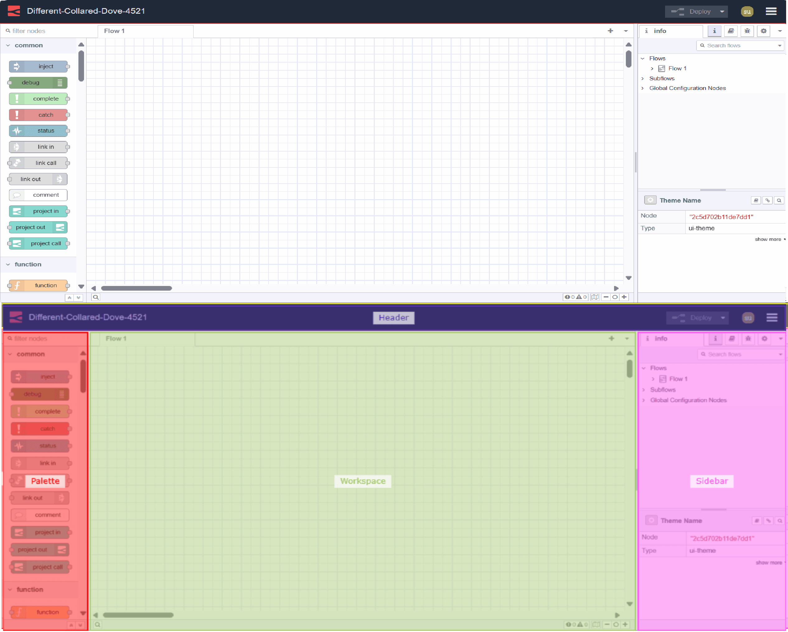

---
eleventyNavigation:
  key: Editor
  order: 1
  parent: Getting Started
meta:
  title: Getting Started with the Node-RED Editor
  description:  Learn about the powerful features of Node-RED Editor.
  keywords: node red editor, node-red editor, nodered flow, node-red flows, nodered workspace
---

# {{meta.title}}

The Node-RED Editor is one of the most essential components of Node-RED.  As the main focus of Node-RED is to enable visual programming, the editor provides a graphical interface that allows users to create, configure, and manage flows easily.

{data-zoomable}

## The main components of the Node-RED editor

The Node-RED Editor has four main components as follows:

- Header: The [header](./header.md) contains the instance name, user profile menu and the main menu. 
- Pallete: The [palette](palette.md) is a sidebar containing all of the nodes that are installed and available to use.
- Workspace: The [workspace](./workspace.md) is where flows (groups of nodes) are developed by dragging nodes from the palette and wiring them together. Adding a new flow tab gives you a new workspace.
- Sidebar: The [sidebar](./sidebar.md) Provides additional context-sensitive options and information depending on the selected node or workspace.
