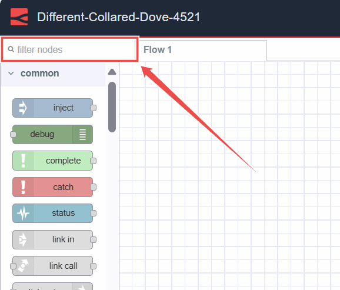
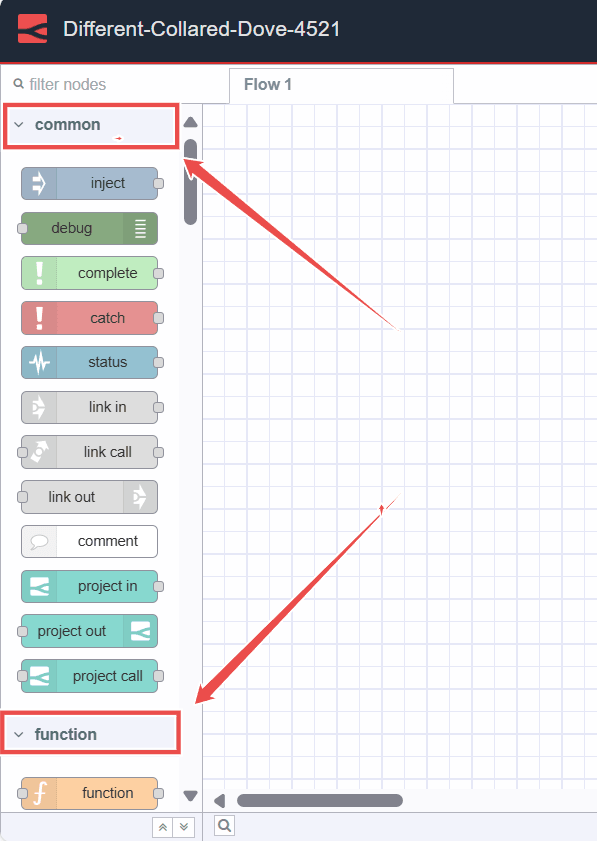
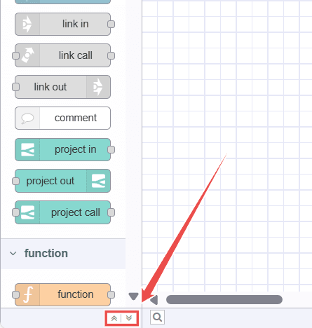

---
eleventyNavigation:
  key: Palette
meta:
  title: Node-RED
  description: Explore the features available in the Node-RED Editor palette, essential for navigation and configuration.
  keywords: node-red, node-red editor
---

# {{meta.title}}

The Palette is the left sidebar that contains all available nodes, including core nodes and third-party nodes that are installed.

## Search Bar

{data-zoomable}

Located at the top of the Palette, the search bar allows you to quickly find nodes by their names.

## Node Categories

{data-zoomable}

The palette is divided into several categories, each containing collections of nodes. When you install a third-party node, it may create a new category. Subflows are categorized under "Subflows".

You can collapse or expand categories by clicking on the specific category.

## Collapse All Categories

{data-zoomable}

At the bottom of the palette, you'll find two arrow icons. Clicking on the first up arrow icon will collapse all categories.

## Expand All Categories

Clicking on the down arrow icon will expand all categories back as default.

## Toggle Palette

{data-zoomable}

Clicking this button hides the palette sidebar. To show it again, click on the button once more.