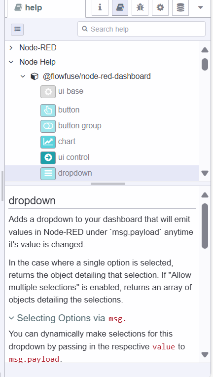

---
eleventyNavigation:
  key: Sidebar
  parent: Editor
meta:
  title: Node-RED Editor Sidebar component
  description: Explore the features available in the Node-RED Editor sidebar component.
  keywords: node-red, node-red editor, sidebar
---

# {{meta.title}}

The sidebar is located on the right side of your Node-RED Editor. It contains a collection of different tools that make Node-RED easier to use, such as managing nodes, configuration, context storage, and more.

{data-zoomable}

The tools available in the sidebar are called panels.

## Default panels

Node-RED sidebar comes with the following default panels:

### Information panel

The information panel shows the information of all flows, nodes present in it, subflows and nodes present in them, and global configuration nodes in a tree structure.

If you hover over any item in that tree structure, you will see some options that make work easy and fast, such as trigger (to trigger the nodes if the hovered node has a button), enable/disable (to disable and enable the hovered node), show/hide (to hide and show the hovered item in the workspace), lock/unlock (to lock and unlock the hovered item), find (to quickly find the hovered item in the workspace). These options are represented with different icons.

#### Search and filtering items

The information panel provides a search bar at the top which allows searching the flows, subflows, and nodes easily in the information panel.

Additionally, it provides a filter that allows filtering those items by various options such as configuration nodes, unknown nodes, invalid nodes, etc.

#### Item properties

If you click on an item in the information panel's tree structure, you'll see the flow ID if the clicked item is a flow and Node ID and type if it is a node in the second tab of the information panel.

IDs can be copied using the copy option on the right side of the ID.

To see more information, click on the show more option, which will show more information on all properties of the node.

At the top, you will see three options: the first help, clicking on it will navigate to the help panel and show the readme provided by the author for the selected item; the second option will copy the URL of the selected item, you can use this feature when you want to point or discuss a specific item in the workspace with your team member; and the third option allows you to locate that item in the workspace.

### Help panel

This panel allows viewing the docs/readme added by the node package authors to help users. This panel's layout is kind of similar to the information panel and is divided into two tabs.

The first tab provides a tree structure with two main topics: "Node-RED" and "Node help." The Node-RED includes the latest changelog and welcome tour (the quick guide for newly added features) for all Node-RED versions.

The second tab shows the help docs/readme of the selected node.

#### Hiding topics

To hide/show the first tab of the help panel, click on the top-left option.

#### Viewing Node docs in the help tab

To see the readme/docs in the help panel for the nodes, single click on the nodes in the workspace or click on the node item in the tree structure of the "Node help" topic.

### Debug panel

The debug panel displays the messages printed by the debug node, this panel helps to debug your application easily.

When the messages are printed on the debug panel, each message includes date time, the name of the node that printed this message, the property name, its datatype, and the value.

#### Filtering debug messages

At the top of the debug panel, you'll see the filter option with three options that allows displaying only those messages which you want:

- All nodes: Selecting this option will display messages printed by all the nodes.
- Selected nodes: This option allows selecting the specific debug nodes whose messages you want to see in the debug panel.
- Current flow: Selecting this option will print only messages printed by the nodes which are present in the current flow.

*Note - the Debug sidebar can only show the 100 most recent messages. If the sidebar is currently showing a filtered list of messages, the hidden messages still count towards the 100 limit.*

#### Clearing messages

To clear the messages, click on the top-right delete option. Alternatively, click on `ctrl + alt + l`.

#### Opening a separate window

To open the debug panel in a separate window, click on the bottom-right option having a computer icon. Clicking on it will open the debug panel in a new browser window which will make it easy to see and manage debug messages.

### Flow Debugger

This panel allows you to debug your flow step by step so that you will get to know where exactly the issue persists.

By default, the Flow Debugger is disabled, you can enable it by toggling the top-left option.

The panel uses a [breakpoint](https://developers.redhat.com/articles/2022/11/08/introduction-debug-events-learn-how-use-breakpoints#what_is_a_breakpoint_) approach to debug the flow. Debugging the flow with breakpoints will help you figure out where the message changed and which node is the cause.

#### Adding breakpoints

To add the breakpoints to the nodes, hover over the node's port and a blue breakpoint indicator will appear. Click it to set the breakpoint on that port. Clicking on it again will remove the breakpoint entirely or you can also use the breakpoint tab to temporarily unselect or remove breakpoints.

The runtime will be paused whenever a message arrives at an active breakpoint. You can also manually pause the runtime using the pause button in the sidebar.

Once paused, the flow will show how many messages are queued up at each node input and output. Those messages will also be listed in the sidebar - in the order the runtime will process them.

#### Processing messages step-by-step

To process the messages step-by-step, click on the step button located in the breakpoint tab.

Additionally, you can step individual messages by clicking the step button that appears when you hover over the message.

### Configuration nodes panel

The configuration nodes panel shows the list of all configuration nodes added to the current Node-RED instance. All the configuration nodes are organized by their scope such as by all flows, by specific flow, and subflow.

Each configuration node in the configuration nodes panel displays that node's type and label along with the count of how many current nodes are using this configuration.

This configuration panel also provides easy access to the config nodes edit dialog, to access it double-click on the config nodes in the panel.

To access this configuration nodes panel click `Ctrl/command + g + c`.

#### Filtering config nodes

The configuration nodes panel provides an option to filter the nodes by all and unused.

### Linter tool panel

This panel provides information on linting issues that persist in the flow. Additionally, it provides suggestions to resolve them.

The panel shows the list of linting issues along with the nodes that persist in them. By clicking on the issue, it will help you locate that node in the flow.

To refresh the linter panel, click on the top-right refresh option.

To modify the linter rules, click on the top-right setting option, which will navigate you to the [linter settings](./header.md#settings).

### Context Data

This panel displays the context variables by their scope. Each variable includes details such as date and time, its store (memory or persistent), and the name and value. To access this panel click `ctrl/command + g + x`.

To learn more about context variables refer to the article on [Understanding Node, Flow, Global, and Environment Variables in Node-RED](/blog/2024/05/understanding-node-flow-global-environment-variables-in-node-red/).

#### Refreshing the Context variables

To refresh the context variables click on the refresh button located at the top-right corner of each scope tab or to refresh a specific variable hover over it and click on the refresh button that appears on the right side of it.

#### Deleting context variables

To delete the context variable hover over the variable that you want to delete and click on the delete button that appears on the right side of it.

#### Copying properties and values

To copy the name of that variable hover over it and click on the first button that appears on the right side.

To copy the value of that variable hover over it and click on the second button that appears on the right side.

## Hiding the Sidebar

To hide the sidebar, click on the sidebar toggle button. To show it back, click on the toggle button again. Alternatively, you can use the `ctrl/command + space` shortcut.

## Resizing the Sidebar

To resize the sidebar, hover the mouse over the sidebar's border until the cursor changes. Then, press the left mouse button and hold it while resizing.

## Switching Between Panels

To switch between panels, click the expand icon in the top-right corner. This will open a menu with all the available panels.

Alternatively, you can click on the small boxes with different icons at the top.