---
eleventyNavigation:
  key: Workspace
  parent: Editor
meta:
  title: Node-RED Editor Workspace
  description: Explore the features available in the Node-RED Editor workspace component
  keywords: node-red, node-red editor, workspace
---

# {{meta.title}}

The workspace is the main area in the editor where you build application flows by dropping nodes from the palette.

{data-zoomable}

## View Tools

{data-zoomable}

The workspace provides view tools at the footer in the right corner. This includes zoom in (`Ctrl` + `+`) and zoom out (`Ctrl` + `-`) buttons to control the view of the workspace and reset the zoom level to its default.

{data-zoomable}

Additionally, it provides a view navigator that allows you to see a scaled-down view of the entire workspace. In this view, you can also see the currently visible area of the workspace in the editor. To jump to a specific workspace area, click on that area in the view navigator.

If the Linter tool is enabled, next to the view navigator on the left side, you will find the Linter tool option that displays the number of linting issues present in the workspace. By clicking on it, you will navigate to the Linter tool in the sidebar.

## Search Flow

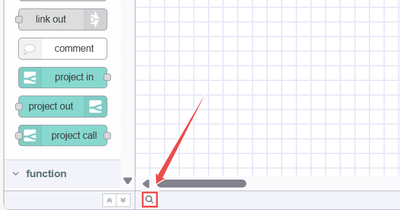{data-zoomable}

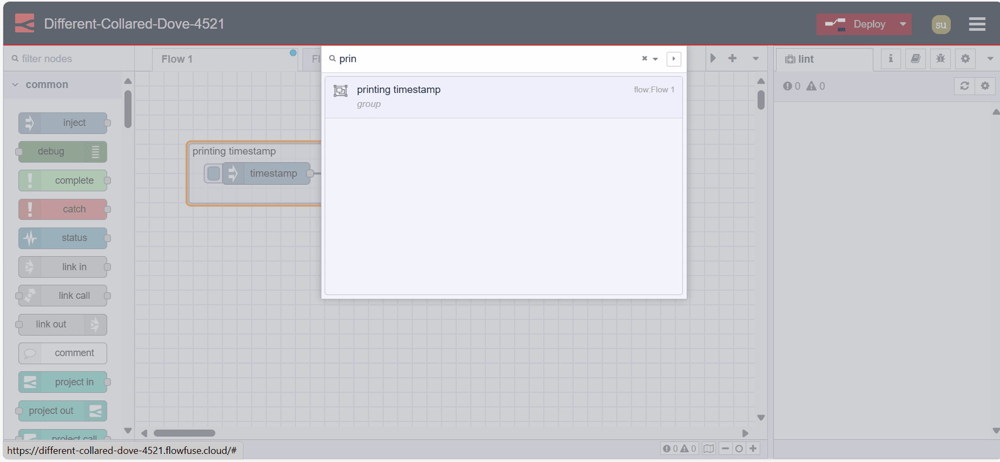{data-zoomable}

At the bottom-left of the workspace, you will see a search icon. Clicking on it will open a popup that allows you to quickly search the flows within your Node-RED instance by their name. You can access this dialog by pressing `Ctrl + F`.

## Flow

{data-zoomable}

A flow is represented as a tab within the editor workspace, providing a new workspace for building applications by connecting nodes. "Flow" is also used informally to describe a single set of connected nodes. Therefore, a flow (tab) can contain multiple flows (sets of connected nodes), but formally, a flow is a parent group of multiple connected nodes. A flow can have a name and description, which will be displayed in the information sidebar.

### Adding a Flow

{data-zoomable}

To create a parent flow, click on the top-right "+" icon, other you can use the [main menu's flow](./header.md#flows) add option. 

### Editing a flow properties

{data-zoomable}

To edit the flow properties double-click on the flow tab to enter its name and description in the popup form that appears.

### Deleting a Flow

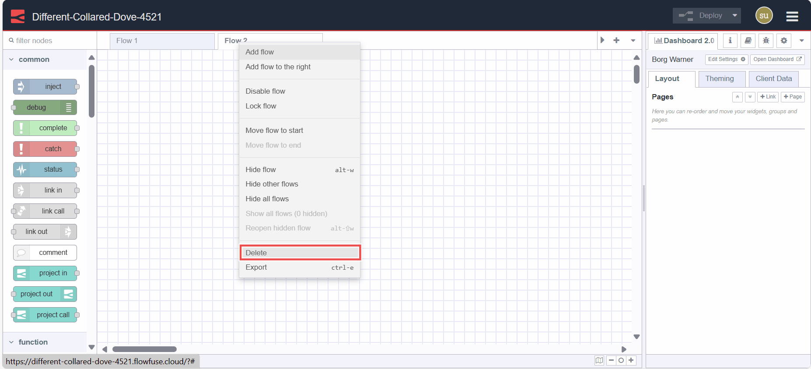{data-zoomable}

To delete a flow, double-click on it. In the popup that appears, click the delete button at the top-left corner. 

{data-zoomable}

Alternatively, right-click on the flow tab and select "Delete" from the menu.

### Enabling and Disabling Flows

{data-zoomable}

To enable or disable a flow, double-click on the flow tab. Click the bottom-left "Disable" button or "Enable" button if it is already disabled. 

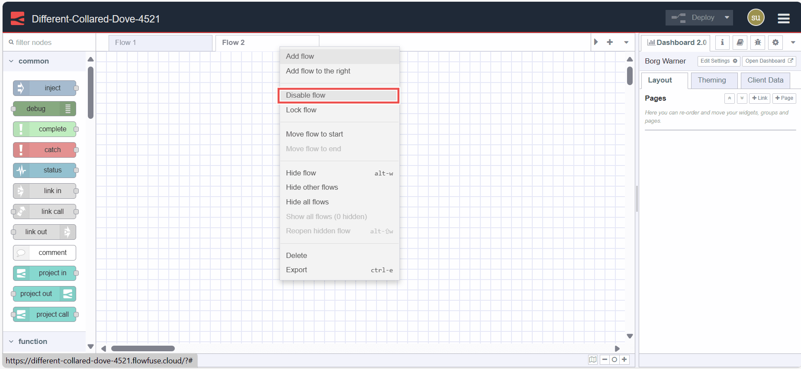{data-zoomable}

Alternatively, right-click on the flow tab and select "Disable/Enable" from the menu. Disabled flows do not execute when deployed.

### Reordering Flows

{data-zoomable}

Flows can be reordered by clicking and dragging the flow tab to the desired position. More options for the flow tab menu can be accessed by clicking on the top-right dropdown arrow icon.

## Subflow

{data-zoomable}

A subflow in Node-RED is a collection of nodes that are collapsed into a single node in the workspace. It allows you to group a set of nodes together into a reusable unit. This helps in organizing flows, promoting reusability, and simplifying complex flow designs by encapsulating multiple nodes into a single, higher-level node representation.

*Note: a subflow cannot contain an instance of itself - either directly or indirectly.*

### Creating a Subflow

{data-zoomable}

To create the subflow, click on the subflow -> create subflow in the main menu. 

{data-zoomable}

It will create the subflow window like a flow tab for you.

### Editing a Subflow

{data-zoomable}

To open the subflow edit dialog, double-click on the subflow node, then click on the "edit template properties". You can give the name for that subflow, add the description by clicking on the top-right

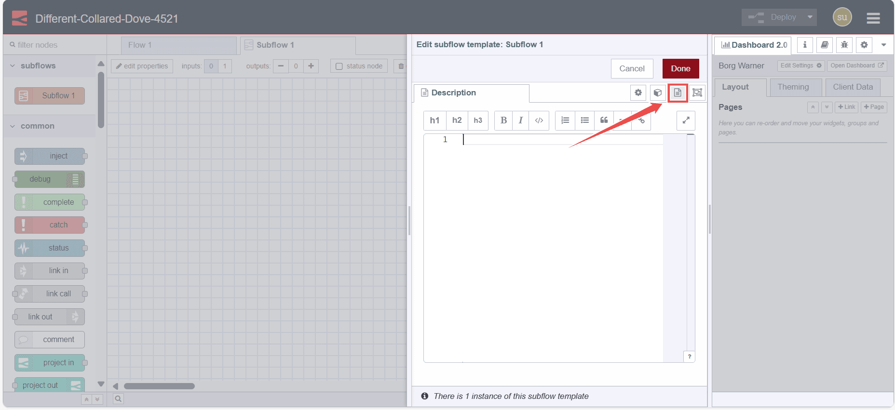{data-zoomable}

"Description" option, and also set the appearance by clicking on the top-right "Appearance" option.

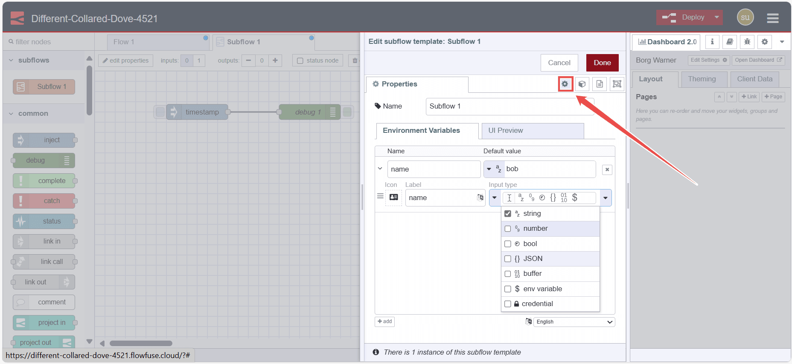{data-zoomable}

In the properties tab, you can define the custom properties that will be added to the subflow's edit dialog. These properties will be then exposed as the environment variables which can be then used by nodes of that subflow. While defining those properties you can also define the data type and label for each.

{data-zoomable}

In the "UI preview" tab, you will see the preview of those properties, showing how they will appear in the subflow.

### Module Properties

{data-zoomable}

In the subflow property dialog, you'll see the module properties option in the top-right corner of the dialog.

The Module Properties tab can be used to set additional meta-data about the Subflow, including version, license, and module name. These can be used when [packaging the Subflow as an npm module](https://nodered.org/docs/creating-nodes/subflow-modules).

### Deleting a Subflow

{data-zoomable}

To delete the subflow, click on the "delete subflow" button at the top of the subflow tab.

### Converting Nodes into a Subflow

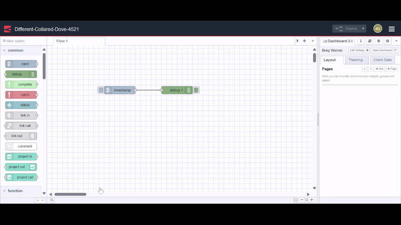{data-zoomable}

If you have nodes on the workspace and you want to create a subflow of them, you can select them by pressing the left mouse key and drawing a rectangle around them. Then click on subflow -> selection to subflow in the main menu.

*Note: Wires coming into the selection should be connected to one node - as the resulting subflow node can itself only have at most one input.*

### Inputs & Outputs

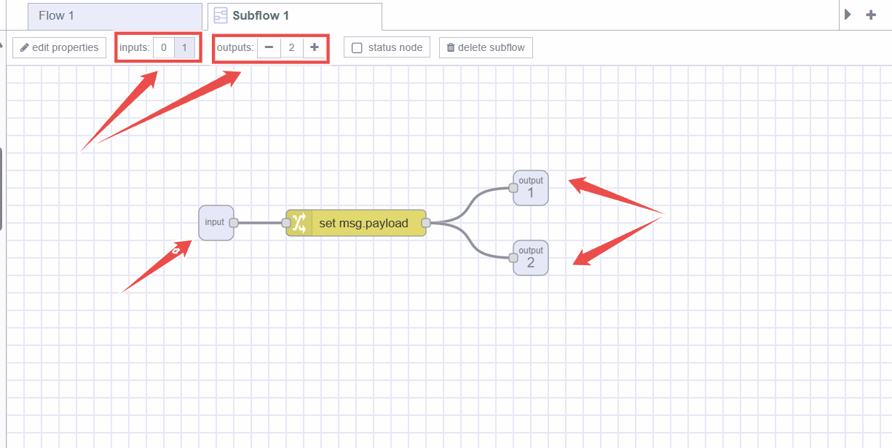{data-zoomable}

The subflow's inputs and outputs are depicted by gray square nodes, which can be connected in the subflow workspace like regular nodes. The top toolbar offers functions for adding and removing these nodes. Similar to regular flow nodes, each subflow can have one input at most, but it can accommodate multiple outputs.

### Status Node

{data-zoomable}

The Status node is used to update the status of the subflow. This status node can be edited like regular flow nodes. This node uses the input of `msg.payload` which can either be a simple string or a Status Object.

## Nodes

{data-zoomable}

A Node is a fundamental building block used to create flows. Each node represents a distinct piece of functionality or a specific action that can be performed within a flow. These nodes can be third-party additions using the palette manager or core nodes.

{data-zoomable}

Nodes can have one input and multiple output ports, connected via wires, which define the data flow within flows. Both input and output nodes can connect to multiple wires.

{data-zoomable}

Some nodes have buttons on either the left or right side. For example, the Inject node has its button on the left, while the Debug node has it on the right. The function of these buttons varies between nodes.

{data-zoomable}

Additionally, some nodes display status at the bottom with icons indicating their runtime status. For example, MQTT and WebSocket nodes show "connected" text with a green circle icon indicating a successful connection.

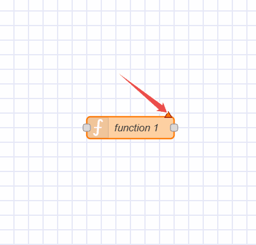{data-zoomable}

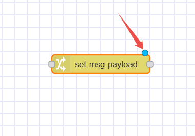{data-zoomable}

All nodes in Node-RED indicate errors with a red triangle, undeployed changes with a blue circle, and linting issues with a yellow icon containing an info symbol.

### Adding Nodes to the Workspace

There are three different ways to add nodes to the workspace:

#### Dragging from the Palette

Nodes can be added from the [Node-RED palette](./palette.md) by dragging them onto the workspace.

#### Using Quick-Add Dialog

Node-RED Editor provides a quick and easy way to add nodes via the palette:

{data-zoomable}

- Press `Ctrl` or `Command` and click on the workspace.
- Select the desired node from the dialog, which contains all available nodes from the main node palette.
- Use the search bar to quickly search nodes.

When drawing a wire from one node, leave the wire on the workspace to connect it to a node that will be added using the same quick-add dialog.

#### Importing from the Library or Clipboard

Nodes can also be added by [importing](./header.md#import) them from the team or local library or using the clipboard.

### Editing Node Properties

{data-zoomable}

To configure a node's properties, double-click on it or select the node and press Enter. A popup form will appear to configure the node. Configuration options vary depending on the node type.

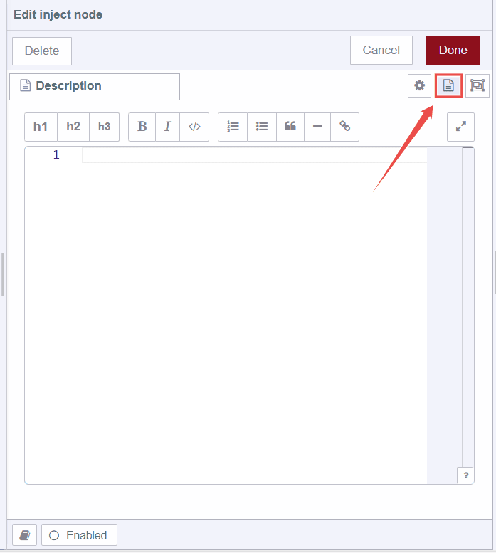{data-zoomable}

- Clicking on the second option from the top-right among three opens a "Description" tab, allowing you to write a Markdown-format description displayed in the information sidebar.

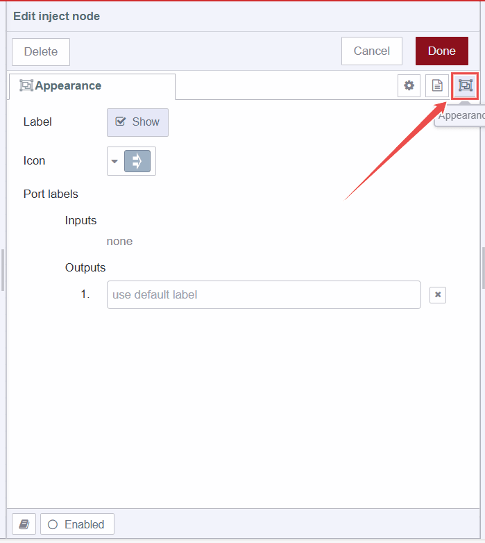{data-zoomable}

- Clicking on the third option opens a tab to modify the node's appearance, such as changing icons, naming input and output ports, and toggling label visibility.

### Enabling and Disabling Nodes

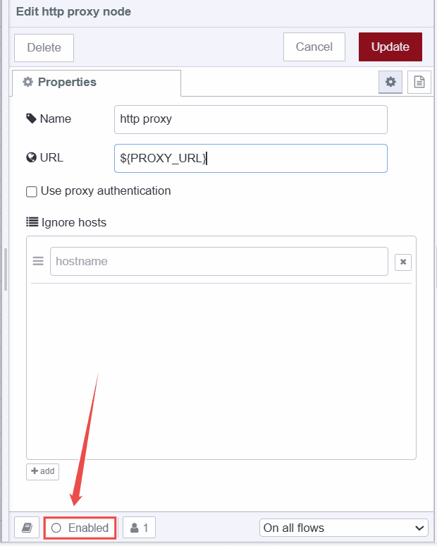{data-zoomable}

To enable or disable nodes, double-click on the node and click the bottom "Enabled" button or "Disabled" button if already enabled.

### Accessing Node Help Information

{data-zoomable}

To access node help information, double-click on the node and click the bottom "Book" icon, which displays information related to that node in the information sidebar.

### Configuration Nodes

Configuration nodes in Node-RED store configurations shared across multiple nodes within a flow.

For example, HTTP Proxy nodes or TLS settings represent configurations for HTTP request nodes.

**Note:** Configuration nodes do not encrypt data after configuration, potentially exposing sensitive information if shared improperly. It is recommended to use [environment variables](/docs/user/envvar/) for configuring these nodes to prevent revealing them in the flow.

Configuration nodes can be added using the edit dialog of nodes requiring configuration:

{data-zoomable}

- Click the "+" icon next to the pencil icon and the field showing the text "Add new ***".
- Enter the necessary information in the edit dialog and click "Add".

Configuration nodes are not visible on the workspace like other nodes but can be managed in the config nodes tab of the sidebar.

{data-zoomable}

To view how many nodes are using a specific configuration, check the footer information in the config node's edit dialog.

Additionally, like common nodes, configuration nodes can be disabled and enabled in the same manner.

## Wires

{data-zoomable}

The "wires" refer to the connections that link nodes together to define the flow of data. These wires visually represent the direction and flow of information from one node to another within a Node-RED flow.

### Wiring Nodes Together

{data-zoomable}

To connect the nodes using the wires, left-click on the node's output port and drag the wire to the destination input port. Additionally, if you press the `Ctrl`/`Command` and mouse left key on the input or output port you will not need to hold the left mouse key or any other button to drag the wire. To connect it to the destination port, press the left mouse key on destination port. If the `Ctrl`/`Command` key remains pressed after connecting to the destination port, and if that port's node has an output port, a new wire will be dragged.

The wires can be connected from the input port to the output port, not from the input port to the input port or the output port to the output port.

### Deleting Wires

{data-zoomable}

To delete wires, click the left mouse button to select the first wire. To select multiple wires, press and hold the `Ctrl\Command` key while clicking each wire with the left mouse button. If you use only the left mouse button, you can select only one wire at a time. After selecting the wires, press the 'delete' or 'backspace' key to delete them.

### Moving Wires

{data-zoomable}

To disconnect the wire from the port, select the wire by clicking on it. Then press and hold the `Shift` key while the left mouse key is pressed on the port. When the mouse is dragged you'll see the wire disconnects from the port and can be connected to another port.

{data-zoomable}

If a port has multiple wires connected to it, if none of them are selected when the button is pressed with the Shift key held, all of the wires will move.

### Slicing Wires

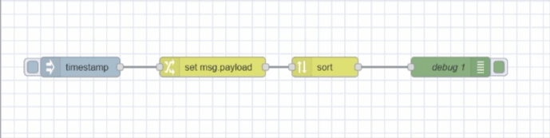{data-zoomable}

Wires can also be removed by slicing through them. You can do this by holding the `Alt`/`Option` key and then drawing the line for slicing by holding the left mouse key.

### Detaching Nodes

#### Keeping Wire While Deleting Node

{data-zoomable}

To do that, press and hold the `Ctrl`/`Command` key, select the node by clicking the left mouse key, and then press the "delete" or "backspace" button.

#### Detaching Node from Wires

{data-zoomable}

To use this option, you have to set the [keyboard shortcut](./header.md#keyboard-shortcuts) for the "detach-selected-nodes" action.

## Groups

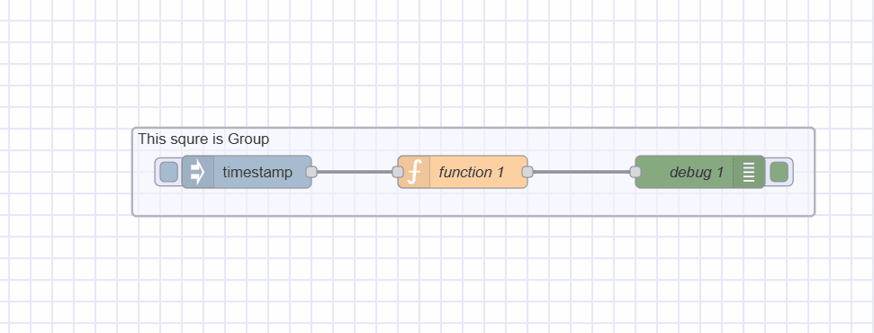{data-zoomable}

In Node-RED, groups can be created for better organization, containing a single object with included node configurations within the editor.

### Creating a Flow Group

{data-zoomable}

To create a flow group, select nodes (by holding the Ctrl key or drawing a rectangle around them). Navigate to `Groups -> Group selection` in the main menu or press `Ctrl + Shift + G`.

### Editing Group Properties

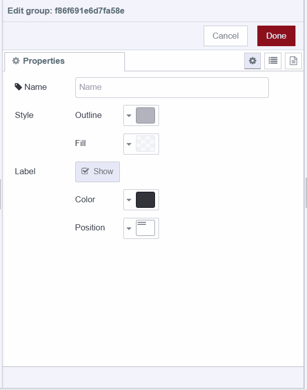{data-zoomable}

A flow group can have a name, background color, and border label visible in the workspace. By default, it has a gray border with no background or name.

To style and name a group, double-click on it. Enter the name, select outline and background colors under the fill property, adjust label position and color, then click "Done" from the top-right corner.

### Adding Group-Level Environment Variables

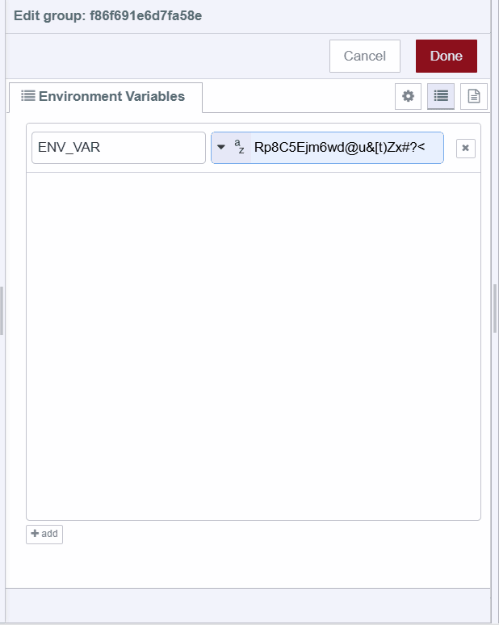{data-zoomable}

To add environment variables at the group level, double-click on it. Select the second option from the top-right in the popup, located under the "Done" button. Click the bottom-most "Add" button to add variables.

### Adding Description

{data-zoomable}

To add a description to the group, double-click on it. Select the third option from the top-right in the popup, under the "Done" button. Enter the description in Markdown format.

### Adding Nodes to a Group

{data-zoomable}

To add nodes to an existing group, drag and drop them into the group. This can be done one node at a time. Groups can also be nested within each other in the same manner.

### Removing Nodes from a Group

{data-zoomable}

To remove nodes from a group, select the nodes and navigate to `Groups -> Remove selection` in the main menu. Similarly, remove a group from another group. Alternatively, click on a node, hold the 'Alt' key, and drag it outside of the group.

### Merging Groups

{data-zoomable}

To merge multiple groups into a single group, select the groups. Go to `Main Menu -> Groups -> Merge selection`.

### Ungrouping Selected Nodes

{data-zoomable}

To ungroup nodes from a group, select the nodes. Go to `Main Menu -> Groups -> Ungroup selection`.

## Selection

Node-RED Editor provides an easy interface for selecting the nodes and the wires on the workspace.

A node can be selected or deselected by clicking on it. To select multiple nodes, press the `Ctrl/Command` key and select the nodes you want to select. To select all of the nodes in the workspace, click `Ctrl+A`.

### Lasso Tool

{data-zoomable}

Node-RED provides a lasso tool to make selection faster. To use the lasso tool, press the left mouse key and drag the cursor, then you can select multiple nodes by drawing a rectangle around them.

### Selecting Connected Nodes

{data-zoomable}

To select all connected nodes to a specific node, press the `Shift` button and click on the middle of that node.

### Selecting All Upstream Nodes

{data-zoomable}

To select all of the connected nodes that are before that specific node, press the `Shift` button and while holding it click on the left part of that node.

### Selecting All Downstream Nodes

{data-zoomable}

To select all of the connected nodes that are after that specific node, press the `Shift` button and while holding it click on the right part of that node.

### Selecting Flows

{data-zoomable}

To select the flow tabs, press the `Ctrl/Command` key and while holding it click on the flow tab you want to select. Now you can then delete, export, or copy them collectively.
